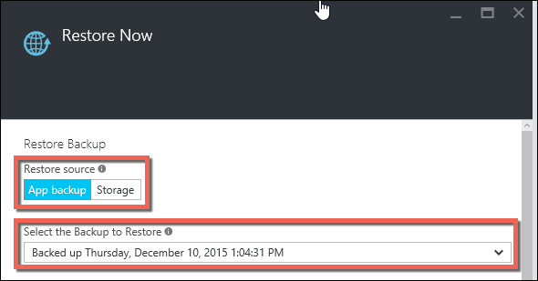
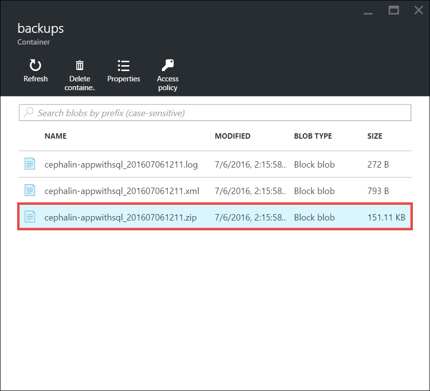

<properties 
    pageTitle="Restaurer une application dans Azure" 
    description="Découvrez comment restaurer votre application à partir d’une sauvegarde." 
    services="app-service" 
    documentationCenter="" 
    authors="cephalin" 
    manager="wpickett" 
    editor="jimbe"/>

<tags 
    ms.service="app-service" 
    ms.workload="na" 
    ms.tgt_pltfrm="na" 
    ms.devlang="na" 
    ms.topic="article" 
    ms.date="07/06/2016" 
    ms.author="cephalin"/>

# Restaurer une application dans Azure

Cet article vous explique comment restaurer une application dans [Azure Application Service](../app-service/app-service-value-prop-what-is.md) que vous avez précédemment sauvegardé (voir [sauvegarder votre application dans Azure](web-sites-backup.md)). Vous pouvez restaurer votre application avec sa boîte de dialogue Propriétés (base de données SQL ou MySQL) à la demande à un état précédent, ou créer une nouvelle application à partir de sauvegarde de votre application d’origine. Création d’une nouvelle application qui s’exécute en parallèle vers la dernière version peut être utile de A / B test.

Restaurer à partir de sauvegardes est disponible aux applications en cours d’exécution dans niveau **Standard** et **Premium** . Pour plus d’informations sur la mise à l’échelle des votre application, voir [mettre à l’échelle d’une application dans Azure](web-sites-scale.md). Montage en cascade **Premium** permet un plus grand nombre de sauvegardes quotidiennes devant être effectuées au niveau **Standard** .

## Restaurer une application à partir d’une sauvegarde existante

1. Sur la carte de **paramètres** de votre application dans le portail Azure, cliquez sur les **sauvegardes** pour afficher la carte de **sauvegardes** . Puis cliquez sur **Restaurer maintenant** dans la barre de commandes. 
    
    ![Choisissez Restaurer maintenant][ChooseRestoreNow]

3. Dans la carte **restaurer** , sélectionnez tout d’abord la source de sauvegarde. 

    
    
    L’option **Sauvegarder application** montre tous les sauvegardes existantes de l’application en cours, et vous pouvez facilement sélectionner un. 
    L’option de **stockage** vous permet de sélectionner n’importe quel fichier ZIP sauvegarde à partir de n’importe quel compte de stockage Azure et conteneur dans votre abonnement existant. 
    Si vous essayez de restaurer une sauvegarde d’une autre application, utilisez l’option de **stockage** .

4. Ensuite, spécifiez la destination pour la restauration de l’application dans la zone **restaurer destination**.

    
    
    >[AZURE.WARNING] Si vous choisissez **Remplacer**, toutes les données existantes dans votre application en cours sont également. Avant de cliquer sur **OK**, assurez-vous qu’il est exactement ce que vous voulez faire.
    
    Vous pouvez sélectionner **Application existante** pour restaurer la sauvegarde d’application à une autre application dans le même groupe de ressource. Avant d’utiliser cette option, vous devez avez déjà créé une autre application dans votre groupe de ressources avec mise en miroir de configuration de base de données à celui défini dans la sauvegarde de l’application. 
    
5. Cliquez sur **OK**.

## Télécharger ou supprimer une sauvegarde d’un compte de stockage
    
1. À partir de la main cuillère **Parcourir** du portail Azure, sélectionnez **comptes de stockage**.
    
    Une liste de vos comptes de stockage existant s’affiche. 
    
2. Sélectionnez le compte de stockage contenant la sauvegarde que vous souhaitez télécharger ou supprimer.
    
    La carte pour le compte de stockage s’affiche.

3. Dans la carte d’accountn stockage, sélectionnez le conteneur
    
    ![Conteneurs d’affichages][ViewContainers]

4. Sélectionnez le fichier de sauvegarde que vous souhaitez télécharger ou supprimer.

    

5. Cliquez sur **Télécharger** ou **Supprimer** selon ce que vous voulez faire.  

## Surveiller une opération de restauration
    
1. Pour afficher des détails sur la réussite ou l’échec de la restauration de l’application, accédez à la carte du **Journal d’Audit** dans le portail Azure. 
    
    La carte de **journaux d’Audit** affiche tous vos opérations, ainsi que le niveau, état, ressources et détails du temps.
    
2. Faites défiler vers le bas pour trouver souhaité l’opération de restauration, cliquez sur pour le sélectionner.

La carte de détails affiche les informations disponibles relatives à l’opération de restauration.
    
## Étapes suivantes

Vous pouvez également sauvegarder et restaurer des applications de Service d’application à l’aide de l’API REST (voir [Utilisation reste pour sauvegarder et restaurer des applications de Service d’application](websites-csm-backup.md)).

>[AZURE.NOTE] Si vous voulez commencer à utiliser le Service d’application Azure avant de vous inscrire pour un compte Azure, accédez à [Essayer le Service application](http://go.microsoft.com/fwlink/?LinkId=523751), où vous pouvez créer une application web starter courtes immédiatement dans le Service d’application. Aucune carte de crédit obligatoire ; Aucune engagements.

<!-- IMAGES -->
[ChooseRestoreNow]: ./media/web-sites-restore/02ChooseRestoreNow.png
[ViewContainers]: ./media/web-sites-restore/03ViewContainers.png
[StorageAccountFile]: ./media/web-sites-restore/02StorageAccountFile.png
[BrowseCloudStorage]: ./media/web-sites-restore/03BrowseCloudStorage.png
[StorageAccountFileSelected]: ./media/web-sites-restore/04StorageAccountFileSelected.png
[ChooseRestoreSettings]: ./media/web-sites-restore/05ChooseRestoreSettings.png
[ChooseDBServer]: ./media/web-sites-restore/06ChooseDBServer.png
[RestoreToNewSQLDB]: ./media/web-sites-restore/07RestoreToNewSQLDB.png
[NewSQLDBConfig]: ./media/web-sites-restore/08NewSQLDBConfig.png
[RestoredContosoWebSite]: ./media/web-sites-restore/09RestoredContosoWebSite.png
[DashboardOperationLogsLink]: ./media/web-sites-restore/10DashboardOperationLogsLink.png
[ManagementServicesOperationLogsList]: ./media/web-sites-restore/11ManagementServicesOperationLogsList.png
[DetailsButton]: ./media/web-sites-restore/12DetailsButton.png
[OperationDetails]: ./media/web-sites-restore/13OperationDetails.png
 
