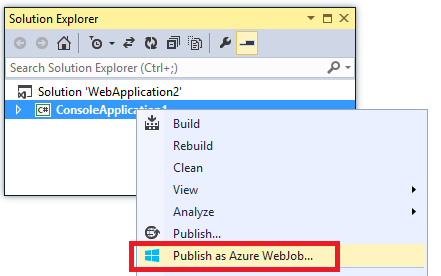

<properties 
    pageTitle="Déployer WebJobs à l’aide de Visual Studio" 
    description="Apprenez à déployer WebJobs Azure Azure Application Service Web Apps à l’aide de Visual Studio." 
    services="app-service" 
    documentationCenter="" 
    authors="tdykstra" 
    manager="wpickett" 
    editor="jimbe"/>

<tags 
    ms.service="app-service" 
    ms.devlang="dotnet" 
    ms.topic="article" 
    ms.tgt_pltfrm="na" 
    ms.workload="na" 
    ms.date="04/27/2016" 
    ms.author="tdykstra"/>

# Déployer WebJobs à l’aide de Visual Studio

## Vue d’ensemble

Cette rubrique explique comment utiliser Visual Studio pour déployer un projet d’Application Console sur une application web dans le [Service d’application](http://go.microsoft.com/fwlink/?LinkId=529714) comme un [WebJob Azure](http://go.microsoft.com/fwlink/?LinkId=390226). Pour plus d’informations sur la façon de déployer WebJobs à l’aide du [Portail Azure](https://portal.azure.com), voir [tâches de s’exécuter en arrière-plan avec WebJobs](web-sites-create-web-jobs.md).

Lorsque Visual Studio déploie un projet d’Application de Console compatibles avec les WebJobs, elle effectue deux tâches :

* Copie pour l’exécution des fichiers vers le dossier approprié dans l’application web (*App_Data/travaux/continue* pour WebJobs continu, *App_Data/travaux/déclenchée* pour WebJobs planifiée et à la demande).
* Configure les [tâches du planificateur Azure](#scheduler) pour WebJobs planifiées au moment particulier. (Cela n'est pas nécessaire pour WebJobs continu.)

Un projet compatibles avec les WebJobs comporte les éléments suivants ajoutés :

* Le package NuGet [Microsoft.Web.WebJobs.Publish](http://www.nuget.org/packages/Microsoft.Web.WebJobs.Publish/) .
* Un fichier [settings.json webjob publier](#publishsettings) qui contient des paramètres de déploiement et de planificateur. 

Vous pouvez ajouter ces éléments à un projet d’Application Console existant ou utiliser un modèle pour créer un projet Application Console compatible WebJobs. 

Vous pouvez déployer un projet en tant qu’un WebJob par elle-même ou lier à un projet web afin qu’il soit déployé automatiquement chaque fois que vous déployez le projet web. Pour lier des projets, Visual Studio inclut le nom du projet compatibles avec les WebJobs dans un fichier [webjobs list.json](#webjobslist) dans le projet web.

## Conditions préalables

Fonctionnalités de déploiement WebJobs sont disponibles dans Visual Studio 2015 lorsque vous installez le Kit de développement Azure pour .NET :

* [Kit de développement azure pour .NET (Visual Studio 2015)](http://go.microsoft.com/fwlink/?linkid=518003).

## Activer le déploiement WebJobs pour un projet d’Application Console existant

Vous avez deux possibilités :

* [Activer le déploiement automatique avec un projet web](#convertlink).

    Configurer un projet d’Application Console existant afin qu’il soit déployé automatiquement comme un WebJob lorsque vous déployez un projet web. Utilisez cette option lorsque vous souhaitez exécuter votre WebJob dans l’application web même dans lequel vous exécutez l’application web apparentées.

* [Activer le déploiement sans un projet web](#convertnolink).

    Configurer un projet d’Application Console existant pour déployer comme un WebJob à elle-même, sans lien à un projet web. Utilisez cette option lorsque vous voulez exécuter un WebJob dans une application web en lui-même avec aucune application web qui s’exécute dans l’application web. Vous souhaiterez peut-être procédez comme suit pour être en mesure d’adapter vos ressources WebJob indépendamment de celles vos ressources d’application web.

### Activer le déploiement WebJobs automatique avec un projet web
  
1. Droit sur le projet web dans **L’Explorateur de solutions**, puis cliquez sur **Ajouter** > **Un projet existant en tant que WebJob Azure**.

    
    
    La boîte de dialogue [Ajouter Azure WebJob](#configure) s’affiche.

1. Dans la liste déroulante **nom du projet** , sélectionnez le projet Application Console à ajouter comme un WebJob.

    

2. La boîte de dialogue [Ajouter Azure WebJob](#configure) , puis cliquez sur **OK**. 

### Activer le déploiement WebJobs sans un projet web
  
1. Droit sur le projet Application Console dans **L’Explorateur de solutions**, puis cliquez sur **Publier en tant que WebJob Azure**. 

    
    
    La boîte de dialogue [Ajouter Azure WebJob](#configure) s’affiche avec le projet sélectionné dans la zone **nom du projet** .

2.  Complétez la boîte de dialogue [Ajouter Azure WebJob](#configure) , puis cliquez sur **OK**.

    L’Assistant **Publier le site Web** s’affiche.  Si vous ne voulez pas publier immédiatement, fermez l’Assistant. Les paramètres que vous avez entré sont enregistrés pour lorsque vous ne souhaitez pas [déployer le projet](#deploy).

## Créer un projet compatibles avec les WebJobs

Pour créer un nouveau projet compatibles avec les WebJobs, vous pouvez utiliser le modèle de projet Application Console et activer le déploiement WebJobs comme indiqué dans [la section précédente](#convert). Comme alternative, vous pouvez utiliser le modèle de nouveau projet WebJobs :

* [Utiliser le modèle de nouveau projet WebJobs pour un WebJob indépendant](#createnolink)

    Créer un projet et configurez-le pour déployer seul comme un WebJob, sans lien à un projet web. Utilisez cette option lorsque vous voulez exécuter un WebJob dans une application web en lui-même avec aucune application web qui s’exécute dans l’application web. Vous souhaiterez peut-être procédez comme suit pour être en mesure d’adapter vos ressources WebJob indépendamment de celles vos ressources d’application web.

* [Utiliser le modèle de nouveau projet WebJobs pour une WebJob liée à un projet web](#createlink)

    Créer un projet est configuré pour déployer automatiquement comme un WebJob lorsqu’un projet web dans la même solution est déployé. Utilisez cette option lorsque vous souhaitez exécuter votre WebJob dans l’application web même dans lequel vous exécutez l’application web apparentées.

> [AZURE.NOTE] Le modèle de nouveau projet WebJobs installe packages NuGet automatiquement et inclut du code dans *Program.cs* pour le [Kit de développement logiciel WebJobs](http://www.asp.net/aspnet/overview/developing-apps-with-windows-azure/getting-started-with-windows-azure-webjobs). Si vous ne souhaitez utiliser le SDK WebJobs ou à utiliser un WebJob planifiée plutôt que continue, supprimer ou modifier la `host.RunAndBlock` instruction dans *Program.cs*.

### Utiliser le modèle de nouveau projet WebJobs pour un WebJob indépendant
  
1. Cliquez sur **fichier** > **Nouveau projet**, puis, dans la boîte de dialogue **Nouveau projet** , cliquez sur **nuage** > **Microsoft Azure WebJob**.

    
    
2. Suivez les instructions ci-dessus pour [rendre l’Application Console un projet WebJobs indépendant du projet](#convertnolink).

### Utiliser le modèle de nouveau projet WebJobs pour une WebJob liée à un projet web

1. Droit sur le projet web dans **L’Explorateur de solutions**, puis cliquez sur **Ajouter** > **Azure WebJob projet**.

    

    La boîte de dialogue [Ajouter Azure WebJob](#configure) s’affiche.

2. Complétez la boîte de dialogue [Ajouter Azure WebJob](#configure) , puis cliquez sur **OK**.

## La boîte de dialogue Ajouter Azure WebJob

La boîte de dialogue **Ajouter Azure WebJob** vous permet d’entrer de nom de WebJob et de paramètres pour votre WebJob de planification. 

Les champs dans cette boîte de dialogue correspondent aux champs de la boîte de dialogue **Nouvelle tâche** du portail Azure. Pour plus d’informations, voir [tâches de s’exécuter en arrière-plan avec WebJobs](web-sites-create-web-jobs.md).

Pour un WebJob planifiée (et non pour WebJobs continu), Visual Studio crée une collection de travail [Azure planificateur](/services/scheduler/) si une n’existe pas encore, et qu’il crée une tâche dans la collection de sites :

* Le regroupement de travail scheduler est nommé *WebJobs-{regionname}* où *{regionname}* fait référence à la région du web app est hébergé dans. Par exemple : WebJobs WestUS.
* La tâche du planificateur est nommée *{webappname}-{webjobname}*. Par exemple : MyWebApp MyWebJob. 
 
>[AZURE.NOTE]
> 
>* Pour plus d’informations sur le déploiement de ligne de commande, voir [activation de ligne de commande ou remise continue de Azure WebJobs](/blog/2014/08/18/enabling-command-line-or-continuous-delivery-of-azure-webjobs/).
>* Si vous configurez une **Tâche périodique** , sélectionnez la fréquence de périodicité à un nombre de minutes, le service Planificateur Azure n’est pas disponible. Autres fréquence (heures, jours et ainsi de suite) est gratuites.
>* Si vous déployez une WebJob et que vous décidez ensuite que vous voulez modifier le type de WebJob et redéploiement, vous devez supprimer le fichier settings.json webjobs publier. Cette option permettra que Visual Studio réafficher les options de publication, vous pouvez modifier le type de WebJob.
>* Si vous déployez une WebJob et modifiez ultérieurement le mode d’exécution de continue non continues ou vice versa, Visual Studio crée un nouveau WebJob dans Azure lorsque vous redéployez. Si vous modifiez d’autres paramètres de planification, mais laissez exécuter le mode de la même ou basculer entre planifiée et à la demande, Visual Studio met à jour le travail existant au lieu de créer un nouvel identifiant.

## settings.json webjob publier

Lorsque vous configurez une Application Console pour le déploiement WebJobs, Visual Studio installe le package NuGet [Microsoft.Web.WebJobs.Publish](http://www.nuget.org/packages/Microsoft.Web.WebJobs.Publish/) et stocke les informations de planification dans un fichier *settings.json webjob publier* dans le dossier du projet WebJobs *Propriétés* du projet. Voici un exemple de ce fichier :

        {
          "$schema": "http://schemastore.org/schemas/json/webjob-publish-settings.json",
          "webJobName": "WebJob1",
          "startTime": "2014-06-23T00:00:00-08:00",
          "endTime": "2014-06-27T00:00:00-08:00",
          "jobRecurrenceFrequency": "Minute",
          "interval": 5,
          "runMode": "Scheduled"
        }

Vous pouvez modifier ce fichier directement, et Visual Studio donne accès à IntelliSense. Le schéma de fichier est stocké en [http://schemastore.org](http://schemastore.org/schemas/json/webjob-publish-settings.json) et peut être affiché à cet endroit.  

>[AZURE.NOTE]
>
>* Si vous configurez une **Tâche périodique** , sélectionnez la fréquence de périodicité à un nombre de minutes, le service Planificateur Azure n’est pas disponible. Autres fréquence (heures, jours et ainsi de suite) est gratuites.

## webjobs list.json

Lorsque vous liez un projet compatibles avec les WebJobs à un projet web, Visual Studio stocke le nom du projet WebJobs dans un fichier *webjobs list.json* dossier *Propriétés* du projet web. La liste peut contenir plusieurs projets WebJobs, comme illustré dans l’exemple suivant :

        {
          "$schema": "http://schemastore.org/schemas/json/webjobs-list.json",
          "WebJobs": [
            {
              "filePath": "../ConsoleApplication1/ConsoleApplication1.csproj"
            },
            {
              "filePath": "../WebJob1/WebJob1.csproj"
            }
          ]
        }

Vous pouvez modifier ce fichier directement, et Visual Studio donne accès à IntelliSense. Le schéma de fichier est stocké en [http://schemastore.org](http://schemastore.org/schemas/json/webjobs-list.json) et peut être affiché à cet endroit.
  
## Déploiement d’un projet WebJobs

Un projet WebJobs que vous avez liés à un projet web déploie automatiquement le projet web. Pour plus d’informations sur le déploiement de project web, voir [comment déployer des applications Web](web-sites-deploy.md).

Pour déployer un projet WebJobs à elle-même, droit sur le projet dans **L’Explorateur de solutions**, puis cliquez sur **Publier en tant que WebJob Azure**. 

    
Pour un WebJob indépendant, le même Assistant **Publier le site Web** qui est utilisé pour les projets web s’affiche, mais moins de paramètres disponibles à modifier.

## Étapes suivantes

Cet article a décrit comment déployer WebJobs à l’aide de Visual Studio. Pour plus d’informations sur le déploiement d’Azure WebJobs, voir [Azure WebJobs - ressources recommandé - déploiement](http://www.asp.net/aspnet/overview/developing-apps-with-windows-azure/azure-webjobs-recommended-resources#deploying).
