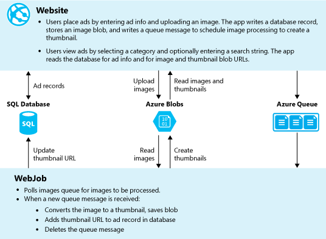
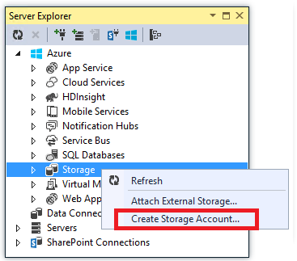

<properties
    pageTitle="Créer un WebJob .NET dans le Service d’application Azure | Microsoft Azure"
    description="Créer une application à plusieurs niveaux à l’aide de ASP.NET MVC et Azure. Les séries de fin avant dans une application web dans le Service d’application Azure et le système principal fonctionne comme un WebJob. L’application utilise Framework entité, base de données SQL et files d’attente de stockage Azure et des objets BLOB."
    services="app-service"
    documentationCenter=".net"
    authors="tdykstra"
    manager="wpickett"
    editor="mollybos"/>

<tags
    ms.service="app-service"
    ms.workload="na"
    ms.tgt_pltfrm="na"
    ms.devlang="na"
    ms.topic="article"
    ms.date="10/28/2016"
    ms.author="tdykstra"/>

# Créer un WebJob .NET dans le Service d’application Azure

Ce didacticiel montre comment écrire du code pour une application ASP.NET MVC 5 à plusieurs niveaux simple qui utilise le [Kit de développement logiciel WebJobs](websites-dotnet-webjobs-sdk.md).

L’objectif du [Kit de développement logiciel WebJobs](websites-webjobs-resources.md) est pour simplifier le code que vous écrivez pour les tâches courantes qu’un WebJob peuvent effectuer, par exemple de traitement d’images, traitement en file d’attente, RSS d’agrégation, gestion des fichiers et envoi de messages électroniques. Le SDK WebJobs possède des fonctionnalités intégrées pour travailler avec le stockage Azure et Bus des services, pour la planification des tâches et gestion des erreurs et de nombreux autres scénarios courants. En outre, il est conçu pour être extensible, et il est d' [Ouvrir le référentiel source pour les extensions](https://github.com/Azure/azure-webjobs-sdk-extensions/wiki/Binding-Extensions-Overview).

L’exemple d’application est un forum publicitaires. Les utilisateurs peuvent télécharger des images pour les annonces et un processus principal convertit les images miniatures. La page de liste ad affiche les miniatures et la page de détails ad montre l’image en taille réelle. Voici une capture d’écran :

Cet exemple d’application fonctionne avec [Azure files d’attente](http://www.asp.net/aspnet/overview/developing-apps-with-windows-azure/building-real-world-cloud-apps-with-windows-azure/queue-centric-work-pattern) et [des objets BLOB Azure](http://www.asp.net/aspnet/overview/developing-apps-with-windows-azure/building-real-world-cloud-apps-with-windows-azure/unstructured-blob-storage). Le didacticiel montre comment déployer l’application sur [Azure Application Service](http://go.microsoft.com/fwlink/?LinkId=529714) et ma [Base de données SQL Azure](http://msdn.microsoft.com/library/azure/ee336279).

## Conditions préalables

Le didacticiel suppose que vous savez comment travailler avec des projets [ASP.NET MVC 5](http://www.asp.net/mvc/tutorials/mvc-5/introduction/getting-started) dans Visual Studio.

Le didacticiel écrite pour Visual Studio 2013. Si vous n’avez pas déjà Visual Studio, il sera être installé pour vous automatiquement lorsque vous installez le Kit de développement Azure pour .NET.

Le didacticiel peut être utilisé avec Visual Studio 2015, mais avant d’exécuter l’application localement vous devez modifier le `Data Source` fait partie de la chaîne de connexion SQL Server LocalDB dans les fichiers Web.config et App.config de `Data Source=(localdb)\v11.0` à `Data Source=(LocalDb)\MSSQLLocalDB`. 

> [AZURE.NOTE] Vous avez besoin d’un compte Azure pour effectuer ce didacticiel :
  >
  > + Vous pouvez [Ouvrir un compte Azure gratuitement](https://azure.microsoft.com/pricing/free-trial/?WT.mc_id=A261C142F): pouvez-vous crédits vous pouvez utiliser pour essayer de services Azure payants et même après leur utilisation jusqu'à vous pouvez conserver le compte et libérer de l’utilisation des services Azure, tels que des sites Web. Votre carte de crédit est jamais facturée, sauf si vous explicitement de modifiez vos paramètres et lui demander de vous être facturés.
  >
  > + Vous pouvez [Activer les avantages d’abonné MSDN](https://azure.microsoft.com/pricing/member-offers/msdn-benefits-details/?WT.mc_id=A261C142F): MSDN votre abonnement fournit les crédits chaque mois que vous pouvez utiliser pour les services Azure payants.
  >
  >Si vous voulez commencer à utiliser le Service d’application Azure avant de vous inscrire pour un compte Azure, accédez à [Essayer le Service application](http://go.microsoft.com/fwlink/?LinkId=523751), où vous pouvez créer une application web starter courte immédiatement dans le Service d’application. Aucune carte de crédit obligatoire ; Aucune engagements.

## Enseignements de cet article

Le didacticiel montre comment effectuer les tâches suivantes :

* Activer votre ordinateur pour le développement Azure en installant le Kit de développement Azure.
* Créer un projet d’Application Console déploie automatiquement comme un WebJob Azure lorsque vous déployez le projet web associée.
* Tester un serveur principal WebJobs SDK localement sur l’ordinateur de développement.
* Publier une application avec un serveur principal WebJobs dans une application web dans le Service d’application.
* Télécharger des fichiers et les stocker dans le service d’objets Blob Azure.
* Utiliser le Kit de développement WebJobs Azure pour travailler avec des objets BLOB et files d’attente de stockage Azure.

## Architecture de l’application

L’exemple d’application utilise le [motif orientée file d’attente de travail](http://www.asp.net/aspnet/overview/developing-apps-with-windows-azure/building-real-world-cloud-apps-with-windows-azure/queue-centric-work-pattern) pour décharger le travail intensive du processeur de création des miniatures à un processus principal.

L’application stocke les annonces dans une base de données SQL, à l’aide d’entité Framework Code First pour créer les tables et accéder aux données. Pour chaque publicité, la base de données stocke les deux URL : une pour l’image en plein écran et l’autre pour la miniature.

Lorsqu’un utilisateur télécharge une image, l’application web stocke l’image dans un [blob Azure](http://www.asp.net/aspnet/overview/developing-apps-with-windows-azure/building-real-world-cloud-apps-with-windows-azure/unstructured-blob-storage)et stocke les informations de publicité dans la base de données avec une URL qui pointe vers le blob. En même temps, il écrit un message dans une file d’attente Azure. Dans un processus principal en cours d’exécution comme un WebJob Azure, le SDK WebJobs consulte la file d’attente pour les nouveaux messages. Lorsqu’un message s’affiche, la WebJob crée une miniature pour cette image et met à jour le champ de base de données URL miniature de cette publicité. Voici un diagramme qui montre comment interagissent les parties de l’application :

[AZURE.INCLUDE [install-sdk](../../includes/install-sdk-2015-2013.md)]

Les didacticiels instructions s’appliquent à Azure SDK pour .NET 2.7.1 ou version ultérieure.

## Créer un compte de stockage Azure

Un compte de stockage Azure fournit des ressources pour le stockage de données file d’attente et blob dans le cloud. Il est également utilisé par le SDK WebJobs pour stocker les données de journalisation pour le tableau de bord.

Dans une application réelle, vous créez généralement des comptes séparés pour l’application des comptes de données par rapport aux données de journalisation et distincts pour les données de test par rapport aux données de production. Pour ce didacticiel, vous allez utiliser qu’un seul compte.

1. Ouvrez la fenêtre **Explorateur de serveurs** dans Visual Studio.

2. Cliquez sur le nœud **Azure** , puis cliquez sur **se connecter à Microsoft Azure**.

3. Connectez-vous à l’aide de vos informations d’identification Azure.

5. Avec le bouton droit de **stockage** sous le nœud Azure, puis cliquez sur **Créer un compte de stockage**.

3. Dans la boîte de dialogue **Créer un compte de stockage** , entrez un nom pour le compte de stockage.

    Le nom doit être doit être unique (aucun autre compte de stockage Azure ne peut avoir le même nom). Si le nom que vous entrez est déjà en cours d’utilisation, vous recevrez une chance de le modifier.

    L’URL pour accéder à votre compte de stockage sera *{nom}*. core.windows.net.

5. Définir la liste déroulante **région ou un groupe affinité** à la région plus proche de vous.

    Ce paramètre spécifie le centre de données Azure va héberger votre compte de stockage. Pour ce didacticiel, votre choix ne faire la différence visible. Toutefois, pour une application web de production, vous souhaitez votre serveur web et votre compte de stockage d’être présent à la même région pour réduire les frais de sortie de latence et les données. L’application web (que vous allez créer ultérieurement) centre de données doit être aussi proche que possible pour les navigateurs l’accès à l’application web afin de réduire la latence.

6. Définissez la liste déroulante **réplication** sur **localement redondants**.

    Lors de la réplication de geo est activée pour un compte de stockage, le contenu stocké est répliqué sur un centre de données secondaire pour permettre le basculement à cet emplacement en cas de sinistre majeur dans l’emplacement principal. Geo réplication peut entraîner des coûts supplémentaires. Pour les comptes de test et de développement, vous ne souhaitez généralement payer pour geo réplication. Pour plus d’informations, voir [créer, gérer, ou supprimer un compte de stockage](../storage-create-storage-account/#replication-options).

5. Cliquez sur **créer**.

    

## Télécharger l’application

1. Téléchargez et décompressez le [complété solution](http://code.msdn.microsoft.com/Simple-Azure-Website-with-b4391eeb).

2. Démarrez Visual Studio.

3. Dans le menu **fichier** , choisissez **Ouvrir > Projet/Solution**, accédez à l’endroit où vous avez téléchargé la solution et puis ouvrez le fichier solution.

4. Appuyez sur CTRL + MAJ + B pour générer la solution.

    Par défaut, Visual Studio restaure automatiquement le contenu du package NuGet, qui n’était pas inclus dans le fichier *.zip* . Si les packages ne sont pas restaurées, installez-les manuellement en accédant à la boîte de dialogue **Gérer les Packages NuGet pour la Solution** et en cliquant sur le bouton **restaurer** en haut à droite.

5. Dans **L’Explorateur de solutions**, vérifiez que **ContosoAdsWeb** est sélectionné comme projet de démarrage.

## Configurer l’application à utiliser votre compte de stockage

1. Ouvrez le fichier *Web.config* application dans le projet ContosoAdsWeb.

    Le fichier contient une chaîne de connexion SQL et une chaîne de connexion de stockage Azure pour travailler avec des objets BLOB et files d’attente.

    La chaîne de connexion SQL pointe vers une base de données [SQL Server Express LocalDB](http://msdn.microsoft.com/library/hh510202.aspx) .

    La chaîne de connexion de stockage est un exemple qui comporte des espaces réservés pour la clé d’accès et le nom du compte de stockage. Vous devez remplacer par une chaîne de connexion qui comporte le nom et la clé de votre compte de stockage.  

    <pre class="prettyprint">&lt;connectionStrings&gt;
   &lt;ajoutez nom = « ContosoAdsContext » connectionString = « Source de données = \v11.0 (localdb) ; Catalogue initial = ContosoAds ; Sécurité intégrée = vrai ; MultipleActiveResultSets = True ; « providerName="System.Data.SqlClient » /&gt;
   &lt;ajouter nom = « AzureWebJobsStorage » connectionString = « DefaultEndpointsProtocol = https ; Nom de compte =<mark>[nom de compte]</mark>; AccountKey =<mark>[accesskey]</mark>» /&gt; 
    &lt;/connectionStrings      &gt;</pre>

    La chaîne de connexion de stockage est nommée AzureWebJobsStorage car il s’agit du nom que le WebJobs SDK utilise par défaut. Le même nom est utilisé ici afin que vous deviez définir une valeur de chaîne de connexion dans l’environnement Azure.

2. Dans l' **Explorateur de serveurs**, avec le bouton droit de votre compte de stockage sous le nœud de **stockage** , puis cliquez sur **Propriétés**.

    

3. Dans la fenêtre **Propriétés** , cliquez sur **Les clés de compte de stockage**, puis cliquez sur les points de suspension.

    

4. Copiez la **chaîne de connexion**.

    

5. Remplacez la chaîne de connexion de stockage dans le fichier *Web.config* par la chaîne de connexion que vous venez de copier. Assurez-vous de que sélectionner tout le contenu placé entre guillemets, mais pas avec les guillemets avant de coller.

6. Ouvrez le fichier *App.config* dans le projet ContosoAdsWebJob.

    Ce fichier comporte deux chaînes de connexion de stockage, l’autre pour les données d’application et l’autre pour l’enregistrement. Vous pouvez utiliser des comptes de stockage distincte pour la journalisation et les données d’application, et vous pouvez utiliser [plusieurs comptes de stockage des données](https://github.com/Azure/azure-webjobs-sdk/blob/master/test/Microsoft.Azure.WebJobs.Host.EndToEndTests/MultipleStorageAccountsEndToEndTests.cs). Pour ce didacticiel, vous allez utiliser un compte de stockage unique. Les chaînes de connexion des espaces réservés pour les clés de compte de stockage. 
    <pre class="prettyprint">&lt;configuration&gt; 
    &lt;connectionStrings&gt;
   &lt;ajoutez nom = « AzureWebJobsDashboard » connectionString = « DefaultEndpointsProtocol = https ; Nom de compte =<mark>[nom de compte]</mark>; AccountKey =<mark>[accesskey]</mark>» /&gt;
   &lt;ajoutez nom = « AzureWebJobsStorage » connectionString = « DefaultEndpointsProtocol = https ; Nom de compte =<mark>[nom de compte]</mark>; AccountKey =<mark>[accesskey]</mark>» /&gt;
   &lt;ajoutez nom = « ContosoAdsContext » connectionString = « Source de données = \v11.0 (localdb) ; Catalogue initial = ContosoAds ; Sécurité intégrée = vrai ; MultipleActiveResultSets = True ; » /&gt; 
    &lt;/connectionStrings&gt;
   &lt;démarrage&gt;
   &lt;version supportedRuntime = sku v4.0 » ou » = ». NETFramework, Version = 4.5 « /&gt; 
    &lt;/startup&gt;
&lt;configuration                             &gt;</pre>

    Par défaut, le SDK WebJobs recherche les chaînes de connexion nommées AzureWebJobsStorage et AzureWebJobsDashboard. Comme alternative, vous pouvez [store la chaîne de connexion toutefois souhaitée, puis passer explicitement à la `JobHost` objet](websites-dotnet-webjobs-sdk-storage-queues-how-to.md#config).

7. Remplacez les deux chaînes de connexion de stockage par la chaîne de connexion que vous avez copiée précédemment.

8. Enregistrez vos modifications.

## Exécutez l’application localement

1. Pour commencer la frontend web de l’application, appuyez sur CTRL + F5.

    Le navigateur par défaut s’ouvre à la page d’accueil. (Le projet web est exécuté, car il effectuées le projet de démarrage.)

    

2. Pour démarrer le système principal WebJob de l’application, cliquez sur le projet ContosoAdsWebJob dans **L’Explorateur**, puis cliquez sur **Déboguer** > **Démarrer une nouvelle instance**.

    Une fenêtre d’application console s’ouvre et affiche les messages d’enregistrement indiquant que l’objet WebJobs SDK JobHost a commencé à exécuter.

    

3. Dans votre navigateur, cliquez sur **créer une annonce**.

4. Entrer des données de test et sélectionner une image à télécharger, puis cliquez sur **créer**.

    

    L’application accède à la page d’Index, mais elle n’affiche pas une miniature pour la nouvelle annonce car ce traitement n’a pas encore s’est produite.

    Pendant ce temps, après une activité attendre un courte un message d’enregistrement dans la fenêtre d’application console indique qu’un message de file d’attente a été reçu et a été traité.

    

5. Une fois que vous voyez les messages de journalisation dans la fenêtre d’application console, actualisez la page d’Index pour afficher la miniature.

    

6. Cliquez sur **Détails** de votre annonce pour voir l’image en plein écran.

    

Vous avez déjà exécuté l’application sur votre ordinateur local, et qu’il utilise un serveur SQL de base de données situé sur votre ordinateur, mais il fonctionne avec files d’attente et objets BLOB dans le cloud. Dans la section suivante vous exécutez l’application dans le cloud, à l’aide d’une base de données cloud, ainsi que des objets BLOB cloud et files d’attente.  

## Exécuter l’application dans le cloud

Vous devez effectuer les étapes suivantes pour exécuter l’application dans le cloud :

* Déployer des applications Web. Visual Studio crée automatiquement une nouvelle application web dans l’application de Service et une instance de base de données SQL.
* Configurer l’application web pour utiliser votre compte de stockage et de base de données SQL Azure.

Une fois que vous avez créé des annonces lors de l’exécution dans le cloud, vous devez afficher le tableau de bord WebJobs SDK pour afficher l’enrichi il a à offrir des fonctionnalités d’analyse.

### Déployer des applications Web

1. Fermez le navigateur et la fenêtre d’application console.

2. Dans l' **Explorateur de solutions**, cliquez sur le projet ContosoAdsWeb, puis cliquez sur **Publier**.

3. Dans l’étape de **profil** de l’Assistant **Publier le site Web** , cliquez sur **Microsoft Azure web applications**.

    

4. Connectez-vous à Azure si vous n’êtes pas encore connecté.

5. Cliquez sur **Nouveau**.

    La boîte de dialogue peut différer légèrement en fonction de la version du Kit de développement Azure pour .NET que vous avez installé.

    

6. Dans la boîte de dialogue **créer web app sur Microsoft Azure** , entrez un nom unique dans la zone **nom de l’application Web** .

    L’URL complète se compose de ce que vous entrez ici plus. azurewebsites.net (comme illustré en regard de la zone de texte **nom de l’application Web** ). Par exemple, si le nom de l’application web est ContosoAds, l’URL sera ContosoAds.azurewebsites.net.

7. Dans la liste déroulante [plan de services d’application](../app-service/azure-web-sites-web-hosting-plans-in-depth-overview.md) , sélectionnez **créer un plan de Service d’application**. Entrez un nom pour le plan de services d’application, tel que ContosoAdsPlan.

8. Dans la liste déroulante [groupe de ressources](../azure-resource-manager/resource-group-overview.md) , sélectionnez **créer un groupe de ressources**.

9. Entrez un nom pour le groupe de ressources, par exemple ContosoAdsGroup.

10. Dans la liste déroulante de la **région** , sélectionnez la même région que vous avez choisi pour votre compte de stockage.

    Ce paramètre spécifie le centre de données Azure votre application web est exécuté en. Tout en conservant le compte de stockage et d’application web dans le même centre de données permet de réduire les frais de sortie latence et les données.

11. Dans la liste déroulante de **serveur de base de données** , sélectionnez **créer un nouveau serveur**.

12. Entrez un nom pour le serveur de base de données, par exemple contosoadsserver + un nombre ou votre nom pour rendre le nom du serveur unique. 

    Le nom du serveur doit être unique. Il peut contenir des lettres minuscules, les chiffres et des traits d’union. Il ne peut pas contenir un trait d’union. 

    Par ailleurs, si votre abonnement déjà dispose d’un serveur, vous pouvez sélectionner ce serveur dans la liste déroulante.

12. Entrez un administrateur **de base de données nom d’utilisateur** et **mot de passe de base de données**.

    Si vous avez sélectionné la **nouvelle base de données SQL server** , vous ne sont pas entrer un nom existant et le mot de passe ici, vous saisissez un nouveau nom et un mot de passe que vous définissez maintenant pour une utilisation ultérieure lorsque vous accédez à la base de données. Si vous avez sélectionné un serveur que vous avez créé précédemment, vous serez invité pour le mot de passe pour le compte d’utilisateur d’administration que vous avez déjà créé.

13. Cliquez sur **créer**.

    

    Visual Studio crée la solution, le projet web, l’application web dans Azure et l’instance de base de données SQL Azure.

14. Dans l’étape de **connexion** de l’Assistant **Publier le site Web** , cliquez sur **suivant**.

    

15. Dans l’étape **paramètres** , désactivez la case à cocher **utiliser cette chaîne de connexion en cours d’exécution** , puis cliquez sur **suivant**.

    

    Vous n’avez pas besoin d’utiliser la boîte de dialogue Publier pour définir la chaîne de connexion SQL, car vous devez définir cette valeur dans l’environnement Azure ultérieurement.

    Vous pouvez ignorer les avertissements sur cette page.

    * En règle générale, le compte de stockage que vous utilisez lorsqu’en cours d’exécution dans Azure est différent de celui que vous utilisez lors de l’exécution localement, mais pour ce didacticiel, vous utilisez le même que celui dans les deux environnements. Si la chaîne de connexion AzureWebJobsStorage n’a pas besoin à transformer. Même si vous ne souhaitez pas utiliser un compte de stockage différentes dans le cloud, vous ne devez transformer la chaîne de connexion, car l’application utilise un paramètre d’environnement Azure lorsqu’il s’exécute dans Azure. Vous verrez ceci plus loin dans le didacticiel.

    * Pour ce didacticiel, que vous ne vont être apporter des modifications au modèle de données utilisé pour la base de données ContosoAdsContext, donc il n’est pas nécessaire d’utiliser des Migrations première entité Framework Code pour le déploiement. Tout d’abord, code crée automatiquement une nouvelle heure de la base de données la première l’application tente d’accéder aux données SQL.

    Pour ce didacticiel, les valeurs par défaut des options sous **Options de publication de fichier** conviennent.

16. Dans l’étape **Aperçu** , cliquez sur **Démarrer aperçu**.

    

    Vous pouvez ignorer les avertissements concernant les aucune base de données publiées. Entité Framework Code First crée la base de données ; Il ne doit pas être publié.

    La fenêtre d’aperçu montre que binaires et fichiers de configuration du projet WebJob seront copiées dans le dossier *app_data\jobs\continuous* de l’application web.

    

17. Cliquez sur **Publier**.

    Visual Studio déploie l’application et ouvre l’URL de la page d’accueil dans le navigateur.

    Vous ne pourrez pas utiliser l’application web jusqu'à ce que vous définissez des chaînes de connexion dans l’environnement Azure dans la section suivante. Vous verrez une page d’erreur ou la page d’accueil en fonction de l’application et base de données création options web que vous avez précédemment choisi.

### Configurer l’application web pour utiliser votre compte de stockage et de base de données SQL Azure.

Il est recommandé sécurité afin [d’éviter des informations sensibles telles que les chaînes de connexion dans les fichiers qui sont stockés dans les référentiels de code source](http://www.asp.net/aspnet/overview/developing-apps-with-windows-azure/building-real-world-cloud-apps-with-windows-azure/source-control#secrets). Azure permet de le faire : vous pouvez définir la chaîne de connexion et d’autres valeurs de paramètre dans l’environnement Azure et API de configuration ASP.NET décrochez automatiquement ces valeurs lorsque l’application s’exécute dans Azure. Vous pouvez définir les valeurs suivantes dans Azure à l’aide de **L’Explorateur de serveur**, le portail Azure, Windows PowerShell ou l’interface de ligne de commande disponibilité sur plusieurs plateformes. Pour plus d’informations, voir [comment chaînes de l’Application et le travail de chaînes de connexion](/blog/2013/07/17/windows-azure-web-sites-how-application-strings-and-connection-strings-work/).

Dans cette section **l’Explorateur de serveurs** vous permet de définir des valeurs de chaîne de connexion dans Azure.

7. Dans l' **Explorateur de serveurs**, avec le bouton droit votre application web sous **Azure > Application Service > {votre groupe de ressources}**, puis cliquez sur **Paramètres d’affichage**.

    La fenêtre **Azure Web App** s’ouvre sur l’onglet **Configuration** .

9. Modifier le nom de la chaîne de connexion DefaultConnection à ContosoAdsContext.

    Azure crée automatiquement cette chaîne de connexion lorsque vous avez créé l’application web avec une base de données associée, afin qu’il possède déjà la valeur de chaîne de connexion approprié. Vous modifiez simplement le nom à ce que votre code recherchez.

9. Ajouter deux nouvelles chaînes de connexion, nommés AzureWebJobsStorage et AzureWebJobsDashboard. Définir le type sur personnalisé, puis définir la valeur de chaîne de connexion à la même valeur que vous avez utilisées précédemment pour les fichiers *Web.config* et *App.config* . (Assurez-vous que vous incluez la chaîne de connexion entière, pas seulement la touche d’accès rapide et ne contiennent pas les guillemets).

    Ces chaînes de connexion sont utilisées par le SDK WebJobs, une pour les données d’application et l’autre pour l’enregistrement. Comme vous avez vu plus haut, celle des données de l’application est également utilisée par le code frontal web.

9. Cliquez sur **Enregistrer**.

    

10. Dans l' **Explorateur de serveurs**, avec le bouton droit de l’application web, puis cliquez sur **Arrêter**.

12. Une fois que l’application web s’arrête, l’application web avec le bouton droit à nouveau, puis cliquez sur **Démarrer**.

    La WebJob démarre automatiquement lorsque vous publiez, mais il s’arrête lorsque vous modifiez la configuration. Vous pouvez redémarrer l’application web pour le redémarrer ou redémarrer le WebJob dans le [Portail Azure](http://go.microsoft.com/fwlink/?LinkId=529715). En règle générale, il est recommandé de redémarrer l’application web après une modification de configuration.

9. Actualiser la fenêtre de navigateur avec l’URL de l’application web dans sa barre d’adresses.

    La page d’accueil s’affiche.

10. Créer une annonce, comme vous le faisiez lorsque vous avez exécuté l’application localement.

    La page d’Index affiche sans une vignette dans un premier temps.

11. Actualiser la page après quelques secondes, puis la vignette apparaît.

    Si la miniature n’apparaît pas, vous devrez peut-être Patientez environ une minute avant de la WebJob redémarrer. Si après avoir a un certain temps n’apparaît toujours pas la miniature lorsque vous actualisez la page, la WebJob a ne peut-être pas démarré automatiquement. Dans ce cas, accédez à l’onglet WebJobs dans la page du [portail classique](https://manage.windowsazure.com) pour votre application web, puis cliquez sur **Démarrer**.

### Afficher le tableau de bord WebJobs SDK

1. Dans le [portail classique](https://manage.windowsazure.com), sélectionnez votre application web.

2. Cliquez sur l’onglet **WebJobs** .

3. Cliquez sur l’URL dans la colonne journaux pour votre WebJob.

    

    Un nouvel onglet de navigateur s’ouvre sur le tableau de bord WebJobs SDK. Le tableau de bord indique que le WebJob s’exécute et affiche une liste des fonctions dans votre code qui a déclenché le SDK WebJobs.

4. Cliquez sur une des fonctions pour afficher des détails sur son exécution.

    

    

    Le bouton de **Fonction relecture** dans cette page provoque l’infrastructure WebJobs SDK d’appeler la fonction à nouveau, et il vous donne la possibilité d’en modifier les données passées à la fonction en premier.

>[AZURE.NOTE] Lorsque vous avez terminé votre test, supprimez l’application web et l’instance de base de données SQL. L’application web est gratuite, mais l’instance de base de données SQL et un compte de stockage méthode d’allocation des frais (minimales en raison de petite taille). En outre, si vous laissez l’application web en cours d’exécution, toute personne détecte votre URL pouvez créer et afficher des annonces. Dans le portail classique, accédez à l’onglet **tableau de bord** pour votre application web, puis cliquez sur le bouton **Supprimer** en bas de la page. Vous pouvez ensuite sélectionner une case à cocher pour supprimer l’instance de base de données SQL en même temps. Si vous voulez simplement temporairement empêcher d’autres utilisateurs d’accéder à l’application web, cliquez sur **Arrêter** . Dans ce cas, les frais continuent à accumuler pour le compte de stockage et de base de données SQL. Vous pouvez suivre une procédure similaire pour supprimer le compte de stockage et de base de données SQL lorsque vous n’avez plus besoin.

## Créer l’application à partir de zéro

Dans cette section, vous devez effectuer les tâches suivantes :

* Créer une solution Visual Studio avec un projet web.
* Ajouter un projet de bibliothèque de classes pour la couche d’accès aux données qui est partagée entre serveur principal et frontal.
* Ajouter un projet d’Application Console pour le serveur principal, avec le déploiement WebJobs activé.
* Ajouter des packages NuGet.
* Définir les références de projet.
* Copiez les fichiers de code et la configuration d’application à partir de l’application téléchargée que vous avez travaillé avec dans la section précédente du didacticiel.
* Passez en revue les parties du code fonctionnant avec des objets BLOB Azure et files d’attente et le SDK WebJobs.

### Créer une solution Visual Studio avec un projet web et le projet de bibliothèque de classes

1. Dans Visual Studio, cliquez sur **Nouveau** > **projet** dans le menu **fichier** .

2. Dans la boîte de dialogue **Nouveau projet** , sélectionnez **Visual c#** > **Web** > **Application Web ASP.NET**.

3. Nommez le projet ContosoAdsWeb, nom de la solution ContosoAdsWebJobsSDK (modifier le nom de la solution si vous êtes l’insérer dans le même dossier que la solution téléchargé), puis cliquez sur **OK**.

    

5. Dans la boîte de dialogue **Nouveau projet ASP.NET** , choisissez le modèle MVC et désactivez la case à cocher **hôte dans le cloud** sous **Microsoft Azure**.

    Sélection **d’hôte dans le nuage** permet de Visual Studio pour créer automatiquement une nouvelle application web Azure et base de données SQL. Étant donné que vous avez déjà créé ces précédemment, vous n’avez pas besoin de maintenant lors de la création du projet. Si vous voulez créer un nouveau, activez la case à cocher. Vous pouvez ensuite configurer la nouvelle application web et la base de données SQL la même façon que précédemment lorsque vous avez déployé l’application.

5. Cliquez sur **Modifier l’authentification**.

    

7. Dans la boîte de dialogue **Modifier l’authentification** , choisissez **Aucune authentification**, puis cliquez sur **OK**.

    

8. Dans la boîte de dialogue **Nouveau projet ASP.NET** , cliquez sur **OK**.

    Visual Studio crée la solution et le projet web.

9. Dans l' **Explorateur de solutions**, avec le bouton droit de la solution (et non sur le projet), puis sélectionnez **Ajouter** > **Nouveau projet**.

11. Dans la boîte de dialogue **Ajouter un nouveau projet** , sélectionnez **Visual c#** > **Windows Desktop** > modèle**Bibliothèque de classes** .  

10. Nommez le projet *ContosoAdsCommon*, puis cliquez sur **OK**.

    Ce projet contiendra le contexte entité Framework et le modèle de données qui seront utilisés par le serveur frontal et le serveur principal. En guise d’alternative, vous pouvez définir les classes liées FE dans le projet web et faire référence à ce projet à partir du projet WebJob. Mais puis votre projet WebJob c’est une référence aux assemblys web qui n’a pas besoin.

### Ajouter un projet d’Application Console qui dispose de déploiement WebJobs activé

1. Cliquez sur le projet web (pas la solution ou le projet de bibliothèque de classes), puis cliquez sur **Ajouter** > **Azure WebJob projet**.

    

2. Dans la boîte de dialogue **Ajouter des WebJob Azure** , entrez ContosoAdsWebJob comme le **nom du projet** et le **nom de WebJob**. Quitter **mode d’exécution WebJob** défini sur **Exécuter en continu**.

3.  Cliquez sur **OK**.

    Visual Studio crée une application Console qui est configurée pour déployer comme un WebJob chaque fois que vous déployez le projet web. Pour ce faire, effectuée les tâches suivantes après avoir créé le projet :

    * Ajouté un fichier *settings.json webjob publier* dans le dossier Propriétés du projet WebJob.
    * Ajouté un fichier *webjobs list.json* dans le dossier Propriétés du projet web.
    * Installé le package Microsoft.Web.WebJobs.Publish NuGet dans le projet WebJob.

    Pour plus d’informations sur ces modifications, voir [comment déployer WebJobs à l’aide de Visual Studio](websites-dotnet-deploy-webjobs.md).

### Ajouter des packages NuGet

Le modèle de nouveau projet pour un projet WebJob installe automatiquement le package WebJobs SDK NuGet [Microsoft.Azure.WebJobs](http://www.nuget.org/packages/Microsoft.Azure.WebJobs) et ses dépendances.

Un des dépendances WebJobs SDK qui est installée automatiquement dans le projet WebJob est la bibliothèque de Client stockage Azure (SCL). Toutefois, vous devez ajouter au projet web pour travailler avec des objets BLOB et files d’attente.

1. Ouvrez la boîte de dialogue **Gérer les Packages NuGet** pour la solution.

2. Dans le volet gauche, sélectionnez **packages installés**.

3. Rechercher le package de *Stockage Azure* , puis cliquez sur **Gérer**.

4. Dans la zone **Sélectionner des projets** , activez la case à cocher **ContosoAdsWeb** , puis cliquez sur **OK**.

    Les trois projets permet de travailler avec des données dans une base de données SQL l’infrastructure d’entité.

5. Dans le volet gauche, sélectionnez **en ligne**.

6. Recherchez le package NuGet *EntityFramework* , puis installez-la dans tous les trois projets.

### Définir les références de projet

Les WebJob projets et travaillent avec la base de données SQL, afin que les deux doivent être une référence au projet ContosoAdsCommon.

1. Dans le projet ContosoAdsWeb, définissez une référence au projet ContosoAdsCommon. (Droit sur le projet ContosoAdsWeb, puis cliquez sur **Ajouter** > **référence**. Dans la boîte de dialogue **Gestionnaire de référence** , sélectionnez **la Solution** > **projets** > **ContosoAdsCommon**, puis cliquez sur **OK**.)

1. Dans le projet ContosoAdsWebJob, définissez une référence au projet ContosAdsCommon.

    Le projet WebJob nécessite des références pour utiliser des images et pour accéder à des chaînes de connexion.

3. Dans le projet ContosoAdsWebJob, définissez une référence à `System.Drawing` et `System.Configuration`.

### Ajouter des fichiers de code et configuration

Ce didacticiel n’affiche pas comment [créer des vues à l’aide de la structure et contrôleurs MVC](http://www.asp.net/mvc/tutorials/mvc-5/introduction/getting-started), comment [écrire du code entité Framework qui fonctionne avec les bases de données SQL Server](http://www.asp.net/mvc/tutorials/getting-started-with-ef-using-mvc)ou [les notions de base d’asynchrone de programmation dans ASP.NET 4.5](http://www.asp.net/aspnet/overview/developing-apps-with-windows-azure/building-real-world-cloud-apps-with-windows-azure/web-development-best-practices#async). Donc tout ce qui reste à faire est copie des fichiers de code et de configuration de la solution téléchargée dans la nouvelle solution. Une fois que vous effectuez cette opération, les sections suivantes Montrez et expliquent les principales parties du code.

Pour ajouter des fichiers à un projet ou d’un dossier, cliquez sur le projet ou le dossier, puis cliquez sur **Ajouter** > **Élément existant**. Sélectionnez les fichiers souhaitée, puis cliquez sur **Ajouter**. Si vous êtes invité à remplacer les fichiers existants, cliquez sur **Oui**.

1. Dans le projet ContosoAdsCommon, supprimez le fichier *Class1.cs* et ajouter les fichiers suivants à la place du projet téléchargé.

    - *AD.cs*
    - *ContosoAdscontext.cs*
    - *BlobInformation.cs*  

2. Dans le projet ContosoAdsWeb, ajoutez les fichiers suivants à partir du projet téléchargé.

    - *Web.config*
    - *Global.asax.cs*  
    - Dans le dossier *contrôleurs* : *AdController.cs*
    - Dans le dossier *Views\Shared* : fichier *_Layout.cshtml*
    - Dans le dossier *Views\Home* : *Index.cshtml*
    - Dans le dossier *Views\Ad* (tout d’abord créer le dossier) : cinq fichiers *.cshtml*  

3. Dans le projet ContosoAdsWebJob, ajoutez les fichiers suivants à partir du projet téléchargé.

    - *App.config* (modifier le filtre de type de fichier pour **Tous les fichiers**)
    - *Program.cs*
    - *Functions.cs*

Vous pouvez désormais créer, exécuter et déploiement de l’application comme indiqué précédemment dans le didacticiel. Avant de vous effectuez cette opération, cependant, arrêter la WebJob est toujours en cours d’exécution dans l’application web première que vous avez déployé sur. Dans le cas contraire ce WebJob traite les messages de file d’attente créés localement ou par l’application en cours d’exécution dans une nouvelle application web, dans la mesure où tous les utilisent le même compte de stockage.

## Passez en revue le code d’application

Les sections suivantes expliquent le code relatifs au travail avec les WebJobs SDK et Azure stockage BLOB et les files d’attente.

> [AZURE.NOTE] Pour le code spécifique au SDK WebJobs, consultez les sections [Program.cs et Functions.cs](#programcs) .

### ContosoAdsCommon - Ad.cs

Le fichier Ad.cs définit une énumération des catégories ad et une classe d’entité POCO pour plus d’informations ad.

        public enum Category
        {
            Cars,
            [Display(Name="Real Estate")]
            RealEstate,
            [Display(Name = "Free Stuff")]
            FreeStuff
        }

        public class Ad
        {
            public int AdId { get; set; }

            [StringLength(100)]
            public string Title { get; set; }

            public int Price { get; set; }

            [StringLength(1000)]
            [DataType(DataType.MultilineText)]
            public string Description { get; set; }

            [StringLength(1000)]
            [DisplayName("Full-size Image")]
            public string ImageURL { get; set; }

            [StringLength(1000)]
            [DisplayName("Thumbnail")]
            public string ThumbnailURL { get; set; }

            [DataType(DataType.Date)]
            [DisplayFormat(DataFormatString = "{0:yyyy-MM-dd}", ApplyFormatInEditMode = true)]
            public DateTime PostedDate { get; set; }

            public Category? Category { get; set; }
            [StringLength(12)]
            public string Phone { get; set; }
        }

### ContosoAdsCommon - ContosoAdsContext.cs

La classe ContosoAdsContext Spécifie que la classe Ad est utilisée dans une collection DbSet, qui stocke les entité Framework dans une base de données SQL.

        public class ContosoAdsContext : DbContext
        {
            public ContosoAdsContext() : base("name=ContosoAdsContext")
            {
            }
            public ContosoAdsContext(string connString)
                : base(connString)
            {
            }
            public System.Data.Entity.DbSet<Ad> Ads { get; set; }
        }

La classe comporte deux constructeurs. Le premier est utilisé par le projet web et indique le nom d’une chaîne de connexion qui est stockée dans le fichier Web.config ou l’environnement d’exécution Azure. Le deuxième constructeur vous permet de passer dans la chaîne de connexion. Qui est requis par le projet WebJob dans la mesure où elle n’a pas un fichier Web.config. Vous savez où cette chaîne de connexion ont été stockée, et vous verrez plus tard comment le code extrait la chaîne de connexion lorsqu’il fait appel à la classe DbContext.

### ContosoAdsCommon - BlobInformation.cs

La `BlobInformation` classe est utilisée pour stocker des informations sur un blob image dans un message file d’attente.

        public class BlobInformation
        {
            public Uri BlobUri { get; set; }

            public string BlobName
            {
                get
                {
                    return BlobUri.Segments[BlobUri.Segments.Length - 1];
                }
            }
            public string BlobNameWithoutExtension
            {
                get
                {
                    return Path.GetFileNameWithoutExtension(BlobName);
                }
            }
            public int AdId { get; set; }
        }

### ContosoAdsWeb - Global.asax.cs

Code qui est appelé à partir de la `Application_Start` méthode crée un conteneur d’objets blob *images* et une file d’attente *images* si elles n’existent pas déjà. Cela garantit que chaque fois que vous démarrez à l’aide d’un nouveau compte de stockage, le conteneur blob requis et file d’attente sont créées automatiquement.

Le code obtient accès au compte de stockage à l’aide de la chaîne de connexion de stockage à partir du fichier *Web.config* ou l’environnement d’exécution Azure.

        var storageAccount = CloudStorageAccount.Parse
            (ConfigurationManager.ConnectionStrings["AzureWebJobsStorage"].ToString());

Il ensuite Obtient une référence au conteneur blob *images* , crée le conteneur s’il n’existe pas déjà et jeux d’autorisations d’accès dans le nouveau conteneur. Par défaut nouveaux conteneurs autorisent uniquement les clients avec les informations d’identification du compte de stockage accéder aux objets BLOB. L’application web doit les objets BLOB en public afin qu’il peut afficher des images à l’aide des URL qui pointent vers les objets BLOB image.

        var blobClient = storageAccount.CreateCloudBlobClient();
        var imagesBlobContainer = blobClient.GetContainerReference("images");
        if (imagesBlobContainer.CreateIfNotExists())
        {
            imagesBlobContainer.SetPermissions(
                new BlobContainerPermissions
                {
                    PublicAccess = BlobContainerPublicAccessType.Blob
                });
        }

Un code similaire Obtient une référence à la file d’attente *thumbnailrequest* et crée une nouvelle file d’attente. Dans ce cas, aucune modification des autorisations n’est nécessaire. 

        CloudQueueClient queueClient = storageAccount.CreateCloudQueueClient();
        var imagesQueue = queueClient.GetQueueReference("thumbnailrequest");
        imagesQueue.CreateIfNotExists();

### ContosoAdsWeb - _Layout.cshtml

Le fichier *_Layout.cshtml* définit le nom de l’application dans l’en-tête et le pied de page et crée une entrée de menu « Annonces ».

### ContosoAdsWeb - Views\Home\Index.cshtml

Le fichier *Views\Home\Index.cshtml* affiche les liens de catégorie sur la page d’accueil. Les liens de passent de la valeur entière de la `Category` énumération dans une variable chaîne de requête à la page annonces Index.

        <li>@Html.ActionLink("Cars", "Index", "Ad", new { category = (int)Category.Cars }, null)</li>
        <li>@Html.ActionLink("Real estate", "Index", "Ad", new { category = (int)Category.RealEstate }, null)</li>
        <li>@Html.ActionLink("Free stuff", "Index", "Ad", new { category = (int)Category.FreeStuff }, null)</li>
        <li>@Html.ActionLink("All", "Index", "Ad", null, null)</li>

### ContosoAdsWeb - AdController.cs

Dans *AdController.cs* fichier le constructeur appelle la `InitializeStorage` méthode pour créer des objets de la bibliothèque de Client de stockage Azure qui fournissent une API pour travailler avec des objets BLOB et files d’attente.

Le code obtient ensuite une référence au conteneur blob *images* que vous avez vu plus haut dans *Global.asax.cs*. Lors de la façon de procéder, il définit un par défaut [Réessayer de stratégie](http://www.asp.net/aspnet/overview/developing-apps-with-windows-azure/building-real-world-cloud-apps-with-windows-azure/transient-fault-handling) approprié pour une application web. La stratégie par défaut intervalle exponentielle réessayer se bloque l’application web pour plus d’une minute sur les tentatives répétées pour une défaillance transitoire. La stratégie de nouvelles tentatives spécifiée ici attend 3 secondes après chaque essayé de jusqu'à 3 essaie.

        var blobClient = storageAccount.CreateCloudBlobClient();
        blobClient.DefaultRequestOptions.RetryPolicy = new LinearRetry(TimeSpan.FromSeconds(3), 3);
        imagesBlobContainer = blobClient.GetContainerReference("images");

Un code similaire Obtient une référence à la file d’attente *d’images* .

        CloudQueueClient queueClient = storageAccount.CreateCloudQueueClient();
        queueClient.DefaultRequestOptions.RetryPolicy = new LinearRetry(TimeSpan.FromSeconds(3), 3);
        imagesQueue = queueClient.GetQueueReference("blobnamerequest");

La plupart du code du contrôleur est généralement utilisé pour travailler avec un modèle de données entité Framework à l’aide d’une classe DbContext. Une exception est HttpPost `Create` méthode, qui télécharge un fichier et enregistre dans le stockage blob. Le classeur de modèles offre un objet [HttpPostedFileBase](http://msdn.microsoft.com/library/system.web.httppostedfilebase.aspx) à la méthode.

        [HttpPost]
        [ValidateAntiForgeryToken]
        public async Task<ActionResult> Create(
            [Bind(Include = "Title,Price,Description,Category,Phone")] Ad ad,
            HttpPostedFileBase imageFile)

Si l’utilisateur sélectionné un fichier à télécharger, le code télécharge le fichier, enregistre dans un blob et met à jour l’enregistrement de base de données Ad avec une URL qui pointe vers le blob.

        if (imageFile != null && imageFile.ContentLength != 0)
        {
            blob = await UploadAndSaveBlobAsync(imageFile);
            ad.ImageURL = blob.Uri.ToString();
        }

Le code qui effectue le téléchargement est dans la `UploadAndSaveBlobAsync` méthode. Il crée un nom GUID pour l’objets blob, des téléchargements et enregistre le fichier et renvoie une référence au blob enregistré.

        private async Task<CloudBlockBlob> UploadAndSaveBlobAsync(HttpPostedFileBase imageFile)
        {
            string blobName = Guid.NewGuid().ToString() + Path.GetExtension(imageFile.FileName);
            CloudBlockBlob imageBlob = imagesBlobContainer.GetBlockBlobReference(blobName);
            using (var fileStream = imageFile.InputStream)
            {
                await imageBlob.UploadFromStreamAsync(fileStream);
            }
            return imageBlob;
        }

Après la HttpPost `Create` méthode télécharge un blob et met à jour de la base de données, il crée un message file d’attente pour indiquer le processus principale qu’une image est prête pour la conversion sur une miniature.

        BlobInformation blobInfo = new BlobInformation() { AdId = ad.AdId, BlobUri = new Uri(ad.ImageURL) };
        var queueMessage = new CloudQueueMessage(JsonConvert.SerializeObject(blobInfo));
        await thumbnailRequestQueue.AddMessageAsync(queueMessage);

Le code de la HttpPost `Edit` méthode ressemble à ceci près que si l’utilisateur sélectionne un nouveau fichier image les objets BLOB qui existent déjà cette publicité doivent être supprimés.

        if (imageFile != null && imageFile.ContentLength != 0)
        {
            await DeleteAdBlobsAsync(ad);
            imageBlob = await UploadAndSaveBlobAsync(imageFile);
            ad.ImageURL = imageBlob.Uri.ToString();
        }

Voici le code de suppression des objets BLOB lorsque vous supprimez une annonce :

        private async Task DeleteAdBlobsAsync(Ad ad)
        {
            if (!string.IsNullOrWhiteSpace(ad.ImageURL))
            {
                Uri blobUri = new Uri(ad.ImageURL);
                await DeleteAdBlobAsync(blobUri);
            }
            if (!string.IsNullOrWhiteSpace(ad.ThumbnailURL))
            {
                Uri blobUri = new Uri(ad.ThumbnailURL);
                await DeleteAdBlobAsync(blobUri);
            }
        }
        private static async Task DeleteAdBlobAsync(Uri blobUri)
        {
            string blobName = blobUri.Segments[blobUri.Segments.Length - 1];
            CloudBlockBlob blobToDelete = imagesBlobContainer.GetBlockBlobReference(blobName);
            await blobToDelete.DeleteAsync();
        }

### ContosoAdsWeb - Views\Ad\Index.cshtml et Details.cshtml

Le fichier *Index.cshtml* affiche les vignettes avec les autres données ad :

        

Le fichier *Details.cshtml* affiche l’image en plein écran :

        

### ContosoAdsWeb - Views\Ad\Create.cshtml et Edit.cshtml

Les fichiers *Create.cshtml* et *Edit.cshtml* spécifient le codage de formulaire qui permet de contrôleur pour obtenir le `HttpPostedFileBase` objet.

        @using (Html.BeginForm("Create", "Ad", FormMethod.Post, new { enctype = "multipart/form-data" }))

Un `<input>` élément indique au navigateur d’une boîte de dialogue de sélection de fichier.

        <input type="file" name="imageFile" accept="image/*" class="form-control fileupload" />

### ContosoAdsWebJob - Program.cs

Au démarrage de la WebJob, la `Main` méthode appelle le SDK WebJobs `JobHost.RunAndBlock` méthode pour commencer l’exécution de déclenche de fonctions sur le thread actuel.

        static void Main(string[] args)
        {
            JobHost host = new JobHost();
            host.RunAndBlock();
        }

### Méthode de GenerateThumbnail ContosoAdsWebJob - Functions.cs-

Le SDK WebJobs appelle cette méthode lors de la réception d’un message file d’attente. La méthode crée une miniature et positionne la miniature URL dans la base de données.

        public static void GenerateThumbnail(
        [QueueTrigger("thumbnailrequest")] BlobInformation blobInfo,
        [Blob("images/{BlobName}", FileAccess.Read)] Stream input,
        [Blob("images/{BlobNameWithoutExtension}_thumbnail.jpg")] CloudBlockBlob outputBlob)
        {
            using (Stream output = outputBlob.OpenWrite())
            {
                ConvertImageToThumbnailJPG(input, output);
                outputBlob.Properties.ContentType = "image/jpeg";
            }

            // Entity Framework context class is not thread-safe, so it must
            // be instantiated and disposed within the function.
            using (ContosoAdsContext db = new ContosoAdsContext())
            {
                var id = blobInfo.AdId;
                Ad ad = db.Ads.Find(id);
                if (ad == null)
                {
                    throw new Exception(String.Format("AdId {0} not found, can't create thumbnail", id.ToString()));
                }
                ad.ThumbnailURL = outputBlob.Uri.ToString();
                db.SaveChanges();
            }
        }

* La `QueueTrigger` attribut indique le SDK WebJobs d’appeler cette méthode lors de la réception d’un nouveau message dans la file d’attente thumbnailrequest.

        [QueueTrigger("thumbnailrequest")] BlobInformation blobInfo,

    La `BlobInformation` objet dans le message file d’attente est automatiquement désérialisé dans le `blobInfo` paramètre. Une fois la méthode terminée, le message file d’attente est supprimé. Si la méthode échoue avant la fin, le message file d’attente n’est pas supprimé ; une fois une location 10 minutes arrive à expiration, le message est publié pour chercher à nouveau et traité. Cette séquence ne répétée indéfiniment si un message provoque toujours une exception. Après 5 échoue tente de traiter un message, le message est déplacé vers une file d’attente nommée {Queue}-poison. Le nombre maximal de tentatives est configurable.

* Les deux `Blob` attributs fournissent des objets qui sont liées à des objets BLOB : un pour le blob image existante et l’autre pour un nouveau blob miniature qui crée la méthode.

        [Blob("images/{BlobName}", FileAccess.Read)] Stream input,
        [Blob("images/{BlobNameWithoutExtension}_thumbnail.jpg")] CloudBlockBlob outputBlob)

    Noms d’objets BLOB proviennent de propriétés de la `BlobInformation` objet reçue dans le message file d’attente (`BlobName` et `BlobNameWithoutExtension`). Pour obtenir toutes les fonctionnalités de la bibliothèque de Client de stockage que vous pouvez utiliser la `CloudBlockBlob` classe pour travailler avec des objets BLOB. Si vous voulez réutiliser le code écrite pour fonctionner avec `Stream` des objets, vous pouvez utiliser la `Stream` cours.

Pour plus d’informations sur l’écriture de fonctions qui utilisent des attributs WebJobs SDK, consultez les ressources suivantes :

* [Comment utiliser le stockage Azure file d’attente avec WebJobs SDK](websites-dotnet-webjobs-sdk-storage-queues-how-to.md)
* [L’utilisation de stockage d’objets blob Azure avec WebJobs SDK](websites-dotnet-webjobs-sdk-storage-blobs-how-to.md)
* [L’utilisation de stockage de table Azure avec WebJobs SDK](websites-dotnet-webjobs-sdk-storage-tables-how-to.md)
* [Comment utiliser Bus des services Azure avec WebJobs SDK](websites-dotnet-webjobs-sdk-service-bus.md)

> [AZURE.NOTE]
>
> * Si votre application web s’exécute sur plusieurs ordinateurs virtuels, plusieurs WebJobs exécutera simultanément et certains scénarios peuvent se produire dans les mêmes données traitées plusieurs fois. Il s’agit pas d’un problème si vous utilisez la file d’attente intégré, blob et des déclencheurs Bus des services. Le Kit de développement garantit que les fonctions seront traitées qu’une seule fois pour chaque message ou blob.
>
> * Pour plus d’informations sur la mise en œuvre d’arrêt, voir [Arrêt approprié](websites-dotnet-webjobs-sdk-storage-queues-how-to.md#graceful).
>
> * Le code dans la `ConvertImageToThumbnailJPG` méthode (non affichée) utilise des classes de la `System.Drawing` espace de noms pour simplifier. Toutefois, les classes dans cet espace de noms ont été conçues pour une utilisation avec Windows Forms. Ils ne sont pas pris en charge pour une utilisation dans un service Windows ou ASP.NET. Pour plus d’informations sur les options de traitement d’images, voir [Génération d’Image dynamique](http://www.hanselman.com/blog/BackToBasicsDynamicImageGenerationASPNETControllersRoutingIHttpHandlersAndRunAllManagedModulesForAllRequests.aspx) et [Approfondie à l’intérieur de redimensionnement de l’Image](http://www.hanselminutes.com/313/deep-inside-image-resizing-and-scaling-with-aspnet-and-iis-with-imageresizingnet-author-na).

## Étapes suivantes

Dans ce didacticiel, vous avez vu une application à plusieurs niveaux simple qui utilise le SDK WebJobs pour le traitement de serveur principal. Cette section propose des suggestions pour en savoir plus sur les applications ASP.NET à plusieurs niveaux et WebJobs.

### Fonctionnalités manquantes

L’application a été conservée simple pour un didacticiel mise en route. Dans une application réelle vous souhaitez implémenter [injection de dépendance](http://www.asp.net/mvc/tutorials/hands-on-labs/aspnet-mvc-4-dependency-injection) et le [référentiel et l’unité de travail des motifs](http://www.asp.net/mvc/tutorials/getting-started-with-ef-using-mvc/advanced-entity-framework-scenarios-for-an-mvc-web-application#repo), utiliser [une interface pour l’enregistrement](http://www.asp.net/aspnet/overview/developing-apps-with-windows-azure/building-real-world-cloud-apps-with-windows-azure/monitoring-and-telemetry#log), [FE Code première Migrations](http://www.asp.net/mvc/tutorials/getting-started-with-ef-using-mvc/migrations-and-deployment-with-the-entity-framework-in-an-asp-net-mvc-application) permet de gérer les changements de modèle de données et [La résilience FE connexion](http://www.asp.net/mvc/tutorials/getting-started-with-ef-using-mvc/connection-resiliency-and-command-interception-with-the-entity-framework-in-an-asp-net-mvc-application) permet de gérer les erreurs de réseau temporaires.

### Mise à l’échelle WebJobs

WebJobs s’exécutent dans le contexte d’une application web et ne sont pas scalable séparément. Par exemple, si vous avez une instance de l’application web Standard, vous avez une seule instance de votre processus en arrière-plan en cours d’exécution, et qu’il utilise des ressources du serveur (processeur, mémoire, etc.) dans le cas contraire sera disponibles pour fournir du contenu web.

Si le trafic varie selon l’heure du jour ou jour de la semaine, et si le traitement d’arrière-plan que vous voulez peut attendre, vous pouvez planifier votre WebJobs au moment de faible trafic. Si le chargement est toujours trop élevé pour cette solution, vous pouvez exécuter le système principal comme un WebJob dans une application web distinctes dédiée à cet effet. Vous pouvez ensuite évoluer votre application web principal indépendamment à partir de votre application web frontaux.

Pour plus d’informations, voir [Mise à l’échelle WebJobs](websites-webjobs-resources.md#scale).

### Éviter le délai d’expiration de l’application web arrêter-légende

Pour vous assurer que votre WebJobs toujours en cours d’exécution et en cours d’exécution sur toutes les instances de votre application web, vous devez activer la fonctionnalité [AlwaysOn](http://weblogs.asp.net/scottgu/archive/2014/01/16/windows-azure-staging-publishing-support-for-web-sites-monitoring-improvements-hyper-v-recovery-manager-ga-and-pci-compliance.aspx) .

### À l’aide du Kit de développement WebJobs en dehors de WebJobs

Un programme qui utilise le WebJobs SDK n’est exécuté dans Azure dans un WebJob. Il peut s’exécuter localement, et il peut également s’exécuter dans d’autres environnements comme un rôle de collaborateur Service Cloud ou un service Windows. Toutefois, vous pouvez accéder uniquement le tableau de bord WebJobs SDK via une application web Azure. Pour utiliser le tableau de bord, vous devez vous connecter l’application web pour le compte de stockage que vous utilisez en définissant la chaîne de connexion AzureWebJobsDashboard sous l’onglet **configurer** du portail classique. Puis vous pouvez accéder au tableau de bord à l’aide de l’URL suivante :

https://{webappname}.SCM.azurewebsites.NET/azurejobs/#/Functions

Pour plus d’informations, voir [l’obtention d’un tableau de bord pour le développement local avec le Kit de développement WebJobs](http://blogs.msdn.com/b/jmstall/archive/2014/01/27/getting-a-dashboard-for-local-development-with-the-webjobs-sdk.aspx), mais notez qu’il affiche un ancien nom de chaîne de connexion.

### Documentation présentée sous d’autres WebJobs

Pour plus d’informations, consultez [ressources de documentation WebJobs Azure](http://go.microsoft.com/fwlink/?LinkId=390226).
