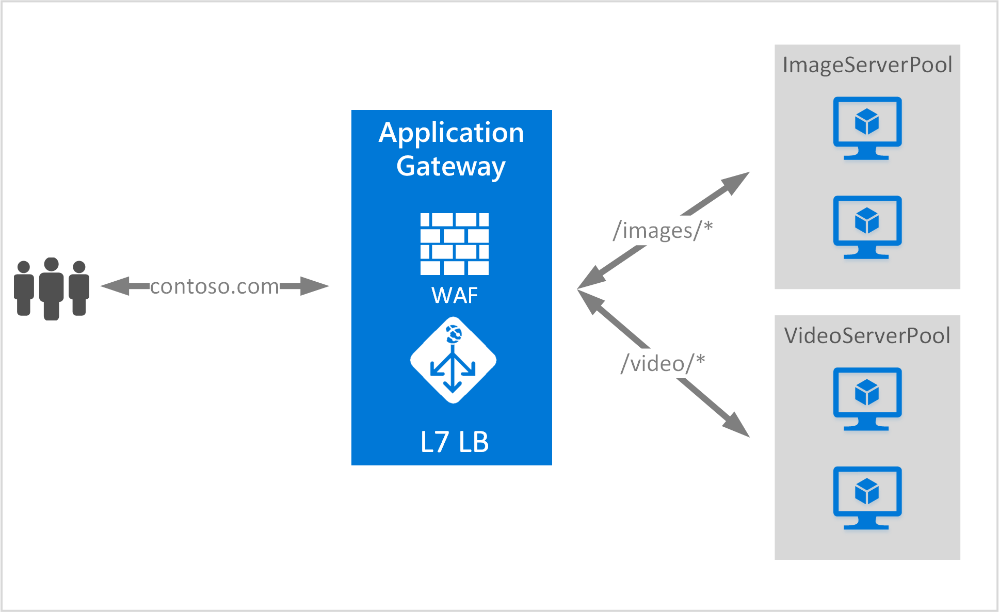

<properties
   pageTitle="Aperçu de routage contenu URL | Microsoft Azure"
   description="Cette page fournit une vue d’ensemble des basée sur Application passerelle URL l’acheminement du contenu, configuration UrlPathMap et PathBasedRouting règle."
   documentationCenter="na"
   services="application-gateway"
   authors="georgewallace"
   manager="carmonm"
   editor="tysonn"/>
<tags
   ms.service="application-gateway"
   ms.devlang="na"
   ms.topic="hero-article"
   ms.tgt_pltfrm="na"
   ms.workload="infrastructure-services"
   ms.date="10/25/2016"
   ms.author="gwallace"/>

# Vue d’ensemble du routage en fonction des URL chemin d’accès

URL chemin d’accès en fonction de routage permet à acheminer le trafic vers des pools serveur principal basé sur les chemins d’accès de l’URL de la demande. L’un des scénarios consiste à acheminer les requêtes de différents types de contenu pour des pools serveur principal différent.
Dans l’exemple suivant, Application Gateway sert le trafic de contoso.com à partir de trois pools serveur principal par exemple : VideoServerPool, ImageServerPool et DefaultServerPool.

Demandes de http://contoso.com/video* sont routés vers VideoServerPool et http://contoso.com/images* sont routés vers ImageServerPool. DefaultServerPool est sélectionnée si aucun des modèles de chemin d’accès correspond aux.

## Élément de configuration UrlPathMap

Élément UrlPathMap est utilisé pour spécifier les modèles de chemin d’accès à des mappages de pool de serveur principal. L’exemple suivant est l’extrait d’urlPathMap élément à partir du fichier de modèle.

    "urlPathMaps": [
    {
    "name": "<urlPathMapName>",
    "id": "/subscriptions/<subscriptionId>/../microsoft.network/applicationGateways/<gatewayName>/ urlPathMaps/<urlPathMapName>",
    "properties": {
        "defaultBackendAddressPool": {
            "id": "/subscriptions/<subscriptionId>/../microsoft.network/applicationGateways/<gatewayName>/backendAddressPools/<poolName>"
        },
        "defaultBackendHttpSettings": {
            "id": "/subscriptions/<subscriptionId>/../microsoft.network/applicationGateways/<gatewayName>/backendHttpSettingsList/<settingsName>"
        },
        "pathRules": [
            {
                "paths": [
                    <pathPattern>
                ],
                "backendAddressPool": {
                    "id": "/subscriptions/<subscriptionId>/../microsoft.network/applicationGateways/<gatewayName>/backendAddressPools/<poolName2>"
                },
                "backendHttpsettings": {
                    "id": "/subscriptions/<subscriptionId>/../microsoft.network/applicationGateways/<gatewayName>/backendHttpsettingsList/<settingsName2>"
                },

            },

        ],

    }
    }
    

>[AZURE.NOTE] PathPattern : Ce paramètre est une liste de modèles de chemin d’accès pour mettre en correspondance. Chacun doit commencer par / et le seul endroit un « * » est autorisé à ce qui suit fin un « / ». La chaîne MAS pour le traitement de chemin d’accès n’inclut pas de texte après le premier ? ou # et ces caractères ne sont pas autorisés ici. 

Vous pouvez extraire un [modèle de gestionnaire de ressources à l’aide de routage basé sur une URL](https://azure.microsoft.com/documentation/templates/201-application-gateway-url-path-based-routing) pour plus d’informations.

## Règle PathBasedRouting

RequestRoutingRule de type PathBasedRouting est utilisée pour lier un récepteur à un urlPathMap. Toutes les demandes sont reçus pour ce récepteur sont routés en fonction de stratégie spécifié dans urlPathMap.
Extrait de PathBasedRouting règle :

    "requestRoutingRules": [
    {

    "name": "<ruleName>",
    "id": "/subscriptions/<subscriptionId>/../microsoft.network/applicationGateways/<gatewayName>/requestRoutingRules/<ruleName>",
    "properties": {
        "ruleType": "PathBasedRouting",
        "httpListener": {
            "id": "/subscriptions/<subscriptionId>/../microsoft.network/applicationGateways/<gatewayName>/httpListeners/<listenerName>"
        },
        "urlPathMap": {
            "id": "/subscriptions/<subscriptionId>/../microsoft.network/applicationGateways/<gatewayName>/ urlPathMaps/<urlPathMapName>"
        },

    }
    
## Étapes suivantes

Après avoir appris basée sur URL l’acheminement du contenu, accédez à [créer une passerelle d’application à l’aide de routage basé sur une URL](application-gateway-create-url-route-portal.md) pour créer une passerelle d’application avec les règles de routage URL.
