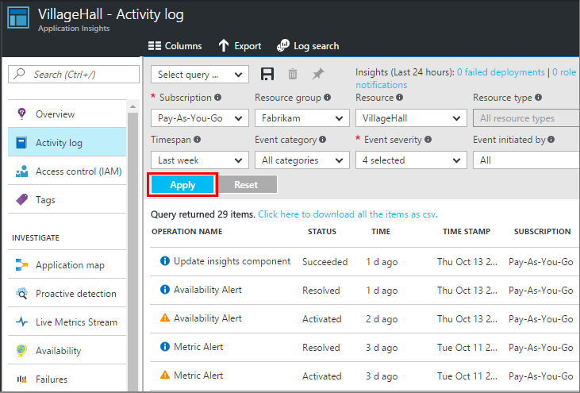

<properties 
    pageTitle="Définir des alertes dans l’Application Insights | Microsoft Azure" 
    description="Être informé à propos des délais de réponse, exceptions et autres performances ou des modifications de l’utilisation de votre application web." 
    services="application-insights" 
    documentationCenter=""
    authors="alancameronwills" 
    manager="douge"/>

<tags 
    ms.service="application-insights" 
    ms.workload="tbd" 
    ms.tgt_pltfrm="ibiza" 
    ms.devlang="na" 
    ms.topic="article" 
    ms.date="10/14/2016" 
    ms.author="awills"/>
 
# Définir des alertes dans perspectives d’Application

[Visual Studio Application Insights] [ start] vous signaler les modifications dans les mesures de performances ou d’utilisation dans votre application web. 

Application Insights surveille votre application live sur un [large éventail de plateformes] [ platforms] pour vous aider à diagnostiquer les problèmes de performances et les tendances d’utilisation.

Il existe trois types d’alertes :

* **Alertes métriques** vous signale quand une métrique coupe une valeur de seuil pendant une certaine période - comme un temps de réponse, exception nombre, de l’UC ou affichages de page. 
* [**Tests Web** ] [ availability] vous indiquer quand votre site est indisponible sur internet ou ne répond lentement. [En savoir plus][availability].
* [**Diagnostics proactifs**](app-insights-proactive-diagnostics.md) sont configurés automatiquement pour vous informer des schémas de performances inhabituelle.

Nous concentrer sur les alertes métriques dans cet article.

## Définir une alerte métrique

Ouvrir la carte de règles d’alerte, puis utilisez le bouton Ajouter. 

* Définissez la ressource avant les autres propriétés. **Choisir la ressource « (components) »** si vous voulez définir des alertes sur les indicateurs de performances ou d’utilisation.
* Le nom que vous attribuez à l’alerte doit être unique dans le groupe de ressources (et pas seulement votre application).
* Veillez à noter les unités dans lequel vous êtes invité à entrer la valeur de seuil.
* Si vous cochez la case « Propriétaires messagerie... », alertes seront envoyées par courrier électronique à toutes les personnes qui accèdent à ce groupe de ressources. Pour développer cet ensemble de personnes, ajoutez-les au [groupe de ressources ou d’abonnement](app-insights-resources-roles-access-control.md) (et non la ressource).
* Si vous spécifiez « Autres messages électroniques », alertes seront envoyées aux personnes ou groupes (ou non vous coché la case « Envoyer par courrier électronique propriétaires... »). 
* Définir une [adresse webhook](../monitoring-and-diagnostics/insights-webhooks-alerts.md) si vous avez configuré une application web qui répond aux alertes. Elle sera appelée lorsque l’alerte est activé (c'est-à-dire déclenchée) et lorsqu’il est résolu. (Mais notez qu’à l’heure actuelle, paramètres de la requête ne sont pas passés en tant que propriétés webhook.)
* Vous pouvez désactiver ou activer l’alerte : voir les boutons en haut de la carte.

*Je ne vois pas le bouton Ajouter une alerte.* 

- Vous utilisez un compte professionnel ? Vous pouvez définir des alertes si vous avez propriétaire ou collaborateur d’accéder à cette ressource d’application. Examinons la carte de contrôle d’accès. [En savoir plus sur le contrôle d’accès][roles].

> [AZURE.NOTE] Dans la carte alertes, vous verrez qu’il existe déjà un jeu d’alerte vers le haut : [Diagnostics proactifs](app-insights-proactive-failure-diagnostics.md). Il s’agit d’un message d’alerte automatique surveille une particulier métrique, échec du taux de requêtes. Sauf si vous décidez de désactiver l’alerte proactive, vous n’avez pas besoin de configurer votre propre alerte sur le taux d’échec de demande. 

## Voir vos alertes

Vous obtenez un message électronique lorsqu’un alerte remplace l’état entre actif et inactif. 

L’état actuel de chaque alerte répertorié dans la carte de règles d’alerte.

Il existe un résumé des activités récentes dans les alertes menu déroulant :

L’historique des modifications de l’état est dans le journal d’activité :

## Fonctionnement des alertes

* Une alerte possède trois états : « Jamais activée », « Activé » et « Résolu ». Activé signifie que la condition que vous avez spécifié était vrai, lorsqu’il a été évalué dernière.

* Une notification est générée lorsque l’état change une alerte. (Si la condition d’alerte était déjà true lorsque vous avez créé l’alerte, vous ne pouvez pas obtenir une notification jusqu'à ce que la condition est fausse.)

* Chaque notification génère un message électronique si vous activé la case à cocher messages électroniques ou fourni des adresses de messagerie. Vous pouvez également consulter la liste déroulante les Notifications.

* Une alerte est évaluée chaque fois qu’une métrique arrive, mais pas dans le cas contraire.

* L’évaluation regroupe le métrique pendant la période précédente et les compare à la valeur seuil pour déterminer l’état de nouveau.

* La période que vous choisissez Spécifie l’intervalle sur laquelle les mesures sont agrégées. Il n’affecte pas la fréquence à laquelle l’alerte est évaluée : qui dépend de la fréquence de l’arrivée des indicateurs.

* Si aucune donnée n’aboutit sur une mesure particulière depuis un certain temps, l’intervalle comporte des effets différents sur alerte évaluation et sur les graphiques dans l’Explorateur de métrique. Dans l’Explorateur métrique, si aucune donnée n’est visible pendant plus d’intervalle d’échantillonnage du graphique, le graphique affiche la valeur 0. Mais une alerte basée sur la même métrique n’est pas être ré-évaluées et l’état de l’alerte reste inchangée. 

    Lorsque les données arrivent par la suite, le graphique revient à une valeur non nulle. Évalue l’alerte basé sur les données disponibles pour la période que vous avez spécifié. Si le nouveau point de données est le seul disponible dans la période, l’agrégat est basé seulement sur que le point de données.

* Une alerte peut clignoter fréquemment entre États alertes et exact, même si vous définissez une longue période. Cela peut arriver si la valeur métrique est placé autour du seuil. Il n’existe aucune hystérésis dans le seuil : la transition à alerte se produit à la même valeur que la transition vers correct.

## Que sont les bonnes alertes pour définir ?

Tout dépend de votre application. Commence, il est préférable de ne pas trop audits. Prenez le temps consultant vos graphiques métriques alors que votre application est en cours d’exécution, pour mieux comprendre comment elle se comporte normalement. Cela vous aide à trouver des moyens d’améliorer ses performances. Définissez des alertes pour vous indiquer quand les mesures accédez à l’extérieur de la zone normale. 

Alertes courants sont les suivants :

* [Indicateurs de navigateur][client], en particulier navigateur **temps de chargement de page**, sont corrects pour les applications web. Si votre page comporte un grand nombre de scripts, vous souhaiterez à prendre en compte **les exceptions de navigateur**. Afin d’obtenir ces mesures et les alertes, vous devez configurer [l’analyse de la page web][client].
* **Temps réponse du serveur** pour le côté serveur d’applications web. Ainsi que la configuration d’alertes, gardez un œil sur cette métrique pour voir si elle disproportionnée varie en fonction taux élevé demande : susceptible d’indiquer que votre application est insuffisant de ressources. 
* **Exceptions de serveur** - celles, vous devez effectuer certains [paramètres supplémentaires](app-insights-asp-net-exceptions.md).

N’oubliez pas que [diagnostics de taux défaillance proactive](app-insights-proactive-failure-diagnostics.md) automatiquement contrôler la fréquence à laquelle votre application répond aux requêtes avec les codes d’erreur. 

## Automatisation

* [Utiliser PowerShell pour automatiser la configuration des alertes](app-insights-powershell-alerts.md)
* [Utiliser webhooks pour automatiser répondre aux alertes](../monitoring-and-diagnostics/insights-webhooks-alerts.md)

## Voir aussi

* [Disponibilité des tests de site web](app-insights-monitor-web-app-availability.md)
* [Automatiser la configuration des alertes](app-insights-powershell-alerts.md)
* [Diagnostics proactifs](app-insights-proactive-diagnostics.md) 

<!--Link references-->

[availability]: app-insights-monitor-web-app-availability.md
[client]: app-insights-javascript.md
[platforms]: app-insights-platforms.md
[roles]: app-insights-resources-roles-access-control.md
[start]: app-insights-overview.md

 