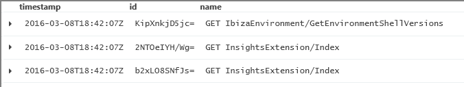
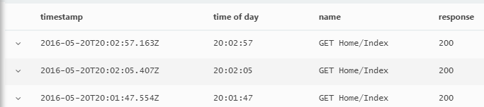
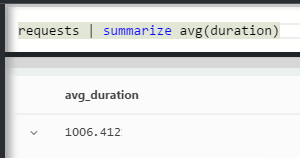
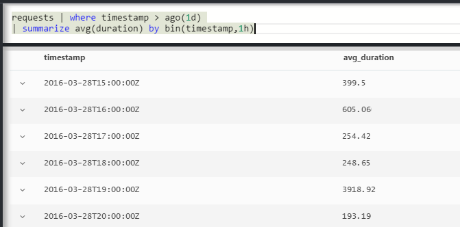
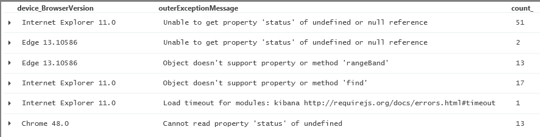
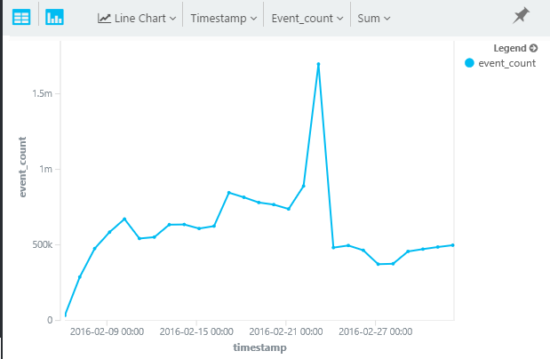
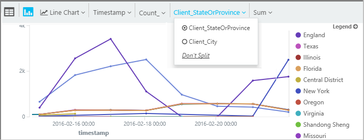
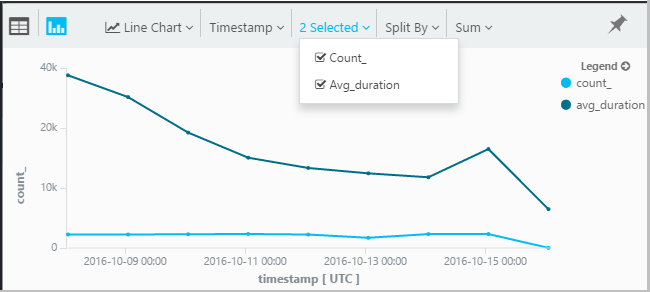

<properties 
    pageTitle="Visite guidée Analytique dans perspectives Application | Microsoft Azure" 
    description="Exemples de courte de toutes les requêtes principales dans Analytique, l’outil recherche puissant d’analyse de l’Application." 
    services="application-insights" 
    documentationCenter=""
    authors="alancameronwills" 
    manager="douge"/>

<tags 
    ms.service="application-insights" 
    ms.workload="tbd" 
    ms.tgt_pltfrm="ibiza" 
    ms.devlang="na" 
    ms.topic="article" 
    ms.date="10/15/2016" 
    ms.author="awills"/>


 
# <a name="a-tour-of-analytics-in-application-insights"></a>Une visite guidée du Analytique dans perspectives d’Application


[Analytique](app-insights-analytics.md) est la fonctionnalité de recherche puissant [d’Analyse de l’Application](app-insights-overview.md). Ces pages décrivent la lanquage requête Analytique.


* **[Regarder la vidéo d’introduction](https://applicationanalytics-media.azureedge.net/home_page_video.mp4)**.
* **[Testez Analytique dans nos données simulées](https://analytics.applicationinsights.io/demo)** si votre application n’est pas envoyer des données Application analyse encore.


Nous allons vous guide dans des requêtes de base pour vous aider à démarrer.

## <a name="connect-to-your-application-insights-data"></a>Se connecter à vos données d’analyse de l’Application

Ouvrez Analytique à partir de votre application [carte vue d’ensemble](app-insights-dashboards.md) dans l’analyse de l’Application :


    
## <a name="takeapp-insights-analytics-referencemdtake-operator-show-me-n-rows"></a>[Prendre](app-insights-analytics-reference.md#take-operator): afficher pour moi n lignes

Points de données qui se connectent opérations de l’utilisateur (en général des requêtes HTTP reçues par votre application web) sont stockés dans une table nommée `requests`. Chaque ligne est un point de données de télémétrie reçu à partir de l’Application Insights SDK dans votre application.

Commençons par examiner quelques exemples de lignes de la table :


> [AZURE.NOTE] Placez le curseur n’importe où dans l’instruction avant de cliquer sur OK. Vous pouvez fractionner une instruction sur plusieurs lignes, mais ne placez les lignes vides dans une instruction. Lignes vides constituent un moyen pratique pour conserver plusieurs requêtes distinctes dans la fenêtre.


Choisir les colonnes, faites-les glisser, regrouper par colonnes et leur filtrage : 


Développez n’importe quel élément pour afficher les détails :
 


> [AZURE.NOTE] Cliquez sur l’en-tête d’une colonne pour trier les résultats disponibles dans le navigateur web. Mais n’oubliez pas que pour un jeu de résultats de grande taille, le nombre de lignes téléchargée dans le navigateur est limité. Tri de cette manière ne toujours montre les éléments les plus élevées ou les plus faibles réels. Pour trier les éléments fiable, utilisez le `top` ou `sort` opérateur. 

## <a name="topapp-insights-analytics-referencemdtop-operator-and-sortapp-insights-analytics-referencemdsort-operator"></a>[Haut](app-insights-analytics-reference.md#top-operator) et [Trier](app-insights-analytics-reference.md#sort-operator)

`take`est utile pour obtenir un exemple rapide d’un résultat, mais il affiche les lignes de la table dans aucun ordre en particulier. Pour obtenir un affichage ordonné, utilisez `top` (pour un échantillon) ou `sort` (au-dessus de la table entière).

Afficher les n premières lignes, triés par une colonne spécifique :

```AIQL

    requests | top 10 by timestamp desc 
```

* *Syntaxe :* La plupart des opérateurs ont tels que les paramètres de mot clé `by`.
* `desc`= par ordre décroissant, `asc` = croissant.



`top...`une façon performant plus de dire `sort ... | take...`. Nous pouvons écrire :

```AIQL

    requests | sort by timestamp desc | take 10
```

Le résultat est le même, mais elle s’exécute un peu plus lente. (Vous pouvez également écrire `order`, qui est l’alias de `sort`.)

Les en-têtes de colonne dans l’affichage tableau peuvent également être utilisés pour trier les résultats dans l’écran. Mais bien entendu, si vous avez utilisé `take` ou `top` pour récupérer une partie seulement d’un tableau, vous devez uniquement réorganiser les enregistrements que vous avez extraits.


## <a name="projectapp-insights-analytics-referencemdproject-operator-select-rename-and-compute-columns"></a>[Projet](app-insights-analytics-reference.md#project-operator): sélectionnez, renommer et calculer des colonnes

Utiliser [`project`](app-insights-analytics-reference.md#project-operator) pour sélectionner uniquement les colonnes que vous souhaitez :

```AIQL

    requests | top 10 by timestamp desc
             | project timestamp, name, resultCode
```


Vous pouvez également renommer des colonnes et définir de nouveaux :

```AIQL

    requests 
  	| top 10 by timestamp desc 
  	| project  
            name, 
            response = resultCode,
            timestamp, 
            ['time of day'] = floor(timestamp % 1d, 1s)
```



* [Noms de colonnes](app-insights-analytics-reference.md#names) peuvent contenir des espaces ou des symboles si elles sont placées entre comme ceci : `['...']` ou`["..."]`
* `%`est l’opérateur modulo habituelle. 
* `1d`(qui est un chiffre, puis une avait ») est un timespan littéral c'est-à-dire un jour. Voici quelques autres littéraux timespan : `12h`, `30m`, `10s`, `0.01s`.
* `floor`(alias `bin`) Arrondit une valeur au multiple le plus proche de la valeur de base que vous avez défini. Donc `floor(aTime, 1s)` arrondit fois vers le bas jusqu'à la seconde le plus proche.

[Les expressions](app-insights-analytics-reference.md#scalars) peuvent inclure tous les opérateurs habituels (`+`, `-`,...), et il existe un éventail de fonctions utiles.

    

## <a name="extendapp-insights-analytics-referencemdextend-operator-compute-columns"></a>[Étendre](app-insights-analytics-reference.md#extend-operator): calculer des colonnes

Si vous voulez juste ajouter des colonnes à existants, utilisez [`extend`](app-insights-analytics-reference.md#extend-operator):

```AIQL

    requests 
  	| top 10 by timestamp desc
  	| extend timeOfDay = floor(timestamp % 1d, 1s)
```

À l’aide de [`extend`](app-insights-analytics-reference.md#extend-operator) est moins détaillée que [`project`](app-insights-analytics-reference.md#project-operator) si vous souhaitez conserver toutes les colonnes existantes.


## <a name="summarizeapp-insights-analytics-referencemdsummarize-operator-aggregate-groups-of-rows"></a>[Summarize](app-insights-analytics-reference.md#summarize-operator): agréger les groupes de lignes

`Summarize`applique une *fonction d’agrégation* spécifiée sur groupes de lignes. 

Par exemple, la durée de votre application web pour répondre à une demande est indiquée dans le champ `duration`. Voyons le temps de réponse moyenne à toutes les demandes :



Ou, nous pouvons séparer le résultat en demandes de noms différents :


`Summarize`collecte les points de données dans le flux de données dans des groupes dont le `by` clause prend la même quantité. Chaque valeur dans la `by` expression - chaque nom de l’opération dans l’exemple ci-dessus - génère une ligne dans la table obtenue. 

Ou, nous pouvons regrouper les résultats par heure du jour :



Notez la manière dont nous utilisons la `bin` fonction (aka `floor`). Si nous avons utilisé simplement `by timestamp`, chaque ligne d’entrée risque d’entraîner son propre groupe peu. Pour n’importe quel scalaire continue comme heures ou nombres, nous avons afin de scinder la plage continue en un nombre de valeurs distinctes, gérable et `bin` -simplement la familier arrondi vers le bas, laquelle est `floor` fonction - la plus simple consiste à le faire.

Nous pouvons utiliser la même technique pour réduire les plages de chaînes :


Notez que vous pouvez utiliser `name=` pour définir le nom d’une colonne de résultat, dans les expressions d’agrégation ou dans la clause.

## <a name="counting-sampled-data"></a>Comptage des exemples de données

`sum(itemCount)`est l’agrégation recommandée pour compter le nombre d’événements. Dans de nombreux cas, itemCount == 1, afin que la fonction compte simplement le nombre de lignes dans le groupe. Mais lorsque [échantillonnages](app-insights-sampling.md) fonctionne, qu’une fraction des événements d’origine est conservée en tant que points de données d’analyse de l’Application, afin que pour chaque point de données que vous voyez, il existe `itemCount` événements. 

Par exemple, si échantillonnages ignore 75 % des événements d’origine, puis itemCount == 4 dans les enregistrements conservés - autrement dit, pour chaque enregistrement conservé, se sont produites quatre enregistrements d’origine. 

D’échantillonnage adapté entraîne itemCount à être plus élevé au cours des périodes lorsque votre application est intensément utilisée.

Résumer itemCount donne donc une bonne estimation du nombre d’événements d’origine.


Il existe également un `count()` agrégation (et une opération count) dans les cas où vous souhaitez réellement compter le nombre de lignes dans un groupe.


Il existe une gamme de [fonctions d’agrégation](app-insights-analytics-reference.md#aggregations).


## <a name="charting-the-results"></a>Les résultats de création de graphiques


```AIQL

    exceptions 
       | summarize count()  
         by bin(timestamp, 1d)
```

Par défaut, les résultats s’affichent sous forme de tableau :


Nous pouvons faire mieux que l’affichage tableau. Nous allons examiner les résultats dans l’affichage du graphique avec la verticale barre option :


Notez que bien que nous n’a pas été trier les résultats par heure (comme vous pouvez le voir dans l’affichage du tableau), l’affichage du graphique affiche toujours dates/heures dans l’ordre correct.


## <a name="whereapp-insights-analytics-referencemdwhere-operator-filtering-on-a-condition"></a>[Où](app-insights-analytics-reference.md#where-operator): filtrage sur une condition

Si vous avez défini des perspectives Application d’analyse pour le [client](app-insights-javascript.md) et le serveur côtés de votre application, certaines de la télémétrie dans la base de données proviennent des navigateurs.

Voyons quelques exceptions signalées à partir de navigateurs :

```AIQL

    exceptions 
  	| where client_Type == "Browser" 
  	|  summarize count() 
       by client_Browser, outerMessage 
```



La `where` opérateur prend une expression booléenne. Voici quelques points importants à leur sujet :

 * `and`, `or`: Opérateurs booléens
 * `==`, `<>` : et pas égal
 * `=~`, `!=` : chaîne sans respecter la casse égal et n’est pas égale. Il existe de nombreuses plusieurs opérateurs de comparaison de chaînes.

Découvrez [les expressions scalaires](app-insights-analytics-reference.md#scalars).

### <a name="filtering-events"></a>Filtrage des événements

Rechercher des demandes en échec :

```AIQL

    requests 
  	| where isnotempty(resultCode) and toint(resultCode) >= 400
```

`responseCode`a type chaîne, c’est pourquoi nous devrez [convertissez-le](app-insights-analytics-reference.md#casts) pour une comparaison numérique.

Résumer les réponses différentes :

```AIQL

    requests
  	| where isnotempty(resultCode) and toint(resultCode) >= 400
  	| summarize count() 
      by resultCode
```

## <a name="timecharts"></a>Timecharts

Afficher le nombre d’événements il est chaque jour :

```AIQL

    requests
      | summarize event_count=count()
        by bin(timestamp, 1d)
```

Sélectionnez l’option d’affichage graphique :




## <a name="multiple-series"></a>Plusieurs séries 

Plusieurs expressions dans les `summarize` crée plusieurs colonnes.

Plusieurs expressions dans les `by` clause crée plusieurs lignes, une pour chaque combinaison de valeurs.


```AIQL

    requests
  	| summarize count(), avg(duration) 
      by bin(timestamp, 1d), client_StateOrProvince, client_City 
  	| order by timestamp asc, client_StateOrProvince, client_City
```


### <a name="segment-a-chart-by-dimensions"></a>Segment, un graphique en dimensions

Si vous représenter graphiquement une table qui comporte une colonne de type chaîne et une colonne numérique, la chaîne peut être utilisée pour fractionner les données numériques en série distincte de points. S’il existe plusieurs colonnes de chaîne, vous pouvez choisir la colonne à utiliser comme discriminant. 



### <a name="display-multiple-metrics"></a>Afficher plusieurs indicateurs

Si vous graphique une table qui plusieurs colonnes numériques, en plus de l’horodatage, vous pouvez afficher n’importe quelle combinaison d'entre eux.



Vous devez sélectionner fractionnées n’avant de pouvoir sélectionner plusieurs colonnes numériques que vous ne pouvez pas fractionner une colonne de chaîne en même temps que l’affichage de plusieurs colonnes numériques. 


## <a name="daily-average-cycle"></a>Cycle moyenne quotidien

Comment l’utilisation ne varie pas avec le jour moyen ?

Demandes de nombres par le temps modulo un jour, binned en heures :

```AIQL

    requests
  	| extend hour = floor(timestamp % 1d , 1h) 
          + datetime("2016-01-01")
  	| summarize event_count=count() by hour
```


>[AZURE.NOTE] Notez nous avons actuellement convertir des durées en dates/heures afin d’afficher sur l’un graphique.


## <a name="compare-multiple-daily-series"></a>Comparer plusieurs séries quotidien

Comment l’utilisation varie avec l’heure du jour dans des pays différents ?

```AIQL

 requests  | where tostring(operation_SyntheticSource)
     | extend hour= floor( timestamp % 1d , 1h)
           + datetime("2001-01-01")
     | summarize event_count=count() 
       by hour, client_CountryOrRegion 
     | render timechart
```


## <a name="plot-a-distribution"></a>Tracer une distribution.

Sessions combien sont a-t-il de longueurs différentes ?

```AIQL

    requests 
  	| where isnotnull(session_Id) and isnotempty(session_Id) 
  	| summarize min(timestamp), max(timestamp) 
      by session_Id 
  	| extend sessionDuration = max_timestamp - min_timestamp 
  	| where sessionDuration > 1s and sessionDuration < 3m 
  	| summarize count() by floor(sessionDuration, 3s) 
  	| project d = sessionDuration + datetime("2016-01-01"), count_
```

La dernière ligne est nécessaire pour convertir en datetime. L’axe x d’un graphique est actuellement affiché comme une valeur scalaire uniquement s’il s’agit d’une valeur datetime.

La `where` clause exclut les sessions usage unique (Durée_de_la_session == 0) et définit la longueur de l’axe des abscisses.


## <a name="percentilesapp-insights-analytics-referencemdpercentiles"></a>[Centiles](app-insights-analytics-reference.md#percentiles)

Les plages de durées couvrir différents pourcentages de sessions ?

Utiliser la requête ci-dessus, mais remplacez la dernière ligne :

```AIQL

    requests 
  	| where isnotnull(session_Id) and isnotempty(session_Id) 
  	| summarize min(timestamp), max(timestamp) 
      by session_Id 
  	| extend sesh = max_timestamp - min_timestamp 
  	| where sesh > 1s
  	| summarize count() by floor(sesh, 3s) 
  	| summarize percentiles(sesh, 5, 20, 50, 80, 95)
```

Nous avons également supprimé la limite supérieure dans la page où clause, afin d’obtenir des chiffres corrects, y compris toutes les sessions avec plusieurs requêtes :


À partir de laquelle vous pouvez constater que :

* égal à 5 % de sessions ont une durée de moins de 3 minutes 34s ; 
* 50 % de sessions dernier minnutes moins 36 ;
* égal à 5 % de sessions plus de 7 derniers jours

Pour obtenir une répartition distincte pour chaque pays, il suffit simplement dispose faire apparaître la colonne client_CountryOrRegion séparément à la fois résumer les opérateurs :

```AIQL

    requests 
  	| where isnotnull(session_Id) and isnotempty(session_Id) 
  	| summarize min(timestamp), max(timestamp) 
      by session_Id, client_CountryOrRegion
  	| extend sesh = max_timestamp - min_timestamp 
  	| where sesh > 1s
  	| summarize count() by floor(sesh, 3s), client_CountryOrRegion
  	| summarize percentiles(sesh, 5, 20, 50, 80, 95)
      by client_CountryOrRegion
```


## <a name="joinapp-insights-analytics-referencemdjoin"></a>[Jointure](app-insights-analytics-reference.md#join)

Nous ont accès à plusieurs tables, y compris les demandes et les exceptions.

Pour rechercher les exceptions relatives à une demande qui a renvoyé une réponse échec, nous pouvons joignez les tables sur `session_Id`:

```AIQL

    requests 
  	| where toint(responseCode) >= 500 
  	| join (exceptions) on operation_Id 
  	| take 30
```


Il est recommandé d’utiliser `project` pour sélectionner uniquement les colonnes nous avons besoin avant de procéder à la jointure.
Dans les mêmes clauses, nous renommer la colonne d’horodatage.


## <a name="letapp-insights-analytics-referencemdlet-clause-assign-a-result-to-a-variable"></a>[Laisser](app-insights-analytics-reference.md#let-clause): assigner un résultat à une variable

Permet de [permettent de](./app-insights-analytics-reference.md#let-statements) séparer les parties de l’expression précédente. Les résultats sont ne change pas :

```AIQL

    let bad_requests = 
      requests
        | where  toint(resultCode) >= 500  ;
    bad_requests
  	| join (exceptions) on session_Id 
  	| take 30
```

> Conseil : Dans le client Analytique, ne placez interlignes entre les parties du présent. Veillez à exécuter toutes ces sections.


## <a name="accessing-nested-objects"></a>Accès aux objets imbriquées

Objets imbriqués sont accessibles facilement. Par exemple, dans le flux des exceptions, vous verrez les objets structurées comme suit :


Vous pouvez le fusionner en choisissant les propriétés que qui vous intéresse :

```AIQL

    exceptions | take 10
  	| extend method1 = tostring(details[0].parsedStack[1].method)
```

Notez que vous devez utiliser un [cast](app-insights-analytics-reference.md#casts) vers le type approprié.

## <a name="custom-properties-and-measurements"></a>Mesures et les propriétés personnalisées

Si votre application attache des [dimensions personnalisées (propriétés) et des mesures personnalisées](app-insights-api-custom-events-metrics.md#properties) aux événements, puis vous verrez les dans la `customDimensions` et `customMeasurements` objets.


Par exemple, si votre application inclut :

```C#

    var dimensions = new Dictionary<string, string> 
                     {{"p1", "v1"},{"p2", "v2"}};
    var measurements = new Dictionary<string, double>
                     {{"m1", 42.0}, {"m2", 43.2}};
    telemetryClient.TrackEvent("myEvent", dimensions, measurements);
```

Pour extraire les valeurs suivantes dans Analytique :

```AIQL

    customEvents
  	| extend p1 = customDimensions.p1, 
      m1 = todouble(customMeasurements.m1) // cast to expected type

``` 

## <a name="tables"></a>Tables

Le flux de données de télémétrie reçu depuis votre application est accessible via plusieurs tables. Le schéma des propriétés disponibles pour chaque table est visible à gauche de la fenêtre.

### <a name="requests-table"></a>Table de demandes

Demandes HTTP compter à votre application web et le segment par nom de la page :


Trouver les requêtes qui échouent à la plupart :


### <a name="custom-events-table"></a>Table des événements personnalisés

Si vous utilisez [TrackEvent()](app-insights-api-custom-events-metrics.md#track-event) pour envoyer vos propres événements, vous pouvez les lire à partir de cette table. 

Prenons un exemple où votre code application contient ces lignes :

```C#

    telemetry.TrackEvent("Query", 
       new Dictionary<string,string> {{"query", sqlCmd}},
       new Dictionary<string,double> {
           {"retry", retryCount},
           {"querytime", totalTime}})
```

Affichez la fréquence de ces événements :
 


Extraire les mesures et les dimensions les événements :


### <a name="custom-metrics-table"></a>Tableau des indicateurs personnalisés

Si vous utilisez [TrackMetric()](app-insights-api-custom-events-metrics.md#track-metric) pour envoyer vos propres valeurs métriques, vous trouverez les résultats dans le flux **customMetrics** . Par exemple :  


> [AZURE.NOTE] Dans l' [Explorateur de mesures](app-insights-metrics-explorer.md), toutes les mesures personnalisés joints à n’importe quel type de télémétrie apparaissent ensemble dans la carte de mesures ainsi que des indicateurs envoyés à l’aide `TrackMetric()`. Mais dans Analytique, mesures personnalisés sont toujours joints à n’importe quel type de télémétrie qu’ils ont été exécutés sur - événements ou les demandes et ainsi de suite - alors que métriques envoyés par TrackMetric s’affichent dans leur propre flux de données.

### <a name="performance-counters-table"></a>Tableau des compteurs de performances

[Compteurs de performance](app-insights-performance-counters.md) indiquent les mesures de base du système de votre application, tel que processeur, la mémoire et l’utilisation du réseau. Vous pouvez configurer le Kit de développement pour envoyer des compteurs supplémentaires, y compris vos propres compteurs personnalisés.

Le schéma de **compteurs de performance** expose la `category`, `counter` nom, et `instance` nom de chaque compteur de performance. Les noms d’instance compteur sont appliquent uniquement aux certains compteurs de performance et généralement indiquent le nom du processus auquel se rapporte le nombre. Dans la télémétrie pour chaque application, vous verrez uniquement les compteurs pour cette application. Par exemple, pour voir quels compteurs sont disponibles : 


Pour obtenir un graphique de mémoire disponible sur la période récente : 


Comme autres télémétrie, **compteurs de performance** possède également une colonne `cloud_RoleInstance` qui indique l’identité de l’ordinateur hôte sur lequel s’exécute votre application. Par exemple, pour comparer les performances de votre application sur les ordinateurs différents : 


### <a name="exceptions-table"></a>Table des exceptions

[Les exceptions signalées par votre application](app-insights-asp-net-exceptions.md) sont disponibles dans ce tableau. 

Pour trouver la requête HTTP qui gère votre application lorsque l’exception a été levée, participez identifiant_opération :


### <a name="browser-timings-table"></a>Table de minutage de navigateur

`browserTimings`Affiche les données de chargement de page collectées dans les navigateurs de vos utilisateurs.

[Configurer votre application de télémétrie côté client](app-insights-javascript.md) pour afficher les mesures. 

Le schéma inclut [métriques indiquant les longueurs des différentes étapes de la page processus de chargement](app-insights-javascript.md#page-load-performance). (Ils n’indiquent la durée pendant laquelle que vos utilisateurs lecture d’une page).  

Afficher les popularities de pages différentes et charger les heures pour chaque page :


### <a name="availbility-results-table"></a>Tableau de résultats ainsi

`availabilityResults`Affiche les résultats de vos [tests de site web](app-insights-monitor-web-app-availability.md). Chaque exécution de vos tests à partir de chaque emplacement pour le test est signalée séparément. 


### <a name="dependencies-table"></a>Table de dépendances

Contient des résultats d’appels que votre application permet de bases de données et des API REST et autres appels à TrackDependency().

### <a name="traces-table"></a>Table traces

Contient l’envoyé par votre application à l’aide de TrackTrace(), ou [autres structures de journalisation](app-insights-asp-net-trace-logs.md)de télémétrie.

## <a name="dashboards"></a>Tableaux de bord

Vous pouvez épingler les résultats à un tableau de bord afin de rassembler tous vos tableaux et graphiques les plus importantes.

* [Tableau de bord partagé Azure](app-insights-dashboards.md#share-dashboards): cliquez sur l’icône d’épingle. Avant de le faire, vous devez disposer d’un tableau de bord partagé. Dans le portail Azure, ouvrez ou créez un tableau de bord et cliquez sur Partager.
* [Tableau de bord Power BI](app-insights-export-power-bi.md): cliquez sur Exporter, exécuter des requêtes Power BI. L’avantage de cette alternative est que vous pouvez afficher votre requête en parallèle avec un autres résultats à partir d’une large gamme de sources.


## <a name="next-steps"></a>Étapes suivantes

* [Référence du langage Analytique](app-insights-analytics-reference.md)

[AZURE.INCLUDE [app-insights-analytics-footer](../../includes/app-insights-analytics-footer.md)]


