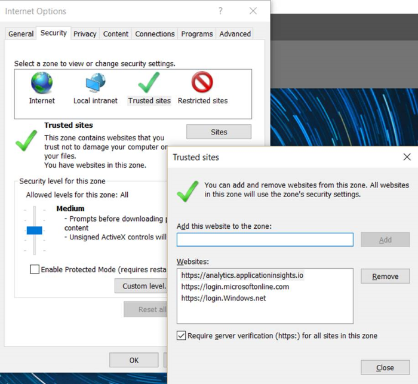
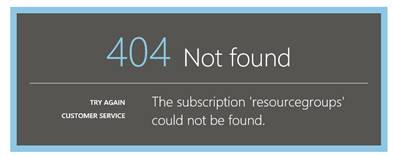

<properties 
    pageTitle="Résolution des problèmes Analytique - l’outil recherche puissante de perspectives Application | Microsoft Azure" 
    description="Problèmes avec analytique Insights Application ? Commencez ici. " 
    services="application-insights" 
    documentationCenter=""
    authors="alancameronwills" 
    manager="douge"/>

<tags 
    ms.service="application-insights" 
    ms.workload="tbd" 
    ms.tgt_pltfrm="ibiza" 
    ms.devlang="na" 
    ms.topic="article" 
    ms.date="07/11/2016" 
    ms.author="awills"/>

# Résoudre les problèmes d’Analytique dans perspectives d’Application

Problèmes de synchronisation [d’Application Insights Analytique](app-insights-analytics.md)? Commencez ici. Analytique est l’outil recherche puissante de Visual Studio Application perspectives.

## Limites

* À l’heure actuelle, les résultats de la requête sont limités à juste plus d’une semaine de données passées.
* Nous tester sur les navigateurs : dernières éditions de Chrome, Edge et Internet Explorer.

## Extensions de navigateur compatible connus

* Ghostery

Désactiver l’extension ou utilisez un autre navigateur.

##« Erreur inattendue »

Erreur interne s’est produite lors de l’exécution du portail – exception non gérée.

* Nettoyer le cache du navigateur. 

## 403... Veuillez réessayer recharger

Une authentification liés erreur s’est produite (lors de l’authentification ou pendant la génération de jeton d’accès). Le portail ne peut-être aucun moyen de récupérer sans modifier les paramètres du navigateur.

* Vérifiez [les cookies tiers sont activées](#cookies) dans le navigateur. 

## 403... vérifier la zone de sécurité

Une authentification liés erreur s’est produite (lors de l’authentification ou pendant la génération de jeton d’accès). Le portail ne peut-être aucun moyen de récupérer sans modifier les paramètres du navigateur.

1. Vérifiez [les cookies tiers sont activées](#cookies) dans le navigateur. 

2. Avez-vous utilisé un favori, le signet ou le lien enregistré pour ouvrir le portail Analytique ? Si vous êtes connectés avec différentes informations d’identification que vous avez utilisé lorsque vous avez enregistré le lien ?

2. Essayez d’utiliser une fenêtre de navigateur privé/fenêtre (après avoir fermé toutes les fenêtres de ces). Vous devrez fournir vos informations d’identification. 

2. Ouvrir une autre fenêtre de navigateur (ordinaire) et accédez à [Azure](https://portal.azure.com). Se déconnecter. Ouvrez ensuite votre lien et vous connecter avec les informations d’identification correctes.

2. Utilisateurs de bord et Internet Explorer peuvent également recevoir cette erreur lorsque les paramètres de zone de confiance ne sont pas pris en charge.

    Vérifiez [portail Analytique](https://analytics.applicationinsights.io) et [Azure Active Directory portail](https://portal.azure.com) se trouvent dans la zone de sécurité même :

 * Dans Internet Explorer, ouvrez **Options Internet**, **sécurité**, **les sites de confiance**, **Sites**:

    

    Dans la liste des sites Web, si une des URL suivantes sont incluse, vérifiez que les autres colonnes sont également inclus :

    https://Analytics.applicationinsights.IO 
   https://login.microsoftonline.com 
   https://login.Windows.NET

## 404... Ressource introuvable

Ressource de l’application a été supprimée à partir de l’analyse des applications et n’est plus disponible. Cela peut arriver si vous avez enregistré l’URL dans la page Analytique.

## 403... Aucune autorisation

Vous n’êtes pas autorisé à ouvrir cette application dans Analytique.

* Avez-vous obtenu le lien à partir d’une autre personne ? Demandez-leur pour vous assurer que vous êtes dans les [lecteurs ou les collaborateurs pour ce groupe de ressources](app-insights-resources-roles-access-control.md).
* Vous n’avez enregistré le lien à l’aide des informations d’identification différentes ? Ouvrez le [portail Azure](https://portal.azure.com), déconnectez-vous, puis essayez ce lien là encore, fournir les informations d’identification correctes.

## 403... Stockage HTML5

Notre portail utilise sessionStorage et localStorage HTML5.

* Chrome : Paramètres de confidentialité, les paramètres de content.
* Internet Explorer : Options Internet, onglet Options avancées, sécurité, activer le stockage DOM

## 404... Abonnement introuvable

L’URL n’est pas valide. 

* Ouvrez la ressource application portail [d’Analyse de l’Application](https://portal.azure.com). Utilisez le bouton Analytique.

## 404... page n’existe pas

L’URL n’est pas valide.

* Ouvrez la ressource application portail [d’Analyse de l’Application](https://portal.azure.com). Utilisez le bouton Analytique.

## Activer les cookies tiers

  Découvrez [comment désactiver les cookies tiers](http://www.digitalcitizen.life/how-disable-third-party-cookies-all-major-browsers), mais notez que nous devons **Activer** les.

## Si le problème persiste    

[Nous contacter](app-insights-get-dev-support.md).
 
[AZURE.INCLUDE [app-insights-analytics-footer](../../includes/app-insights-analytics-footer.md)]

