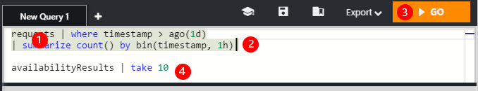

<properties 
    pageTitle="À l’aide d’Analytique - l’outil recherche puissante de perspectives Application | Microsoft Azure" 
    description="À l’aide de l’Analytique, l’outil recherche diagnostic puissant d’analyse de l’Application. " 
    services="application-insights" 
    documentationCenter=""
    authors="danhadari" 
    manager="douge"/>

<tags 
    ms.service="application-insights" 
    ms.workload="tbd" 
    ms.tgt_pltfrm="ibiza" 
    ms.devlang="na" 
    ms.topic="article" 
    ms.date="10/21/2016" 
    ms.author="awills"/>

# À l’aide d’Analytique dans perspectives d’Application

[Analytique](app-insights-analytics.md) est la fonctionnalité de recherche puissant [d’Analyse de l’Application](app-insights-overview.md). Ces pages décrivent le langage de requête Analytique.

* **[Regarder la vidéo d’introduction](https://applicationanalytics-media.azureedge.net/home_page_video.mp4)**.
* **[Testez Analytique dans nos données simulées](https://analytics.applicationinsights.io/demo)** si votre application n’est pas envoyer des données Application analyse encore.

## Analytique ouvert

À partir de la ressource, accueil de votre application dans perspectives d’Application, cliquez sur Analytique.

Le didacticiel en ligne vous donne des idées sur ce que vous pouvez faire.

Il existe une [visite guidée approfondie ici](app-insights-analytics-tour.md).

## Interroger votre télémétrie

### Écrire une requête

Commencer avec les noms d’une des tables répertoriées sur la gauche (ou les [plage](app-insights-analytics-reference.md#range-operator) ou [union](app-insights-analytics-reference.md#union-operator) opérateurs). Utiliser `|` pour créer une opportunité [d’opérateurs](app-insights-analytics-reference.md#queries-and-operators). IntelliSense vous avec les opérateurs et parmi les éléments d’expression que vous pouvez utiliser.

Consultez la [vue d’ensemble du langage Analytique](app-insights-analytics-tour.md) et [de référence du langage](app-insights-analytics-reference.md).

### Exécuter une requête

1. Vous pouvez utiliser les sauts de ligne unique dans une requête.
2. Placez le curseur à l’intérieur ou à la fin de la requête que vous souhaitez exécuter.
3. Cliquez sur OK pour exécuter la requête.
4. Ne placez interlignes dans votre requête. Vous pouvez conserver plusieurs requêtes séparées dans un onglet de la requête en les séparant par des lignes vides. Seul l’avec le curseur s’exécute.

### Enregistrer une requête

1. Enregistrez le fichier de requête en cours.
2. Ouvrir un fichier de requête enregistrée.
3. Créer un nouveau fichier de requête.

## Voir les détails

Développer une ligne dans les résultats pour afficher la liste complète des propriétés. Vous pouvez développer davantage n’importe quelle propriété est une valeur structurée - par exemple, des dimensions personnalisées ou la pile répertoriant une exception.

 

## Réorganiser les résultats

Vous pouvez trier, filtrer, pagination et grouper les résultats renvoyés par votre requête.

> [AZURE.NOTE] Le tri, de regroupement et de filtrage dans le navigateur ne relancez votre requête. Ils réorganiser uniquement les résultats retournés par votre requête dernière. 
> 
> Pour effectuer les tâches suivantes sur le serveur avant les résultats sont retournés, écrivez votre requête avec les opérateurs de [tri](app-insights-analytics-reference.md#sort-operator), de [résumer](app-insights-analytics-reference.md#summarize-operator) et [où](app-insights-analytics-reference.md#where-operator) .

Sélectionnez les colonnes que vous voulez voir, faites glisser les en-têtes de colonne pour les réorganiser et redimensionner les colonnes en faisant glisser ses bords.

### Trier et filtrer des éléments

Trier les résultats en cliquant sur l’en-tête d’une colonne. Cliquez à nouveau pour trier le sens inverse, puis cliquez sur une troisième fois pour revenir à l’ordre d’origine renvoyées par votre requête.

Utilisez l’icône de filtre pour affiner votre recherche.

### Regrouper les éléments

Pour trier selon plusieurs colonnes, utiliser le regroupement. Activez-le, puis faites glisser les en-têtes de colonne dans l’espace situé au-dessus de la table.

### Manquante certains résultats ?

Il existe une limite de 10 lignes k sur les résultats renvoyés à partir du portail. Un avertissement indique si vous passez en revue la limite. Dans ce cas, le tri de vos résultats de la table ne sont pas toujours afficher vous tous les résultats prénom ou réels. 

Il est conseillé d’éviter de passer de la limite. Utiliser des opérateurs tels que :

* [où horodatage > ago(3d)](app-insights-analytics-reference.md#where-operator)
* [100 premières par date](app-insights-analytics-reference.md#top-operator) 
* [prendre 100](app-insights-analytics-reference.md#take-operator)
* [résumer](app-insights-analytics-reference.md#summarize-operator) 

## Diagrammes

Sélectionnez le type de diagramme que vous souhaitez :

Si vous avez plusieurs colonnes des types de droite, vous pouvez choisir le x et y axes et une colonne de dimensions pour fractionner les résultats par.

Par défaut, les résultats sont initialement affichés sous forme de tableau, puis vous sélectionnez le diagramme manuellement. Mais vous pouvez utiliser le [rendu directive](app-insights-analytics-reference.md#render-directive) à la fin d’une requête pour sélectionner un diagramme.

## Épingler au tableau de bord

Vous pouvez épingler un diagramme ou table à un de vos [tableaux de bord partagé](app-insights-dashboards.md) - seulement, cliquez sur le code confidentiel. (Vous devrez peut-être [mise à niveau que votre application de tarification du package](app-insights-pricing.md) activer cette fonctionnalité.) 

Cela signifie que, lorsque vous insérez ensemble d’un tableau de bord pour vous aider à analyser les performances ou l’utilisation de vos services web, vous pouvez inclure relativement complexe analyse en parallèle avec les autres mesures. 

Vous pouvez épingler un tableau au tableau de bord, si elle implique quatre ou moins de colonnes. Uniquement les sept premières lignes sont affichés.

#### Actualisation du tableau de bord

Le graphique épinglé au tableau de bord est actualisé automatiquement en relançant à environ chaque demi-heure.

#### Simplifications automatiques

Dans certains cas, certaines simplifications sont appliquées à un graphique lorsque vous épinglez un tableau de bord.

Lorsque vous épingler un graphique affichant un grand nombre d’emplacements discrètes (généralement un graphique à barres), les emplacements renseignées au moins sont automatiquement regroupées en un seul « autres » de l’emplacement. Par exemple, cette requête :

    requests | summarize count_search = count() by client_CountryOrRegion

dans Analytique, ressemble à ceci :

mais lorsque vous l’épinglez un tableau de bord, il ressemble à ceci :

## Exporter vers Excel

Une fois que vous avez exécuté une requête, vous pouvez télécharger un fichier .csv. Cliquez sur **Exporter vers Excel**.

## Exporter dans Power BI

Placez le curseur dans une requête, sélectionnez **Exporter vers Power BI**.

Vous exécutez la requête dans Power BI. Vous pouvez le configurer pour actualiser sur une planification.

Avec Power BI, vous pouvez créer des tableaux de bord qui regroupent les données à partir d’un large éventail de sources.

[Pour plus d’informations sur l’exportation à Power BI](app-insights-export-power-bi.md)

[AZURE.INCLUDE [app-insights-analytics-footer](../../includes/app-insights-analytics-footer.md)]

