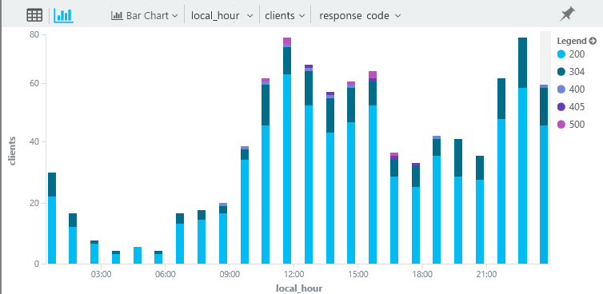
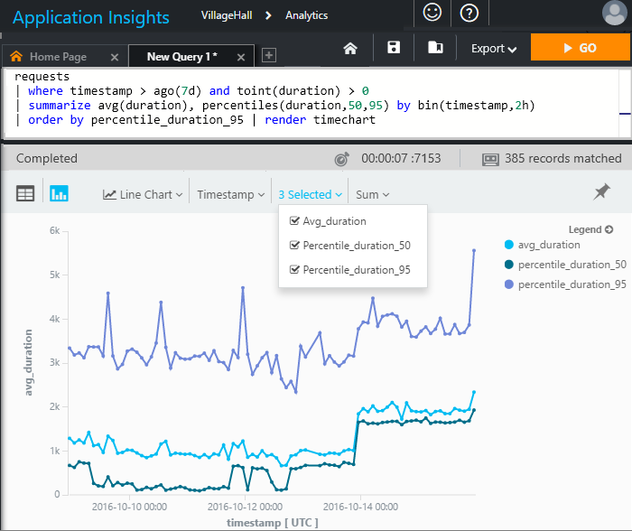
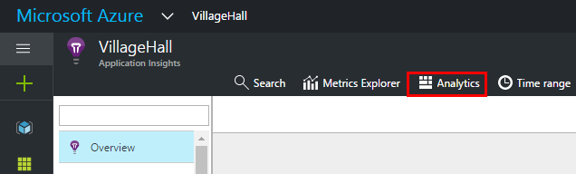

<properties 
    pageTitle="Analytique - l’outil recherche puissante de perspectives Application | Microsoft Azure" 
    description="Vue d’ensemble des Analytique, l’outil recherche diagnostic puissant d’analyse de l’Application. " 
    services="application-insights" 
    documentationCenter=""
    authors="alancameronwills" 
    manager="douge"/>

<tags 
    ms.service="application-insights" 
    ms.workload="tbd" 
    ms.tgt_pltfrm="ibiza" 
    ms.devlang="na" 
    ms.topic="article" 
    ms.date="07/26/2016" 
    ms.author="awills"/>


# <a name="analytics-in-application-insights"></a>Analytique dans perspectives d’Application


[Analytique](app-insights-analytics.md) est la fonctionnalité de recherche puissant [d’Analyse de l’Application](app-insights-overview.md). Ces pages décrivent la lanquage requête Analytique. 

* **[Regarder la vidéo d’introduction](https://applicationanalytics-media.azureedge.net/home_page_video.mp4)**.
* **[Testez Analytique dans nos données simulées](https://analytics.applicationinsights.io/demo)** si votre application n’est pas envoyer des données Application analyse encore.

## <a name="queries-in-analytics"></a>Requêtes dans Analytique
 
Une requête classique est un tableau *source* suivi d’une série d' *opérateurs* séparés par `|`. 

Par exemple, nous allons déterminer quelle heure du jour citoyens de Hyderabad essayer notre application web. Et nous avez voyons quels codes de résultats sont retournés à leurs demandes HTTP. 

```AIQL

    requests      // Table of events that log HTTP requests.
  	| where timestamp > ago(7d) and client_City == "Hyderabad"
  	| summarize clients = dcount(client_IP) 
      by tod_UTC=bin(timestamp % 1d, 1h), resultCode
  	| extend local_hour = (tod_UTC + 5h + 30min) % 24h + datetime("2001-01-01") 
```

Nous compter le nombre d’adresses IP client distinctes, en les groupant à l’heure du jour au cours des 7 derniers jours. 

Nous allons afficher les résultats avec la présentation graphique à barres, en choisissant empiler les résultats à partir des codes de réponse différente :



Il semblerait que notre application est les plus populaires en pause déjeuner et lit au moment dans Hyderabad. (Et nous devons étudier ces 500 codes).


Il existe également opérations statistiques puissantes :




La langue comporte de nombreuses fonctionnalités attrayantes :

* [Filtre](app-insights-analytics-reference.md#where-operator) votre télémétrie application brutes par tous les champs, y compris votre propriétés personnalisées et indicateurs.
* [Participer à](app-insights-analytics-reference.md#join-operator) plusieurs tables – demandes mettre en corrélation avec les affichages de page, des appels de dépendance, exceptions et journal trace.
* Statistiques puissantes [agrégations](app-insights-analytics-reference.md#aggregations).
* Aussi puissant que SQL, mais il est beaucoup plus facile pour les requêtes complexes : au lieu d’imbrication d’instructions, vous canal les données à partir d’une seule opération élémentaire à l’autre.
* Visualisations immédiates et puissantes.


## <a name="connect-to-your-application-insights-data"></a>Se connecter à vos données d’analyse de l’Application


Ouvrez Analytique à partir de votre application [carte vue d’ensemble](app-insights-dashboards.md) dans l’analyse de l’Application : 




## <a name="limits"></a>Limites

À l’heure actuelle, les résultats de la requête sont limités à juste plus d’une semaine de données passées.


[AZURE.INCLUDE [app-insights-analytics-footer](../../includes/app-insights-analytics-footer.md)]


## <a name="next-steps"></a>Étapes suivantes


* Nous vous recommandons de commencer avec la [visite guidée du langage](app-insights-analytics-tour.md).