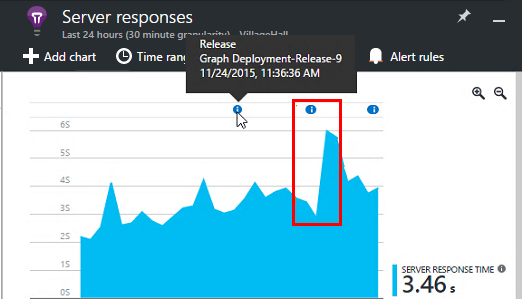
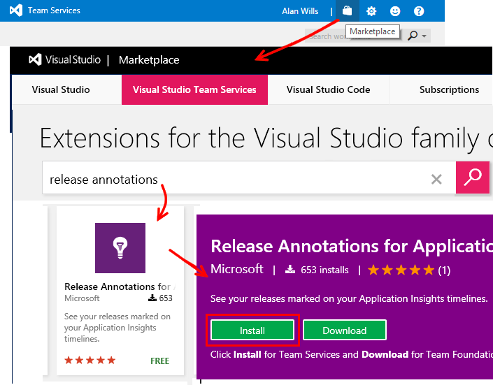

<properties
    pageTitle="Libérer des annotations pour avoir un aperçu Application | Microsoft Azure"
    description="Ajoutez déploiement ou créer des marqueurs à vos graphiques explorer métriques dans Application perspectives."
    services="application-insights"
    documentationCenter=".net"
    authors="alancameronwills"
    manager="douge"/>

<tags
    ms.service="application-insights"
    ms.workload="tbd"
    ms.tgt_pltfrm="ibiza"
    ms.devlang="na"
    ms.topic="article"
    ms.date="06/28/2016"
    ms.author="awills"/>

# Libérer des annotations dans perspectives d’Application

Relâchez annotations sur [Explorer indicateurs](app-insights-metrics-explorer.md) graphiques s’affichent dans lequel vous avez déployé une nouvelle version. Ils facilitent la voir si vos modifications avaient aucun effet sur les performances de votre application. Elles peuvent être créées automatiquement par le [système de génération de Visual Studio Team Services](https://www.visualstudio.com/en-us/get-started/build/build-your-app-vs), et vous pouvez également [les créer à partir de PowerShell](#create-annotations-from-powershell).

Version annotations sont une fonctionnalité de la version sur le nuage et relâchez service de Visual Studio Team Services. 

## Installez l’extension Annotations (une fois)

Pour être en mesure de créer des annotations de version, vous devez installer un grand nombre d’équipe extensions du Service disponible sur le marché Visual Studio.

1. Connectez-vous à votre projet [Visual Studio Team Services](https://www.visualstudio.com/en-us/get-started/setup/sign-up-for-visual-studio-online) .
2. Dans Visual Studio Marketplace, [obtenir l’extension Annotations Release](https://marketplace.visualstudio.com/items/ms-appinsights.appinsightsreleaseannotations)et l’ajouter à votre compte Team Services.

Vous devrez faire une fois pour votre compte de Visual Studio Team Services. Version annotations maintenant peuvent être configurées pour n’importe quel projet dans votre compte. 

## Obtenir une clé API d’analyse des applications

Vous devez faire ceci pour chaque modèle de publication que vous souhaitez créer des annotations de version.

1. Se connecter au [Portail de Microsoft Azure](https://portal.azure.com) et ouvrir la ressource Application perspectives qui surveille votre application. (Ou [créer un maintenant](app-insights-overview.md), si vous n’avez pas encore fait).
2. Ouvrir **l’Accès à l’API**et une copie de **l’Analyse des Id de l’Application**.

    

2. Dans une fenêtre distincte du navigateur, ouvrez (ou créez) le modèle de version qui gère votre déploiement de Visual Studio Team Services. 

    Ajouter une tâche, puis sélectionnez la tâche Application Insights Release Annotation dans le menu.

    Collez l' **Id de l’Application** que vous avez copiée à partir de la carte d’accès à l’API.

    

3. Définir le champ **APIKey** à une variable `$(ApiKey)`.

4. Dans la carte d’accès à l’API, créez une nouvelle clé API et prendre une copie de celui-ci.

    

4. Ouvrez l’onglet Configuration du modèle de publication.

    Créer une définition variable pour `ApiKey`.

    Collez votre clé d’API pour la définition de la variable ApiKey.

    

5. Enfin, les **Enregistrer** la définition de version.

## Créer des annotations à partir de PowerShell

Vous pouvez également créer des annotations à partir de n’importe quel processus que vous aimez (sans utiliser VS Team System). 

Obtenir le [script Powershell à partir de GitHub](https://github.com/Microsoft/ApplicationInsights-Home/blob/master/API/CreateReleaseAnnotation.ps1).

Utilisez-la comme suit :

    .\CreateReleaseAnnotation.ps1 `
      -applicationId "<applicationId>" `
      -apiKey "<apiKey>" `
      -releaseName "<myReleaseName>" `
      -releaseProperties @{
          "ReleaseDescription"="a description";
          "TriggerBy"="My Name" }

Obtenir le `applicationId` et un `apiKey` à partir de la ressource de perspectives d’Application : ouvrir les paramètres, accès à l’API, puis copier l’ID de l’Application. Cliquez sur Créer une clé de l’API, puis copiez la clé. 

## Libérer des annotations

À présent, lorsque vous utilisez le modèle de publication pour déployer une nouvelle version, une annotation sera envoyée aux analyses de l’Application. Les annotations seront affichent dans les graphiques dans l’Explorateur de mesures.

Cliquez sur un marqueur d’annotation pour ouvrir plus d’informations sur la version, notamment demandeur, branche de contrôle de source, relâchez définition et environnement.

