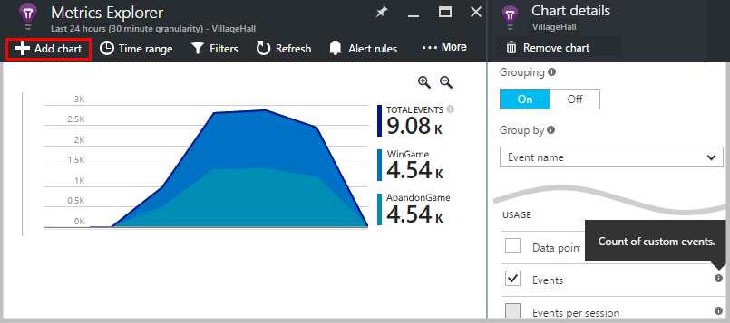
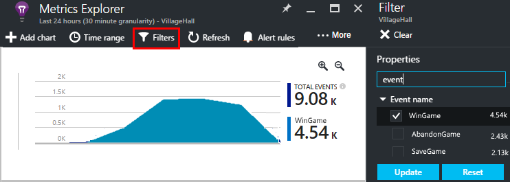
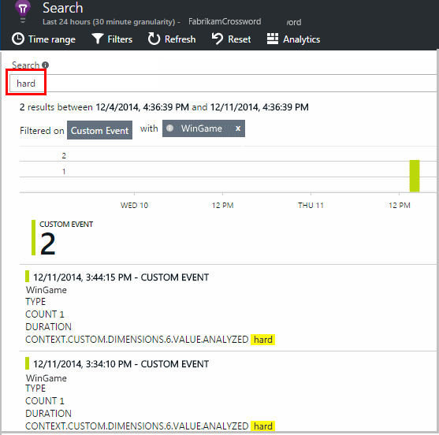

<properties 
    pageTitle="Application Insights API pour les événements personnalisés et d’indicateurs | Microsoft Azure" 
    description="Insérer plusieurs lignes de code dans votre application appareil ou de bureau, la page web ou le service pour suivre l’utilisation et diagnostiquer les problèmes." 
    services="application-insights"
    documentationCenter="" 
    authors="alancameronwills" 
    manager="douge"/>
 
<tags 
    ms.service="application-insights" 
    ms.workload="tbd" 
    ms.tgt_pltfrm="ibiza" 
    ms.devlang="multiple" 
    ms.topic="article" 
    ms.date="10/19/2016" 
    ms.author="awills"/>

# <a name="application-insights-api-for-custom-events-and-metrics"></a>Application Insights API pour les mesures et les événements personnalisés 

*Analyse de l’application est en mode Aperçu.*

Insérer plusieurs lignes de code dans votre application pour déterminer ce que font les utilisateurs avec lui, ou pour diagnostiquer les problèmes. Vous pouvez envoyer télémétrie à partir des applications de bureau et de périphérique, les clients web et les serveurs web. La télémétrie de core [Visual Studio Application Insights](app-insights-overview.md) API vous permet d’envoyer vos propres versions de télémétrie standard et des indicateurs et des événements personnalisés. Cette API est la même API qui est utilisée par le collecteur de données Application perspectives standard.

## <a name="api-summary"></a>Résumé de l’API

L’API est uniforme sur toutes les plateformes, en dehors de quelques légères variantes.

Méthode | Utilisé pour
---|---
[`TrackPageView`](#page-views) | Pages, des écrans, des cartes ou des formulaires
[`TrackEvent`](#track-event) | Actions de l’utilisateur et d’autres événements. Utilisé pour effectuer le suivi de comportement de l’utilisateur ou pour surveiller les performances.
[`TrackMetric`](#track-metric) | Mesures de performances tels que des files d’attente ne pas liées à des événements spécifiques
[`TrackException`](#track-exception)|Exceptions de journal de diagnostic. Repérer l’endroit où ils se produisent en relation avec d’autres événements et examiner les traces de la pile.
[`TrackRequest`](#track-request)| Ouvrez une session la fréquence et la durée des demandes de serveur pour l’analyse des performances.
[`TrackTrace`](#track-trace)|Messages journal de diagnostic. Vous pouvez également capturer les journaux 3e partie.
[`TrackDependency`](#track-dependency)|Ouvrez une session la durée et la fréquence des appels vers des composants externes dont dépend votre application.

Vous pouvez [joindre des propriétés et des indicateurs](#properties) à la plupart de ces appels de télémétrie. 


## <a name="prep"></a>Avant de commencer

Si vous n’avez pas terminé ces encore :

* Ajouter le Kit de développement de perspectives Application à votre projet :
 * [Projet ASP.NET][greenbrown]
 * [Projet Java][java] 
 * [JavaScript dans chaque page web][client]   

* Dans votre code de serveur web ou appareil, sont les suivantes :

    *C#:*`using Microsoft.ApplicationInsights;`

    *VB:*`Imports Microsoft.ApplicationInsights`

    *Java :*`import com.microsoft.applicationinsights.TelemetryClient;`

## <a name="construct-a-telemetryclient"></a>Construire une TelemetryClient

Construire une instance de TelemetryClient (sauf dans les pages web dans JavaScript) :

*C# :* 

    private TelemetryClient telemetry = new TelemetryClient();

*VISUAL BASIC :* 

    Private Dim telemetry As New TelemetryClient

*Java*

    private TelemetryClient telemetry = new TelemetryClient();

TelemetryClient est thread-safe.

Nous vous recommandons d’utiliser une instance de `TelemetryClient` pour chaque module de votre application. Par exemple, vous pouvez avoir une `TelemetryClient` dans votre service web pour signaler entrants requêtes http et une autre dans un cours de logiciels intermédiaires à événements de logique d’entreprise rapport. Vous pouvez définir des propriétés telles que `TelemetryClient.Context.User.Id` pour effectuer le suivi des utilisateurs et des sessions, ou `TelemetryClient.Context.Device.Id` afin d’identifier l’ordinateur. Ces informations sont associées à tous les événements envoyés par l’instance.


## <a name="track-event"></a>Le suivi des événements

Dans l’Application Insights, un *événement personnalisé* est des observations que vous pouvez afficher les deux dans [l’Explorateur de mesures] [ metrics] sous la forme d’un nombre agrégé et également occurrences individuelles dans [Rechercher des diagnostics][diagnostic]. (Il n’est pas lié à MVC ou autres framework « événements ».) 

Insérer des appels TrackEvent dans votre code pour compter le nombre d’occurrences utilisateurs soit choisir une fonction particulière, la fréquence à laquelle ils atteignent les objectifs particuliers, soit peut-être créer des types d’erreur. 

Par exemple, dans une application « match », envoyer un événement chaque fois qu’un utilisateur remporte la partie : 

*JavaScript*

    appInsights.trackEvent("WinGame");

*C#*
    
    telemetry.TrackEvent("WinGame");

*VISUAL BASIC*


    telemetry.TrackEvent("WinGame")

*Java*

    telemetry.trackEvent("WinGame");


### <a name="view-your-events-in-the-azure-portal"></a>Afficher vos événements dans le portail Azure

Pour afficher un compteur de vos événements, ouvrir une carte [Métrique Explorer](app-insights-metrics-explorer.md) , ajouter un nouveau graphique, puis sélectionnez les événements.  



Pour comparer le nombre d’événements différents, définissez le type de graphique sur la grille et groupe par nom de l’événement :


Dans la grille, cliquez sur par nom de l’événement pour afficher les occurrences individuelles de cet événement.


Cliquez sur une occurrence pour afficher plus de détails.

Pour vous concentrer sur des événements spécifiques dans l’Explorateur de métrique ou recherche, définir le filtre de la carte pour les noms des événements qui vous intéresse :



## <a name="track-metric"></a>Effectuer le suivi de métrique

Utilisez TrackMetric pour envoyer des indicateurs qui ne sont associés à des événements particuliers. Par exemple, vous pouvez contrôler une longueur file d’attente à intervalles réguliers. 

Mesures sont affichent sous forme graphique statistique dans l’Explorateur de métriques, mais contrairement aux événements, vous ne pouvez pas rechercher des occurrences individuelles dans Rechercher des Diagnostics.

Valeurs métriques doivent être > = 0 doit être affichée correctement.


*JavaScript*

    appInsights.trackMetric("Queue", queue.Length);

*C#*

    telemetry.TrackMetric("Queue", queue.Length);

*VISUAL BASIC*

    telemetry.TrackMetric("Queue", queue.Length)

*Java*

    telemetry.trackMetric("Queue", queue.Length);

En fait, vous pouvez procéder ainsi dans un thread d’arrière-plan :

*C#*

    private void Run() {
     var appInsights = new TelemetryClient();
     while (true) {
      Thread.Sleep(60000);
      appInsights.TrackMetric("Queue", queue.Length);
     }
    }


Pour afficher les résultats, ouvrez l’Explorateur métriques et ajouter un nouveau graphique. Le configurer pour afficher votre métrique.


Il existe certaines [limites du nombre d’indicateurs](#limits) que vous pouvez utiliser.

## <a name="page-views"></a>Affichages de page

Dans un appareil ou une page web application, télémétrie du mode page est envoyé par défaut lors du chargement de chaque écran ou la page. Mais vous pouvez modifier que pour effectuer le suivi des affichages de page à des moments supplémentaires ou différentes. Par exemple, dans une application qui affiche des tabulations ou cartes, vous souhaiterez peut-être effectuer le suivi d’une « page » chaque fois que l’utilisateur ouvre une nouvelle carte. 


Données utilisateur et session sont envoyées en tant que propriétés ainsi que des affichages de page afin que les graphiques utilisateur et session animez lorsqu’il y a télémétrie du mode page.

#### <a name="custom-page-views"></a>Affichages de page personnalisée

*JavaScript*

    appInsights.trackPageView("tab1");

*C#*

    telemetry.TrackPageView("GameReviewPage");

*VISUAL BASIC*

    telemetry.TrackPageView("GameReviewPage")


Si vous avez plusieurs onglets dans différentes pages HTML, vous pouvez spécifier l’URL trop :

    appInsights.trackPageView("tab1", "http://fabrikam.com/page1.htm");

#### <a name="timing-page-views"></a>Affichages de page minutage

Par défaut, les heures signalé comme « Temps de chargement de Page affichage » sont mesurées du lorsque le navigateur envoie la demande, jusqu'à ce que l’événement de chargement de la page du navigateur est appelée.

À la place, vous pouvez :

* Définir une durée explicite dans l’appel [trackPageView](https://github.com/Microsoft/ApplicationInsights-JS/blob/master/API-reference.md#trackpageview) .
 * `appInsights.trackPageView("tab1", null, null, null, durationInMilliseconds);`
* Utiliser le mode page minutage appels `startTrackPage` et `stopTrackPage`.

*JavaScript*

    // To start timing a page:
    appInsights.startTrackPage("Page1");

... 

    // To stop timing and log the page:
    appInsights.stopTrackPage("Page1", url, properties, measurements);

Le nom que vous utilisez comme premier paramètre associe les appels start et stop. Le nom de la page actuelle par défaut. 

Les durées de chargement de page qui en résulte affichées dans l’Explorateur métrique sont dérivées de l’intervalle entre les appels de début et d’arrêt. C’est vous quel intervalle de temps réellement.

## <a name="track-request"></a>Demande de suivi

Utilisé par le serveur Kit de développement pour enregistrer des demandes HTTP. 

Vous pouvez également l’appeler vous-même si vous souhaitez simuler des demandes dans un contexte où vous ne disposez pas du module de service web en cours d’exécution.

*C#*

    // At start of processing this request:

    // Operation Id and Name are attached to all telemetry and help you identify
    // telemetry associated with one request:
    telemetry.Context.Operation.Id = Guid.NewGuid().ToString();
    telemetry.Context.Operation.Name = requestName;
    
    var stopwatch = System.Diagnostics.Stopwatch.StartNew();

    // ... process the request ...

    stopwatch.Stop();
    telemetry.TrackRequest(requestName, DateTime.Now,
       stopwatch.Elapsed, 
       "200", true);  // Response code, success


## <a name="operation-context"></a>Contexte de l’opération

Éléments de télémétrie peuvent être associés en joignant leur ID d’opération courantes. La demande standard suivi module effectue cette exceptions et d’autres événements envoyés pendant le traitement d’une requête HTTP. Dans [Rechercher](app-insights-diagnostic-search.md) et [Analytique](app-insights-analytics.md), vous pouvez utiliser l’ID de trouver facilement les événements associés à la demande. 

Pour définir l’ID, le plus simple consiste à définir un contexte d’opération à l’aide de ce modèle :

    // Establish an operation context and associated telemetry item:
    using (var operation = telemetry.StartOperation<RequestTelemetry>("operationName"))
    {
        // Telemetry sent in here will use the same operation ID.
        ...
        telemetry.TrackEvent(...); // or other Track* calls
        ...
        // Set properties of containing telemetry item - for example:
        operation.Telemetry.ResponseCode = "200";
        
        // Optional: explicitly send telemetry item:
        telemetry.StopOperation(operation);

    } // When operation is disposed, telemetry item is sent.

Outre la définition de contexte d’une opération, `StartOperation` crée un élément de télémétrie du type que vous spécifiez et il envoie lorsque vous supprimez l’opération, ou si vous appelez explicitement `StopOperation`. Si vous utilisez `RequestTelemetry` comme type de télémétrie, puis sa durée est définie sur l’intervalle de temps donné entre start et stop.

Contextes opération ne peuvent pas être imbriquées. S’il existe déjà un contexte d’opération, son ID est associé à tous les éléments qu’il contient, y compris l’élément créé avec StartOperation.

Dans la recherche, dans le contexte d’opération est utilisé pour créer la liste des éléments associés :


## <a name="track-exception"></a>Effectuer le suivi d’Exception

Envoyer des exceptions Application analyse : pour [compter les][metrics], comme une indication de la fréquence d’un problème ; et [d’examiner les occurrences individuelles][diagnostic]. Les rapports incluent les traces de la pile.

*C#*

    try
    {
        ...
    }
    catch (Exception ex)
    {
       telemetry.TrackException(ex);
    }

*JavaScript*

    try
    {
       ...
    }
    catch (ex)
    {
       appInsights.trackException(ex);
    }

Kits de développement logiciel intercepter plusieurs exceptions automatiquement, sans que vous ayez toujours appeler explicitement TrackException.

* ASP.NET : [écrire du code pour intercepter des exceptions](app-insights-asp-net-exceptions.md)
* J2EE : [Exceptions sont capturées automatiquement](app-insights-java-get-started.md#exceptions-and-request-failures)
* JavaScript : Capturées automatiquement. Si vous souhaitez désactiver la collection automatique, ajoutez une ligne dans l’extrait de code que vous insérez dans vos pages web :

    ```
    ({
      instrumentationKey: "your key"
      , disableExceptionTracking: true
    })
    ```


## <a name="track-trace"></a>Effectuer le suivi de suivi 

Cela permet de diagnostiquer les problèmes en envoyant une trace de barre de navigation' ' analyse de l’Application. Vous pouvez envoyer des blocs de données de diagnostic et les inspecter dans [Rechercher des diagnostics][diagnostic]. 

 

[Ouvrez une session cartes] [ trace] utiliser cette API pour envoyer les journaux tierce au portail.


*C#*

    telemetry.TrackTrace(message, SeverityLevel.Warning, properties);


Vous pouvez effectuer une recherche sur le contenu du message, mais (contrairement aux valeurs de propriété), vous ne pouvez pas filtrer dessus.

La limite de taille sur `message` est beaucoup plus limite sur Propriétés.
L’avantage de TrackTrace est que vous pouvez placer les données relativement longues dans le message. Par exemple, vous Impossible Encoder données billet.  


En outre, vous pouvez ajouter un niveau de gravité à votre message. Et, comme autres télémétrie, vous pouvez ajouter des valeurs de propriétés que vous pouvez utiliser pour vous permettre de filtre ou recherche pour différents jeux de traces. Par exemple :


    var telemetry = new Microsoft.ApplicationInsights.TelemetryClient();
    telemetry.TrackTrace("Slow database response",
                   SeverityLevel.Warning,
                   new Dictionary<string,string> { {"database", db.ID} });

Cette procédure vous permette, dans [Rechercher][diagnostic], afin de filtrer facilement tous les messages d’un niveau particulier gravité relatives à une base de données particulière.

## <a name="track-dependency"></a>Effectuer le suivi de dépendance

Cet appel permet de suivre le temps de réponse et le taux de réussite des appels vers un morceau de code externe. Les résultats s’affichent dans les graphiques de dépendance dans le portail. 

```C#

            var success = false;
            var startTime = DateTime.UtcNow;
            var timer = System.Diagnostics.Stopwatch.StartNew();
            try
            {
                success = dependency.Call();
            }
            finally
            {
                timer.Stop();
                telemetry.TrackDependency("myDependency", "myCall", startTime, timer.Elapsed, success);
            }
```

N’oubliez pas que le serveur que SDK comprennent un [module de dépendance](app-insights-dependencies.md) qui découvre et effectue le suivi de certain dépendance appelle automatiquement - par exemple pour bases de données et des API REST. Vous devez installer un agent sur le serveur pour que le module fonctionne. Vous utiliserez cet appel si vous voulez effectuer le suivi des appels qui ne sont pas capturées par le suivi automatisé, ou si vous ne voulez pas installer l’agent.

Pour désactiver le module de suivi de dépendance standard, modifier [ApplicationInsights.config](app-insights-configuration-with-applicationinsights-config.md) et supprimer la référence à `DependencyCollector.DependencyTrackingTelemetryModule`.


## <a name="flushing-data"></a>Vidage des données

En règle générale, le Kit de développement envoie des données parfois choisies pour réduire l’impact sur l’utilisateur. Toutefois, dans certains cas, vous souhaiterez peut-être vider la mémoire tampon - par exemple, si vous utilisez le Kit de développement dans une application qui s’arrête.

*C#*

    telemetry.Flush();

    // Allow some time for flushing before shutdown.
    System.Threading.Thread.Sleep(1000);

Notez que la fonction est asynchrone pour le [canal de télémétrie server](https://www.nuget.org/packages/Microsoft.ApplicationInsights.WindowsServer.TelemetryChannel/), mais synchrone si vous choisissez d’utiliser le canal en mémoire ou [permanente](app-insights-api-filtering-sampling.md#persistence-channel).


## <a name="authenticated-users"></a>Utilisateurs authentifiés

Dans une application web, les utilisateurs peuvent par défaut identifiée par des cookies. Un utilisateur peut compter plusieurs fois s’ils accéder à votre application à partir d’un autre ordinateur ou un navigateur, ou supprimer les cookies. 

Mais si les utilisateurs se connecter à votre application, vous pouvez obtenir un inventaire plus précis en définissant l’id utilisateur authentifié dans le code de navigateur :

*JavaScript*

```JS
    // Called when my app has identified the user.
    function Authenticated(signInId) {
      var validatedId = signInId.replace(/[,;=| ]+/g, "_");
      appInsights.setAuthenticatedUserContext(validatedId);
      ...
    }
```

Dans une application web application MVC, par exemple :

*Razor*

        @if (Request.IsAuthenticated)
        {
            <script>
                appInsights.setAuthenticatedUserContext("@User.Identity.Name
                   .Replace("\\", "\\\\")"
                   .replace(/[,;=| ]+/g, "_"));
            </script>
        }

Il n’est pas nécessaire d’utiliser le nom d’utilisateur réel de l’utilisateur. Il ne doit être un numéro d’identification unique pour cet utilisateur. Il ne doit pas inclure d’espaces ni aucun des caractères `,;=|`. 

L’id d’utilisateur est également dans des cookies session et envoyé au serveur. Si le serveur SDK est installé, l’id utilisateur authentifié est envoyée dans le cadre des propriétés du contexte de télémétrie client et serveur, afin que vous pouvez filtrer et rechercher dessus.

Si votre application regroupe comptes d’utilisateurs, vous pouvez également passer un identificateur pour le compte (avec les mêmes restrictions de caractère).


      appInsights.setAuthenticatedUserContext(validatedId, accountId);

Dans l' [Explorateur de mesures](app-insights-metrics-explorer.md), vous pouvez créer un graphique qui compte les **utilisateurs authentifiés** et des **comptes d’utilisateur**. 

Vous pouvez également [Rechercher] [ diagnostic] pour les points de données client avec des comptes et des noms d’utilisateurs spécifiques.

## <a name="properties"></a>Filtrer, rechercher et segmenter vos données avec les propriétés

Vous pouvez joindre des propriétés et des mesures à vos événements (et également pour les mesures, page affichages, exceptions et autres données de télémétrie).

**Propriétés** sont des valeurs de chaîne que vous pouvez utiliser pour filtrer vos télémétrie dans les rapports d’utilisation. Par exemple si votre application fournit plusieurs jeux, vous souhaiterez joindre le nom du jeu à chaque événement, afin que vous puissiez voir quels jeux sont les plus populaires. 

Il existe une limite de 1k environ sur la longueur de chaîne. (Si vous souhaitez envoyer de grandes quantités de données, utilisez le paramètre de message de [TrackTrace](#track-trace).)

**Les mesures** sont des valeurs numériques qui peuvent être présentés sous forme graphique. Par exemple, vous souhaiterez savoir s’il existe une augmentation progressive de scores que votre joueurs atteindre. Les graphiques peuvent être segmentées par les propriétés envoyées avec l’événement, afin que vous pouvez obtenir distincte ou empilées les graphiques pour différents jeux.

Valeurs métriques doivent être > = 0 doit être affichée correctement.


Il existe certaines [limites du nombre de propriétés, les valeurs de propriété et les mesures](#limits) que vous pouvez utiliser.


*JavaScript*

    appInsights.trackEvent
      ("WinGame",
         // String properties:
         {Game: currentGame.name, Difficulty: currentGame.difficulty},
         // Numeric metrics:
         {Score: currentGame.score, Opponents: currentGame.opponentCount}
         );

    appInsights.trackPageView
        ("page name", "http://fabrikam.com/pageurl.html",
          // String properties:
         {Game: currentGame.name, Difficulty: currentGame.difficulty},
         // Numeric metrics:
         {Score: currentGame.score, Opponents: currentGame.opponentCount}
         );
          

*C#*

    // Set up some properties and metrics:
    var properties = new Dictionary <string, string> 
       {{"game", currentGame.Name}, {"difficulty", currentGame.Difficulty}};
    var metrics = new Dictionary <string, double>
       {{"Score", currentGame.Score}, {"Opponents", currentGame.OpponentCount}};

    // Send the event:
    telemetry.TrackEvent("WinGame", properties, metrics);


*VISUAL BASIC*

    ' Set up some properties:
    Dim properties = New Dictionary (Of String, String)
    properties.Add("game", currentGame.Name)
    properties.Add("difficulty", currentGame.Difficulty)

    Dim metrics = New Dictionary (Of String, Double)
    metrics.Add("Score", currentGame.Score)
    metrics.Add("Opponents", currentGame.OpponentCount)

    ' Send the event:
    telemetry.TrackEvent("WinGame", properties, metrics)


*Java*
    
    Map<String, String> properties = new HashMap<String, String>();
    properties.put("game", currentGame.getName());
    properties.put("difficulty", currentGame.getDifficulty());
    
    Map<String, Double> metrics = new HashMap<String, Double>();
    metrics.put("Score", currentGame.getScore());
    metrics.put("Opponents", currentGame.getOpponentCount());
    
    telemetry.trackEvent("WinGame", properties, metrics);


> [AZURE.NOTE] Prendre soin de ne pas pour enregistrer les informations personnelles dans les propriétés.

**Si vous avez utilisé des indicateurs**, ouvrez l’Explorateur métrique et sélectionnez la métrique dans le groupe personnalisé :


*Si votre métrique n’apparaît pas, ou si l’en-tête personnalisé n’est pas il, fermez la carte de sélection et réessayez plus tard. Il peut parfois prendre une heure pour que les mesures pour être agrégée dans le pipeline.*

**Si vous avez utilisé des propriétés et indicateurs**, segment la métrique par la propriété :


**Dans la recherche des diagnostics**, vous pouvez afficher les propriétés et les mesures d’occurrences individuelles d’un événement.


Utilisez le champ de recherche pour afficher les occurrences d’événement avec une valeur de propriété particulière.




[En savoir plus sur les expressions de recherche][diagnostic].

#### <a name="alternative-way-to-set-properties-and-metrics"></a>Autre méthode pour définir des propriétés et indicateurs

S’il est plus pratique, vous pouvez collecter les paramètres d’un événement dans un objet séparé :

    var event = new EventTelemetry();

    event.Name = "WinGame";
    event.Metrics["processingTime"] = stopwatch.Elapsed.TotalMilliseconds;
    event.Properties["game"] = currentGame.Name;
    event.Properties["difficulty"] = currentGame.Difficulty;
    event.Metrics["Score"] = currentGame.Score;
    event.Metrics["Opponents"] = currentGame.Opponents.Length;

    telemetry.TrackEvent(event);

> [AZURE.WARNING] Ne pas réutiliser la même instance d’élément de télémétrie (`event` dans cet exemple) à appeler Track*() à plusieurs reprises. Cela peut entraîner télémétrie à être envoyé avec une configuration incorrecte.


## <a name="timed"></a>Événements de minutage

Vous voulez parfois le temps nécessaire pour effectuer une action du graphique. Par exemple, vous souhaitez peut-être savoir utilisateurs combien de temps faut-il pour prendre en compte les choix effectués dans un jeu. Il s’agit d’un exemple d’utilisation du paramètre mesure utile.


*C#*

    var stopwatch = System.Diagnostics.Stopwatch.StartNew();

    // ... perform the timed action ...

    stopwatch.Stop();

    var metrics = new Dictionary <string, double>
       {{"processingTime", stopwatch.Elapsed.TotalMilliseconds}};

    // Set up some properties:
    var properties = new Dictionary <string, string> 
       {{"signalSource", currentSignalSource.Name}};

    // Send the event:
    telemetry.TrackEvent("SignalProcessed", properties, metrics);


## <a name="defaults"></a>Propriétés par défaut de télémétrie personnalisé

Si vous voulez définir des valeurs de propriété valeur par défaut pour certains événements personnalisés que vous écrivez, vous pouvez les définir dans un TelemetryClient. Ils sont associés à chaque élément de télémétrie envoyé à partir de ce client. 

*C#*

    using Microsoft.ApplicationInsights.DataContracts;

    var gameTelemetry = new TelemetryClient();
    gameTelemetry.Context.Properties["Game"] = currentGame.Name;
    // Now all telemetry will automatically be sent with the context property:
    gameTelemetry.TrackEvent("WinGame");
    
*VISUAL BASIC*

    Dim gameTelemetry = New TelemetryClient()
    gameTelemetry.Context.Properties("Game") = currentGame.Name
    ' Now all telemetry will automatically be sent with the context property:
    gameTelemetry.TrackEvent("WinGame")

*Java*

    import com.microsoft.applicationinsights.TelemetryClient;
    import com.microsoft.applicationinsights.TelemetryContext;
    ...


    TelemetryClient gameTelemetry = new TelemetryClient();
    TelemetryContext context = gameTelemetry.getContext();
    context.getProperties().put("Game", currentGame.Name);
    
    gameTelemetry.TrackEvent("WinGame");


    
Appels de télémétrie individuels peuvent remplacer les valeurs par défaut dans leurs dictionnaires de propriété.

De **JavaScript pour les clients web**, [utilisez des initialiseurs de télémétrie JavaScript](#js-initializer).

**Pour ajouter des propriétés pour tous les télémétrie** , y compris les données à partir de modules collection standard, [implémenter `ITelemetryInitializer` ](app-insights-api-filtering-sampling.md#add-properties).


## <a name="sampling-filtering-and-processing-telemetry"></a>Échantillonnage, le filtrage et le traitement de télémétrie 

Vous pouvez écrire du code pour traiter votre télémétrie avant d’être envoyé à partir du Kit de développement. Le traitement inclut les données envoyées par les modules de télémétrie standard tels que la collecte de demande HTTP et collection de dépendance.

* [Ajouter des propriétés](app-insights-api-filtering-sampling.md#add-properties) de télémétrie en mettant en œuvre `ITelemetryInitializer` - par exemple, pour ajouter une version numéros ou valeurs calculées à partir d’autres propriétés. 
* [Filtrage](app-insights-api-filtering-sampling.md#filtering) peut modifier ou annuler télémétrie avant d’être envoyé à partir du Kit de développement en mettant en œuvre `ITelemetryProcesor`. Vous contrôler ce qui est envoyé ou ignoré, mais vous devez tenir compte de l’effet sur vos mesures. Selon la façon dont vous ignorez les éléments, vous risquez de perdre la possibilité de naviguer entre les éléments associés.
* [Échantillonnage](app-insights-api-filtering-sampling.md#sampling) est une solution complète afin de réduire le volume de données envoyées à partir de votre application sur le portail. Il procède sans modifier les mesures affichées et sans affecter votre capacité à diagnostiquer les problèmes en déplacement entre les éléments connexes tels que des exceptions, les demandes et les affichages de page.

[Pour en savoir plus](app-insights-api-filtering-sampling.md)


## <a name="disabling-telemetry"></a>Désactivation de télémétrie

Pour **Arrêter dynamiquement et démarrer** la collection de sites et transmission de télémétrie :

*C#*

```C#

    using  Microsoft.ApplicationInsights.Extensibility;

    TelemetryConfiguration.Active.DisableTelemetry = true;
```

Pour **désactiver sélectionné collecteur standard** - par exemple, compteurs de performance, les requêtes HTTP ou dépendances - supprimez ou commentez les lignes concernées [ApplicationInsights.config][config]. Vous pouvez procéder, par exemple, si vous souhaitez envoyer vos propres données TrackRequest.

## <a name="debug"></a>Mode développeur

Pendant le débogage, il est utile d’avoir votre télémétrie expédiée dans le pipeline de sorte que vous pouvez consulter immédiatement les résultats. Vous recevez également des messages supplémentaires pour vous aider à suivre des problèmes avec la télémétrie. Désactiver en production, comme cela peut ralentir votre application.


*C#*
    
    TelemetryConfiguration.Active.TelemetryChannel.DeveloperMode = true;

*VISUAL BASIC*

    TelemetryConfiguration.Active.TelemetryChannel.DeveloperMode = True


## <a name="ikey"></a>Définissez la clé instrumentation de télémétrie personnalisé sélectionné

*C#*
    
    var telemetry = new TelemetryClient();
    telemetry.InstrumentationKey = "---my key---";
    // ...


## <a name="dynamic-ikey"></a>Clé instrumentation dynamiques

Pour éviter de mélange de télémétrie à partir des environnements de développement, de test et de production, vous pouvez [créer des ressources Application perspectives distinctes] [ create] et modifier leur clé selon l’environnement.

Au lieu de l’obtention de la clé d’instrumentation à partir du fichier de configuration, vous pouvez le configurer dans votre code. Définir la clé dans une méthode d’initialisation, par exemple global.aspx.cs dans un service ASP.NET :

*C#*

    protected void Application_Start()
    {
      Microsoft.ApplicationInsights.Extensibility.
        TelemetryConfiguration.Active.InstrumentationKey = 
          // - for example -
          WebConfigurationManager.Settings["ikey"];
      ...

*JavaScript*

    appInsights.config.instrumentationKey = myKey; 


Dans les pages web, vous souhaiterez peut-être définissez-le à partir d’état au serveur web plutôt que codage littéralement dans le script. Par exemple, dans une page web générée dans une application ASP.NET :

*JavaScript dans Razor*

    <script type="text/javascript">
    // Standard Application Insights web page script:
    var appInsights = window.appInsights || function(config){ ...
    // Modify this part:
    }({instrumentationKey:  
      // Generate from server property:
      @Microsoft.ApplicationInsights.Extensibility.
         TelemetryConfiguration.Active.InstrumentationKey"
    }) // ...


## <a name="telemetrycontext"></a>TelemetryContext

TelemetryClient contient une propriété de contexte, qui contient un nombre de valeurs qui sont envoyés en même temps que toutes les données de télémétrie. Ils sont généralement définis par les modules de télémétrie standard, mais vous pouvez également définir les vous-même. Par exemple :

    telemetry.Context.Operation.Name = "MyOperationName";

Si vous définissez une de ces valeurs vous-même, vous souhaiterez peut-être supprimer la ligne correspondante à partir de [ApplicationInsights.config][config], de sorte que vos valeurs et les valeurs standards ne pas être confondus.

* **Composant** Identifie l’application et sa version
* **Appareil** Données relatives à l’appareil sur lequel l’application est en cours d’exécution (dans les applications web, c’est le périphérique serveur ou le client à partir duquel la télémétrie est envoyé)
* **InstrumentationKey** Identifie la ressource Application Insights dans Azure où la télémétrie s’affichent. En règle générale, chercher chez ApplicationInsights.config
* **Emplacement** Identifie l’emplacement géographique de l’appareil.
* **Opération** Dans les applications web, la requête HTTP actuelle. Dans d’autres types d’application, vous pouvez définir cette événements de groupe entre eux.
 * **ID**: une valeur générée qui correspond différents d’événements, de sorte que lorsque vous examinez tout événement de Diagnostic recherche, vous pouvez rechercher « éléments associés »
 * **Nom**: un identificateur, généralement l’URL de la requête HTTP. 
 * **SyntheticSource**: si non null ou vide, cette chaîne indique que la source de la demande a été identifiée comme un test robot ou sur le web. Par défaut, il sera exclue de calculs dans l’Explorateur de mesures.
* **Propriétés** Propriétés qui sont envoyées avec toutes les données de télémétrie. Peut être remplacé dans le suivi des * appels individuels.
* **Session** Identifie la session de l’utilisateur. L’Id est défini sur une valeur générée, qui est modifiée lorsque l’utilisateur n’a pas été active pendant un certain temps.
* **Utilisateur** Informations sur l’utilisateur. 

## <a name="limits"></a>Limites


[AZURE.INCLUDE [application-insights-limits](../../includes/application-insights-limits.md)]

*Comment puis-je éviter en appuyant sur la limite de débit ?*

* Utilisez [l’échantillonnage](app-insights-sampling.md).

*Combien de temps les données sont conservées ?*

* Voir [confidentialité et la rétention des données][data].


## <a name="reference-docs"></a>Documents de référence

* [Référence ASP.NET](https://msdn.microsoft.com/library/dn817570.aspx)
* [Informations de référence Java](http://dl.windowsazure.com/applicationinsights/javadoc/)
* [Référence JavaScript](https://github.com/Microsoft/ApplicationInsights-JS/blob/master/API-reference.md)
* [Kit de développement logiciel Android](https://github.com/Microsoft/ApplicationInsights-Android)
* [Kit de développement logiciel iOS](https://github.com/Microsoft/ApplicationInsights-iOS)


## <a name="sdk-code"></a>Kit de développement logiciel Code

* [ASP.NET Core SDK](https://github.com/Microsoft/ApplicationInsights-dotnet)
* [ASP.NET 5](https://github.com/Microsoft/ApplicationInsights-aspnet5)
* [Packages Windows Server](https://github.com/Microsoft/applicationInsights-dotnet-server)
* [Java SDK](https://github.com/Microsoft/ApplicationInsights-Java)
* [Kit de développement logiciel JavaScript](https://github.com/Microsoft/ApplicationInsights-JS)
* [Toutes les plateformes](https://github.com/Microsoft?utf8=%E2%9C%93&query=applicationInsights)

## <a name="questions"></a>Questions

* *Les exceptions Track_() appels peuvent lever ?*
    
    Aucun. Vous n’avez pas besoin de renvoyer à la ligne dans les clauses try captures. Si le Kit de développement rencontre des problèmes, il se connecteront messages que vous voyez la sortie de console débogage, et - si les messages obtenez via - dans Rechercher des Diagnostics.


* *Existe-t-il une API REST pour obtenir des données à partir du portail ?*

    Oui, bientôt disponible. En attendant, utilisez [l’exportation continue](app-insights-export-telemetry.md).

## <a name="next"></a>Étapes suivantes


[Rechercher des événements et des journaux][diagnostic]

[Exemples et des procédures pas à pas](app-insights-code-samples.md)

[Résolution des problèmes][qna]


<!--Link references-->

[client]: app-insights-javascript.md
[config]: app-insights-configuration-with-applicationinsights-config.md
[create]: app-insights-create-new-resource.md
[data]: app-insights-data-retention-privacy.md
[diagnostic]: app-insights-diagnostic-search.md
[exceptions]: app-insights-asp-net-exceptions.md
[greenbrown]: app-insights-asp-net.md
[java]: app-insights-java-get-started.md
[metrics]: app-insights-metrics-explorer.md
[qna]: app-insights-troubleshoot-faq.md
[trace]: app-insights-search-diagnostic-logs.md

 
