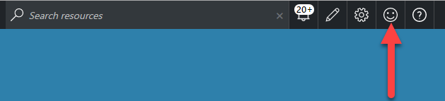

<properties 
    pageTitle="Mappage d’application dans l’Application Insights | Microsoft Azure" 
    description="Une présentation visuelle des dépendances entre les composants d’application, accompagnés d’indicateurs de performance clés et les alertes." 
    services="application-insights" 
    documentationCenter=""
    authors="SoubhagyaDash" 
    manager="douge"/>

<tags 
    ms.service="application-insights" 
    ms.workload="tbd" 
    ms.tgt_pltfrm="ibiza" 
    ms.devlang="na" 
    ms.topic="article" 
    ms.date="06/15/2016" 
    ms.author="awills"/>
 
# Mappage d’application dans l’Application perspectives

Dans [Visual Studio Application perspectives](app-insights-overview.md), mappage d’Application est une mise en page visuelle des relations de dépendance de vos composants d’application. Chaque composant affiche des indicateurs de performance clés tels que charge performances, échecs et alertes, pour vous aider à découvrir n’importe quel composant à l’origine d’un problème de performance ou une défaillance. Vous pouvez cliquer sur par le biais de n’importe quel composant de diagnostic plus détaillées, à la fois Insights d’Application, et - si votre application utilise des services Azure - diagnostics de Windows Azure, tels que les recommandations Conseiller de base de données SQL.

Comme autres graphiques, vous pouvez épingler un mappage d’application pour le tableau de bord Azure, où il est entièrement fonctionnelle. 

## Ouvrez le mappage d’application

Ouvrir la carte à partir de la carte de vue d’ensemble de votre application :

La carte indique :

* Tests de disponibilité
* Composant côté client (surveillé avec JavaScript SDK)
* Composant côté serveur
* Dépendances des composants client et serveur

Vous pouvez développer et réduire les groupes de lien de dépendance :

 
Si vous avez un grand nombre de dépendances d’un certain type (SQL, HTTP etc.), ils peuvent s’afficher groupés. 

 
 
## Problèmes tons directs

Chaque nœud possède des indicateurs de performance appropriées, telles que les taux de charge, les performances et échec pour ce composant. 

Icônes d’avertissement mettez en surbrillance les éventuels problèmes. Un avertissement orange indique qu’il échecs dans les requêtes, des affichages de page ou des appels de dépendance. Rouge indique qu’un taux de défaillance supérieures à 5 %.

 
Active les alertes également afficher la : 

 
Si vous utilisez SQL Azure, il est une icône qui s’affiche lorsqu’il existe des recommandations sur la façon dont vous pouvez améliorer les performances. 

Cliquez sur n’importe quelle icône pour obtenir plus de détails :

 
 
## Cliquez sur Diagnostics par le biais

Chacun des nœuds sur la carte offre ciblé de clics des diagnostics. Les options peuvent varier selon le type du nœud.

 
Pour les composants qui sont hébergés dans Azure, les options incluent un lien direct avec eux.

## Filtres et laps de temps

Par défaut, la carte résume toutes les données disponibles pour la plage horaire choisie. Mais vous pouvez filtrer afin d’inclure uniquement les noms d’opération spécifique ou les dépendances.

* Nom de l’opération : Cela inclut les affichages de page et les types de requêtes côté serveur. Avec cette option, la carte indique les indicateurs de performance clés sur le nœud côté client/serveur pour les opérations sélectionnées uniquement. Il indique les dépendances appelés dans le contexte de ces opérations spécifiques.
* Nom de base de dépendance : Cela inclut les dépendances de côté de navigateur AJAX et côté serveur. Si vous signalez télémétrie dépendance personnalisée avec l’API TrackDependency, ils apparaissent également ici. Vous pouvez sélectionner les dépendances à afficher sur la carte. Veuillez noter que pour l’instant, cela ne va pas filtrer les demandes de côté serveur ou les affichages de page côté client.

 
 
## Enregistrer des filtres

Pour enregistrer les filtres que vous avez appliqués, épingler l’affichage filtré sur un [tableau de bord](app-insights-dashboards.md).

 

## Commentaires

Veuillez [fournir des commentaires via l’option commentaires portail](app-insights-get-dev-support.md).

