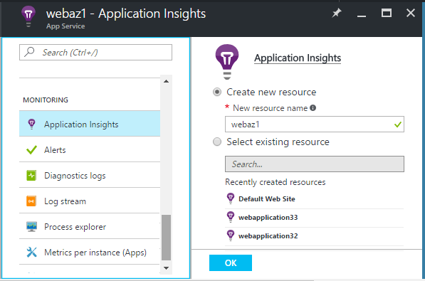

<properties 
    pageTitle="Dépendances sur une analyse de l’Application de suivi" 
    description="Analyser l’utilisation et les performances de votre local ou votre application web de Microsoft Azure avec des aperçus de l’Application." 
    services="application-insights" 
    documentationCenter=".net"
    authors="alancameronwills" 
    manager="douge"/>

<tags 
    ms.service="application-insights" 
    ms.workload="tbd" 
    ms.tgt_pltfrm="ibiza" 
    ms.devlang="na" 
    ms.topic="article" 
    ms.date="10/24/2016" 
    ms.author="awills"/>


# <a name="set-up-application-insights-dependency-tracking"></a>Configurer des perspectives d’Application : suivi de dépendance


[AZURE.INCLUDE [app-insights-selector-get-started-dotnet](../../includes/app-insights-selector-get-started-dotnet.md)]


Une *dépendance* est un composant externe qui est appelé par votre application. Il s’agit d’un service appelé à l’aide de HTTP, ou une base de données ou un système de fichiers. Dans Visual Studio Application perspectives, vous pouvez facilement repérer la durée pendant laquelle votre application attend de dépendances et la fréquence à laquelle un appel de dépendance échoue.


Le moniteur de prédéfinies dépendance signale actuellement les appels à ces types de dépendances :

* ASP.NET
 * Bases de données SQL
 * Web ASP.NET et services WCF qui utilisent des liaisons basé sur HTTP
 * Appels HTTP locales ou distantes
 * Azure DocumentDb, table, stockage d’objets blob et file d’attente
* Java
 * Appels vers une base de données via un pilote [JDBC](http://docs.oracle.com/javase/7/docs/technotes/guides/jdbc/) , tels que MySQL, SQL Server, PostgreSQL ou SQLite.
* JavaScript dans les pages web - la [page web SDK](app-insights-javascript.md) automatiquement les journaux des appels Ajax en tant que dépendances.

Vous pouvez écrire vos propres appels SDK pour surveiller les autres dépendances à l’aide de l' [API TrackDependency](app-insights-api-custom-events-metrics.md#track-dependency).


## <a name="to-set-up-dependency-monitoring"></a>Pour configurer la surveillance des dépendances

Vous avez besoin d’un abonnement [Microsoft Azure](http://azure.com) .

### <a name="if-your-app-runs-on-your-iis-server"></a>Si votre application s’exécute sur votre serveur IIS

Si votre application web s’exécute sur .NET 4.6 ou version ultérieure, vous pouvez l' [installer l’Application Insights SDK](app-insights-asp-net.md) dans votre application, ou installer le moniteur d’état Application perspectives. Vous n’avez pas besoin à la fois.

Dans le cas contraire, installez moniteur d’état Insights Application sur le serveur :

1. Sur votre serveur web IIS, connectez-vous en tant qu’administrateur.
2. Téléchargez et exécutez [programme d’installation de l’Analyseur de l’état](http://go.microsoft.com/fwlink/?LinkId=506648).
4. Dans l’Assistant installation, connectez-vous à Microsoft Azure.

    

    *Erreurs de connexion ? Voir [résolution des problèmes](#troubleshooting).*

5. Sélectionnez l’application web installés ou le site Web que vous souhaitez surveiller, puis configurez la ressource dans laquelle vous souhaitez afficher les résultats dans le portail d’analyse de l’Application.

    

    En règle générale, vous choisissez de configurer un [groupe de ressources]et une nouvelle ressource[roles].

    Sinon, utilisez une ressource existante si vous avez déjà configuré des [tests web] [ availability] pour votre site ou [WebClient surveillance][client].

6. Redémarrer IIS.

    

    Votre service web est interrompu pour quelques instants.

6. Notez que ApplicationInsights.config a été inséré dans les applications web que vous souhaitez analyser.

    

   Il existe également certaines modifications au fichier web.config.

#### <a name="want-to-reconfigure-later"></a>Vous voulez (ré) configurer ultérieurement ?

Après avoir terminé l’Assistant, vous pouvez reconfigurer l’agent dès que vous le souhaitez. Vous pouvez également utiliser si vous avez installé l’agent mais il y a des problèmes avec la configuration initiale.


### <a name="if-your-app-runs-as-an-azure-web-app"></a>Si votre application s’exécute comme une application Web Azure

Dans le panneau de votre application Web Azure, ajoutez l’extension Application perspectives.




### <a name="if-its-an-azure-cloud-services-project"></a>S’il s’agit d’un projet de services cloud Azure

[Ajouter des scripts aux rôles web et de travail](app-insights-cloudservices.md#dependencies). Ou [installez .NET framework 4.6 ou version ultérieure](../cloud-services/cloud-services-dotnet-install-dotnet.md).

## <a name="diagnosis"></a>Diagnostiquer les problèmes de performances de dépendance

Pour évaluer les performances des requêtes à votre serveur, ouvrez la carte de Performance et faites défiler jusqu'à coup de œil à la grille de requêtes :


L’option supérieure est très longue. Voyons si nous pouvons déterminer l’endroit où le temps est utilisé.

Cliquez sur cette ligne pour consulter des événements demande individuelle :


Cliquez sur n’importe quelle instance longue pour contrôler davantage.

Faites défiler jusqu'à les appels dépendance à distance liées à cette demande :


Il ressemble à la plupart de la maintenance de temps que cette demande a été consacrée à un appel vers un service local. 


Sélectionnez cette ligne pour obtenir plus d’informations :


Les détails inclut des informations suffisantes pour identifier le problème.


Dans un autre cas, aucun appel de dépendance n’est long, mais en optant pour l’affichage chronologique, nous pouvons voir où le délai s’est produite dans notre traitement interne :


## <a name="failures"></a>Échecs

S’il existe des échecs de requêtes, cliquez sur le graphique.


Cliquez sur via un type de demande et instance de requête, pour rechercher un appel à une dépendance à distance a échoué.


## <a name="custom-dependency-tracking"></a>Dépendance personnalisée suivi

Le module de suivi de dépendance standard détecte automatiquement les dépendances externes telles que des bases de données et des API REST. Mais que vous souhaitiez certains composants supplémentaires devant être traitée de la même façon. 

Vous pouvez écrire du code qui envoie des informations sur les dépendances, à l’aide de même [API TrackDependency](app-insights-api-custom-events-metrics.md#track-dependency) qui est utilisée par les modules standards.

Par exemple, si vous créez votre code avec un assembly que vous n’avez pas écrit vous-même, temps tous les appels à, pour déterminer quels contribution aux votre temps de réponse. Pour que ces données affichées dans les graphiques dépendance Application perspectives, envoyez-le à l’aide `TrackDependency`.

```C#

            var startTime = DateTime.UtcNow;
            var timer = System.Diagnostics.Stopwatch.StartNew();
            try
            {
                success = dependency.Call();
            }
            finally
            {
                timer.Stop();
                telemetry.TrackDependency("myDependency", "myCall", startTime, timer.Elapsed, success);
            }
```

Si vous voulez désactiver le module de suivi de dépendance standard, supprimez la référence à DependencyTrackingTelemetryModule dans [ApplicationInsights.config](app-insights-configuration-with-applicationinsights-config.md).

## <a name="troubleshooting"></a>Résolution des problèmes

*Succès de dépendance indicateur toujours affiche true ou false.*

* Mettre à niveau vers la dernière version du Kit de développement. Si votre version .NET est inférieure à 4.6, installez [Moniteur d’état](app-insights-monitor-performance-live-website-now.md).

## <a name="next-steps"></a>Étapes suivantes

- [Exceptions](app-insights-asp-net-exceptions.md)
- [Données utilisateur et de la page][client]
- [Disponibilité](app-insights-monitor-web-app-availability.md)


<!--Link references-->

[api]: app-insights-api-custom-events-metrics.md
[apikey]: app-insights-api-custom-events-metrics.md#ikey
[availability]: app-insights-monitor-web-app-availability.md
[azure]: ../insights-perf-analytics.md
[client]: app-insights-javascript.md
[diagnostic]: app-insights-diagnostic-search.md
[metrics]: app-insights-metrics-explorer.md
[netlogs]: app-insights-asp-net-trace-logs.md
[portal]: http://portal.azure.com/
[qna]: app-insights-troubleshoot-faq.md
[redfield]: app-insights-asp-net-dependencies.md
[roles]: app-insights-resources-roles-access-control.md

 
