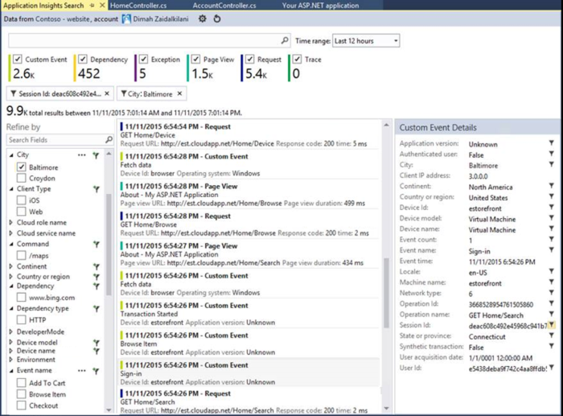
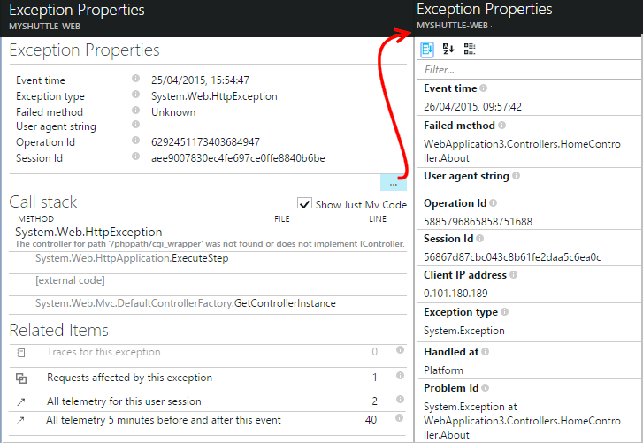

<properties 
    pageTitle="Diagnostiquer les échecs et les exceptions dans les applications ASP.NET avec des aperçus d’Application" 
    description="Capturer des exceptions à partir des applications ASP.NET ainsi que de télémétrie demande." 
    services="application-insights" 
    documentationCenter=".net"
    authors="alancameronwills" 
    manager="douge"/>

<tags 
    ms.service="application-insights" 
    ms.workload="tbd" 
    ms.tgt_pltfrm="ibiza" 
    ms.devlang="na" 
    ms.topic="article" 
    ms.date="10/27/2016" 
    ms.author="awills"/>


# <a name="set-up-application-insights-diagnose-exceptions"></a>Configurer la Application Insights : diagnostiquer les exceptions

[AZURE.INCLUDE [app-insights-selector-get-started-dotnet](../../includes/app-insights-selector-get-started-dotnet.md)]


En analysant votre application avec [Visual Studio Application Insights][start], vous pouvez corrélation échecs de requêtes avec exceptions et d’autres événements sur le client et le serveur, afin que vous puissiez rapidement diagnostiquer les causes.

Pour surveiller une application ASP.NET, vous devez [Ajouter l’Application Insights SDK] [ greenbrown] à votre application, ou [installer le moniteur d’état de votre serveur IIS][redfield], ou, si votre application est une application Web Azure, ajoutez l' [Extension perspectives d’Application](app-insights-azure-web-apps.md).

## <a name="diagnosing-exceptions-using-visual-studio"></a>Diagnostiquer les exceptions à l’aide de Visual Studio

Ouvrez la solution d’application dans Visual Studio pour faciliter le débogage.

Exécutez l’application sur votre serveur ou sur votre ordinateur de développement à l’aide de F5.

Ouvrez la fenêtre de recherche de perspectives d’Application dans Visual Studio et le configurer pour afficher des événements à partir de votre application. Pendant que vous êtes le débogage, vous pouvez faire ceci en cliquant sur le bouton analyse de l’Application.



Notez que vous pouvez filtrer le rapport pour afficher uniquement les exceptions. 

*Aucune exceptions affichant ? Voir [capturer des exceptions](#exceptions).*

Cliquez sur un rapport d’exception pour afficher sa trace de pile.


Cliquez sur une référence de ligne dans la trace de pile, pour ouvrir le fichier approprié.  

## <a name="diagnosing-failures-using-the-azure-portal"></a>Diagnostiquer les défaillances à l’aide du portail Azure

À partir de la vue d’ensemble de l’analyse des applications de votre application, la vignette échecs montre graphiques des exceptions et échec des demandes HTTP, ainsi qu’une liste de la demande URL occasionnant les plus fréquentes échecs.


Cliquez sur un des types d’échec de demande dans la liste pour accéder à des occurrences individuelles de l’échec. À partir de là, cliquez sur via les exceptions ou des données de suivi des associé :


**Par ailleurs,** vous pouvez démarrer à partir de la liste des exceptions que vous trouverez plus bas dans la carte échecs. Conserver en cliquant sur jusqu'à ce que vous atteigniez finalement exceptions individuelles.


*Aucune exceptions affichant ? Voir [capturer des exceptions](#exceptions).*

À partir de là, vous pouvez consulter la trace de la pile et propriétés détaillées de chaque exception et rechercher suivi du journal connexes ou autres événements.




[En savoir plus sur les Diagnostics de recherche][diagnostic].


## <a name="dependency-failures"></a>Échecs de dépendance

Une *dépendance* est un service que votre application appelle généralement via une connexion de base de données ou API REST. [Moniteur d’état application Insights] [ redfield] automatiquement surveille divers types d’appel de dépendance, mesure de la durée des appels et réussite ou l’échec. 

Pour obtenir des données de dépendance, vous devez [installer le moniteur d’état] [ redfield] sur votre serveur IIS, ou si votre application est une application Web Azure, utilisez l' [Extension perspectives d’Application](app-insights-azure-web-apps.md). 

Échec d’appels aux dépendances, sont répertoriés dans la carte échecs, et vous pouvez également les retrouver sous éléments associés dans les détails de la demande et les détails de l’exception.

*Aucune défaillance dépendance ? Bien. Mais, pour vérifier que vous obtenez des données de dépendance, ouvrez la carte de Performance et examinez le graphique de la durée de la dépendance.*

 

## <a name="custom-tracing-and-log-data"></a>Traçage personnalisés et les données du journal

Pour obtenir des données de diagnostic spécifiques à votre application, vous pouvez insérer code pour envoyer vos propres données de télémétrie. Cela affichées dans la recherche des diagnostics en parallèle avec la demande, en mode page et autres données collectées automatiquement. 

Vous disposez de plusieurs options :

* [TrackEvent()](app-insights-api-custom-events-metrics.md#track-event) est généralement utilisé pour l’analyse des modèles d’utilisation, mais les données qu’il renvoie également apparaissent sous événements personnalisés dans Rechercher des Diagnostics. Événements sont nommés et peut contenir des propriétés de chaîne et d’indicateurs numérique sur lequel vous pouvez [Filtrer vos recherches Diagnostics][diagnostic].
* [TrackTrace()](app-insights-api-custom-events-metrics.md#track-trace) vous permet d’envoyer des données telles que les informations du billet.
* [TrackException()](#exceptions) envoie traces de la pile. [En savoir plus sur les exceptions](#exceptions).
* Si vous utilisez déjà un cadre de journalisation, tels que Log4Net ou NLog, vous pouvez [capturer ces journaux] [ netlogs] et les voir en diagnostic recherche à côté des données de demande et de l’exception.

Pour afficher ces événements, ouvrez [recherche][diagnostic], Ouvrir filtre, puis sélectionnez Custom Event, une Trace ou une Exception.


> [AZURE.NOTE] Si votre application génère un grand nombre de télémétrie, le module d’échantillonnage adapté réduit automatiquement le volume est envoyé au portail en envoyant qu’une fraction représentant des événements. Événements qui font partie de la même opération est sélectionnés ou désélectionnés en tant que groupe, afin que vous pouvez vous déplacer entre les événements liés. [Découvrez les échantillonnages.](app-insights-sampling.md)

### <a name="how-to-see-request-post-data"></a>Comment afficher les données de publication de demande

Détails de la demande ne contiennent pas les données envoyées à votre application dans un appel billet. Pour que ces données signalées :

* [Installez le Kit de développement] [ greenbrown] dans votre projet d’application.
* Insérer du code dans votre application pour appeler [Microsoft.ApplicationInsights.TrackTrace()][api]. Envoyer les données de publication dans le paramètre de message. Il existe une limite à la taille autorisée, afin que vous devez essayer d’envoyer uniquement les données essentielles.
* Lorsque vous recherchez une demande échec, recherchez les traces associés.  


## <a name="exceptions"></a>Capturer les exceptions et les données de diagnostic connexes

Tout d’abord, n’apparaît pas dans le portail toutes les exceptions entraîner des problèmes dans votre application. Vous verrez les exceptions de navigateur (si vous utilisez le [Kit de développement logiciel JavaScript] [ client] dans vos pages web). Mais la plupart des exceptions de serveur sont capturés par IIS et que vous avez écrire un peu de code pour les afficher.

Vous pouvez :

* **Enregistrer des exceptions explicitement** en insérant du code dans les gestionnaires d’exception pour signaler les exceptions.
* **Capturer des exceptions automatiquement** en configurant votre infrastructure ASP.NET. Les ajouts nécessaires sont différentes pour les différents types de framework.

## <a name="reporting-exceptions-explicitly"></a>Signalisation des exceptions explicitement

Le moyen le plus simple consiste à insérer un appel à TrackException() dans un gestionnaire d’exceptions.

JavaScript

    try 
    { ...
    }
    catch (ex)
    {
      appInsights.trackException(ex, "handler loc",
        {Game: currentGame.Name, 
         State: currentGame.State.ToString()});
    }

C#

    var telemetry = new TelemetryClient();
    ...
    try 
    { ...
    }
    catch (Exception ex)
    {
       // Set up some properties:
       var properties = new Dictionary <string, string> 
         {{"Game", currentGame.Name}};

       var measurements = new Dictionary <string, double>
         {{"Users", currentGame.Users.Count}};

       // Send the exception telemetry:
       telemetry.TrackException(ex, properties, measurements);
    }

VISUAL BASIC

    Dim telemetry = New TelemetryClient
    ...
    Try
      ...
    Catch ex as Exception
      ' Set up some properties:
      Dim properties = New Dictionary (Of String, String)
      properties.Add("Game", currentGame.Name)

      Dim measurements = New Dictionary (Of String, Double)
      measurements.Add("Users", currentGame.Users.Count)
  
      ' Send the exception telemetry:
      telemetry.TrackException(ex, properties, measurements)
    End Try

Les paramètres propriétés et des mesures sont facultatives, mais sont utiles pour le [filtrage et ajout] [ diagnostic] des informations supplémentaires. Par exemple, si vous avez une application qui peut exécuter plusieurs jeux, vous pouvez rechercher tous les rapports d’exception liés à un jeu particulier. Vous pouvez ajouter autant d’éléments que vous le souhaitez pour chaque dictionnaire.

## <a name="browser-exceptions"></a>Exceptions de navigateur

La plupart des exceptions de navigateur sont signalés.

Si votre page web inclut des fichiers de script à partir de réseaux de distribution de contenu ou d’autres domaines, vérifiez votre balise script possède l’attribut ```crossorigin="anonymous"```, et que le serveur envoie [en-têtes CORS](http://enable-cors.org/). Cela vous permettra obtenir une trace de la pile et le détail des exceptions JavaScript non gérées à partir de ces ressources.

## <a name="web-forms"></a>Formulaires Web

Pour les formulaires web, le HTTP Module seront en mesure de collecter les exceptions lorsqu’il n’y a aucuns configurée avec CustomErrors de redirection.

Mais si vous avez des redirections actives, ajoutez les lignes suivantes à la fonction Application_Error dans Global.asax.cs. (Ajouter un fichier Global.asax si vous n’en avez pas déjà).

*C#*

    void Application_Error(object sender, EventArgs e)
    {
      if (HttpContext.Current.IsCustomErrorEnabled && Server.GetLastError  () != null)
      {
         var ai = new TelemetryClient(); // or re-use an existing instance

         ai.TrackException(Server.GetLastError());
      }
    }


## <a name="mvc"></a>MVC

Si la configuration [CustomErrors](https://msdn.microsoft.com/library/h0hfz6fc.aspx) est `Off`, puis les exceptions seront disponibles pour le [HTTP Module](https://msdn.microsoft.com/library/ms178468.aspx) recueillir. Toutefois, si elle est `RemoteOnly` (par défaut), ou `On`, l’exception est alors désactivée et non disponible pour les idées Application collecter automatiquement. Vous pouvez résoudre ce problème, substitution de la [classe System.Web.Mvc.HandleErrorAttribute](http://msdn.microsoft.com/library/system.web.mvc.handleerrorattribute.aspx)et en appliquant la classe remplacée comme indiqué pour les différentes versions MVC en dessous ([source github](https://github.com/AppInsightsSamples/Mvc2UnhandledExceptions/blob/master/MVC2App/Controllers/AiHandleErrorAttribute.cs)) :

    using System;
    using System.Web.Mvc;
    using Microsoft.ApplicationInsights;

    namespace MVC2App.Controllers
    {
      [AttributeUsage(AttributeTargets.Class | AttributeTargets.Method, Inherited = true, AllowMultiple = true)] 
      public class AiHandleErrorAttribute : HandleErrorAttribute
      {
        public override void OnException(ExceptionContext filterContext)
        {
            if (filterContext != null && filterContext.HttpContext != null && filterContext.Exception != null)
            {
                //If customError is Off, then AI HTTPModule will report the exception
                if (filterContext.HttpContext.IsCustomErrorEnabled)
                {   //or reuse instance (recommended!). see note above  
                    var ai = new TelemetryClient();
                    ai.TrackException(filterContext.Exception);
                } 
            }
            base.OnException(filterContext);
        }
      }
    }

#### <a name="mvc-2"></a>MVC 2

Remplacez l’attribut HandleError par votre nouvel attribut dans vos contrôleurs.

    namespace MVC2App.Controllers
    {
       [AiHandleError]
       public class HomeController : Controller
       {
    ...

[Exemple](https://github.com/AppInsightsSamples/Mvc2UnhandledExceptions)

#### <a name="mvc-3"></a>MVC 3

Inscrire `AiHandleErrorAttribute` comme un filtre global dans Global.asax.cs :

    public class MyMvcApplication : System.Web.HttpApplication
    {
      public static void RegisterGlobalFilters(GlobalFilterCollection filters)
      {
         filters.Add(new AiHandleErrorAttribute());
      }
     ...

[Exemple](https://github.com/AppInsightsSamples/Mvc3UnhandledExceptionTelemetry)


#### <a name="mvc-4-mvc5"></a>MVC 4, MVC5

Inscrire AiHandleErrorAttribute comme un filtre global dans FilterConfig.cs :

    public class FilterConfig
    {
      public static void RegisterGlobalFilters(GlobalFilterCollection filters)
      {
        // Default replaced with the override to track unhandled exceptions
        filters.Add(new AiHandleErrorAttribute());
      }
    }

[Exemple](https://github.com/AppInsightsSamples/Mvc5UnhandledExceptionTelemetry)

## <a name="web-api-1x"></a>Web API 1.x


Remplacer System.Web.Http.Filters.ExceptionFilterAttribute :

    using System.Web.Http.Filters;
    using Microsoft.ApplicationInsights;

    namespace WebAPI.App_Start
    {
      public class AiExceptionFilterAttribute : ExceptionFilterAttribute
      {
        public override void OnException(HttpActionExecutedContext actionExecutedContext)
        {
            if (actionExecutedContext != null && actionExecutedContext.Exception != null)
            {  //or reuse instance (recommended!). see note above 
                var ai = new TelemetryClient();
                ai.TrackException(actionExecutedContext.Exception);    
            }
            base.OnException(actionExecutedContext);
        }
      }
    }

Vous pourriez ajoutez cet attribut remplacée à certains contrôleurs ou ajouter à la configuration du filtre globale de la classe WebApiConfig : 

    using System.Web.Http;
    using WebApi1.x.App_Start;

    namespace WebApi1.x
    {
      public static class WebApiConfig
      {
        public static void Register(HttpConfiguration config)
        {
            config.Routes.MapHttpRoute(name: "DefaultApi", routeTemplate: "api/{controller}/{id}",
                defaults: new { id = RouteParameter.Optional });
            ...
            config.EnableSystemDiagnosticsTracing();

            // Capture exceptions for Application Insights:
            config.Filters.Add(new AiExceptionFilterAttribute());
        }
      }
    }

[Exemple](https://github.com/AppInsightsSamples/WebApi_1.x_UnhandledExceptions)

Il existe plusieurs cas les filtres d’exception ne peuvent pas gérer. Par exemple :

* Exceptions levées à partir de constructeurs contrôleur. 
* Exceptions levées à partir de gestionnaires de messages. 
* Exceptions levées pendant le routage. 
* Exceptions levées pendant la sérialisation contenu réponse. 

## <a name="web-api-2x"></a>Web API 2.x

Ajouter une mise en œuvre de IExceptionLogger :

    using System.Web.Http.ExceptionHandling;
    using Microsoft.ApplicationInsights;

    namespace ProductsAppPureWebAPI.App_Start
    {
      public class AiExceptionLogger : ExceptionLogger
      {
        public override void Log(ExceptionLoggerContext context)
        {
            if (context !=null && context.Exception != null)
            {//or reuse instance (recommended!). see note above 
                var ai = new TelemetryClient();
                ai.TrackException(context.Exception);
            }
            base.Log(context);
        }
      }
    }

Ajouter aux services dans WebApiConfig :

    using System.Web.Http;
    using System.Web.Http.ExceptionHandling;
    using ProductsAppPureWebAPI.App_Start;

    namespace WebApi2WithMVC
    {
      public static class WebApiConfig
      {
        public static void Register(HttpConfiguration config)
        {
            // Web API configuration and services

            // Web API routes
            config.MapHttpAttributeRoutes();

            config.Routes.MapHttpRoute(
                name: "DefaultApi",
                routeTemplate: "api/{controller}/{id}",
                defaults: new { id = RouteParameter.Optional }
            );
            config.Services.Add(typeof(IExceptionLogger), new AiExceptionLogger()); 
        }
      }
  }

[Exemple](https://github.com/AppInsightsSamples/WebApi_2.x_UnhandledExceptions)

Comme des alternatives, vous pouvez :

2. Remplacez le ExceptionHandler uniquement par une implémentation personnalisée de IExceptionHandler. Cette option est appelée uniquement lorsque le cadre est toujours en mesure de choisir le message de réponse à envoyer (pas lorsque la connexion est interrompue par exemple) 
3. Filtres d’exception (comme décrit dans la section contrôleurs de 1.x API Web ci-dessus) - ne pas appelées dans tous les cas.


## <a name="wcf"></a>WCF

Ajouter une classe qui étend attribut et met en œuvre IErrorHandler et IServiceBehavior.

    using System;
    using System.Collections.Generic;
    using System.Linq;
    using System.ServiceModel.Description;
    using System.ServiceModel.Dispatcher;
    using System.Web;
    using Microsoft.ApplicationInsights;

    namespace WcfService4.ErrorHandling
    {
      public class AiLogExceptionAttribute : Attribute, IErrorHandler, IServiceBehavior
      {
        public void AddBindingParameters(ServiceDescription serviceDescription,
            System.ServiceModel.ServiceHostBase serviceHostBase,
            System.Collections.ObjectModel.Collection<ServiceEndpoint> endpoints,
            System.ServiceModel.Channels.BindingParameterCollection bindingParameters)
        {
        }

        public void ApplyDispatchBehavior(ServiceDescription serviceDescription, 
            System.ServiceModel.ServiceHostBase serviceHostBase)
        {
            foreach (ChannelDispatcher disp in serviceHostBase.ChannelDispatchers)
            {
                disp.ErrorHandlers.Add(this);
            }
        }

        public void Validate(ServiceDescription serviceDescription, 
            System.ServiceModel.ServiceHostBase serviceHostBase)
        {
        }

        bool IErrorHandler.HandleError(Exception error)
        {//or reuse instance (recommended!). see note above 
            var ai = new TelemetryClient();

            ai.TrackException(error);
            return false;
        }

        void IErrorHandler.ProvideFault(Exception error, 
            System.ServiceModel.Channels.MessageVersion version, 
            ref System.ServiceModel.Channels.Message fault)
        {
        }
      }
    }

Ajoutez l’attribut aux mises en œuvre de service :

    namespace WcfService4
    {
        [AiLogException]
        public class Service1 : IService1 
        { 
         ...

[Exemple](https://github.com/AppInsightsSamples/WCFUnhandledExceptions)

## <a name="exception-performance-counters"></a>Compteurs d’exception

Si vous avez [installé le moniteur d’état] [ redfield] sur votre serveur, vous pouvez obtenir un graphique du taux d’exceptions, mesuré en .NET. Cela inclut les exceptions .NET gérées et non gérées.

Ouvrir une carte métrique Explorer, ajouter un nouveau graphique, puis sélectionnez **votre taux d’Exception**, répertoriés sous compteurs de Performance. 

.NET framework calcule le taux en compter le nombre d’exceptions dans un intervalle et en divisant par la longueur de l’intervalle. 

Notez qu’il soit différent du nombre de « Exceptions » calculé par le portail d’analyse de l’Application à partir de rapports TrackException. Les intervalles d’échantillonnage sont différents, et le Kit de développement n’envoyer des rapports TrackException pour toutes les gérées et exceptions non gérées.

<!--Link references-->

[api]: app-insights-api-custom-events-metrics.md
[client]: app-insights-javascript.md
[diagnostic]: app-insights-diagnostic-search.md
[greenbrown]: app-insights-asp-net.md
[netlogs]: app-insights-asp-net-trace-logs.md
[redfield]: app-insights-monitor-performance-live-website-now.md
[start]: app-insights-overview.md

 
