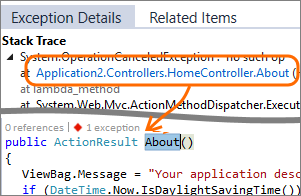

<properties 
    pageTitle="Tirer le meilleur parti des perspectives Application | Microsoft Azure" 
    description="Après la mise en route d’analyse de l’Application, Voici un résumé des fonctionnalités que vous pouvez Explorer." 
    services="application-insights" 
    documentationCenter=".net"
    authors="alancameronwills" 
    manager="douge"/>

<tags 
    ms.service="application-insights" 
    ms.workload="tbd" 
    ms.tgt_pltfrm="ibiza" 
    ms.devlang="na" 
    ms.topic="article" 
    ms.date="10/27/2016" 
    ms.author="awills"/>

# <a name="more-telemetry-from-application-insights"></a>Plus de télémétrie d’analyse de l’Application

Une fois que vous avez [ajouté des perspectives d’Application à votre code ASP.NET](app-insights-asp-net.md), voici quelques actions que possibles pour obtenir davantage de télémétrie. 

## <a name="if-your-app-runs-on-your-iis-server-"></a>Si votre application s’exécute sur votre serveur IIS...

Si votre application est hébergée sur des serveurs IIS dans votre contrôle, installez le contrôle d’état Insights Application sur les serveurs. S’il est déjà installé, vous ne devez rien faire.

1. Sur chaque serveur web IIS, connectez-vous à l’aide des informations d’identification d’administrateur.
2. Téléchargez et exécutez [programme d’installation de l’Analyseur de l’état](http://go.microsoft.com/fwlink/?LinkId=506648).
3. Dans l’Assistant installation, connectez-vous à Microsoft Azure.

Vous n’avez pas besoin de faire quoi, mais vous pouvez vérifier que le contrôle est activé pour votre application.


(Vous pouvez également utiliser moniteur d’état pour [Activer le contrôle en cours d’exécution](app-insights-monitor-performance-live-website-now.md), même si vous n’avez pas instrument vos applications dans Visual Studio.)

### <a name="what-do-you-get"></a>Que pouvez-vous ?

Si moniteur d’état est installé sur vos ordinateurs serveur, vous obtenez certaines télémétrie supplémentaire :

* Télémétrie dépendance (SQL des appels et reste apportées par votre application) pour les applications .NET 4.5. (Pour les versions ultérieures de .NET, moniteur d’état n’est pas nécessaire de télémétrie dépendance.) 
* Traces de pile d’exception afficher plus de détails.
* Compteurs de performance. Dans l’Application perspectives, ces compteurs apparaissent dans la carte de serveurs. 


Pour afficher plus ou moins compteurs, [Modifier les graphiques](app-insights-metrics-explorer.md). Si le compteur de performance souhaité ne figure pas dans l’ensemble disponible, vous pouvez [l’ajouter à l’ensemble collectée par le module de compteur de performances](app-insights-performance-counters.md).

## <a name="if-its-an-azure-web-app-"></a>S’il s’agit d’une application web Azure...

Si votre application s’exécute comme une application web Azure, accédez au panneau Azure pour l’application ou une machine virtuelle et ouvrez la carte d’analyse de l’Application. 

### <a name="what-do-you-get"></a>Que pouvez-vous ?

* Traces de pile d’exception afficher plus de détails.
* Télémétrie dépendance (SQL des appels et reste apportées par votre application) pour les applications .NET 4.5. (Pour les versions ultérieures de .NET, l’extension n’est pas nécessaire de télémétrie dépendance.) 


(Vous pouvez également utiliser cette méthode pour [activer lors de l’exécution d’analyse des performances](app-insights-monitor-performance-live-website-now.md), même si vous n’avez pas instrument votre application dans Visual Studio.)

## <a name="client-side-monitoring"></a>Analyse côté client

Vous avez installé le Kit de développement qui envoie des données de télémétrie à partir du serveur (back-end) de votre application. Vous pouvez désormais ajouter analyse côté client. Cela vous donne de données sur les utilisateurs, sessions, affichages de page et les exceptions ou les incidents qui se produisent dans le navigateur. Vous pourrez également écrire votre propre code pour effectuer le suivi du fonctionnement de vos utilisateurs avec votre application, droite vers le bas jusqu'à le niveau détaillé de clics et les séquences de touches.

Ajouter l’extrait de l’Application Insights JavaScript à chaque page web, pour obtenir de télémétrie de navigateurs clients.

1. Dans Azure, ouvrez la ressource Application perspectives pour votre application.
2. Ouvrez la mise en route, côté Client moniteur et copiez l’extrait de code.
3. Coller afin qu’il apparaisse dans l’en-tête de chaque page web - généralement que vous pouvez le faire en les collant dans la page maître.


Remarquez que le code contienne la clé d’instrumentation qui identifie votre ressource d’application.

### <a name="what-do-you-get"></a>Que pouvez-vous ?

* Vous pouvez écrire un code JavaScript pour envoyer de [télémétrie personnalisé à partir de vos pages web](app-insights-api-custom-events-metrics.md), par exemple effectuer le suivi de clics de bouton.
* Dans [Analytique](app-insights-analytics.md), données de `pageViews` et données AJAX dans `dependencies`. 
* [Performances du client et les données d’utilisation](app-insights-javascript.md) dans la carte de navigateurs.


[En savoir plus sur la page web suivi.](app-insights-web-track-usage.md)


## <a name="track-application-version"></a>Version de l’Application de suivi

Vérifiez que `buildinfo.config` est généré par votre processus MSBuild. Dans votre fichier .csproj, ajouter :  

```XML

    <PropertyGroup>
      <GenerateBuildInfoConfigFile>true</GenerateBuildInfoConfigFile>    <IncludeServerNameInBuildInfo>true</IncludeServerNameInBuildInfo>
    </PropertyGroup> 
```

Lorsqu’il comporte les informations de génération, le module web Application Insights ajoute automatiquement **l’application** en tant que propriété à chaque élément de télémétrie. Vous permet de filtrer par version lorsque vous effectuez des [recherches Diagnostics](app-insights-diagnostic-search.md) ou lorsque [exploration des indicateurs](app-insights-metrics-explorer.md). 

Toutefois, notez que le numéro de version de build est généré uniquement par MS Build, pas par la génération de developer dans Visual Studio.


## <a name="availability-web-tests"></a>Disponibilité des tests de site web

Envoyer des demandes HTTP votre application web à intervalles réguliers à partir du monde entier. Nous vous avertir si la réponse est lente ou peu fiables.

Dans la ressource Application perspectives pour votre application, cliquez sur la vignette de disponibilité pour ajouter, modifier et afficher les tests de site web.

Vous pouvez ajouter plusieurs tests fonctionnant à plusieurs emplacements.


[Pour en savoir plus](app-insights-monitor-web-app-availability.md)

## <a name="custom-telemetry-and-logging"></a>Journalisation et télémétrie personnalisé

Les packages d’Application idées que vous avez ajouté à votre code fournissent une API que vous pouvez appeler à partir de votre application.

* [Générer vos propres événements et indicateurs](app-insights-api-custom-events-metrics.md), par exemple pour dénombrer les épreuves business ou surveiller les performances.
* [Traces de journal capture](app-insights-asp-net-trace-logs.md) de Log4Net, NLog ou System.Diagnostics.Trace.
* [Filtrer, modifier, ou augmenter](app-insights-api-filtering-sampling.md) la télémétrie standard envoyé à partir de votre application en écrivant processeurs de télémétrie. 


## <a name="powerful-analysis-and-presentation"></a>Présentation et une analyse puissante

Il existe de nombreuses façons d’Explorer vos données. Si vous avez récemment commencé avec des aperçus de l’Application, consultez les articles suivants :

||
|---|---
|[**Recherche des diagnostics par exemple de données**](app-insights-visual-studio.md)<br/>Recherche / filtrage des événements tels que les demandes exceptions, appels dépendance, journal traces et affichages de page. Dans Visual Studio, accédez au code de traces de la pile.|
|[**Explorer les mesures pour les données agrégées**](app-insights-metrics-explorer.md)<br/>Explorer, filtrer et segment agrégé données telles que les taux des demandes, les échecs et les exceptions ; temps de réponse, temps de chargement de page.|
|[**Tableaux de bord**](app-insights-dashboards.md#dashboards)<br/>Combiner des données provenant de plusieurs ressources et les partager avec d’autres personnes. Idéal pour les applications composants multiples et d’affichage en continu dans la salle de réunion.  |
|[**Flux de données métriques Live**](app-insights-metrics-explorer.md#live-metrics-stream)<br/>Lorsque vous déployez une nouvelle version, regardez ces indicateurs de performance près en temps réel pour vous assurer que tout fonctionne comme prévu.|
|[**Analytique**](app-insights-analytics.md)<br/>Répondre à des questions difficiles sur les performances et l’utilisation de votre application à l’aide de ce langage de requête puissantes.|
|[**Alertes automatiques et manuelles**](app-insights-alerts.md)<br/>Des alertes automatiques s’adapter aux modèles normal de votre application de télémétrie et le déclencheur lorsqu’il y a quelque chose à l’extérieur de schéma habituel. Vous pouvez également définir des alertes sur les niveaux de particuliers de mesures standard ou personnalisées.|

## <a name="data-management"></a>Gestion des données

|||
|---|---|
|[**Exporter en continu**](app-insights-export-telemetry.md)<br/>Copiez toutes les votre télémétrie dans stockage afin que vous pouvez les analyser vos besoins.|
|**API d’accès aux données**<br/>À venir.|
|[**Échantillonnages**](app-insights-sampling.md)<br/>Réduit le taux de données et vous aide à rester dans la limite de votre niveau de tarification.|