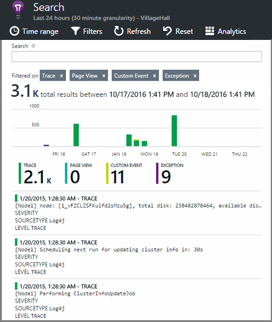

<properties 
    pageTitle="Explorer les journaux de suivi .NET dans perspectives d’Application" 
    description="Effectuer une recherche dans les journaux générés avec Trace, NLog ou Log4Net." 
    services="application-insights" 
    documentationCenter=".net"
    authors="alancameronwills" 
    manager="douge"/>

<tags 
    ms.service="application-insights" 
    ms.workload="tbd" 
    ms.tgt_pltfrm="ibiza" 
    ms.devlang="na" 
    ms.topic="article" 
    ms.date="07/21/2016" 
    ms.author="awills"/>
 
# <a name="explore-net-trace-logs-in-application-insights"></a>Explorer les journaux de suivi .NET dans perspectives d’Application  

Si vous utilisez NLog, log4Net ou System.Diagnostics.Trace pour le suivi de diagnostic dans votre application ASP.NET, vous pouvez avoir vos journaux envoyés [Visual Studio Application]analyse[start], où vous pouvez Explorer et y effectuer des recherches. Les journaux sont fusionnées avec l’autres télémétrie en provenance de votre application, afin que vous pouvez identifier les traces associés à prendre en charge chaque demande d’utilisateur et les mettre en corrélation avec d’autres événements et les rapports d’exception.


> [AZURE.NOTE] Avez-vous besoin du module de capture journal ? Il s’agit d’une carte utile pour les journaux 3ème tiers, mais si vous n’utilisez déjà NLog, log4Net ou System.Diagnostics.Trace, vous pouvez simplement appeler [Application Insights TrackTrace()](app-insights-api-custom-events-metrics.md#track-trace) directement.


## <a name="install-logging-on-your-app"></a>Installer la journalisation dans votre application

Installez la structure de votre journalisation choisie dans votre projet. Cela doit entraîner une entrée dans app.config ou web.config.

Si vous utilisez System.Diagnostics.Trace, vous devez ajouter une entrée à web.config :

```XML

    <configuration>
     <system.diagnostics>
       <trace autoflush="false" indentsize="4">
         <listeners>
           <add name="myListener" 
             type="System.Diagnostics.TextWriterTraceListener" 
             initializeData="TextWriterOutput.log" />
           <remove name="Default" />
         </listeners>
       </trace>
     </system.diagnostics>
   </configuration>
```

## <a name="configure-application-insights-to-collect-logs"></a>Configurer l’Application perspectives pour collecter les journaux

**[Analyse des applications ajouter à votre projet](app-insights-asp-net.md)** si vous n’avez pas fait. Vous verrez une option pour inclure le collecteur de journal.

Ou **Configurer Application perspectives** par clic droit sur votre projet dans l’Explorateur de solutions. Sélectionnez l’option à **configurer collection la trace**.

*Aucune option collecteur du menu ou un journal de perspectives d’Application ?* Essayez de [résolution des problèmes](#troubleshooting).


## <a name="manual-installation"></a>Installation manuelle

Utilisez cette méthode si votre type de projet n’est pas pris en charge par le programme d’installation d’analyse de l’Application (par exemple un bureau projet Windows). 

1. Si vous prévoyez d’utiliser log4Net ou NLog, installez-le dans votre projet. 
2. Dans l’Explorateur, avec le bouton droit de votre projet, puis sélectionnez **Manage NuGet Packages**.
3. Recherchez « Application perspectives »

    

4. Sélectionnez le package approprié - un des :
  + Microsoft.ApplicationInsights.TraceListener (pour capturer des appels System.Diagnostics.Trace)
  + Microsoft.ApplicationInsights.NLogTarget
  + Microsoft.ApplicationInsights.Log4NetAppender

Le package NuGet installe les assemblys nécessaires et également modifie web.config ou app.config.

## <a name="insert-diagnostic-log-calls"></a>Insérer des appels journal de diagnostic

Si vous utilisez System.Diagnostics.Trace, un appel typique serait le suivant :

    System.Diagnostics.Trace.TraceWarning("Slow response - database01");

Si vous préférez log4net ou NLog :

    logger.Warn("Slow response - database01");


## <a name="using-the-trace-api-directly"></a>À l’aide de la Trace API directement

Vous pouvez appeler directement la trace Insights Application API. Les cartes de journalisation utiliser cette API. 

Par exemple :

    var telemetry = new Microsoft.ApplicationInsights.TelemetryClient();
    telemetry.TrackTrace("Slow response - database01");

L’avantage de TrackTrace est que vous pouvez placer les données relativement longues dans le message. Par exemple, vous pourriez Encoder données billet. 

En outre, vous pouvez ajouter un niveau de gravité à votre message. Et, comme autres télémétrie, vous pouvez ajouter des valeurs de propriétés que vous pouvez utiliser pour vous permettre de filtre ou recherche pour différents jeux de traces. Par exemple :


    var telemetry = new Microsoft.ApplicationInsights.TelemetryClient();
    telemetry.TrackTrace("Slow database response",
                   SeverityLevel.Warning,
                   new Dictionary<string,string> { {"database", db.ID} });

Cette procédure vous permette, dans [Rechercher][diagnostic], afin de filtrer facilement tous les messages d’un niveau particulier gravité relatives à une base de données particulière.

## <a name="explore-your-logs"></a>Explorer vos journaux

Exécutez votre application, soit en mode débogage ou déployer live.

Dans la carte de vue d’ensemble de votre application dans [le portail d’Application Insights][portal], sélectionnez [Rechercher][diagnostic].




Vous pouvez, par exemple :

* Filtrer sur les traces journal, ou sur les éléments avec des propriétés spécifiques
* Inspecter un élément spécifique dans le détail.
* Rechercher d’autres télémétrie relatives à la même demande utilisateur (autrement dit, avec la même OperationId) 
* Enregistrer la configuration de cette page comme favori

> [AZURE.NOTE] **Échantillonnages.** Si votre application envoie un grand nombre de données et que vous utilisez le Kit de développement du Insights d’Application pour ASP.NET version 2.0.0-beta3 ou version ultérieure, la fonctionnalité d’échantillonnage adapté peut-être fonctionner et envoyer uniquement un pourcentage de votre télémétrie. [Découvrez les échantillonnages.](app-insights-sampling.md)

## <a name="next-steps"></a>Étapes suivantes

[Diagnostiquer les échecs et les exceptions dans ASP.NET][exceptions]

[En savoir plus sur la recherche][diagnostic].


## <a name="troubleshooting"></a>Résolution des problèmes

### <a name="how-do-i-do-this-for-java"></a>Comment faire ceci pour Java ?

Utiliser les [cartes de journal Java](app-insights-java-trace-logs.md).

### <a name="theres-no-application-insights-option-on-the-project-context-menu"></a>Aucune option d’analyse des applications dans le menu contextuel du projet

* Vérifier les outils d’analyse de l’Application est installé sur cet ordinateur de développement. Dans Visual Studio menu Outils, Extensions et mises à jour, recherchez les outils d’analyse des applications. Si elle n’est pas dans l’onglet installé, ouvrez l’onglet en ligne et l’installer.
* Il peut s’agir d’un type de projet non pris en charge par les outils d’analyse de l’Application. Utiliser [une installation manuelle](#manual-installation).

### <a name="no-log-adapter-option-in-the-configuration-tool"></a>Aucune option carte journal dans l’outil de configuration

* Vous devez d’abord installer le cadre de la journalisation.
* Si vous utilisez System.Diagnostics.Trace, vérifiez que vous [configuré dans `web.config` ](https://msdn.microsoft.com/library/system.diagnostics.eventlogtracelistener.aspx).
* Avez-vous la dernière version d’outils d’analyse de l’Application ? Dans le menu **Outils** de Visual Studio, choisissez **Extensions et mises à jour**et ouvrez l’onglet **mises à jour** . Si les outils d’analyse de l’Application n’est visible, cliquez sur pour mettre à jour.


### <a name="emptykey"></a>J’obtiens une erreur « clé Instrumentation ne peut pas être vide »

Il semble que vous avez installé le package journalisation carte Nuget sans l’installation d’analyse de l’Application.

Dans l’Explorateur de solutions, avec le bouton droit `ApplicationInsights.config` et sélectionnez **Mise à jour Application perspectives**. Vous recevrez une boîte de dialogue qui vous invite à se connecter à Azure et créez une ressource d’Application perspectives, ou utiliser une existante. Qui doit le correctif.

### <a name="i-can-see-traces-in-diagnostic-search-but-not-the-other-events"></a>Je vois traces rechercher des diagnostics, mais pas les autres événements

Il peut parfois prendre un certain temps pour tous les événements et les demandes d’obtenir dans le pipeline.

### <a name="limits"></a>La quantité de données est conservée ?

Jusqu'à 500 événements par seconde à partir de chaque application. Les événements sont conservés pendant sept jours.

### <a name="im-not-seeing-some-of-the-log-entries-that-i-expect"></a>Je ne vois pas certaines des entrées du journal escomptées

Si votre application envoie un grand nombre de données et que vous utilisez le Kit de développement du perspectives d’Application pour ASP.NET version 2.0.0-beta3 ou version ultérieure, la fonctionnalité d’échantillonnage adapté peut-être fonctionner et envoyer uniquement un pourcentage de votre télémétrie. [Découvrez les échantillonnages.](app-insights-sampling.md)

## <a name="add"></a>Étapes suivantes

* [Configurer la disponibilité et teste la réactivité][availability]
* [Résolution des problèmes][qna]


<!--Link references-->

[availability]: app-insights-monitor-web-app-availability.md
[diagnostic]: app-insights-diagnostic-search.md
[exceptions]: app-insights-asp-net-exceptions.md
[portal]: https://portal.azure.com/
[qna]: app-insights-troubleshoot-faq.md
[start]: app-insights-overview.md

 
