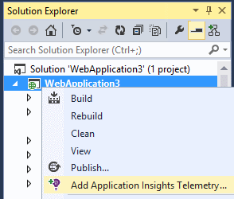
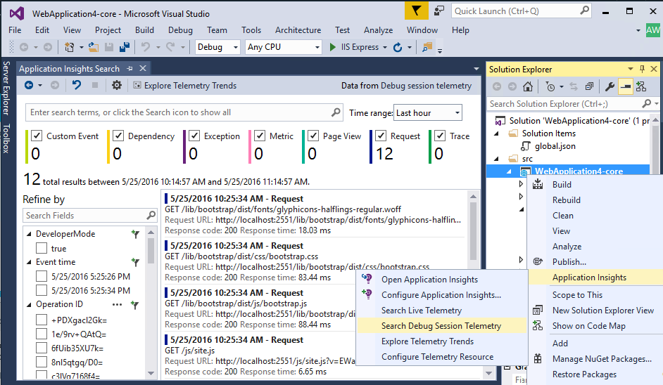
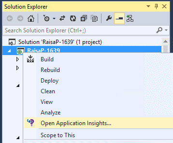
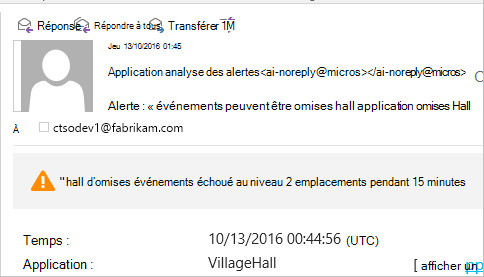
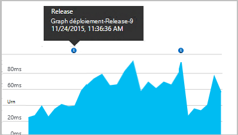
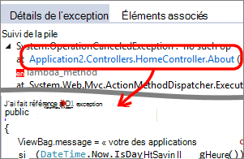

<properties 
    pageTitle="Configurer l’analytique d’application web ASP.NET avec des aperçus Application | Microsoft Azure" 
    description="Configurer les performances, la disponibilité et analytique de l’utilisation de votre site Web ASP.NET, hébergé en local ou dans Azure." 
    services="application-insights" 
    documentationCenter=".net"
    authors="NumberByColors" 
    manager="douge"/>

<tags 
    ms.service="application-insights" 
    ms.workload="tbd" 
    ms.tgt_pltfrm="ibiza" 
    ms.devlang="na" 
    ms.topic="get-started-article" 
    ms.date="10/13/2016" 
    ms.author="awills"/>


# <a name="set-up-application-insights-for-aspnet"></a>Configurer Application perspectives pour ASP.NET

[Visual Studio Application Insights](app-insights-overview.md) surveille vos applications en ligne pour vous aider à [détecter et diagnostiquer les problèmes de performances et les exceptions](app-insights-detect-triage-diagnose.md)et [Découvrez comment votre application est utilisée](app-insights-overview-usage.md).  Elle fonctionne pour les applications qui sont hébergées sur vos propres serveurs IIS en local ou sur le cloud machines virtuelles, ainsi que les applications web Azure.


## <a name="before-you-start"></a>Avant de commencer

Tu as besoin de :

* Visual Studio 2013 mise à jour 3 ou version ultérieure. Une version ultérieure est meilleure.
* Un abonnement à [Microsoft Azure](http://azure.com). Si votre équipe ou organisation dispose d’un abonnement Azure, le propriétaire peut vous ajouter au, à l’aide de votre [compte Microsoft](http://live.com). 

Il existe des articles de remplacement pour examiner si vous êtes intéressé par :

* [Instrumentation d’une application web en cours d’exécution](app-insights-monitor-performance-live-website-now.md)
* [Services en nuage Azure](app-insights-cloudservices.md)

## <a name="ide"></a>1. Ajouter Application Insights SDK


### <a name="if-its-a-new-project"></a>S’il s’agit d’un nouveau projet...

Vérifiez que Insights Application est sélectionné lorsque vous créez un projet dans Visual Studio. 


### <a name="-or-if-its-an-existing-project"></a>... ou s’il s’agit d’un projet existant

Droit sur le projet dans l’Explorateur de solutions, puis choisissez **Ajouter Application Insights télémétrie** ou **Configurer Application perspectives**.



* Projet ASP.NET Core ? - [Suivez ces instructions pour corriger quelques lignes de code](https://github.com/Microsoft/ApplicationInsights-aspnetcore/wiki/Getting-Started#add-application-insights-instrumentation-code-to-startupcs). 


## <a name="run"></a>2. exécuter votre application

Exécuter votre application en appuyant sur F5 et essayez-le : ouvrir les différentes pages pour générer certains télémétrie.

Dans Visual Studio, vous voyez un compteur des événements qui ont été enregistrés. 


## <a name="3-see-your-telemetry"></a>3. voir votre télémétrie...

### <a name="-in-visual-studio"></a>... dans Visual Studio

Ouvrez la fenêtre d’Application Insights dans Visual Studio : cliquez sur le bouton analyse de l’Application, ou avec le bouton droit de votre projet dans l’Explorateur de :



Cet affichage montre télémétrie généré dans le côté serveur de votre application. Tester les filtres, puis cliquez sur n’importe quel événement pour afficher plus de détails.

[En savoir plus sur les outils d’analyse de l’Application dans Visual Studio](app-insights-visual-studio.md).

<a name="monitor"></a> 
### <a name="-in-the-portal"></a>dans le portail

Sauf si vous choisissez *Installer SDK uniquement,* vous pouvez également consulter la télémétrie sur le portail web Application perspectives. 

Le portail comporte plus des graphiques, des outils d’analyse et des tableaux de bord que Visual Studio. 


Ouvrez la ressource de perspectives d’Application dans le [portail Azure](https://portal.azure.com/).



Le portail s’ouvre dans un affichage de la télémétrie provenant de votre application :

* La première télémétrie apparaît dans [les mesures de flux](app-insights-metrics-explorer.md#live-metrics-stream).
* Événements individuels s’affichent dans la **recherche** (1). Données peuvent prendre quelques minutes apparaisse. Cliquez sur n’importe quel événement pour afficher ses propriétés. 
* Métrique agrégé s’affichent dans les graphiques (2). Il peut prendre une minute ou deux de données ici. Cliquez sur un graphique quelconque pour ouvrir une carte avec plus de détails.

[En savoir plus sur l’utilisation de perspectives d’Application dans le portail Azure](app-insights-dashboards.md).

## <a name="4-publish-your-app"></a>4. publier votre application

Publier votre application sur votre serveur IIS ou sur Azure. Regardez les [indicateurs de flux](app-insights-metrics-explorer.md#live-metrics-stream) pour vous assurer que tout fonctionne correctement.

Vous verrez votre établissement dans le portail d’analyse de l’Application, où vous pouvez surveiller les indicateurs, rechercher votre télémétrie et configurer des [tableaux de bord](app-insights-dashboards.md)de télémétrie. Vous pouvez également utiliser le [langage de requête Analytique](app-insights-analytics.md) de puissants pour analyser l’utilisation et les performances ou rechercher des événements spécifiques. 

Vous pouvez également continuer à analyser votre télémétrie dans [Visual Studio](app-insights-visual-studio.md) avec les outils de diagnostic recherche et [les tendances](app-insights-visual-studio-trends.md).

> [AZURE.NOTE] Si votre application envoie suffisamment télémétrie d’aborder la [limitation des limites](app-insights-pricing.md#limits-summary), automatique [échantillonnages](app-insights-sampling.md) bascule. Échantillonnages permet de réduire la quantité de télémétrie envoyé à partir de votre application, tout en conservant les données mises en corrélation fins de diagnostic.


##<a name="land"></a>Quoi « Ajouter Application perspectives » ?

Application Insights envoie télémétrie depuis votre application vers le portail de perspectives Application (qui est hébergé dans Microsoft Azure) :


La commande a trois actions :

1. Ajoutez le package d’Application Insights Web SDK NuGet à votre projet. Pour voir dans Visual Studio, avec le bouton droit de votre projet et sélectionnez Manage NuGet Packages.
2. Créer une ressource d’analyse des applications dans [le portail Azure](https://portal.azure.com/). Il s’agit de l’endroit où vous voyez vos données. Il récupère la *clé instrumentation,* qui identifie la ressource.
3. Insère la clé d’instrumentation dans `ApplicationInsights.config`, afin que le Kit de développement peut envoyer télémétrie au portail.

Si vous le souhaitez, vous pouvez effectuer ces étapes manuellement pour [ASP.NET 4](app-insights-windows-services.md) ou [ASP.NET Core](https://github.com/Microsoft/ApplicationInsights-aspnetcore/wiki/Getting-Started).

### <a name="to-upgrade-to-future-sdk-versions"></a>Mise à niveau vers les versions ultérieures du Kit de développement

Pour mettre à niveau vers une [nouvelle version du Kit de développement](https://github.com/Microsoft/ApplicationInsights-dotnet-server/releases), ouvrez à nouveau le Gestionnaire de package NuGet et leur filtrage sur les packages installés. Sélectionnez Microsoft.ApplicationInsights.Web et choisissez Mettre à niveau.

Si vous avez ApplicationInsights.config toutes les personnalisations, enregistrez une copie de celui-ci avant de mettre à niveau et par la suite fusionner vos modifications dans la nouvelle version.

## <a name="add-more-telemetry"></a>Ajouter plus de télémétrie

### <a name="web-pages-and-single-page-apps"></a>Pages Web et applications d’une page simple

1. [Ajouter l’extrait de code JavaScript](app-insights-javascript.md) à vos pages web pour les cartes de navigateur et l’utilisation des données sur les affichages de page, le temps de chargement, exceptions de navigateur, performances des appels AJAX, allument nombre utilisateur et de session.
2. [Événements personnalisés de code](app-insights-api-custom-events-metrics.md) à compter, l’heure ou mesure actions de l’utilisateur.

### <a name="dependencies-exceptions-and-performance-counters"></a>Dépendances, des exceptions et compteurs de performance

[Moniteur d’état installer](app-insights-monitor-performance-live-website-now.md) sur chacun de vos ordinateurs serveur, pour obtenir d’autres télémétrie sur votre application. C’est ce que vous obtenez :

* [Compteurs de performance](app-insights-performance-counters.md) - 
processeur, mémoire, disque et autres compteurs de performance relatifs à votre application. 
* [Exceptions](app-insights-asp-net-exceptions.md) - télémétrie plus détaillée pour quelques exceptions près.
* [Dépendances](app-insights-asp-net-dependencies.md) - appels aux services API REST ou SQL. Déterminer si les réponses lentes par les composants externes sont à l’origine des problèmes de performances dans votre application. (Si votre application s’exécute sur .NET 4.6, vous n’avez pas besoin moniteur d’état pour obtenir ce télémétrie.)

### <a name="diagnostic-code"></a>Code de diagnostic

Vous avez un problème ? Si vous voulez insérer du code dans votre application de diagnostiquer il, vous disposez de plusieurs options :

* [Traces de journal capture](app-insights-asp-net-trace-logs.md): Si vous utilisez déjà Log4N, NLog ou System.Diagnostics.Trace pour enregistrer les événements de trace, la sortie peut être envoyée analyse de l’Application de sorte que vous pouvez l’associer aux demandes, effectuer des recherches dans celle-ci et à les analyser. 
* [Mesures et les événements personnalisé](app-insights-api-custom-events-metrics.md): utiliser TrackEvent() et TrackMetric() dans serveur ou code de la page web.
* [Balise télémétrie avec les propriétés supplémentaires](app-insights-api-filtering-sampling.md#add-properties)

Utiliser [la recherche](app-insights-diagnostic-search.md) pour rechercher et corrélation [Analytique](app-insights-analytics.md) pour exécuter des requêtes plus importants et les événements spécifiques.

## <a name="alerts"></a>Alertes

Soyez le premier à savoir si votre application rencontre des problèmes. (Ne patienter jusqu'à ce que vos utilisateurs vous indiquent !) 

* [Créer des tests de site web](app-insights-monitor-web-app-availability.md) pour vous assurer que votre site est visible sur le web.
* [Diagnostics proactifs](app-insights-proactive-diagnostics.md) exécuter automatiquement (si votre application possède une certaine quantité minimale du trafic). Vous n’avez rien à faire pour les configurer. Ils vous indiquent si votre application a un taux d’échecs de requêtes inhabituels.
* [Définir des alertes métriques](app-insights-alerts.md) pour vous avertir de si une métrique dépasse un seuil. Vous pouvez définir les métriques personnalisé que vous le code dans votre application.

Par défaut, les notifications d’alerte sont envoyées au propriétaire de l’abonnement Azure. 



## <a name="version-and-release-tracking"></a>Suivi de version et d’édition

### <a name="track-application-version"></a>Version de l’application de suivi

Vérifiez que `buildinfo.config` est généré par votre processus MSBuild. Dans votre fichier .csproj, ajouter :  

```XML

    <PropertyGroup>
      <GenerateBuildInfoConfigFile>true</GenerateBuildInfoConfigFile>    <IncludeServerNameInBuildInfo>true</IncludeServerNameInBuildInfo>
    </PropertyGroup> 
```

Lorsqu’il comporte les informations de génération, le module web Application Insights ajoute automatiquement **l’application** en tant que propriété à chaque élément de télémétrie. Vous permet de filtrer par version lorsque vous effectuez des [recherches Diagnostics](app-insights-diagnostic-search.md) ou lorsque [exploration des indicateurs](app-insights-metrics-explorer.md). 

Toutefois, notez que le numéro de version de build est généré uniquement par MS Build, pas par la génération de developer dans Visual Studio.

### <a name="release-annotations"></a>Libérer des annotations

Si vous utilisez Visual Studio Team Services, vous pouvez [obtenir un marqueur annotation](app-insights-annotations.md) ajoutée à vos graphiques chaque fois que vous publiez une nouvelle version.




## <a name="next-steps"></a>Étapes suivantes

| | 
|---|---
|**[Travailler avec des aperçus d’Application dans Visual Studio](app-insights-visual-studio.md)**<br/>Débogage à l’aide de télémétrie, Diagnostics de recherche, l’extraction de code.|
|**[Utiliser le portail d’analyse de l’Application](app-insights-dashboards.md)**<br/>Exporter des tableaux de bord, puissants outils de diagnostics et analytiques et les alertes, une carte de dépendance live de votre application et télémétrie. |
|**[Ajouter davantage de données](app-insights-asp-net-more.md)**<br/>Surveiller l’utilisation, disponibilité, dépendances, exceptions. Intégrer traces à partir de structures de journalisation. Écrire télémétrie personnalisé. | 


