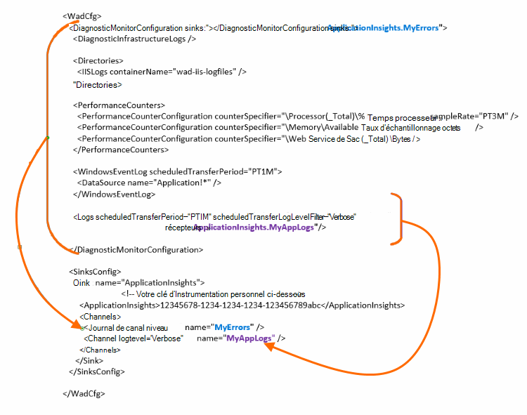

<properties
    pageTitle="Envoyer les journaux de Diagnostic Azure analyse des applications"
    description="Configurez les détails des journaux de diagnostic Azure Cloud Services qui sont envoyés au portail Application perspectives."
    services="application-insights"
    documentationCenter=".net"
    authors="sbtron"
    manager="douge"/>

<tags
    ms.service="application-insights"
    ms.workload="tbd"
    ms.tgt_pltfrm="ibiza"
    ms.devlang="na"
    ms.topic="article"
    ms.date="11/17/2015"
    ms.author="awills"/>

# <a name="configure-azure-diagnostic-logging-to-application-insights"></a>Configurer la journalisation des diagnostics Azure analyse des applications

Lorsque vous configurez un projet de Services Cloud ou une Machine virtuelle dans Microsoft Azure [Azure peut générer un journal de diagnostic](../vs-azure-tools-diagnostics-for-cloud-services-and-virtual-machines.md). Vous pouvez avoir est envoyé analyse de l’Application de sorte que vous pouvez les analyser ainsi que de diagnostic et l’utilisation de télémétrie envoyé à partir de l’application par le Kit de développement de perspectives Application. Le journal Azure inclut les événements de la gestion de l’application comme Démarrer, arrêter, se bloque, ainsi que des compteurs de performance. Le journal inclut également des appels dans l’application à System.Diagnostics.Trace.

Cet article décrit la configuration de la capture des diagnostics en détail.

Vous devez Azure SDK 2,8 installé dans Visual Studio.

## <a name="get-an-application-insights-resource"></a>Obtenir une ressource d’Application perspectives

Pour la meilleure expérience, [Ajouter l’Application Insights SDK à chaque rôle de votre application de Services en nuage](app-insights-cloudservices.md)ou [à quelle application vous exécuterez dans votre machine virtuelle](app-insights-overview.md). Vous pouvez puis envoyer les données de diagnostic à analyser et affiche la même ressource Application perspectives.

Par ailleurs, si vous ne voulez pas utiliser le Kit de développement - par exemple, si l’application est déjà live – vous pouvez seulement [créer une nouvelle ressource Application Insights](app-insights-create-new-resource.md) dans le portail Azure. Sélectionnez **Diagnostics Azure** en tant que le type d’application.


## <a name="send-azure-diagnostics-to-application-insights"></a>Envoyer les diagnostics de Windows Azure Application analyse

Si vous parvenez à mettre à jour votre projet de l’application, puis dans Visual Studio sélectionnez chaque rôle, choisissez ses propriétés et dans l’onglet Configuration, sélectionnez **Envoyer des diagnostics analyse de l’Application**.

Si votre application est déjà live, utilisez Explorateur de serveurs ou de Services Cloud l’Explorateur de Visual Studio pour ouvrir les propriétés de l’application. Sélectionnez **Envoyer des diagnostics analyse de l’Application**.

Dans tous les cas, vous serez invité pour obtenir des informations de la ressource d’analyse de l’Application que vous avez créé.

[En savoir plus sur la configuration des perspectives d’Application pour une application de Services Cloud](app-insights-cloudservices.md).

## <a name="configuring-the-azure-diagnostics-adapter"></a>Configuration de la carte diagnostics de Windows Azure

Lisez la suite uniquement si vous souhaitez sélectionner les parties du journal que vous envoyez analyse de l’Application. Par défaut, tout le contenu est envoyé, y compris : événements Microsoft Azure ; compteurs de performance ; suivi des appels de l’application à System.Diagnostics.Trace.

Diagnostics de Windows Azure stocke les données dans les tables de stockage Azure. Toutefois, vous pouvez également toutes les barre verticale ou un sous-ensemble de données d’analyse de l’Application en configurant des « récepteurs » et « canaux » dans votre configuration lors de l’utilisation d’extension Azure Diagnostics 1.5 ou version ultérieure.

### <a name="configure-application-insights-as-a-sink"></a>Configurer des perspectives Application comme un récepteur

Lorsque vous utilisez les propriétés de rôle pour définir « Envoyer les données Application analyse », le Kit de développement Azure (2,8 ou version ultérieure) ajoute un `<SinksConfig>` élément vers le [fichier de configuration de Diagnostics Azure](https://msdn.microsoft.com/library/azure/dn782207.aspx) public du rôle.

`<SinksConfig>`définit le récepteur supplémentaire dans lequel les données Azure diagnostics peuvent être envoyées.  Exemple `SinksConfig` ressemble à ceci :

```xml

    <SinksConfig>
     <Sink name="ApplicationInsights">
      <ApplicationInsights>{Insert InstrumentationKey}</ApplicationInsights>
      <Channels>
        <Channel logLevel="Error" name="MyTopDiagData"  />
        <Channel logLevel="Verbose" name="MyLogData"  />
      </Channels>
     </Sink>
    </SinksConfig>

```

La `ApplicationInsights` élément spécifie la clé d’instrumentation qui identifie la ressource Application Insights dans lequel les données de diagnostic Azure seront envoyées. Lorsque vous sélectionnez la ressource, il est rempli automatiquement selon la `APPINSIGHTS_INSTRUMENTATIONKEY` configuration du service. (Si vous voulez définir manuellement, obtenir la clé dans la liste déroulante Essentials de la ressource).

`Channels`définir les données qui seront envoyées au récepteur. Le canal se comporte comme un filtre. La `loglevel` attribut vous permet de spécifier le niveau de journalisation qui envoie le canal. Les valeurs disponibles sont : `{Verbose, Information, Warning, Error, Critical}`.

### <a name="send-data-to-the-sink"></a>Envoyer des données vers le récepteur

Envoyer des données de l’analyse des applications récepteur en ajoutant l’attribut récepteurs sous le nœud DiagnosticMonitorConfiguration. Ajout de l’élément récepteurs à chaque nœud indique que les données collectées à partir de ce nœud et n’importe quel nœud sous envoi au récepteur spécifié.

Par exemple, la valeur par défaut créé par le Kit de développement Azure consiste à envoyer toutes les données de diagnostics Azure :

```xml

    <DiagnosticMonitorConfiguration overallQuotaInMB="4096" sinks="ApplicationInsights">
```

Mais si vous souhaitez envoyer uniquement les journaux d’erreurs, qualifier le nom de récepteur avec un nom de canal :

```xml

    <DiagnosticMonitorConfiguration overallQuotaInMB="4096" sinks="ApplicationInsights.MyTopDiagdata">
```

Notez que nous utilisons le nom du récepteur que nous avons définie, ainsi que le nom d’un canal que nous avons définie ci-dessus.

Si vous voulez uniquement envoyer les journaux d’application détaillée analyse de l’Application, puis vous ajouterez l’attribut récepteurs à la `Logs` nœud.

```xml

    <Logs scheduledTransferPeriod="PT1M" scheduledTransferLogLevelFilter="Verbose" sinks="ApplicationInsights.MyLogData"/>
```

Vous pouvez également inclure plusieurs récepteurs dans la configuration à différents niveaux dans la hiérarchie. Dans ce cas le récepteur spécifié au niveau supérieur de la hiérarchie sert un paramètre global et celle spécifiée à l’élément individuel élément comportements comme une substitution ce paramètre global.

Voici un exemple complet du fichier de configuration public qui envoie toutes les erreurs analyse de l’Application (spécifié en la `DiagnosticMonitorConfiguration` nœud) et un niveau plus détaillé ouvre pour les journaux des applications (spécifiées à la `Logs` nœud).

```xml

    <WadCfg>
     <DiagnosticMonitorConfiguration overallQuotaInMB="4096"
       sinks="ApplicationInsights.MyTopDiagData"> <!-- All info below sent to this channel -->
      <DiagnosticInfrastructureLogs />
      <PerformanceCounters>
        <PerformanceCounterConfiguration counterSpecifier="\Processor(_Total)\% Processor Time" sampleRate="PT3M" sinks="ApplicationInsights.MyLogData/>
        <PerformanceCounterConfiguration counterSpecifier="\Memory\Available MBytes" sampleRate="PT3M" />
        <PerformanceCounterConfiguration counterSpecifier="\Web Service(_Total)\Bytes Total/Sec" sampleRate="PT3M" />
      </PerformanceCounters>
      <WindowsEventLog scheduledTransferPeriod="PT1M">
        <DataSource name="Application!*" />
      </WindowsEventLog>
      <Logs scheduledTransferPeriod="PT1M" scheduledTransferLogLevelFilter="Verbose"
            sinks="ApplicationInsights.MyLogData"/>
       <!-- This specific info sent to this channel -->
     </DiagnosticMonitorConfiguration>

     <SinksConfig>
      <Sink name="ApplicationInsights">
        <ApplicationInsights>{Insert InstrumentationKey}</ApplicationInsights>
        <Channels>
          <Channel logLevel="Error" name="MyTopDiagData"  />
          <Channel logLevel="Verbose" name="MyLogData"  />
        </Channels>
      </Sink>
     </SinksConfig>
    </WadCfg>
```



Il existe certaines limitations importantes de cette fonctionnalité :

* Canaux constituent uniquement pour l’utiliser avec pas les compteurs de performance et de type journal. Si vous spécifiez un canal avec un élément de compteur de performances que sont ignorée.
* Le niveau de journalisation pour un canal ne peut pas dépasser le niveau de journalisation pour ce qui est collecté par les diagnostics de Windows Azure. Par exemple : vous ne pouvez pas recueillir les erreurs dans le journal de l’Application dans l’élément journaux et tentent d’envoyer des commentaires les fichiers journaux à la synchronisation d’aperçu de l’Application. L’attribut scheduledTransferLogLevelFilter doit toujours collecter égale ou plus de journaux que les journaux que vous essayez d’envoyer à un récepteur.
* Impossible d’envoyer des données blob collectées par extension diagnostics de Windows Azure analyse de l’Application. Par exemple rien spécifiée sous le nœud répertoires. Pour blocage exporte le vidage réel sera toujours envoyé aux stockage blob et uniquement une notification que le vidage a été généré sera envoyée aux analyses de l’Application.

## <a name="related-topics"></a>Rubriques connexes

* [Analyse des Services Cloud Azure avec des aperçus d’Application](app-insights-cloudservices.md)
* [Utilisation de PowerShell pour envoyer les diagnostics de Windows Azure Application analyse](app-insights-powershell-azure-diagnostics.md)
* [Fichier de Configuration de Diagnostics Azure](https://msdn.microsoft.com/library/azure/dn782207.aspx)
