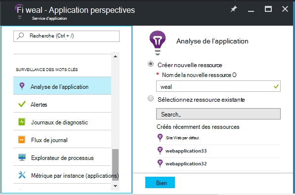
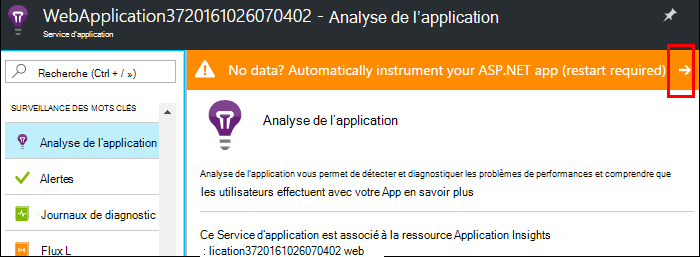
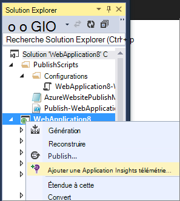
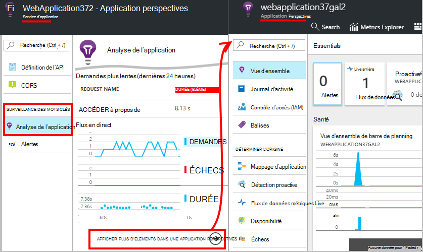
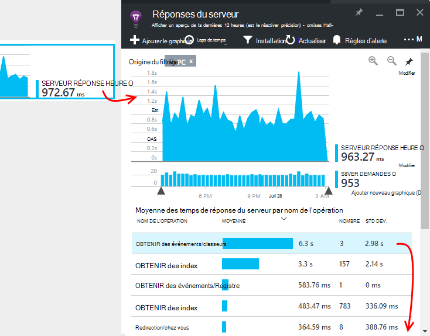
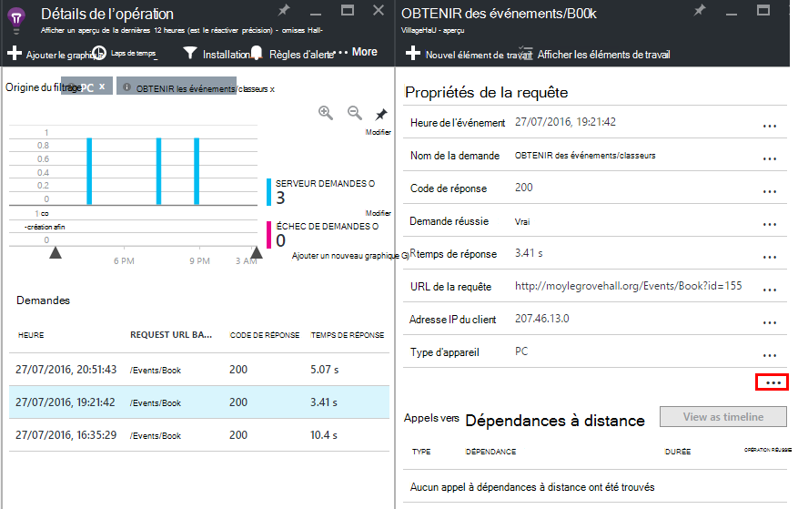

<properties
    pageTitle="Surveiller les performances de l’application web Azure | Microsoft Azure"
    description="Performances de l’application de surveillance pour les applications web Azure. Temps de chargement et de réponse, les informations de dépendance et définir des alertes sur les performances du graphique."
    services="application-insights"
    documentationCenter=".net"
    authors="alancameronwills"
    manager="douge"/>

<tags
    ms.service="azure-portal"
    ms.workload="na"
    ms.tgt_pltfrm="na"
    ms.devlang="na"
    ms.topic="article"
    ms.date="10/24/2016"
    ms.author="awills"/>

# Surveiller les performances de l’application web Azure

Dans le [Portail Azure](https://portal.azure.com) , vous pouvez configurer application analyse des performances pour vos [applications web Azure](../app-service-web/app-service-web-overview.md). [Visual Studio Application Insights](app-insights-overview.md) instruments votre application pour envoyer télémétrie relatives à ses activités au service Application perspectives, où il est stocké et analysée. Il, graphiques métriques et outils de recherche peuvent servir afin de diagnostiquer les problèmes, améliorer les performances et évaluer l’utilisation.

## Temps d’exécution ou l’heure de création

Vous pouvez configurer l’analyse l’instrumentation de l’application de deux façons :

* **Exécution** : vous pouvez sélectionner une extension de performance lors de votre application web est déjà en ligne. Il n’est pas nécessaire de recréer ou de réinstaller votre application. Vous obtenez un jeu standard de packages qui contrôlent les temps de réponse, taux de réussite, exceptions, dépendances et ainsi de suite. 
 
* **Heure de création** - vous pouvez installer un package dans votre application de développement. Cette option n’est plus polyvalente. Outre les mêmes packages standards, vous pouvez écrire du code pour personnaliser la télémétrie ou pour envoyer vos propres télémétrie. Vous pouvez vous connecter des activités spécifiques ou enregistrer des événements en fonction de la sémantique de votre domaine d’application. 

## Exécuter instrumentation heure avec des aperçus d’Application

Si vous exécutez déjà une application web dans Azure, vous obtenez déjà certains surveillance : taux de demande et d’erreur. Ajouter des perspectives d’Application pour tirer le meilleur, tels que des temps de réponse, surveillance des appels de dépendances, des détection intelligente et l’Analytique puissant langage de requête. 

1. **Sélectionnez Application Insights** dans le panneau Azure pour votre application web.

    

 * Choisir de créer une nouvelle ressource, sauf si vous déjà configuré une ressource d’Application perspectives pour cette application par un autre itinéraire.

2. **Instrument votre application web** après l’installation d’analyse de l’Application. 

    

3. **Surveiller votre application**.  [Expore les données](#explore-the-data).

Plus tard, vous pouvez générer et redéployez l’application avec des aperçus de l’Application si vous voulez.

*Comment supprimer des perspectives d’Application, ou passez à l’envoi vers une autre ressource ?*

* Dans Azure, ouvrez la carte de contrôle de l’application web, puis sous Outils de développement, ouvrir **les Extensions**. Supprimez l’extension Application perspectives. Puis sous analyse, cliquez sur analyse de l’Application et créer ou sélectionner la ressource souhaitée.

## Créer l’application avec des aperçus d’Application

Analyse des applications peut fournir télémétrie plus détaillée en installant un SDK dans votre application. En particulier, vous pouvez collecter les journaux de suivi, [écrire télémétrie personnalisé](../application-insights/app-insights-api-custom-events-metrics.md)et obtenir des rapports d’exception plus détaillées.

1. **Dans Visual Studio** (mise à jour 2013 2 ou version ultérieure), ajoutez le Kit de développement de perspectives Application à votre projet.

    

    Si vous êtes invité à se connecter, utilisez les informations d’identification pour votre compte Azure.

    L’opération a deux effets :

 1. Crée une ressource d’Application Insights dans Azure, où télémétrie est stockée, analysé et affiché.
 2. Ajoute le package d’Application Insights NuGet à votre code et configure afin d’envoyer de télémétrie à la ressource Azure.

2. **Tester la télémétrie** en exécutant l’application sur votre ordinateur de développement (F5).

3. **Publier l’application** sur Azure de la manière habituelle. 

*Comment passer à l’envoi vers une autre ressource Insights Application ?*

* Dans Visual Studio, le projet avec le bouton droit, sélectionnez **Application Insights > configurer** et choisissez la ressource souhaitée. Vous obtenez l’option pour créer une nouvelle ressource. Reconstruire et redéployez.

## Explorer les données

1. Sur la cuillère Insights Application du Panneau de configuration web app, vous voyez métriques Live, qui affiche les demandes et les échecs dans une seconde ou deux d'entre eux se produisant. Il est très utile affichage lorsque vous êtes republier votre application, vous pouvez immédiatement voir les problèmes.

2. Cliquez pour la ressource Application analyse complète.

    
    

    Vous pouvez également y accéder directement à partir de navigation ressource Azure.

2. Cliquez dans un graphique quelconque pour obtenir plus en détail :

    

    Vous pouvez [Personnaliser les cartes indicateurs](../application-insights/app-insights-metrics-explorer.md).

3. Cliquez sur par le biais à la suite de voir des événements et leurs propriétés :

    

    Avez-vous remarqué la « … » toutes les propriétés s’ouvre.

    Vous pouvez [Personnaliser les recherches](../application-insights/app-insights-diagnostic-search.md).

Pour des recherches plus importants sur votre télémétrie, utilisez [langage de requête Analytique](../application-insights/app-insights-analytics-tour.md).

## Étapes suivantes

* [Activer Azure diagnostics](app-insights-azure-diagnostics.md) soient envoyées analyse de l’Application.
* [Mesures de fonctionnement du service Moniteur](../monitoring-and-diagnostics/insights-how-to-customize-monitoring.md) pour vous assurer que votre service n’est disponible et injoignable.
* [Recevoir des notifications alertes](../monitoring-and-diagnostics/insights-receive-alert-notifications.md) chaque fois que les événements opérationnels se produisent ou métriques croisées un seuil.
* [Application perspectives pour applications JavaScript et les pages web](app-insights-web-track-usage.md) permet d’obtenir télémétrie client dans les navigateurs visitez une page web.
* [Configurer des tests de site web de disponibilité](app-insights-monitor-web-app-availability.md) pour être alerté si votre site est arrêté.
