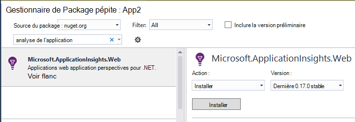

<properties
   pageTitle="Analyse des applications pour les Services en nuage Azure"
   description="Surveiller votre rôles web et collaborateur efficacement avec des aperçus de l’Application"
   services="application-insights"
   documentationCenter=""
   authors="soubhagyadash"
   manager="douge"
   editor="alancameronwills"/>

<tags
   ms.service="application-insights"
   ms.devlang="na"
   ms.tgt_pltfrm="ibiza"
   ms.topic="article"
   ms.workload="tbd"
   ms.date="03/02/2016"
   ms.author="sdash"/>

# <a name="application-insights-for-azure-cloud-services"></a>Analyse des applications pour les Services en nuage Azure


*Analyse de l’application est en mode Aperçu*

[Applications de service Microsoft Azure Cloud](https://azure.microsoft.com/services/cloud-services/) peuvent être analysées en [Visual Studio Application Insights] [ start] de disponibilité, les performances, les échecs et l’utilisation. Avec les commentaires que pouvez-vous sur les performances et l’efficacité de votre application dans la nature, vous pouvez rendre plusieurs choix pertinents sur l’orientation de la conception dans chaque cycle de vie de développement.


Vous avez besoin d’un abonnement avec [Microsoft Azure](http://azure.com). Connectez-vous à l’aide d’un compte Microsoft, vous devrez pour Windows, XBox Live ou d’autres services de cloud Microsoft. 


#### <a name="sample-application-instrumented-with-application-insights"></a>Exemple d’Application équipé d’analyse de l’Application

Jetez un coup de œil au niveau de cet [exemple d’application](https://github.com/Microsoft/ApplicationInsights-Home/tree/master/Samples/AzureEmailService) dans lequel Application Insights est ajouté à un service cloud avec deux rôles collaborateur hébergés dans Azure. 

Ce qui suit vous indique comment adapter votre propre projet de service cloud de la même façon.

## <a name="create-an-application-insights-resource-for-each-role"></a>Création d’une ressource d’Application perspectives pour chaque rôle

Une ressource d’analyse de l’Application est l’endroit où vos données de télémétrie seront analysées et affichées.  

1.  Dans le [portail Azure][portal], créez une nouvelle ressource Application perspectives. Pour type d’application, sélectionnez l’application ASP.NET. 

    

2.  Prendre une copie de la clé d’Instrumentation. Vous devez cette option peu de temps pour configurer le Kit de développement.

    


Il est généralement [recommandé créer une ressource distincte pour les données dans chaque rôle web et de travail](app-insights-separate-resources.md). 

Comme alternative, vous pouvez envoyer des données à partir de tous les rôles à une ressource, mais définir une [propriété par défaut] [ apidefaults] afin que vous pouvez filtrer ou regrouper les résultats de chaque rôle.

## <a name="sdk"></a>Installez le Kit de développement dans chaque projet


1. Dans Visual Studio, modifiez les packages NuGet de votre projet application cloud.

    


2. Pour les rôles web, ajoutez le package de NuGet [Perspectives d’Application pour le Web](http://www.nuget.org/packages/Microsoft.ApplicationInsights.Web) . Cette version du Kit de développement inclut des modules qui ajouter le contexte de serveur telles que les informations de rôle. Pour les rôles de travail, utilisez [Perspectives pour Windows serveurs d’applications](https://www.nuget.org/packages/Microsoft.ApplicationInsights.WindowsServer/).

    


3. Configurer le Kit de développement pour envoyer des données à la ressource Application perspectives.

    Définir la clé instrumentation comme un paramètre de configuration dans le fichier `ServiceConfiguration.Cloud.cscfg`. ([Exemples de code](https://github.com/Microsoft/ApplicationInsights-Home/blob/master/Samples/AzureEmailService/AzureEmailService/ServiceConfiguration.Cloud.cscfg)).
 
    ```XML
     <Role name="WorkerRoleA"> 
      <Setting name="APPINSIGHTS_INSTRUMENTATIONKEY" value="YOUR IKEY" /> 
     </Role>
    ```
 
    Dans une fonction de démarrage approprié, définissez la clé d’instrumentation à partir du paramètre de configuration :

    ```C#
     TelemetryConfiguration.Active.InstrumentationKey = RoleEnvironment.GetConfigurationSettingValue("APPINSIGHTS_INSTRUMENTATIONKEY");
    ```

    Remarque, cliquez avec le même nom `APPINSIGHTS_INSTRUMENTATIONKEY` de la configuration du paramètre sera utilisé par les Diagnostics Azure création de rapports. 


    Procédez comme suit pour chaque rôle dans votre application. Voir les exemples :
 
 * [Rôle Web](https://github.com/Microsoft/ApplicationInsights-Home/blob/master/Samples/AzureEmailService/MvcWebRole/Global.asax.cs#L27)
 * [Rôle de travail](https://github.com/Microsoft/ApplicationInsights-Home/blob/master/Samples/AzureEmailService/WorkerRoleA/WorkerRoleA.cs#L232)
 * [Pour les pages web](https://github.com/Microsoft/ApplicationInsights-Home/blob/master/Samples/AzureEmailService/MvcWebRole/Views/Shared/_Layout.cshtml#L13)   

4. Définir le fichier ApplicationInsights.config soit toujours copié vers le répertoire de sortie. 

    (Dans le fichier .config, vous verrez les messages vous demandant pour placer la clé instrumentation il. Toutefois, pour les applications cloud, il est préférable définir à partir du fichier .cscfg. Ainsi que le rôle est identifié correctement dans le portail).


#### <a name="run-and-publish-the-app"></a>Exécuter et publier l’application

Exécuter votre application, puis connectez-vous à Azure. Ouvrir les ressources d’analyse de l’Application que vous avez créé, et vous verrez des points de données individuels qui apparaissent dans la [recherche](app-insights-diagnostic-search.md)et agréger les données dans [l’Explorateur de métrique](app-insights-metrics-explorer.md). 

Ajouter plus de télémétrie - voir les sections ci-dessous -, puis publier votre application pour obtenir des commentaires de diagnostic et l’utilisation de live. 


#### <a name="no-data"></a>Aucune donnée ?

* Ouvrir la [recherche] [ diagnostic] vignette, pour afficher les événements individuels.
* Utiliser l’application, ouvrez différentes pages afin qu’il génère certaines télémétrie.
* Patientez quelques secondes, puis cliquez sur Actualiser.
* Voir [dépannage][qna].


## <a name="more-telemetry"></a>Télémétrie plus

Les sections ci-dessous montrent comment obtenir télémétrie supplémentaire à partir de différents aspects de votre application.


## <a name="track-requests-from-worker-roles"></a>Suivre les demandes de rôles de travail

Dans les rôles web, le module demandes recueille automatiquement les données relatives aux demandes HTTP. Voir l' [exemple MVCWebRole](https://github.com/Microsoft/ApplicationInsights-Home/tree/master/Samples/AzureEmailService/MvcWebRole) pour obtenir des exemples de la façon dont vous pouvez ignorer le comportement de la collection de sites par défaut. 

Vous pouvez capturer les performances des appels aux rôles de travail en effectuant le suivi dans la même façon que les demandes HTTP. Dans l’Application perspectives, le type de télémétrie demande mesure une unité de travail côté serveur nommé soit chronométré indépendamment vous réussir ou échouer. Tandis que les requêtes HTTP sont capturés automatiquement par le Kit de développement, vous pouvez insérer votre propre code pour effectuer le suivi des demandes aux rôles de travail.

Voir les deux rôles de travail exemple instrumentés aux demandes de rapport : [WorkerRoleA](https://github.com/Microsoft/ApplicationInsights-Home/tree/master/Samples/AzureEmailService/WorkerRoleA) et [WorkerRoleB](https://github.com/Microsoft/ApplicationInsights-Home/tree/master/Samples/AzureEmailService/WorkerRoleB)

## <a name="azure-diagnostics"></a>Diagnostics de Windows Azure

Données [Azure Diagnostics](../vs-azure-tools-diagnostics-for-cloud-services-and-virtual-machines.md) incluent les événements de gestion de rôle, des compteurs de performance et des journaux d’application. Vous pouvez avoir ces envoyés Application analyse afin que vous puissiez les voir en parallèle avec le reste de votre télémétrie, ce qui facilite la diagnostiquer les problèmes.

Diagnostics de Windows Azure sont particulièrement utiles si un rôle échoue de manière inattendue ou ne parvient pas à démarrer.

1. Avec le bouton droit le rôle (et non le projet !) pour ouvrir ses propriétés, puis sélectionnez **Activer les Diagnostics**, **Envoyer des diagnostics analyse de l’Application**.

    

    **Votre application est déjà publié et en cours d’exécution**, ouvrir Explorateur de serveurs ou par Explorer nuage, avec le bouton droit de votre application et sélectionnez l’option même.

3.  Sélectionnez la même ressource Application perspectives en tant que vos autres télémétrie.

    Si vous le souhaitez, vous pouvez définir une autre ressource dans les configurations de services différente (Cloud, Local) afin de séparer les données de développement de données en temps réel.

3. Vous pouvez également [exclure certains les diagnostics de Windows Azure](app-insights-azure-diagnostics.md) que vous souhaitez être transférés analyse de l’Application. La valeur par défaut est tout.

### <a name="view-azure-diagnostic-events"></a>Afficher les événements de diagnostics Azure

Où trouver les Diagnostics de vérification :

* Compteurs de performance sont affichées dans les indicateurs personnalisés. 
* Les journaux d’événements Windows apparaissent sous forme de traces et des événements personnalisés.
* Journaux d’application, les journaux ETW et des journaux d’infrastructure diagnostics s’affichent sous forme de traces.

Pour afficher des compteurs de performance et le nombre d’événements, ouvrez [L’Explorateur métriques](app-insights-metrics-explorer.md) et ajouter un nouveau graphique :


Utiliser [la recherche](app-insights-diagnostic-search.md) pour rechercher dans les journaux de suivi différents envoyés par Azure Diagnostics. Par exemple, si vous avez récemment une exception unhanded dans un rôle qui a provoqué le rôle à se bloquer et Corbeille, qu’informations seraient apparaissant dans l’Application canal de journal des événements Windows. Vous pouvez utiliser la fonctionnalité de recherche pour examiner l’erreur du journal des événements Windows et obtenir la trace de pile complète pour l’exception de ce qui vous permet de trouver la cause du problème.


## <a name="app-diagnostics"></a>Diagnostics d’application

Diagnostics de Windows Azure inclut automatiquement les entrées du journal que votre application génère à l’aide de System.Diagnostics.Trace. 

Mais si vous utilisez déjà les structures Log4N ou NLog, vous pouvez aussi [capturer leur journal][netlogs].

[Effectuer le suivi des événements personnalisés et indicateurs] [ api] dans client serveur ou les deux, pour en savoir plus sur les performances et l’utilisation de votre application.

## <a name="dependencies"></a>Dépendances

Application Insights SDK peuvent signaler appels votre application permet aux dépendances externes telles que des API REST et SQL Server. Cela vous permet de voir si une dépendance particulière est à l’origine réponses lentes ou défaillances.

Si votre application utilise .NET framework 4.6 ou version ultérieure, vous ne devez rien à faire. 

Dans le cas contraire, configurez le rôle de collaborateur/web avec l' [Application Insights Agent](app-insights-monitor-performance-live-website-now.md) également appelé « moniteur d’état ».

Pour utiliser l’Agent de perspectives Application avec vos rôles web/travail :

* Ajouter le dossier [AppInsightsAgent](https://github.com/Microsoft/ApplicationInsights-Home/tree/master/Samples/AzureEmailService/WorkerRoleA/AppInsightsAgent) et les deux fichiers dedans à vos projets de rôle web/concerné. Veillez à définir leurs propriétés build afin qu’ils sont toujours copiés dans le répertoire de sortie. Ces fichiers installent l’agent.
* Ajouter la tâche de démarrage dans le fichier CSDEF comme indiqué [ici](https://github.com/Microsoft/ApplicationInsights-Home/tree/master/Samples/AzureEmailService/AzureEmailService/ServiceDefinition.csdef#L18).
* Remarque : *Rôles de travail* requièrent trois variables d’environnement comme indiqué [ici](https://github.com/Microsoft/ApplicationInsights-Home/tree/master/Samples/AzureEmailService/AzureEmailService/ServiceDefinition.csdef#L44). Ce n’est pas obligatoire pour les rôles web.

### <a name="dependency-reports"></a>Rapports sur les dépendances

Voici un exemple de ce que vous voyez sur le portail d’analyse de l’Application :

* Diagnostics riches en corrélation automatiquement les demandes d’et dépendances :

    

* Performances du rôle web, avec les informations de dépendance :

    

* Voici une capture d’écran sur les requêtes et les informations sur les dépendances pour un rôle de collaborateur :

    

## <a name="exceptions"></a>Exceptions

Voir [Exceptions à la surveillance Application perspectives](app-insights-asp-net-exceptions.md) pour plus d’informations sur comment collecter des exceptions non gérées à partir de types d’applications web différent.

Le rôle web exemple a contrôleurs MVC5 et 2 de l’API Web. Les exceptions non gérées à partir de 2 sont capturées avec les éléments suivants :

* [AiHandleErrorAttribute](https://github.com/Microsoft/ApplicationInsights-Home/blob/master/Samples/AzureEmailService/MvcWebRole/Telemetry/AiHandleErrorAttribute.cs) configurer [ici](https://github.com/Microsoft/ApplicationInsights-Home/blob/master/Samples/AzureEmailService/MvcWebRole/App_Start/FilterConfig.cs#L12) pour contrôleurs MVC5
* [AiWebApiExceptionLogger](https://github.com/Microsoft/ApplicationInsights-Home/blob/master/Samples/AzureEmailService/MvcWebRole/Telemetry/AiWebApiExceptionLogger.cs) configurer [ici](https://github.com/Microsoft/ApplicationInsights-Home/blob/master/Samples/AzureEmailService/MvcWebRole/App_Start/WebApiConfig.cs#L25) pour contrôleurs Web API 2

Pour les rôles de travail, il existe deux façons d’effectuer le suivi des exceptions.

* TrackException(ex)
* Si vous avez ajouté le package de NuGet Insights Application trace récepteur, vous pouvez utiliser System.Diagnostics.Trace pour enregistrer les exceptions. [Exemple de code.](https://github.com/Microsoft/ApplicationInsights-Home/blob/master/Samples/AzureEmailService/WorkerRoleA/WorkerRoleA.cs#L107)

## <a name="performance-counters"></a>Compteurs de performance

Les compteurs suivants sont collectées par défaut :

    * \Process(??APP_WIN32_PROC??)\% temps processeur
    * \Memory\Available octets
    * \.NET CLR Exceptions(??APP_CLR_PROC??)\# d’exceptions levées / sec
    * \Processus ( ??. APP_WIN32_PROC ??) \Private octets
    * \Processus ( ??. APP_WIN32_PROC ??) Données \IO octets/s
    * \Processor(_Total)\% temps processeur

En outre, les éléments suivants sont également collectées pour les rôles web :

    * \ASP.NET applications ( ??. APP_W3SVC_PROC ??) \Requests/sec    
    * \ASP.NET applications ( ??. APP_W3SVC_PROC ??) Temps d’exécution \Request
    * \ASP.NET applications ( ??. APP_W3SVC_PROC ??) \Requests dans la file d’attente d’Application

Vous pouvez spécifier personnalisée supplémentaire ou autres compteurs de performance windows comme illustré [ici](https://github.com/Microsoft/ApplicationInsights-Home/blob/master/Samples/AzureEmailService/WorkerRoleA/ApplicationInsights.config#L14)

  

## <a name="correlated-telemetry-for-worker-roles"></a>Télémétrie en corrélation pour les rôles de travail

Il n’est une expérience de diagnostic enrichie, vous pouvez voir ce qui a conduit à une demande de latence élevée ou a échoué. Grâce aux rôles web, le Kit de développement configure automatiquement corrélation entre télémétrie connexe. Pour les rôles de travail, vous pouvez utiliser un initialiseur de télémétrie personnalisé pour définir un attribut de contexte Operation.Id courantes pour tous les télémétrie pour y parvenir. Cela vous permettra de voir si le problème de latence/échec a été dû en raison d’une dépendance ou votre code, en un clin de œil ! 

Voici comment :

* Définir l’Id de corrélation dans un CallContext comme indiqué [ici](https://github.com/Microsoft/ApplicationInsights-Home/blob/master/Samples/AzureEmailService/WorkerRoleA/WorkerRoleA.cs#L36). Dans ce cas, nous utilisons l’ID de demande comme l’id de corrélation
* Ajouter une mise en œuvre TelemetryInitializer personnalisée, qui définira la Operation.Id à l’ID de corrélation placée au-dessus. Illustré ici : [ItemCorrelationTelemetryInitializer](https://github.com/Microsoft/ApplicationInsights-Home/blob/master/Samples/AzureEmailService/WorkerRoleA/Telemetry/ItemCorrelationTelemetryInitializer.cs#L13)
* Ajouter l’initialiseur de télémétrie personnalisé. Vous pourriez le faire dans le fichier ApplicationInsights.config ou dans le code comme illustré [ici](https://github.com/Microsoft/ApplicationInsights-Home/blob/master/Samples/AzureEmailService/WorkerRoleA/WorkerRoleA.cs#L233)

Voilà ! L’utilisation du portail est déjà intégrée afin de mieux voir les télémétrie en un clin de œil :


## <a name="client-telemetry"></a>Télémétrie client

[Ajouter le SDK JavaScript à vos pages web] [ client] pour obtenir via un navigateur télémétrie tels que les comptes d’affichages de page, les temps de chargement de page, les exceptions de script et vous permettent d’écrire télémétrie personnalisé dans les scripts de votre page.

## <a name="availability-tests"></a>Tests de disponibilité

[Configurer des tests de site web] [ availability] pour vous assurer que votre application reste injoignable et en temps réel.


## <a name="example"></a>Exemple

[L’exemple](https://github.com/Microsoft/ApplicationInsights-Home/tree/master/Samples/AzureEmailService) surveille un service qui possède un rôle web et deux rôles de travail.

## <a name="exception-method-not-found-on-running-in-azure-cloud-services"></a>Exception « méthode non trouvé » sur l’exécution en Azure Cloud Services

Que vous créez pour .NET 4.6 ? 4.6 n’est pas pris en charge dans les rôles d’Azure Cloud Services automatiquement. [Installer 4.6 chaque rôle](../cloud-services/cloud-services-dotnet-install-dotnet.md) avant l’exécution de votre application.

## <a name="related-topics"></a>Rubriques connexes

* [Configuration d’envoi Azure Diagnostics analyse des applications](app-insights-azure-diagnostics.md)
* [Utilisation de PowerShell pour envoyer les diagnostics de Windows Azure Application analyse](app-insights-powershell-azure-diagnostics.md)


[api]: app-insights-api-custom-events-metrics.md
[apidefaults]: app-insights-api-custom-events-metrics.md#default-properties
[apidynamicikey]: app-insights-separate-resources.md#dynamic-ikey
[availability]: app-insights-monitor-web-app-availability.md
[azure]: app-insights-azure.md
[client]: app-insights-javascript.md
[diagnostic]: app-insights-diagnostic-search.md
[netlogs]: app-insights-asp-net-trace-logs.md
[portal]: http://portal.azure.com/
[qna]: app-insights-troubleshoot-faq.md
[redfield]: app-insights-monitor-performance-live-website-now.md
[start]: app-insights-overview.md 
