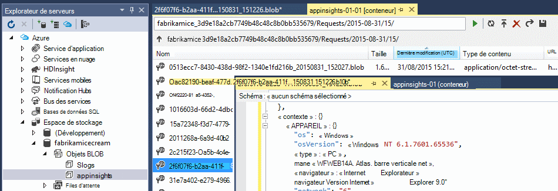

<properties 
    pageTitle="Procédure pas à pas : exporter télémétrie à base de données SQL à partir d’analyse de l’Application" 
    description="En permanence exportez Application Insights vers SQL à l’aide de flux de données Analytique." 
    services="application-insights" 
    documentationCenter=""
    authors="noamben" 
    manager="douge"/>

<tags 
    ms.service="application-insights" 
    ms.workload="tbd" 
    ms.tgt_pltfrm="ibiza" 
    ms.devlang="na" 
    ms.topic="article" 
    ms.date="03/06/2015" 
    ms.author="awills"/>
 
# <a name="walkthrough-export-to-sql-from-application-insights-using-stream-analytics"></a>Procédure pas à pas : Exporter vers SQL à partir de l’analyse des applications à l’aide de flux de données Analytique

Cet article vous explique comment déplacer vos données de télémétrie [d’Analyse des applications Visual Studio] [ start] dans une base de données SQL Azure à l’aide de [Exporter continue] [ export] et [Azure flux Analytique](https://azure.microsoft.com/services/stream-analytics/). 

Exportation continue déplace vos données de télémétrie dans le stockage Azure au format JSON. Nous allons analyser les objets JSON à l’aide d’Azure flux Analytique et créer des lignes dans une table de base de données.

(En règle générale, exporter continu est la façon d’effectuer votre propre analyse de la télémétrie vos applications envoyer analyse de l’Application. Vous pouvez adapter cet exemple de code pour effectuer d’autres actions avec la télémétrie exporté, telles que l’agrégation de données.)

Nous allons commencer par l’hypothèse que vous avez déjà l’application que vous voulez analyser.


Dans cet exemple, nous allons utiliser les données d’affichage de page, mais le même modèle peut être facilement étendu à d’autres types de données telles que des événements personnalisés et exceptions. 


## <a name="add-application-insights-to-your-application"></a>Ajouter des perspectives d’Application à votre application


Pour commencer :

1. [Configurer la Application perspectives pour vos pages web](app-insights-javascript.md). 

    (Dans cet exemple, nous allons nous concentrer sur le traitement des données de la page Afficher les navigateurs clients, mais vous pouvez également configurer aperçus d’Application pour le côté serveur de votre application [Java](app-insights-java-get-started.md) ou [ASP.NET](app-insights-asp-net.md) et traiter la demande, dépendance et d’autres télémétrie serveur.)


5. Publier votre application et surveiller les données de télémétrie figurant dans une ressource de votre Application perspectives.


## <a name="create-storage-in-azure"></a>Créer un stockage dans Azure

Exportation continue génère toujours des données à un compte de stockage Azure, vous devez tout d’abord créer le stockage.

1. Créer un compte de stockage dans votre abonnement dans le [portail Azure][portal].

    

2. Créer un conteneur

    

3. Copier la touche d’accès de stockage

    Vous en aurez besoin ultérieurement pour configurer l’entrée du service analytique flux.

    

## <a name="start-continuous-export-to-azure-storage"></a>Démarrer exportation continue au stockage Azure

1. Dans le portail Azure, accédez à la ressource Application Insights que vous avez créé pour votre application.

    

2. Créer une exportation continue.

    


    Sélectionnez le compte de stockage que vous avez créée :

    
    
    Définir les types d’événements que vous voulez voir :

    


3. Laisser certaines données s’accumuler. Réunir revenir et permettre aux utilisateurs d’utiliser votre application depuis un certain temps. Télémétrie arriveront et vous verrez graphiques statistiques dans [l’Explorateur de métriques](app-insights-metrics-explorer.md) et événements individuels de [recherche de diagnostic](app-insights-diagnostic-search.md). 

    Et également, d’exportation de données à votre espace de stockage. 

4. Inspecter le contenu exporté des données, dans le portail - cliquez sur **Parcourir**, sélectionnez votre compte de stockage, puis **conteneurs** - ou dans Visual Studio. Dans Visual Studio, choisissez **Afficher / Cloud Explorer**, puis ouvrez Azure / stockage. (Si vous n’avez pas cette option de menu, vous devez installer le Kit de développement Azure : ouvrir la boîte de dialogue Nouveau projet et ouvrez c# / Cloud / obtenir Microsoft Azure SDK pour .NET.)

    

    Prenez note de la partie du nom du chemin d’accès, qui est dérivée de la clé de nom et d’instrumentation application commune. 

Les événements sont écrits sur blob des fichiers au format JSON. Chaque fichier peut contenir un ou plusieurs événements. Si nous aimerions lire les données d’événement et filtrer les champs que nous voulons. Il existe toutes sortes de choses que nous pourrions faire avec les données, mais notre plan nous sommes aujourd'hui le flux Analytique permet de déplacer les données dans une base de données SQL. Qui fera simplifier l’exécution d’un nombre important de requêtes intéressantes.

## <a name="create-an-azure-sql-database"></a>Créer une base de données SQL Azure

Une nouvelle fois en commençant par votre abonnement dans [Azure portal][portal], créer la base de données (et un nouveau serveur, sauf si vous disposez déjà d’une) à laquelle vous allez écrire les données.


Vérifiez que le serveur de base de données permet d’accéder aux services Azure :


## <a name="create-a-table-in-azure-sql-db"></a>Créer une table dans la base de données SQL Azure

Se connecter à la base de données créé dans la section précédente avec votre outil de gestion préféré. Dans cette procédure, nous allons utiliser les [Outils de gestion de SQL Server](https://msdn.microsoft.com/ms174173.aspx) (SSMS).


Créer une nouvelle requête et exécutez le T-SQL suivante :

```SQL

CREATE TABLE [dbo].[PageViewsTable](
    [pageName] [nvarchar](max) NOT NULL,
    [viewCount] [int] NOT NULL,
    [url] [nvarchar](max) NULL,
    [urlDataPort] [int] NULL,
    [urlDataprotocol] [nvarchar](50) NULL,
    [urlDataHost] [nvarchar](50) NULL,
    [urlDataBase] [nvarchar](50) NULL,
    [urlDataHashTag] [nvarchar](max) NULL,
    [eventTime] [datetime] NOT NULL,
    [isSynthetic] [nvarchar](50) NULL,
    [deviceId] [nvarchar](50) NULL,
    [deviceType] [nvarchar](50) NULL,
    [os] [nvarchar](50) NULL,
    [osVersion] [nvarchar](50) NULL,
    [locale] [nvarchar](50) NULL,
    [userAgent] [nvarchar](max) NULL,
    [browser] [nvarchar](50) NULL,
    [browserVersion] [nvarchar](50) NULL,
    [screenResolution] [nvarchar](50) NULL,
    [sessionId] [nvarchar](max) NULL,
    [sessionIsFirst] [nvarchar](50) NULL,
    [clientIp] [nvarchar](50) NULL,
    [continent] [nvarchar](50) NULL,
    [country] [nvarchar](50) NULL,
    [province] [nvarchar](50) NULL,
    [city] [nvarchar](50) NULL
)

CREATE CLUSTERED INDEX [pvTblIdx] ON [dbo].[PageViewsTable]
(
    [eventTime] ASC
)WITH (PAD_INDEX = OFF, STATISTICS_NORECOMPUTE = OFF, SORT_IN_TEMPDB = OFF, DROP_EXISTING = OFF, ONLINE = OFF, ALLOW_ROW_LOCKS = ON, ALLOW_PAGE_LOCKS = ON)

```


Dans cet exemple, nous utilisons les données à partir des affichages de page. Pour afficher les données disponibles, inspecter votre sortie JSON et consultez les [Exporter le modèle de données](app-insights-export-data-model.md).

## <a name="create-an-azure-stream-analytics-instance"></a>Créer une instance Azure flux Analytique

À partir du [Portail Azure classique](https://manage.windowsazure.com/), sélectionnez le service Azure flux Analytique et créez une nouvelle tâche de flux de données Analytique :


Lors de la création de la tâche, développer les détails :


#### <a name="set-blob-location"></a>Définir l’emplacement blob

Configurer à partir de votre blob exporter continue :


Désormais, vous devez la clé primaire Access à partir de votre compte de stockage, vous avez noté précédemment. Définir en tant que la clé de compte de stockage.


#### <a name="set-path-prefix-pattern"></a>Modèle de préfixe défini chemin d’accès 


Veillez à définir le Format de Date à **AAAA-MM-JJ** (avec **tirets**).

Le modèle de préfixe chemin d’accès spécifie comment flux Analytique recherche les fichiers d’entrée dans le stockage. Vous devez le configurer pour qu’elles correspondent à exporter continue le stockage des données. Définissez-le comme suit :

    webapplication27_12345678123412341234123456789abcdef0/PageViews/{date}/{time}

Dans cet exemple :

* `webapplication27`est le nom de la ressource Application perspectives, **tout en minuscules**. 
* `1234...`est la clé d’instrumentation de l’Application Insights ressource **avec tirets supprimés**. 
* `PageViews`est le type de données nous à analyser. Les types disponibles varient selon le filtre que vous définissez dans exporter continue. Examiner les données exportées pour afficher d’autres types disponibles et voir les [Exporter le modèle de données](app-insights-export-data-model.md).
* `/{date}/{time}`un motif écrit littéralement.

Pour obtenir le nom et l’iKey de la ressource de perspectives de l’Application, ouvrez Essentials sur sa page Vue d’ensemble, ou paramètres.

#### <a name="finish-initial-setup"></a>Terminer la configuration initiale

Confirmez le format de sérialisation :


Fermez l’Assistant et attendez la configuration terminer.

>[AZURE.TIP] Utilisez l’exemple de fonction pour vérifier que vous avez défini le chemin d’accès d’entrée correctement. En cas d’échec : vérifier qu’il existe des données dans l’espace de stockage pour la plage horaire exemple vous avez choisi. Modifiez la définition d’entrée et vérification de définir le compte de stockage, le préfixe chemin d’accès et de format de date correctement.

## <a name="set-query"></a>Jeu de requête

Ouvrez la section requête :


Remplacer la requête par défaut avec :

```SQL

    SELECT flat.ArrayValue.name as pageName
    , flat.ArrayValue.count as viewCount
    , flat.ArrayValue.url as url
    , flat.ArrayValue.urlData.port as urlDataPort
    , flat.ArrayValue.urlData.protocol as urlDataprotocol
    , flat.ArrayValue.urlData.host as urlDataHost
    , flat.ArrayValue.urlData.base as urlDataBase
    , flat.ArrayValue.urlData.hashTag as urlDataHashTag
      ,A.context.data.eventTime as eventTime
      ,A.context.data.isSynthetic as isSynthetic
      ,A.context.device.id as deviceId
      ,A.context.device.type as deviceType
      ,A.context.device.os as os
      ,A.context.device.osVersion as osVersion
      ,A.context.device.locale as locale
      ,A.context.device.userAgent as userAgent
      ,A.context.device.browser as browser
      ,A.context.device.browserVersion as browserVersion
      ,A.context.device.screenResolution.value as screenResolution
      ,A.context.session.id as sessionId
      ,A.context.session.isFirst as sessionIsFirst
      ,A.context.location.clientip as clientIp
      ,A.context.location.continent as continent
      ,A.context.location.country as country
      ,A.context.location.province as province
      ,A.context.location.city as city
    INTO
      AIOutput
    FROM AIinput A
    CROSS APPLY GetElements(A.[view]) as flat


```

Notez que les premières certaines propriétés sont spécifiques à afficher les données de page. Exportations d’autres types de télémétrie ont des propriétés différentes. Voir la [référence de modèle de données pour les types de propriétés et les valeurs détaillée.](app-insights-export-data-model.md)

## <a name="set-up-output-to-database"></a>Configurer la sortie à base de données

Sélectionnez SQL comme sortie.


Spécifiez la base de données SQL.


Fermez l’Assistant et attendez une notification indiquant que la sortie a été définie.

## <a name="start-processing"></a>Démarrer le traitement

Démarrer la tâche à partir de la barre d’action :


Vous pouvez choisir d’afficher lancer le traitement des données à partir de maintenant, ou des données d’origine antérieures. Ce dernier est utile si vous avez eu continue exporter en cours d’exécution depuis un certain temps.


Après quelques minutes, revenez aux outils de gestion de SQL Server et regarder les données s’étalant dans. Par exemple, utilisez une requête comme suit :

    SELECT TOP 100 *
    FROM [dbo].[PageViewsTable]


## <a name="related-articles"></a>Articles connexes

* [Exporter vers SQL à l’aide d’un rôle de collaborateur](app-insights-code-sample-export-telemetry-sql-database.md)
* [Exporter vers PowerBI à l’aide de flux de données Analytique](app-insights-export-power-bi.md)
* [Référence pour les types de propriétés et les valeurs de modèle de données détaillées.](app-insights-export-data-model.md)
* [Exportation continue dans perspectives d’Application](app-insights-export-telemetry.md)
* [Analyse de l’application](https://azure.microsoft.com/services/application-insights/)

<!--Link references-->

[diagnostic]: app-insights-diagnostic-search.md
[export]: app-insights-export-telemetry.md
[metrics]: app-insights-metrics-explorer.md
[portal]: http://portal.azure.com/
[start]: app-insights-overview.md

 