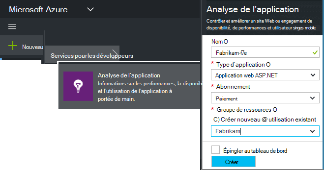
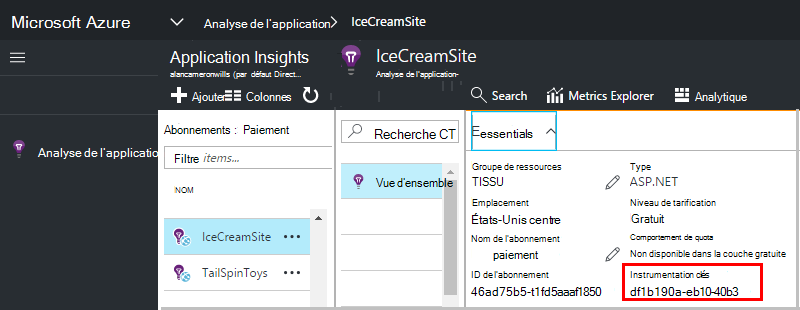

<properties 
    pageTitle="Créer une nouvelle ressource Application Insights | Microsoft Azure" 
    description="Définir des perspectives Application d’analyse pour une nouvelle application live. Approche basée sur le Web." 
    services="application-insights" 
    documentationCenter=""
    authors="alancameronwills" 
    manager="douge"/>

<tags 
    ms.service="application-insights" 
    ms.workload="tbd" 
    ms.tgt_pltfrm="ibiza" 
    ms.devlang="na" 
    ms.topic="article" 
    ms.date="08/26/2016" 
    ms.author="awills"/>

# Création d’une ressource d’Application perspectives

Visual Studio Application Insights affiche les données relatives à votre application dans une *ressource*de Microsoft Azure. Création d’une ressource est donc partie de [la configuration d’analyse des applications à surveiller une nouvelle application][start]. Dans de nombreux cas, cela automatiquement par l’IDE, et qui est recommandée où il est disponible. Mais dans certains cas, vous créez une ressource manuellement.

Après avoir créé la ressource, vous recevez sa clé instrumentation et l’utiliser pour configurer le Kit de développement de l’application. Envoie la télémétrie à la ressource.

## S’inscrire à Microsoft Azure

Si vous n’avez pas obtenu un [Microsoft compte, créez-en une](http://live.com). (Si vous utilisez des services, tels que Outlook.com, OneDrive, Windows Phone ou XBox Live, vous possédez déjà un compte Microsoft.)

Vous devez également un abonnement à [Microsoft Azure](http://azure.com). Si votre équipe ou organisation dispose d’un abonnement Azure, le propriétaire peut vous ajouter au, à l’aide de votre identifiant Windows Live ID.

Ou vous pouvez créer un nouvel abonnement. Le compte gratuit vous permet d’essayer tout Azure. Après l’expiration de la période d’évaluation, vous pouvez trouver l’abonnement paiement approprié, comme vous ne payer gratuitement services. 

Lorsque vous avez accès à un abonnement, connexion analyse de l’Application en [http://portal.azure.com](https://portal.azure.com)et utilisez votre identifiant Live ID pour vous connecter.

## Création d’une ressource d’Application perspectives
  

Dans la [portal.azure.com](https://portal.azure.com), ajoutez une ressource d’analyse de l’Application :

* **Type d’application** affecte ce que vous voyez sur la carte de présentation et les propriétés disponibles dans [l’Explorateur métrique][metrics]. Si vous ne voyez pas votre type d’application, choisissez ASP.NET.
* **Groupe de ressources** est plus pratique pour gérer les propriétés telles que le contrôle d’accès. Si vous avez déjà créé d’autres ressources Azure, vous pouvez choisir de placer cette nouvelle ressource dans le même groupe.
* **Abonnement** est votre compte de paiement dans Azure.
* **Emplacement** est l’endroit où nous conserver vos données. Actuellement il ne peut pas être modifié.
* **Ajouter à la startboard** place une vignette d’accès rapide pour la ressource dans votre page accueil Azure. Recommandé.

Lorsque votre application a été créée, une nouvelle carte s’ouvre. Il s’agit de l’endroit où vous verrez performances et données d’utilisation sur votre application. 

Pour obtenir précédent lui au prochain votre connexion à Azure, regardez de mosaïque de démarrage rapide de votre application sur le forum de début (écran d’accueil). Ou cliquez sur Parcourir pour le rechercher.

## Copiez la clé d’instrumentation

La clé d’instrumentation identifie la ressource que vous avez créé. Vous en aurez besoin pour donner au SDK.

## Installez le Kit de développement dans votre application

Installer l’Application Insights SDK dans votre application. Cette étape dépend fortement du type de votre application. 

Utilisez la touche instrumentation pour configurer [le Kit de développement logiciel que vous installez dans votre application][start].

Le Kit de développement inclut des modules standard qui envoient télémétrie sans avoir à écrire du code. Pour suivre les actions de l’utilisateur ou diagnostiquer les problèmes plus en détail, [Utilisez l’API] [ api] pour envoyer votre propre télémétrie.

## Afficher les données de télémétrie

Fermer la carte de démarrage rapide pour revenir à votre carte d’application dans le portail Azure.

Cliquez sur la vignette de recherche pour afficher les [Diagnostics de recherche][diagnostic], où les premiers événements seront affichent. 

Si vous attendez plus de données, cliquez sur Actualiser après quelques secondes.

## Création automatique d’une ressource

Vous pouvez écrire un [script PowerShell](app-insights-powershell-script-create-resource.md) pour créer automatiquement une ressource.

## Étapes suivantes

* [Créer un tableau de bord](app-insights-dashboards.md)
* [Recherche des Diagnostics](app-insights-diagnostic-search.md)
* [Explorer des indicateurs](app-insights-metrics-explorer.md)
* [Écrire des requêtes Analytique](app-insights-analytics.md)

<!--Link references-->

[api]: app-insights-api-custom-events-metrics.md
[diagnostic]: app-insights-diagnostic-search.md
[metrics]: app-insights-metrics-explorer.md
[start]: app-insights-overview.md

 