<properties
    pageTitle="Tableaux de bord et navigation dans le portail d’Application Insights | Microsoft Azure"
    description="Créer des vues de vos graphiques APM clés et les requêtes."
    services="application-insights"
    documentationCenter=""
    authors="alancameronwills"
    manager="douge"/>

<tags
    ms.service="application-insights"
    ms.workload="tbd"
    ms.tgt_pltfrm="ibiza"
    ms.devlang="multiple"
    ms.topic="article" 
    ms.date="10/18/2016"
    ms.author="awills"/>

# Navigation et tableaux de bord dans le portail d’analyse de l’Application

Une fois que vous avez [configuré Insights d’Application sur votre projet](app-insights-overview.md), les données de télémétrie sur les performances et l’utilisation de votre application seront affichent dans une ressource de perspectives de l’Application de votre projet dans le [portail Azure](https://portal.azure.com).

## Rechercher votre télémétrie

Connectez-vous au [portail Azure](https://portal.azure.com) et accédez à la ressource d’analyse de l’Application que vous avez créé pour votre application.

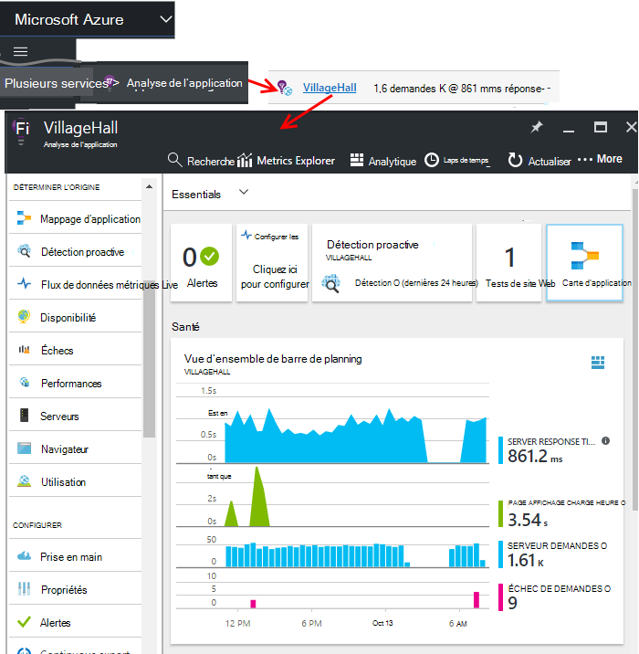

La carte de présentation (page) pour votre application affiche un résumé des mesures de diagnostics clés de votre application et est une passerelle vers les autres fonctionnalités du portail.

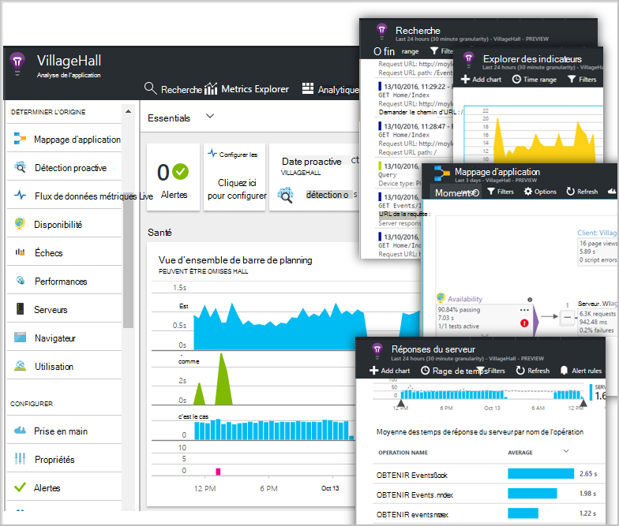

Vous pouvez personnaliser tous les autres graphiques et les épingler à un tableau de bord. De cette façon, vous pouvez rassembler les graphiques touches issues de différentes applications.

## Tableaux de bord

La première chose que vous voyez lorsque vous êtes connecté au [portail Microsoft Azure](https://portal.azure.com) est un tableau de bord. Ici vous pouvez rassembler les graphiques qui sont plus importants au sein de toutes vos ressources Azure, notamment de télémétrie de [Visual Studio Application perspectives](app-insights-overview.md).
 

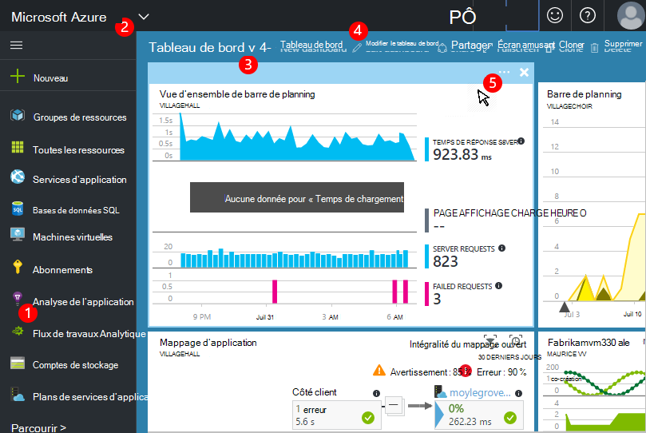

1. **Naviguez jusqu’au groupe des ressources spécifiques** telles que votre application dans l’Application Insights : utilisez la barre de gauche.
2. **Revenez au tableau de bord en cours**, ou pour accéder à d’autres affichages récentes : utilisez le menu déroulant en haut à gauche.
3. **Tableaux de bord commutateur**: utiliser le menu déroulant sur le titre du tableau de bord
4. **Créer, modifier et partager des tableaux de bord** dans la barre d’outils de tableau de bord.
5. **Modifier le tableau de bord**: pointez sur une vignette, puis utilisez sa barre supérieure à déplacer, personnaliser ou supprimez-le.

## Ajouter un tableau de bord

Lorsque vous cherchez à une carte ou un ensemble de graphiques qui est particulièrement intéressant, vous pouvez épingler une copie de celui-ci au tableau de bord. Vous le verrez prochaine fois que vous y retourne.

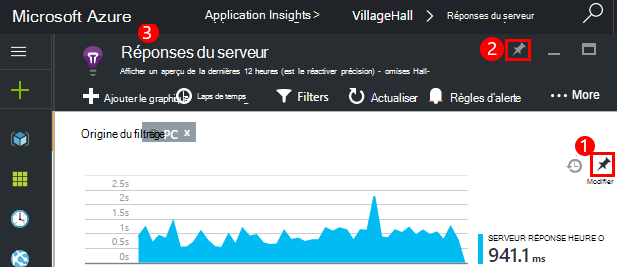

1. Graphique de code confidentiel au tableau de bord. Une copie du graphique s’affiche dans le tableau de bord.
2. Épinglez la carte entière au tableau de bord - il apparaît dans le tableau de bord sous la forme d’une vignette que vous pouvez cliquer sur via.
3. Cliquez sur le coin supérieur gauche pour revenir au tableau de bord actuel. Ensuite, vous pouvez utiliser le menu déroulant pour revenir à l’affichage actuel.

Notez que les graphiques sont regroupées en vignettes : une vignette peut contenir plusieurs graphiques. Vous épinglez la vignette entier au tableau de bord.

### Épingler une requête en Analytique

Vous pouvez également [épingler Analytique](app-insights-analytics-using.md#pin-to-dashboard) graphiques pour un tableau de bord [partagé](#share-dashboards-with-your-team) . Cela vous permet d’ajouter des graphiques de toutes les requêtes arbitraire en parallèle avec les mesures standard. (Il y a une charge de cette fonctionnalité.)

## Ajuster une vignette dans le tableau de bord

Une fois une vignette sur le tableau de bord, vous pouvez la modifier.

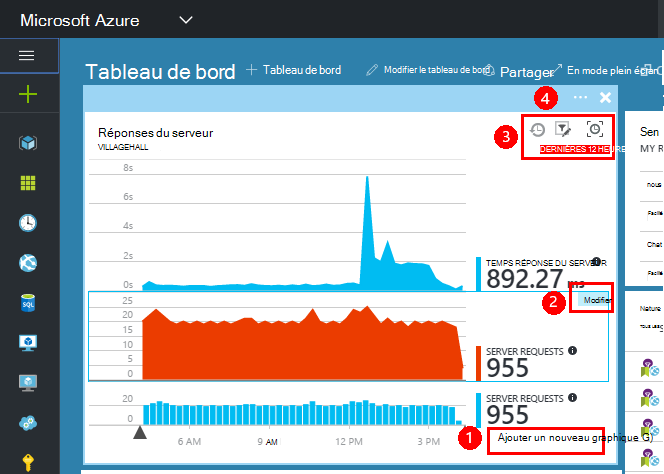

1. Ajouter un graphique à la vignette. 
2. Définir la métrique, group by dimension et le style (table, graph) d’un graphique.
3. Faites glisser sur le diagramme pour effectuer un zoom dans ; Cliquez sur le bouton Annuler pour rétablir la période ; définir les propriétés de filtre pour les graphiques sur la vignette.
4. Définir le titre de la vignette.

Vignettes épinglées à partir de cartes explorer métrique offrent davantage d’options édition que les vignettes épinglées à partir d’une carte de vue d’ensemble.

La vignette d’origine que vous épinglés n’est pas affectée par vos modifications.

## Basculer entre les tableaux de bord

Vous pouvez enregistrer plusieurs tableaux de bord et basculer entre elles. Lorsque vous épinglez un graphique ou une carte, elles sont ajoutées au tableau de bord en cours.

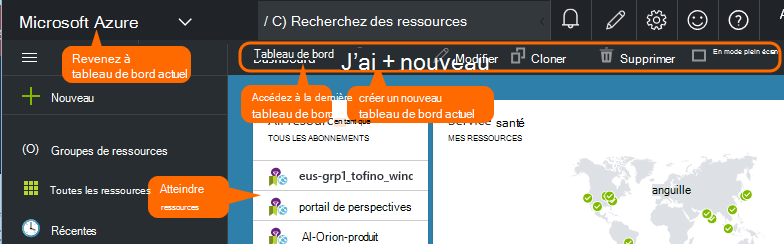

Vous devrez, par exemple, un tableau de bord pour l’affichage en mode plein écran dans la salle de réunion et l’autre pour du développement général.

Dans le tableau de bord, une carte apparaît sous la forme d’une vignette : cliquez dessus pour accéder à la carte. Un graphique réplique le graphique dans son emplacement d’origine.

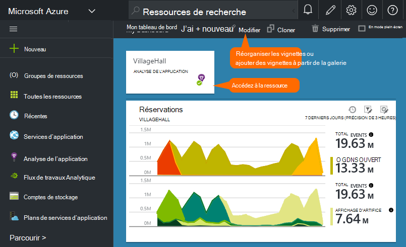

## Partager des tableaux de bord

Lorsque vous avez créé un tableau de bord, vous pouvez le partager avec d’autres utilisateurs.

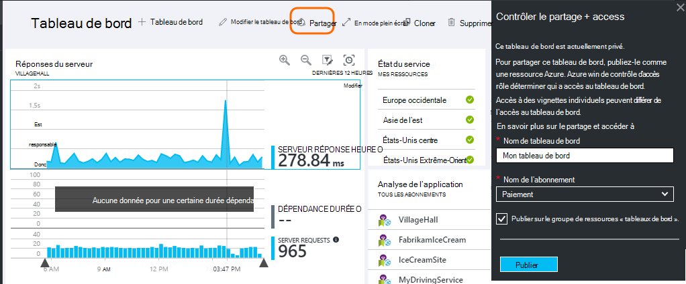

Obtenir des informations sur les [rôles et contrôle d’accès](app-insights-resources-roles-access-control.md).

## Navigation de l’application

La carte de vue d’ensemble constitue la passerelle vers plus d’informations sur votre application.

* **Un graphique ou mosaïque** - cliquez sur une vignette ou le graphique pour afficher plus de détails sur ce qui est affiché.

### Boutons de cartes de vue d’ensemble

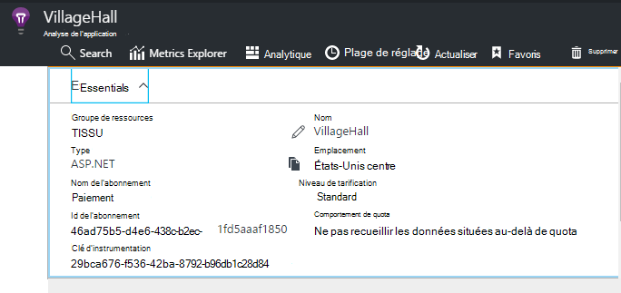

* [**Explorer les mesures**](app-insights-metrics-explorer.md) - créer votre propre de performances et l’utilisation des graphiques.
* [**Recherche**](app-insights-diagnostic-search.md) - rechercher des instances spécifiques d’événements tels que les demandes, exceptions, ou ouvrir une session traces.
* [**Analytique**](app-insights-analytics.md) - requêtes puissantes sur votre télémétrie.
* **Plage horaire** - ajuster la plage affichée par tous les graphiques dans la carte.
* **Supprimer** : supprimer la ressource Application perspectives pour cette application. Vous devez également supprimer les packages d’analyse de l’Application à partir de votre code de l’application, ou modifier la [clé d’instrumentation](app-insights-create-new-resource.md#copy-the-instrumentation-key) dans votre application pour diriger télémétrie vers une autre ressource Application perspectives.

### Onglet Essentials

* [Clé instrumentation](app-insights-create-new-resource.md#copy-the-instrumentation-key) - identifie cette ressource d’application. 
* Tarifs - rendre fonctionnalités VERR. MAJ volume défini et disponible.

### Barre de navigation de l’application

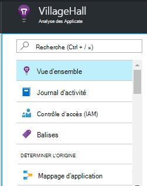

* **Vue d’ensemble** : retour à la carte de vue d’ensemble de l’application.
* **Journal d’activité** : événements d’administration Azure et les alertes.
* [**Contrôle d’accès**](app-insights-resources-roles-access-control.md) - donner accès aux membres de l’équipe et d’autres personnes.
* [**Balises**](../resource-group-using-tags.md) - utiliser les balises pour regrouper votre application avec d’autres personnes.

DÉTERMINER L’ORIGINE

* [**Mappage d’application**](app-insights-app-map.md) - carte Active affichant les composants de votre application, dérivée des informations de dépendance.
* [**Diagnostics proactifs**](app-insights-proactive-diagnostics.md) - alertes performances récentes révision.
* [**Flux en direct**](app-insights-metrics-explorer.md#live-stream) - un ensemble de mesures quasi instantanée utiles lorsque vous déployez une nouvelle version fixe ou de débogage.
* [**Disponibilité / tests Web**](app-insights-monitor-web-app-availability.md) -envoyer les demandes normales à votre application web dans le monde.* 
* [**Échecs, performances**](app-insights-web-monitor-performance.md) - Exceptions, taux d’échec et les temps de réponse pour les demandes dans votre application et des requêtes à partir de votre application aux [dépendances](app-insights-asp-net-dependencies.md).
* [**Performances**](app-insights-web-monitor-performance.md) - délai de réponse, temps de réponse dépendance. 
* [Serveurs](app-insights-web-monitor-performance.md) - compteurs de Performance. Disponible si vous [installez le moniteur d’état](app-insights-monitor-performance-live-website-now.md).

* **Navigateur** - mode Page et performances AJAX. Disponible si vous [instrument vos pages web](app-insights-javascript.md).
* Compte **l’utilisation** - mode Page, l’utilisateur et session. Disponible si vous [instrument vos pages web](app-insights-javascript.md).

CONFIGURER

* **Prise en main** - didacticiel en ligne.
* **Propriétés** - clé instrumentation, abonnement et Nº ressource.
* [Alertes](app-insights-alerts.md) - configuration d’alerte métrique.
* [Exporter continu](app-insights-export-telemetry.md) - configurer l’exportation de télémétrie au stockage Azure.
* [Tests de performances](app-insights-monitor-web-app-availability.md#performance-tests) - configurer une charge synthétique sur votre site Web.
* [Quota et tarifs](app-insights-pricing.md) [échantillonnage](app-insights-sampling.md)et réception.
* **Accès à l’API** - créer [relâchez annotations](app-insights-annotations.md) et de l’API d’accès aux données.
* [**Éléments de travail**](app-insights-diagnostic-search.md#create-work-item) : se connecter à un système de suivi afin que vous pouvez créer des bogues lors de l’inspection télémétrie de travail.

Paramètres

* [**Verrouille**](..\resource-group-lock-resources.md) : verrouiller les ressources Azure
* [**Script d’automation**](app-insights-powershell.md) - exporter une définition de la ressource Azure afin que vous pouvez l’utiliser en tant que modèle pour créer des ressources.

PRISE EN CHARGE

* **Demande de support technique** - nécessite un abonnement payant. Voir aussi [obtenir de l’aide](app-insights-get-dev-support.md).

## Quoi d’autre ?

||
|---|---
|[Explorer des indicateurs](app-insights-metrics-explorer.md) Mesures de filtre et de segment|
|[Recherche des Diagnostics](app-insights-diagnostic-search.md) Rechercher et examiner des événements, événements liés et créer des bogues |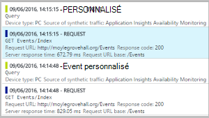
|[Analytique](app-insights-analytics.md) Langage de requête puissantes| 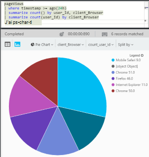

