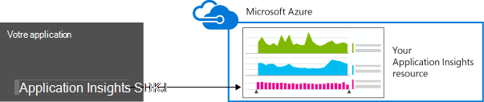
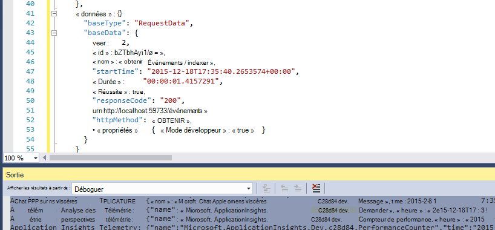
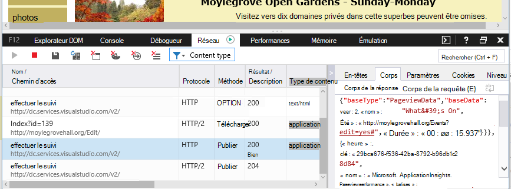

<properties 
    pageTitle="Conservation des données et le stockage dans perspectives d’Application" 
    description="Déclaration de stratégie de rétention et confidentialité" 
    services="application-insights" 
    documentationCenter=""
    authors="alancameronwills" 
    manager="douge"/>

<tags 
    ms.service="application-insights" 
    ms.workload="tbd" 
    ms.tgt_pltfrm="ibiza" 
    ms.devlang="na" 
    ms.topic="article" 
    ms.date="05/17/2016" 
    ms.author="awills"/>

# Collecte de données, conservation et stockage dans perspectives d’Application 

*Analyse de l’application est en mode Aperçu.*

Lorsque vous installez [Visual Studio Application Insights] [ start] SDK dans votre application, il envoie télémétrie sur votre application dans le Cloud. Naturellement, développeurs responsables souhaitent connaître exactement quelles données sont envoyées, que se passe-t-il aux données et comment ils veulent contrôle. En particulier, des données sensibles peuvent être envoyées, où il est stocké et comment sécurisé est-il ? 

Tout d’abord, la réponse courte :

* Les modules de télémétrie standard qui s’exécutent « prêts à l’emploi » sont probablement pas envoyer des données sensibles au service. La télémétrie concerne charge, indicateurs de performance et l’utilisation, les rapports d’exception et d’autres données de diagnostic. Les données utilisateur principale visibles dans les rapports de diagnostics sont des URL ; mais votre application ne doivent pas mettre dans tous les cas des données sensibles en texte brut dans une URL.
* Vous pouvez écrire du code qui envoie télémétrie personnalisé supplémentaire pour vous aider à surveiller l’utilisation de diagnostics et de. (Cette extensibilité est une excellente fonctionnalité d’analyse de l’Application). Il est possible, par inadvertance, d’écrire ce code afin qu’elle inclue personnelles et d’autres données sensibles. Si votre application fonctionne avec ce type de données, vous devez appliquer des processus de révision fort à tout le code que vous rédigez.
* Lors du développement et test de votre application, il est facile à inspecter le Kit de développement les éléments envoyés. Les données s’affichent dans les fenêtres de sortie débogage du IDE et du navigateur. 
* Les données sont conservées dans les serveurs [Microsoft Azure](http://azure.com) aux États-Unis. (Mais votre application anywhere peut être exécuté.) Azure a [une sécurité renforcée traite et répond à un large éventail de normes de conformité](https://azure.microsoft.com/support/trust-center/). Seuls vous et votre équipe désigné ont accès à vos données. Personnel Microsoft peut avoir un accès limité à celui-ci uniquement dans certaines circonstances limitées avec vos connaissances. Il est chiffré lors des transferts, mais pas dans les serveurs.

Le reste de cet article décrit plus en détail plus en détail ces réponses. Il est conçu pour être autonomes, afin que vous puissiez l’afficher à des collègues qui ne font pas partie de votre équipe.

## Quelles sont les perspectives d’Application ?

[Visual Studio Application Insights] [ start] est un service fourni par Microsoft, qui vous permet d’améliorer les performances et la facilité d’utilisation de vos applications en ligne. Il surveille votre application tout le temps qu’il est en cours d’exécution, au cours des tests et une fois que vous avez publié ou déployé. Analyse de l’application crée des graphiques et tableaux procédures, par exemple, les heures de la journée à la plupart des utilisateurs, la réactivité de l’application est, et bien qu’il est pris en charge par des services externes dont elle dépend. S’il existe des problèmes de performances, échecs ou se bloque, vous pouvez rechercher les données de télémétrie de détail pour identifier la cause. Et le service vous envoie des messages électroniques se si des modifications sont apportées dans la disponibilité et les performances de votre application.

Afin d’obtenir cette fonctionnalité, vous installez une Application Insights SDK dans votre application, laquelle fait alors partie de son code. Lorsque votre application est en cours d’exécution, le Kit de développement surveille son fonctionnement et envoie télémétrie au service Application perspectives. Il s’agit d’un service en nuage hébergé par [Microsoft Azure](http://azure.com). (Mais Application Insights fonctionne pour toutes les applications, pas seulement ceux qui sont hébergés dans Azure).

Le service d’Application Insights stocke et analyse le télémétrie. Pour afficher l’analyse ou la recherche via la télémétrie stockée, vous se connecter à votre compte Azure et ouvrez la ressource Application perspectives pour votre application. Vous pouvez également partager l’accès aux données avec d’autres membres de votre équipe, ou abonnés Azure spécifiés.

Vous pouvez avoir les données exportées à partir du service d’Application perspectives, par exemple pour une base de données ou aux outils externes. Vous fournir chaque outil avec une clé spéciale que vous obtenez à partir du service. La clé peut être révoquée si nécessaire. 

Application Insights SDK sont disponibles pour une plage de types d’application : web services hébergés dans vos propres serveurs J2EE ou ASP.NET ou dans Azure ; Web clients - autrement dit, le code en cours d’exécution dans une page web ; applications de bureau et services ; APPAREIL applications tels que Windows Phone, iOS et Android. Ils sont tous envoient télémétrie au même service.

## Quelles sont les données recueille-t-il ?

### Comment se trouvent les données recueillies ?

Il existe trois sources de données :

* Le Kit de développement, intégrer votre application [de développement](app-insights-asp-net.md) ou [en cours d’exécution](app-insights-monitor-performance-live-website-now.md). Il existe différentes SDK pour différents types d’applications. Il existe également un [SDK pour les pages web](app-insights-javascript.md), qui charge dans le navigateur de l’utilisateur final ainsi que de la page.

 * Chaque SDK comporte un nombre de [modules](app-insights-configuration-with-applicationinsights-config.md), qui permet de collecter différents types de télémétrie différentes techniques.
 * Si vous installez le Kit de développement de développement, vous pouvez utiliser son API pour envoyer votre propre télémétrie, ainsi que les modules standards. Cette télémétrie personnalisée peut inclure des données que vous voulez envoyer.
* Dans certains serveurs web, il existe des agents qui s’exécutent à côté de l’application et envoyer de télémétrie sur processeur, la mémoire et initiaux à l’emménagement réseau. Par exemple, machines virtuelles Azure, Docker hôtes et [serveurs J2EE](app-insights-java-agent.md) peuvent avoir ces agents.
* [Les tests de disponibilité](app-insights-monitor-web-app-availability.md) sont exécutés par Microsoft des processus qui envoient des requêtes dans votre application web à intervalles réguliers. Les résultats sont envoyés au service Application perspectives.

### Quels types de données sont collectées ?

Les catégories principales sont :

* [Télémétrie de serveur web](app-insights-asp-net.md) - requêtes HTTP.  URI, le temps nécessaire pour traiter la demande, le code de réponse, l’adresse IP du client. Id de session.
* [Pages Web](app-insights-javascript.md) - Page, utilisateur et session de compte. Temps de chargement de page. Exceptions. Appels AJAX.
* Performances compteurs - mémoire, processeur, IO, initiaux à l’emménagement réseau.
* Contexte client et serveur - OS, paramètres régionaux, type d’appareil, navigateur, résolution d’écran.
* [Exceptions](app-insights-asp-net-exceptions.md) et se bloque - **pile vide**, créer des id, type d’UC. 
* [Dépendances](app-insights-asp-net-dependencies.md) - appels vers des services externes comme reste, SQL, AJAX. Chaîne de connexion ou URI, durée, succès, commande.
* [Les tests de disponibilité](app-insights-monitor-web-app-availability.md) - durée de test et les étapes, les réponses.
* [Journaux de suivi](app-insights-search-diagnostic-logs.md) et de [télémétrie personnalisé](app-insights-api-custom-events-metrics.md) - **rien dans vos journaux ou télémétrie de code**.

[Plus en détail](#data-sent-by-application-insights).

## Comment puis-je vérifier que collecté ?

Si vous développez l’application à l’aide de Visual Studio, exécutez l’application en mode débogage (F5). La télémétrie apparaît dans la fenêtre de sortie. À partir de là, vous pouvez copier et mettre en forme en tant que JSON pour facilement une inspection. 

Vous trouverez également un affichage plus lisible dans la fenêtre Diagnostics.

Pour les pages web, ouvrez la fenêtre de débogage de votre navigateur.

### Puis-je écrire code pour filtrer la télémétrie avant d’être envoyé ?

Ce serait possible en écrivant un [plug-in de télémétrie processeur](app-insights-api-filtering-sampling.md).

## Combien de temps les données sont conservées ? 

Points de données brutes (autrement dit, les éléments que vous pouvez inspecter dans Rechercher des Diagnostics) sont conservées pendant 7 jours. Si vous avez besoin de conserver les données plus longues que celle, vous pouvez utiliser [Exporter continue](app-insights-export-telemetry.md) pour le copier dans un compte de stockage.

Données agrégées (autrement dit, nombre, moyennes et autres données statistiques que vous voyez dans l’Explorateur de métrique) sont conservées en grains d’une minute pendant 30 jours et 1 heure ou un jour (selon le type) pendant au moins 90 jours.

## Qui peut accéder aux données ?

Les données sont visibles par vous et, si vous avez un compte d’organisation, membres de votre équipe. 

Il peut être exporté par vous et les membres d’équipe et peut être copié vers d’autres emplacements et transmis à d’autres personnes.

#### Que faire par le Microsoft avec les informations de que mon application envoie analyse des applications ?

Microsoft utilise les données uniquement pour fournir le service pour vous.

## Où les données sont conservées ? 

* Aux États-Unis. 

#### Peut il être stocké ailleurs autre, par exemple en Europe ? 

* Pas à l’heure actuelle. 

#### Que signifie que mon application doit être hébergés aux États-Unis ?

* Non. Votre application peut s’exécuter à n’importe où, dans votre propre hôtes locaux ou dans le Cloud.

## Mes données sont sécurisées ?  

Analyse de l’application est un Service Azure dans l’aperçu. Tandis que nous travaillons Preview vers la protection de vos données par les stratégies décrites dans le [livre blanc Azure sécurité, confidentialité et la conformité](http://go.microsoft.com/fwlink/?linkid=392408).

Les données sont stockées dans des serveurs Microsoft Azure. Pour les comptes dans le portail Azure, les restrictions de compte sont décrites dans le [document Azure sécurité, confidentialité et la conformité](http://go.microsoft.com/fwlink/?linkid=392408). Pour les comptes dans le portail de Services Visual Studio d’équipe, le document de [Protection des données Visual Studio Team Services](http://download.microsoft.com/download/8/E/E/8EE6A61C-44C2-4F81-B870-A267F1DF978C/MicrosoftVisualStudioOnlineDataProtection.pdf) s’applique. 

Accès à vos données par le personnel Microsoft est limité. Nous accéder à vos données uniquement avec votre autorisation et s’il est nécessaire prendre en charge votre utilisation des perspectives d’Application. 

Données agrégat entre les applications tous nos clients (par exemple, le taux de données et la taille moyenne de traces) sont utilisées pour améliorer l’analyse de l’Application.

#### Télémétrie d’une autre personne peut interférer avec mes données d’analyse de l’Application ?

Ils peuvent envoyer télémétrie supplémentaire à votre compte à l’aide de la clé d’instrumentation, qui se trouve dans le code de vos pages web. Avec suffisamment de données supplémentaires, vos mesures n'aurait pas correctement représentent les performances et l’utilisation de votre application.

Si vous partagez le code avec d’autres projets, n’oubliez pas de supprimer votre clé d’instrumentation.

## Les données sont chiffrées ? 

Pas dans les serveurs à l’heure actuelle.

Toutes les données sont chiffrées lorsqu’elle est déplacée entre centres de données.

#### Les données chiffrées lors des transferts de mon application aux serveurs d’analyse de l’Application ?

Oui, nous utilisons https pour envoyer des données au portail quasi-totalité SDK, y compris les serveurs web, les appareils et les pages web HTTPS. La seule exception est envoyées à partir des pages web HTTP simple de données. 

## Informations d’identification personnelle

#### Personnellement Identifiable informations personnelle pu être envoyé analyse des applications ? 

Oui, il est possible. 

En tant qu’instructions générales fournies pour :

* Télémétrie plus standard (autrement dit, télémétrie envoyé sans vous écrire du code) n’inclut pas les informations d’identification personnelle explicites. Toutefois, il est possible identifier des individus par inférence à partir d’une collection d’événements.
* Exception et suivi des messages peuvent contenir des informations d’identification personnelle
* Télémétrie personnalisé - autrement dit, les appels tels que TrackEvent que vous écrivez dans le code à l’aide de l’API ou journal traces - peut contenir des données que vous choisissez.

Le tableau à la fin de ce document contient des descriptions plus détaillées des données collectées.

#### Je suis responsable de la conformité aux lois et réglementations en ce qui concerne les informations d’identification personnelle ?

Oui. Il est vous assurer que la collection de sites et l’utilisation des données est conforme aux lois et réglementations et avec les termes du contrat Microsoft Online Services.

Vous devez informer vos clients correctement les données collectées par votre application et la manière dont les données sont utilisées.

#### Pouvant mes utilisateurs désactiver l’analyse des applications ?

Pas directement. Nous ne fournissons un commutateur vos utilisateurs pouvant fonctionner pour désactiver les analyses de l’Application.

Toutefois, vous pouvez implémenter cette fonctionnalité dans votre application. Tous les SDK inclure un paramètre de l’API qui désactive la collection de sites de télémétrie. 

#### Mon application collecte involontairement des informations sensibles. Analyse de l’Application peut nettoyage de ces données afin qu’il n’est pas conservé ?

Analyse de l’application ne pas filtrer ou suppression de vos données. Vous devez gérer les données de façon appropriée et éviter d’envoyer ces données analyse de l’Application.

## Données envoyées par Application perspectives

Kits de développement logiciel varient entre les plateformes et il existe plusieurs composants que vous pouvez installer. (Reportez-vous à [Application perspectives - prise en main][start].) Chaque composant envoie des données différentes.

#### Catégories de données envoyées dans différents scénarios

Votre action  | Les classes de données collectées (voir le tableau suivant)
---|---
[Ajouter l’Application Insights SDK à un projet web .NET][greenbrown] | ServerContext Déduit Compteurs de performance Demandes **Exceptions** Session utilisateurs
[Installer le moniteur d’état sur IIS][redfield]|Dépendances ServerContext Déduit Compteurs de performance
[Ajouter l’Application Insights SDK pour une application web Java][java]|ServerContext Déduit Demande Session utilisateurs
[Ajouter JavaScript SDK à page web][client]|ClientContext  Déduit Page ClientPerf AJAX
[Définir des propriétés par défaut][apiproperties]|**Propriétés** pour tous les événements standards et personnalisés
[Appel TrackMetric][api]|Valeurs numériques **Propriétés**
[Appeler le suivi des *][api]|Nom de l’événement **Propriétés**
[Appel TrackException][api]|**Exceptions** Vidage de la pile **Propriétés**
Kit de développement logiciel ne peut pas collecter les données. Par exemple :   -n’est pas accessible compteurs de performance  -exception dans initialiseur de télémétrie | Diagnostics SDK
 

Pour [SDK pour d’autres plateformes][platforms], voir leurs documents.

#### Les classes des données collectées

Les données collectées classe | Inclut (pas une liste exhaustive) 
---|---
**Propriétés**|**Toutes les données - déterminées par votre code**
Élément DeviceContext |ID, les adresses IP, les paramètres régionaux, modèle d’appareil, réseau, type de réseau, nom OEM, résolution d’écran, Instance de rôle, le nom de rôle, Type d’appareil
ClientContext |Système d’exploitation, les paramètres régionaux, de langue, de réseau et de résolution de la fenêtre
Session | id de session
ServerContext |Nom de l’ordinateur, les paramètres régionaux du système d’exploitation, périphérique, session utilisateur, contexte de l’utilisateur, opération 
Déduit |emplacement géographique à partir de l’adresse IP, horodatage, du système d’exploitation, navigateur
Indicateurs | Valeur et nom métrique
Événements | Valeur et nom de l’événement
PageViews | URL et page Nom ou nom de l’écran
Performances du client | Nom d’URL ou d’une page, le temps de chargement de navigateur
AJAX | Appels HTTP d’une page web sur serveur
Demandes |URL, durée, le code de réponse
Dépendances|Type (SQL, HTTP,...), d’une chaîne de connexion ou d’URI, synchronisation/asynchrone, durée, succès, instruction SQL (avec moniteur d’état)
**Exceptions** | Type, **message**, piles d’appels, source fichier et numéro de ligne, id de thread
Se bloque | Id de processus, id de processus parent, id de thread de blocage ; correctif pour application, l’id et génération ;  type d’exception, adresse, raison ; symboles masquées et historiques, adresses binaires de début et de fin, binaire nom et chemin d’accès, type d’UC
Suivi des messages | Niveau de **message** et la gravité
Compteurs de performance | Temps processeur, quantité de mémoire disponible, taux de requêtes, taux d’exception, octets privés processus, taux IO, durée de demande, demander file d’attente
Disponibilité | Code de réponse de test Web, la durée de chaque étape de test, nom de test, horodatage, succès, temps de réponse emplacement pour le test
Diagnostics SDK | Message de trace ou une Exception 

Vous pouvez [désactiver une partie des données par ApplicationInsights.config édition][config]

## Crédits

Ce produit inclut les données GeoLite2 créées par MaxMind, disponible à partir de [http://www.maxmind.com](http://www.maxmind.com).

## Vidéos

#### Introduction

> [AZURE.VIDEO application-insights-introduction]

#### Prise en main

> [AZURE.VIDEO getting-started-with-application-insights]

<!--Link references-->

[api]: app-insights-api-custom-events-metrics.md
[apiproperties]: app-insights-api-custom-events-metrics.md#properties
[client]: app-insights-javascript.md
[config]: app-insights-configuration-with-applicationinsights-config.md
[greenbrown]: app-insights-asp-net.md
[java]: app-insights-java-get-started.md
[platforms]: app-insights-platforms.md
[pricing]: http://azure.microsoft.com/pricing/details/application-insights/
[redfield]: app-insights-monitor-performance-live-website-now.md
[start]: app-insights-overview.md

 