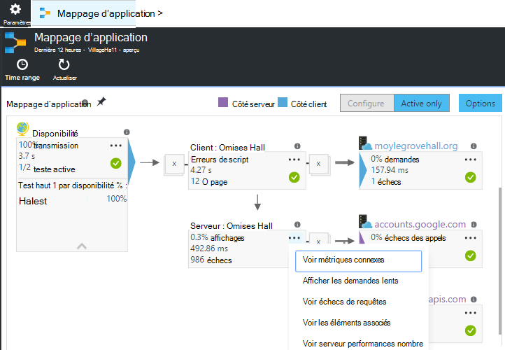
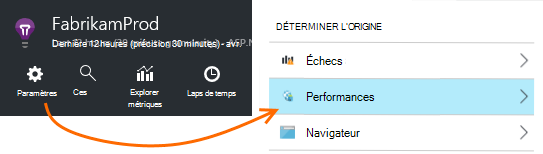
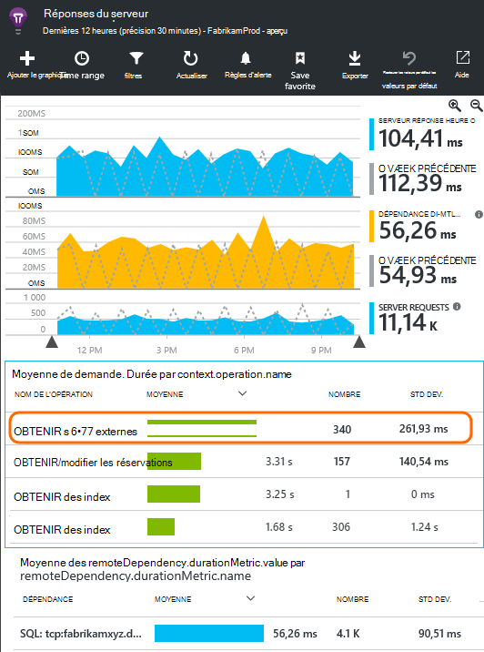
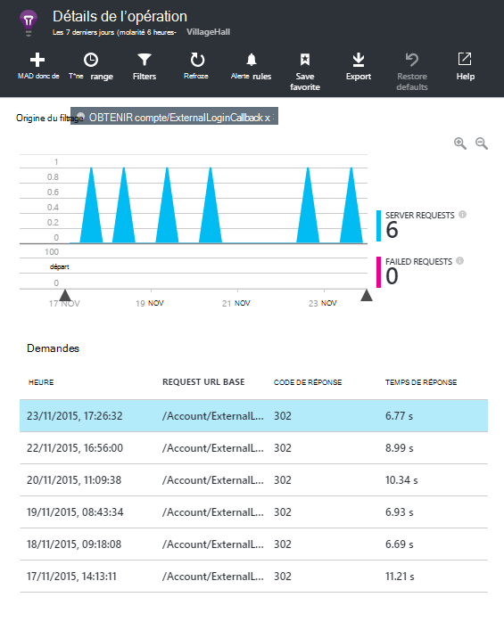
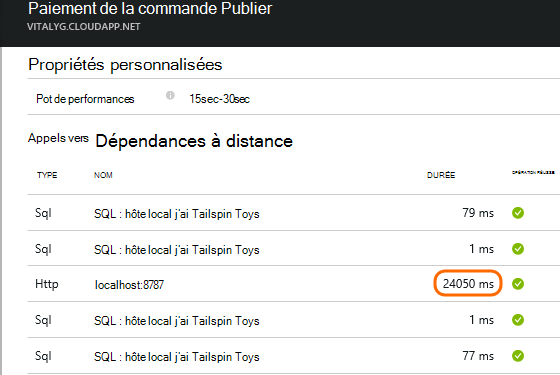
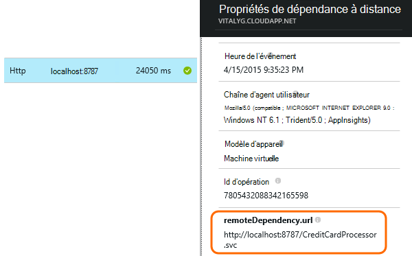
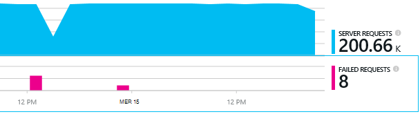
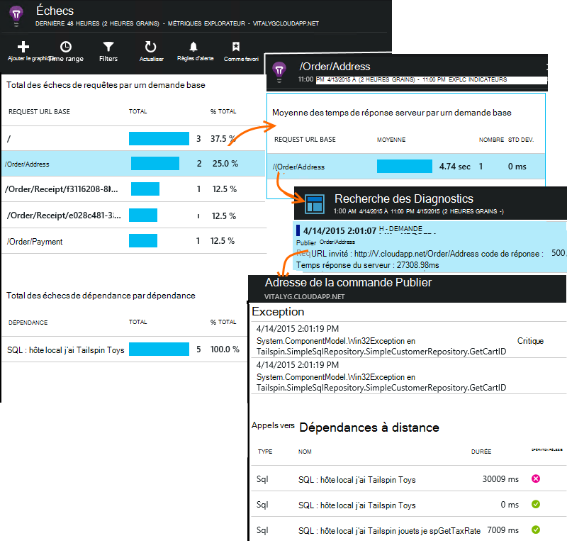

<properties 
    pageTitle="Diagnostiquer les problèmes avec les dépendances dans perspectives d’Application" 
    description="Rechercher des échecs et baisse des performances provoquée par les dépendances" 
    services="application-insights" 
    documentationCenter=""
    authors="alancameronwills" 
    manager="douge"/>

<tags 
    ms.service="application-insights" 
    ms.workload="tbd" 
    ms.tgt_pltfrm="ibiza" 
    ms.devlang="na" 
    ms.topic="article" 
    ms.date="05/12/2016" 
    ms.author="awills"/>
 
# <a name="diagnosing-issues-with-dependencies-in-application-insights"></a>Diagnostiquer les problèmes avec les dépendances dans perspectives d’Application


Une *dépendance* est un composant externe qui est appelé par votre application. Il s’agit d’un service appelé à l’aide de HTTP, ou une base de données ou un système de fichiers. Ou, dans votre page web script, il peut être un appel AJAX sur le serveur. Dans Visual Studio Application perspectives, vous pouvez facilement repérer la durée pendant laquelle votre application attend de dépendances et la fréquence à laquelle un appel de dépendance échoue.

## <a name="where-you-can-use-it"></a>L’endroit où vous pouvez l’utiliser

Se déconnecter de la zone de surveillance des dépendances est actuellement disponible pour :

* ASP.NET web applications et services exécuté sur un serveur IIS ou Azure
* [Applications web Java](app-insights-java-agent.md)
* [Pages Web](https://azure.microsoft.com/blog/ajax-collection-in-application-insights/)

Pour les autres types, tels que des applications de l’appareil, vous pouvez écrire votre propre moniteur à l’aide de l' [API TrackDependency](app-insights-api-custom-events-metrics.md#track-dependency).

Le moniteur de prédéfinies dépendance signale actuellement les appels à ces types de dépendances :

* ASP.NET
 * Bases de données SQL
 * Web ASP.NET et services WCF qui utilisent des liaisons basé sur HTTP
 * Appels HTTP locales ou distantes
 * Azure DocumentDb, table, stockage d’objets blob et file d’attente
* Java
 * Appels vers une base de données via un pilote [JDBC](http://docs.oracle.com/javase/7/docs/technotes/guides/jdbc/) , tels que MySQL, SQL Server, PostgreSQL ou SQLite.
* Pages Web
 * [Appels AJAX](app-insights-javascript.md)

Là encore, vous pourriez écrire vos propres appels SDK à surveiller les autres dépendances.

## <a name="to-set-up-dependency-monitoring"></a>Pour configurer la surveillance des dépendances

Installer l’agent approprié pour le serveur hôte.

Plateforme | Installer
---|---
Serveur IIS | Soit [installer le moniteur d’état sur le serveur](app-insights-monitor-performance-live-website-now.md) ou [mettre à niveau votre application .NET Framework 4.6 ou version ultérieure](http://go.microsoft.com/fwlink/?LinkId=528259) et installez le [Kit de développement logiciel Application Insights](app-insights-asp-net.md) dans votre application.
Dans le navigateur Azure | [Extension de perspectives d’application](app-insights-azure-web-apps.md)
Serveur web Java | [Applications web Java](app-insights-java-agent.md)
Pages Web | [Moniteur JavaScript](app-insights-javascript.md) (Aucune autre configuration que l’analyse de la page web)
Service de nuage Azure |  [Les tâches démarrage](app-insights-cloudservices.md#dependencies) ou [installer .NET framework 4.6 +](../cloud-services/cloud-services-dotnet-install-dotnet.md)  

Le contrôle d’état pour les serveurs IIS ne doit pas vous permet de reconstruire votre projet source avec le Kit de développement de perspectives Application. 

## <a name="application-map"></a>Mappage d’application

Mappage d’application se comporte comme aide visuelle pour découvrir les dépendances entre les composants de votre application. 



Parmi les cases, vous pouvez accéder à dépendance pertinent et d’autres graphiques.

Cliquez sur le petit [x] pour réduire une sous-arborescence.

Épinglez la carte pour le [tableau de bord](app-insights-dashboards.md), où il sera entièrement fonctionnelle.

[En savoir plus](app-insights-app-map.md).

## <a name="diagnosis"></a>Diagnostiquer les problèmes de performances dépendance sur le serveur web

Pour évaluer les performances des requêtes à votre serveur :



Faites défiler jusqu'à coup de œil à la grille de requêtes :



L’option supérieure est très longue. Voyons si nous pouvons déterminer l’endroit où le temps est utilisé.

Cliquez sur cette ligne pour consulter des événements demande individuelle :




Cliquez sur n’importe quelle instance longue pour contrôler davantage.

> [AZURE.NOTE] Faites défiler vers le bas pour choisir une instance. Latence dans le pipeline peut signifie que les données pour les instances supérieure soient incomplètes.

Faites défiler jusqu'à les appels dépendance à distance liées à cette demande :



Il ressemble à la plupart de la maintenance de temps que cette demande a été consacrée à un appel vers un service local. 

Sélectionnez cette ligne pour obtenir plus d’informations :




Les détails inclut des informations suffisantes pour identifier le problème.


## <a name="failures"></a>Échecs

S’il existe des échecs de requêtes, cliquez sur le graphique.



Cliquez sur via un type de demande et instance de requête, pour rechercher un appel à une dépendance à distance a échoué.





## <a name="custom-dependency-tracking"></a>Dépendance personnalisée suivi

Le module de suivi de dépendance standard détecte automatiquement les dépendances externes telles que des bases de données et des API REST. Mais que vous souhaitiez certains composants supplémentaires devant être traitée de la même façon. 

Vous pouvez écrire du code qui envoie des informations sur les dépendances, à l’aide de même [API TrackDependency](app-insights-api-custom-events-metrics.md#track-dependency) qui est utilisée par les modules standards.

Par exemple, si vous créez votre code avec un assembly que vous n’avez pas écrit vous-même, temps tous les appels à, pour déterminer quels contribution aux votre temps de réponse. Pour que ces données affichées dans les graphiques dépendance Application perspectives, envoyez-le à l’aide `TrackDependency`.

```C#

            var success = false;
            var startTime = DateTime.UtcNow;
            var timer = System.Diagnostics.Stopwatch.StartNew();
            try
            {
                success = dependency.Call();
            }
            finally
            {
                timer.Stop();
                telemetry.TrackDependency("myDependency", "myCall", startTime, timer.Elapsed, success);
            }
```

Si vous voulez désactiver le module de suivi de dépendance standard, supprimez la référence à DependencyTrackingTelemetryModule dans [ApplicationInsights.config](app-insights-configuration-with-applicationinsights-config.md).


## <a name="ajax"></a>AJAX

Afficher des [pages Web](app-insights-javascript.md).


 