<properties
    pageTitle="Détecter, trier, diagnostiquer"
    description="Analyser les incidents et détecter et diagnostiquer les problèmes de performances dans vos applications"
    authors="alancameronwills"
    services="application-insights"
    documentationCenter=""
    manager="douge"/>

<tags
    ms.service="application-insights"
    ms.workload="tbd"
    ms.tgt_pltfrm="ibiza"
    ms.devlang="na"
    ms.topic="article" 
    ms.date="11/06/2015"
    ms.author="awills"/>

# Détecter, trier et diagnostiquer avec des aperçus d’Application

*Analyse de l’application est en mode Aperçu.*

Vous permet de perspectives application savoir comment votre application s’exécute et utilisé lorsqu’il est en ligne. Et si un problème se pose, il vous informe, vous aide à vous évaluez l’impact et vous aide à déterminer la cause.

Voici un compte à partir d’une équipe qui développe des applications web :

* *« Quelques jours auparavant, nous avons déployé un correctif « secondaire ». Nous n’a pas été exécuté un test large, mais malheureusement certaines modifications inattendues vous avez fusionnées dans la charge utile, à l’origine d’incompatibilité entre le début et en fin. Immédiatement, exceptions du serveur ont, notre alerte déclenchée et nous avons apporté prenant en charge de la situation. Quelques clics absent (e) dans le portail d’Application perspectives, nous obtenu suffisamment d’informations à l’exception des piles d’appels pour affiner le problème. Nous annulée immédiatement et limiter les dommages. Analyse de l’application a été cette partie de la devops successivement très simple et exploitables. »*

Voyons comment une équipe de développement web courantes utilise Application perspectives pour surveiller les performances. Nous allons suivre l’équipe dans banque de Fabrikam qui développe le système bancaire en ligne (répartition).

L’équipe travaille sur un cycle comme suit :

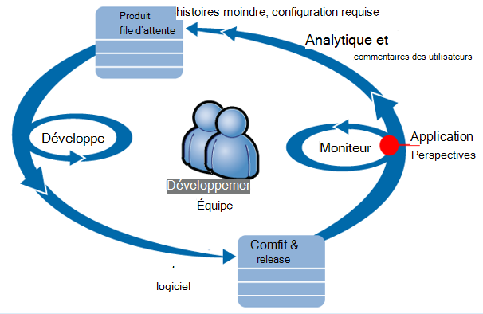

Configuration requise de flux à leur file d’attente développement (liste des tâches). Ils fonctionnent en bref sprint, laquelle livrer souvent un logiciel fonctionnel - généralement sous la forme d’améliorations et extensions de l’application existante. L’application live est fréquemment mis à jour avec les nouvelles fonctionnalités. Bien qu’il soit direct, l’équipe de l’analyse de performances et d’utilisation à l’aide de l’analyse de l’Application. Cette analyse flux réinsérer dans leur file d’attente développement.

L’équipe utilise Application perspectives pour contrôler l’application web en direct étroitement pour :
* Performances. Ils veulent comprendre comment réactivité dépendent de comptage des demandes ; Combien processeur, le réseau, disque et autres ressources sont utilisés ; et où se trouvent les engorgements.
* Échecs. Cas d’exceptions ou Échec de requêtes, ou en cas d’un compteur de performance à l’extérieur de la plage à l’aise, l’équipe doit connaître rapidement afin de pouvoir prendre des mesures.
* Utilisation. Lorsqu’une nouvelle fonctionnalité est disponible, l’équipe en charge utile de savoir dans quelle mesure elle est utilisée, et indique si les utilisateurs ont des difficultés avec lui.

Nous allons vous concentrer sur la partie commentaires du cycle :

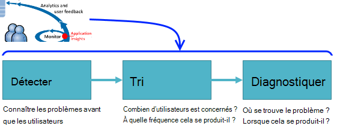

## Détecter la disponibilité d’un problème

Marcela Markova est un développeur senior de l’équipe de répartition et vous permet d’accéder au prospect sur l’analyse des performances en ligne. Elle configure plusieurs [tests de site web][availability]:

* Un test unique URL pour la page d’accueil de l’application, http://fabrikambank.com/onlinebanking/. Elle définit le critère de code HTTP 200 et le texte « Bienvenue ! ». Si ce test échoue, il est un sérieux problème au niveau du réseau ou les serveurs ou peut-être un problème de déploiement. (Ou une personne a changé la Bienvenue dans ! message de la page sans en avertir son sait-il.)

* Un test plusieurs étapes plus approfondie, se connecte et obtient un compte en cours de liste, l’extraction quelques informations clé sur chaque page. Ce test vérifie que le lien vers la base de données de comptes fonctionne. Elle utilise un id client fictif : certains d'entre eux sont conservées à des fins de test.

Avec les tests de configurer, Marcela est assuré que l’équipe saurez rapidement sur toute coupure de courant.  

Échecs apparaissent sous forme de points rouges sur le plan de test web :

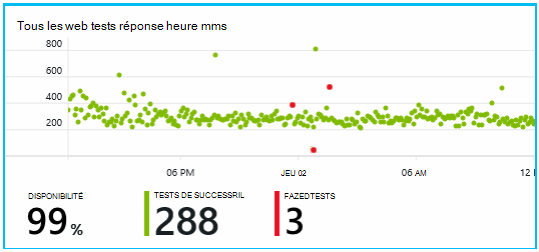

Mais surtout, une alerte concernant une défaillance est envoyée à l’équipe de développement. De cette façon, ils savent avant de quasiment tous les clients.

## Surveiller les performances

Dans la page Vue d’ensemble dans l’Application perspectives, il est un graphique qui affiche plusieurs [mesures clés][perf].

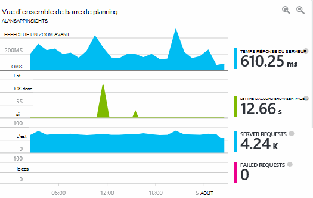

Temps de chargement de page de navigateur est dérivée de télémétrie envoyé directement à partir de pages web. Temps réponse du serveur, compteur de demande de serveur demande échec Nb toutes mesurée sur le serveur web et sont envoyés analyse des applications à partir de là.

Marcela est légèrement concerné avec le graphique de réponse serveur, qui affiche la durée moyenne entre lorsque le serveur reçoit une demande HTTP à partir du navigateur d’un utilisateur et lorsqu’elle retourne la réponse. Il n’est pas inhabituelle afficher une variante dans ce graphique, comme varie en fonction de la charge sur le système. Mais dans ce cas, il semble que de corrélation entre petite augmente dans le nombre de requêtes et volumineux augmente dans le temps de réponse. Qui indique que le système fonctionne uniquement à ses limites. 

Elle s’ouvre les graphiques de serveurs :

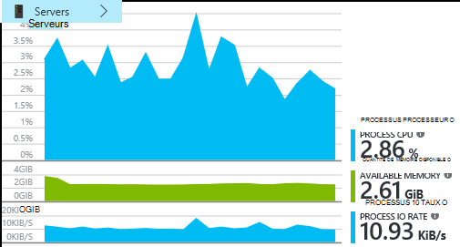

Il ne semble aucun signe de limitation de ressources, peut-être que les chocs dans les graphiques de réponse serveur sont simplement une coïncidence.

## Alertes

Toutefois, elle souhaite effectuer le suivi du temps de réponse. Si elle s’exécute trop élevés, il souhaite connaître immédiatement.

Afin qu’elle définit un [alertes][metrics], temps de réponse supérieurs à un seuil par défaut. Ainsi, son confiance elle saurez à ce sujet si le temps de réponse sont lents.

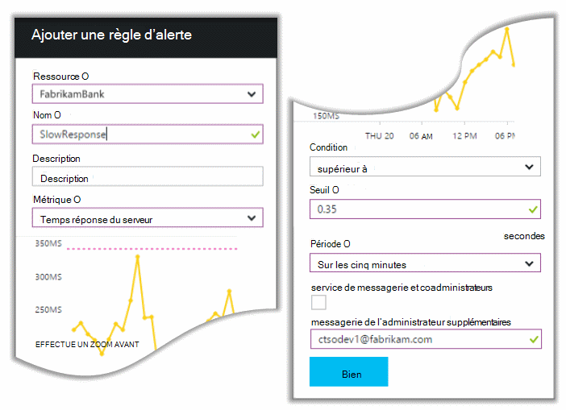

Alertes peuvent être définies sur un large éventail d’autres mesures. Par exemple, vous pouvez recevoir des messages électroniques si le nombre d’exception devient élevé ou la quantité de mémoire disponible est faible, ou s’il existe une pointe de demandes des clients.

## Alertes de diagnostics proactives

Lendemain, un e-mail d’alerte arrive à partir de l’analyse de l’Application. Mais lorsqu’elle ouvre il, she recherche n’est pas l’alerte de temps de réponse, elle créé. Au lieu de cela, il vous indique lui a été lancer une augmentation de requêtes échecs - autrement dit, les requêtes qui ont renvoyé des codes d’erreur de 500 ou plus.

Échecs de requêtes sont où les utilisateurs ont vu une erreur - en général suite à une exception levée dans le code. Peut-être verra un message portant le message « Nous avons pas pu mettre à jour vos informations immédiatement Désolé » ou, en absolue déplacés pire des cas, un vidage de pile sur écran de l’utilisateur, démographiques fournies par le serveur web.

Cette alerte est une surprise, car la dernière fois qu’elle a examiné, le nombre de demandes qui ont échoué a été approcher faible. Un petit nombre d’échecs est à prévoir dans un serveur occupé (e). 

Il a été également un peu d’une surprise lui, car elle n’a pas été obligé de configurer cette alerte. En fait, Diagnostics proactifs est inclus automatiquement avec des aperçus de l’Application. Il automatiquement s’adapte à votre application motif panne habituel et échecs « est utilisé pour » sur une page particulière, ou élevée ou lié à d’autres mesures. Il déclenche l’alarme uniquement s’il existe une hausse au-dessus qu’il s’agit d’attendre.

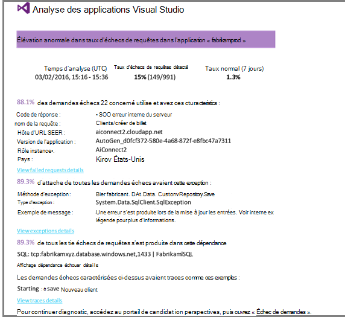

Il s’agit d’une adresse de messagerie très utile. Il ne simplement déclencher une alarme ; elle effectue une grande partie le tri et le travail diagnostic, trop.

Il affiche le nombre de clients est affecté et les pages web ou les opérations. Marcela pouvez décider si elle a besoin d’obtenir toute une équipe travaillant sur Ceci comme un exercice d’alerte, ou si elle peut être ignorée semaine prochaine.

Le message électronique affiche également qu’une exception particulière s’est produite et - bien plus intéressantes - que l’échec est associé à des appels échecs à une base de données particulière. Cette rubrique explique pourquoi l’erreur apparaissait soudainement même si l’équipe de Marcela n’a pas déployé des mises à jour récemment. 

Elle connecte à la suite de l’équipe de base de données. Oui, ils publié un correctif dans la demi-heure passée ; et mince, peut-être il peut y avoir un changement de schéma secondaires...

Le problème est donc sur la façon d’étant fixe, même avant d’une solution journaux et en 15 minutes de celui-ci résultant. Toutefois, Marcela clique sur le lien pour ouvrir l’Application perspectives. Il s’ouvre directement sur une requête a échoué, et elle peut voir la base de données a échoué à appeler dans la liste d’appels de dépendance associée. 

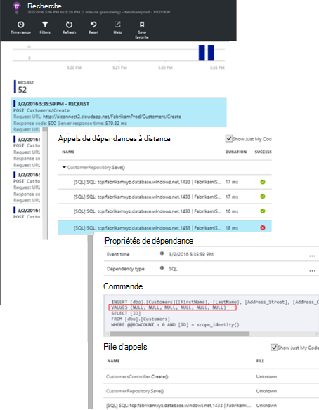

## Détection des exceptions

Avec un peu de configuration, [exceptions](app-insights-asp-net-exceptions.md) sont signalés Application analyse automatiquement. Ils peuvent également être capturées explicitement en insérant des appels vers [TrackException()](app-insights-api-custom-events-metrics.md#track-exception) dans le code :  

    var telemetry = new TelemetryClient();
    ...
    try
    { ...
    }
    catch (Exception ex)
    {
       // Set up some properties:
       var properties = new Dictionary <string, string>
         {{"Game", currentGame.Name}};

       var measurements = new Dictionary <string, double>
         {{"Users", currentGame.Users.Count}};

       // Send the exception telemetry:
       telemetry.TrackException(ex, properties, measurements);
    }

L’équipe Fabrikam Bank a évolué session d’exercices pratiques d’envoi toujours de télémétrie sur une exception, sauf s’il existe une récupération évidente.  

En fait, leur stratégie est encore plus large que celle : ils envoient télémétrie dans tous les cas où le client n’est pas satisfait dans qu’ils souhaitent, si elle correspond à une exception dans le code ou non. Par exemple, si le système externe transfert bancaire entre retourne un message « Impossible de terminer cette opération » pour une raison quelconque opérationnelle (aucune défaillance du client) ils suivent cet événement.

    var successCode = AttemptTransfer(transferAmount, ...);
    if (successCode < 0)
    {
       var properties = new Dictionary <string, string>
            {{ "Code", returnCode, ... }};
       var measurements = new Dictionary <string, double>
         {{"Value", transferAmount}};
       telemetry.TrackEvent("transfer failed", properties, measurements);
    }

TrackException est utilisée pour signaler les exceptions, car il envoie une copie de la pile ; TrackEvent est utilisé pour signaler d’autres événements. Vous pouvez joindre les propriétés qui peuvent vous être utiles dans le diagnostic.

Exceptions et événements apparaissant dans la [Recherche de Diagnostic] [ diagnostic] carte. Vous pouvez explorer les pour afficher les propriétés supplémentaires et suivi de la pile.

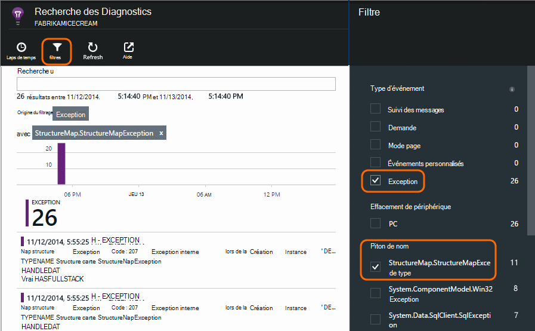

## Surveiller l’activité utilisateur

Lorsque le temps de réponse est préférable de manière cohérente à travers et il existe quelques exceptions près, l’équipe de développement pouvez envisager comment faire pour améliorer l’expérience des utilisateurs et comment encourager davantage d’utilisateurs pour atteindre les objectifs de votre choix.

Par exemple, un voyage utilisateur classique via le site web a un entonnoir 'à' Effacer : de nombreux clients examiner les taux de différents types de l’emprunt ; certaines d'entre elles renseignez le formulaire de devis ; et de les personnes qui reçoivent une soumission, quelques alors et prennent le prêt.

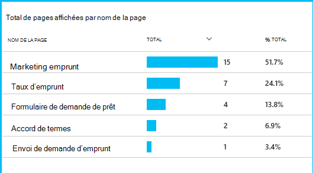

En fonction de l’endroit où les numéros des clients plus grandes disparaître, l’entreprise peut travailler comment atteignent davantage d’utilisateurs vers le bas de l’entonnoir. Dans certains cas, il peut y avoir une défaillance expérience utilisateur - par exemple, le bouton « suivant » est difficile à rechercher, ou les instructions ne sont pas visibles. Plus probablement, il existe des raisons professionnelles plus significatives pour portée aboutissants : peut-être les taux de prêt sont trop élevés.

Quelle que soit les raisons, les données vous aide à l’équipe de déterminer ce que font les utilisateurs. Autres suivi des appels peuvent être insérées pour travailler de manière davantage de détails. TrackEvent() peut être utilisé pour compter les actions de l’utilisateur, dans les moindres détails de clics des boutons permettant d’élèves significatives comme rembourser un emprunt.

L’équipe est prise utilisé pour des informations sur l’activité des utilisateurs. Aujourd'hui, chaque fois qu’ils conçoivent une nouvelle fonctionnalité, ils fonctionnent arrière comment ils obtiennent des commentaires sur son utilisation. Ils conçoivent le suivi des appels dans la fonctionnalité à partir du début. Ils utilisent les commentaires pour améliorer la fonctionnalité de chaque cycle de développement.

## Surveillance proactive  

Marcela ne restez autour en attente pour les alertes. Peu de temps après chaque redéploiement, elle examine en [réactivité] [ perf] -le chiffre global et la table des demandes plus lentes, ainsi que des nombres exception.  

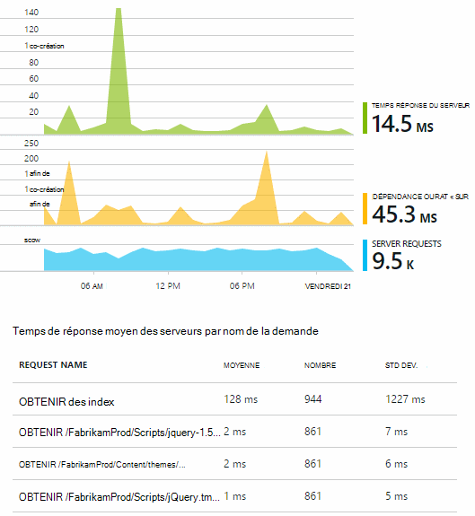

Elle peut évaluer l’effet de performances de chaque déploiement, généralement comparaison chaque semaine avec la dernière. S’il existe une aggravation soudain, elle qui déclenche avec les développeurs pertinents.

## Tri

Tri - évaluer la gravité et l’étendue d’un problème - est la première étape après détection. Devons nous appelons déconnecter l’équipe à minuit ? Ou être gauche jusqu'à ce que l’intervalle pratique suivante dans la file d’attente ? Il existe certaines questions clés de tri.

Combien neuf ? Les graphiques dans la carte de vue d’ensemble autoriser certaines perspective à un problème. Par exemple, l’application Fabrikam généré des alertes de test web quatre une nuit. Prenons le graphique dans le matin, l’équipe peut voir qu’il y avait bien quelques points rouge, bien que toujours la plupart des tests ont été verte. Extraire dans le diagramme de disponibilité, il était évident que tous ces problèmes intermittents étaient à partir d’un test emplacement. Ceci est évidemment un problème de réseau qui peuvent affecter qu’une seule route et probablement efface lui-même.  

En revanche, une hausse spectaculaire et stable dans le graphique des heures de nombre ou une réponse exception est visiblement quelque chose dysfonctionnement sur.

Un tri utile il convient de s’essayez il vous-même. Si vous rencontrez le problème persiste, vous savez qu’il est de type real.

Quelle fraction d’utilisateurs sont concernés ? Pour obtenir une réponse approximative, divisez le taux de défaillance par le nombre de sessions.

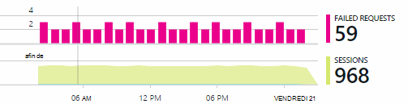

Dans le cas de lenteur, comparez la table des demandes plus lente répondre avec la fréquence d’utilisation de chaque page.

Quelle est l’important le scénario bloqué ? S’il s’agit d’un problème fonctionnel bloquer un récit utilisateur particulier, il ne constitue beaucoup ? Si les clients ne peuvent pas payer leurs factures, il s’agit de grave ; Si elles ne peuvent pas modifier ses préférences de couleur écran, peut-être qu’il peut attendre. Les détails de l’événement ou une exception ou l’identité de la page lente, vous indique où les clients sont vous rencontrez des problèmes.

## Diagnostic

Diagnostic n’est pas tout à fait identique débogage. Avant de commencer le suivi par le biais du code, vous devez disposer une idée approximative de pourquoi, où et quand le problème est survenu.

**Lorsque cela se produit-il ?** L’affichage Historique fournie par les graphiques événement et métrique facilite la mettre en correspondance des effets avec les causes possibles. Si taux horaire ou une exception de réponse comporte des pointes intermittents, examinez le nombre de demande : si elle est optimale en même temps, puis il ressemble à un problème de ressources. Vous devez affecter plus UC ou mémoire ? Ou une dépendance qui ne peuvent pas gérer la charge ?

**S’agit-il nous ?**  Si vous avez une lancer une baisse des performances d’un type particulier de demande - par exemple lorsque le client souhaite un relevé de compte - il est possible qu’il peut être un sous-SYSTEME externes plutôt que votre application web. Dans l’Explorateur d’indicateurs, sélectionnez les taux d’échec de dépendance et les taux de durée de dépendance et de comparer leurs historiques dans passées de quelques heures ou jours avec le problème que vous avez détecté. Si il sont corrélation des modifications, un sous-SYSTEME externes peut-être être à l’origine du problème.  

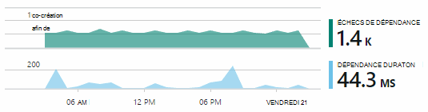

Certains problèmes de dépendance lente sont géolocalisation des problèmes. Banque Fabrikam utilise Azure machines virtuelles et découvert qu’ils avaient par inadvertance situés leur serveur web et le serveur de compte dans des pays différents. Une amélioration considérable a été provoquée par la migration d’un d’eux.

**Que faire ?** Si le problème n’apparaît pas dans une dépendance, et si elle n’est pas toujours il, il est probablement dû à une modification récente. La perspective historique fournie par les graphiques métrique et événement facilite faire correspondre toutes les modifications soudaines avec les déploiements. Qui permet d’affiner la recherche pour le problème.

**Que se passe-t-il ?** Certains problèmes se produisent uniquement rarement et peuvent être difficiles à analyser en testant en mode hors connexion. Tout ce que nous pouvons faire consiste à essayer capturer le bogue lorsqu’il se produit live. Vous pouvez inspecter le vidage de pile dans les rapports d’exception. En outre, vous pouvez écrire suivi des appels, selon votre structure de journalisation favori ou avec TrackTrace() ou TrackEvent().  

Fabrikam a rencontré un problème intermittent avec les interdépendances entre comptes transferts, mais uniquement à certains types de comptes. Pour mieux comprendre que s’est-il passé, ils insérés TrackTrace() appels à des points importants dans le code, en joignant le type de compte en tant que propriété à chaque appel. Qui est très simple filtrer uniquement les traces dans les Diagnostics de recherche. Ils associés également les valeurs de paramètre en tant que propriétés et les mesures pour les suivi des appels.

## Gérer les deuxièmes il

Une fois que vous avez constaté le problème, vous pouvez créer un plan de résoudre le problème. Peut-être que vous devez annuler une modification récente ou peut-être que vous pouvez simplement alors et correctif. Une fois la réparation terminée, Insights Application vous signale que vous a réussi.  

Équipe de développement de la banque Fabrikam prendre une approche plus structurée à mesure de performances qu’ils avant d’analyse des applications utilisées.

* Ils définir les objectifs de performance en termes de mesures spécifiques dans la page Vue d’ensemble des perspectives d’Application.

* Ils conçoivent des mesures de performances dans l’application à partir du début, telles que les mesures qui déterminent votre niveau utilisateur par le biais ampoules 'à'.  

## Utilisation

Analyse de l’application peut également servir à découvrir ce que les utilisateurs faire avec une application. Une fois qu’elle s’exécute correctement, l’équipe souhaitez en savoir quelles fonctionnalités sont les plus populaires, que les utilisateurs comme ou ont des difficultés avec l’et la fréquence à laquelle ils sont revenir. Qui leur permettra de classer par priorité de leurs tâches à venir. Et ils peuvent planifier mesurer le succès de chaque fonctionnalité dans le cadre du cycle de développement. [En savoir plus][usage].

## Vos applications

C’est une utilisation d’équipe perspectives d’Application non seulement pour corriger les problèmes individuelles, mais pour améliorer leur cycle de vie de développement. J’ai espérons que celui-ci vous a donné quelques suggestions de comment Insights Application peut vous aider à améliorer les performances de vos propres applications.

## Vidéo

[AZURE.VIDEO performance-monitoring-application-insights]

<!--Link references-->

[api]: app-insights-api-custom-events-metrics.md
[availability]: app-insights-monitor-web-app-availability.md
[diagnostic]: app-insights-diagnostic-search.md
[metrics]: app-insights-metrics-explorer.md
[perf]: app-insights-web-monitor-performance.md
[usage]: app-insights-web-track-usage.md
 
