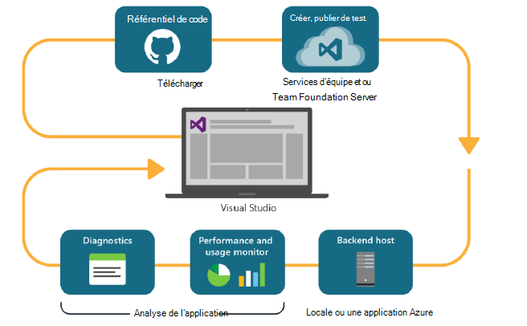
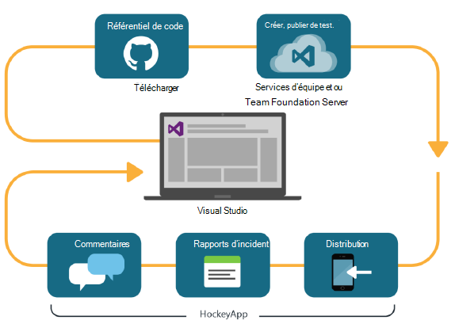

<properties
    pageTitle="Développeur Analytique"
    description="DevOps avec Visual Studio, Application Insights et HockeyApp"
    authors="alancameronwills"
    services="application-insights"
    documentationCenter=""
    manager="douge"/>

<tags
    ms.service="application-insights"
    ms.workload="tbd"
    ms.tgt_pltfrm="ibiza"
    ms.devlang="na"
    ms.topic="article" 
    ms.date="05/18/2016"
    ms.author="awills"/>

# Développeur Analytique avec Application Insights et HockeyApp

*Analyse de l’application est en mode Aperçu.*

De nombreux projets fonctionnent un cycle [DevOps](https://en.wikipedia.org/wiki/DevOps) rapide. Ils créent et distribuer leurs applications, obtenir des commentaires sur son fonctionnement et que les utilisateurs faire et puis utilisent ces informations pour planifier de futures cycles de développement. 

Pour surveiller l’utilisation et les performances, il est important de disposer de télémétrie à partir de l’application live, ainsi que les utilisateurs eux-mêmes. 

De nombreux systèmes sont créées à partir de plusieurs composants : un service web, processeurs de serveur principal ou banques de données et le logiciel client dans le navigateur de l’utilisateur ou comme une application dans un téléphone ou un autre périphérique. La télémétrie à partir de ces différents composants doit être pris ensemble.

Certaines versions restreintes distribution aux testeurs désignés ; Nous avons également organisé flighting (tests des nouvelles fonctionnalités avec les audiences restreint) et A | B test (parallèles tests de l’interface utilisateur de remplacement).

Gestion de la distribution et l’intégration de surveillance sur plusieurs composants client et serveur n’est pas une tâche simple. Ce processus est une partie essentielle de l’architecture de l’application : nous ne pouvons pas créer un système de ce type sans un cycle de développement itératif et bonne outils d’analyse.

Dans cet article, nous allons aborder comment les aspects surveillance du cycle devOps s’intègrent avec les autres composants du processus. 

Si vous souhaitez examiner un exemple spécifique, il existe [une étude de cas intéressante](http://aka.ms/mydrivingdocs) comportant plusieurs composants client et serveur.

## Un cycle DevOps

Outils Visual Studio et développeur Analytique offrent une expérience devOps bien intégrée. Par exemple, Voici un cycle standard pour une application web (qui pourrait être Java, Node.js ou ASP.NET) :

* Un développeur archive dans le référentiel de code ou fusionne dans la branche principale. Le référentiel est Git dans cette illustration, mais cela peut également se [Contrôle de Version Team Foundation](https://www.visualstudio.com/docs/tfvc/overview).
* Les modifications déclencher la lecture d’un test générer et l’unité. Le service de build peut se trouver dans [Visual Studio Team Services ou son équivalent en local, Team Foundation Server](https://www.visualstudio.com/docs/vsts-tfs-overview). 
* Build réussie et le test unitaire peuvent [déclencher un déploiement automatique](https://www.visualstudio.com/docs/release/author-release-definition/more-release-definition). L’hôte de l’application web peut être votre propre serveur web ou un Microsoft Azure. 
* Télémétrie à partir de l’application live est envoyée à [Application perspectives](app-insights-overview.md), à la fois à partir du serveur et [des navigateurs clients](app-insights-javascript.md). Là, vous pouvez analyser les performances des modèles de l’application et l’utilisation. Aide puissants [Outils de recherche](app-insights-analytics.md) vous diagnostiquer les problèmes. [Alertes](app-insights-alerts.md) Vérifiez que vous savez concernant un problème dès qu’il se produit. 
* Votre prochain cycle de développement est informé par votre analyse de la télémétrie live.

### Applications de bureau et appareil

Pour les appareils et les applications de bureau, la partie de la distribution du cycle est légèrement différente, car nous ne simplement télécharger à un ou deux serveurs. En revanche, build réussie et le test unitaire peuvent [téléchargement d’un déclencheur dans HockeyApp](https://support.hockeyapp.net/kb/third-party-bug-trackers-services-and-webhooks/how-to-use-hockeyapp-with-visual-studio-team-services-vsts-or-team-foundation-server-tfs). HockeyApp contrôle distribution à votre équipe d’utilisateurs de test (ou au public, si vous préférez). 

HockeyApp collecte également des performances et l’utilisation, dans les formulaires de :

* Commentaires utilisateur textuel avec captures d’écran
* Rapports d’incident
* Télémétrie personnalisé codé par vous.

Là encore, le cycle de devOps terminé en cours de frappe vos plans évolution future en fonction de l’évaluation acquise.

## La configuration de développeur Analytique

Pour chaque composant de votre application - mobile ou un site web ou un bureau - les étapes sont les mêmes. Pour de nombreux types d’application, Visual Studio effectue automatiquement certaines de ces étapes.

1. Ajouter le Kit de développement appropriée à votre application. Pour les applications de périphérique, il est HockeyApp, ni pour les services web Application perspectives. Chacune possède plusieurs variantes de plates-formes différentes. (Il est également possible d’utiliser soit SDK pour les applications de bureau, bien que nous vous recommandons de HockeyApp.)
2. Enregistrer votre application avec le portail Application Insights ou HockeyApp, selon le Kit de développement que vous avez utilisé. Il s’agit de l’endroit où vous verrez analytique depuis votre application live. Vous obtenez un clé instrumentation ou l’ID que vous configurez dans votre application pour que le Kit de développement sache où d’envoyer son télémétrie.
3. Ajouter du code personnalisé (le cas échéant) afin de vous connecter les événements ou les mesures, pour vous aider à l’aide des diagnostics ou pour analyser les performances ou utilisation. Il existe un grand nombre de surveillance intégrée, et vous ne devez donc sur votre premier cycle.
3. Pour les applications de l’appareil :
 * Télécharger une version de débogage sur HockeyApp. À partir de là, vous pouvez le distribuer à une équipe d’utilisateurs de test. Chaque fois que vous téléchargez les versions ultérieures, l’équipe serez averti.
 * Lorsque vous configurez votre continue créer service, créez une définition de la version qui utilise l’étape du plug-in pour télécharger sur HockeyApp.

### Analytique et exportation de télémétrie HockeyApp

Vous pouvez examiner HockeyApp personnalisée et se connecter à l’aide des fonctionnalités Analytique et d’exportation en continu de perspectives sur Application en [configurant un pont](app-insights-hockeyapp-bridge-app.md)de télémétrie.

## Étapes suivantes
 
Voici les instructions détaillées pour différents types d’application :

* [Application web ASP.NET](app-insights-asp-net.md) 
* [Dans le navigateur Java](app-insights-java-get-started.md)
* [Node.js dans le navigateur](https://github.com/Microsoft/ApplicationInsights-node.js)
* [application iOS](https://support.hockeyapp.net/kb/client-integration-ios-mac-os-x-tvos/hockeyapp-for-ios)
* [Application Mac OS X](https://support.hockeyapp.net/kb/client-integration-ios-mac-os-x-tvos/hockeyapp-for-mac-os-x)
* [Application Android](https://support.hockeyapp.net/kb/client-integration-android/hockeyapp-for-android-sdk)
* [Application Windows universel](https://support.hockeyapp.net/kb/client-integration-windows-and-windows-phone/how-to-create-an-app-for-uwp)
* [Application Windows Phone 8 et 8.1](https://support.hockeyapp.net/kb/client-integration-windows-and-windows-phone/hockeyapp-for-windows-phone-silverlight-apps-80-and-81)
* [Windows Presentation Foundation application](https://support.hockeyapp.net/kb/client-integration-windows-and-windows-phone/hockeyapp-for-windows-wpf-apps)

