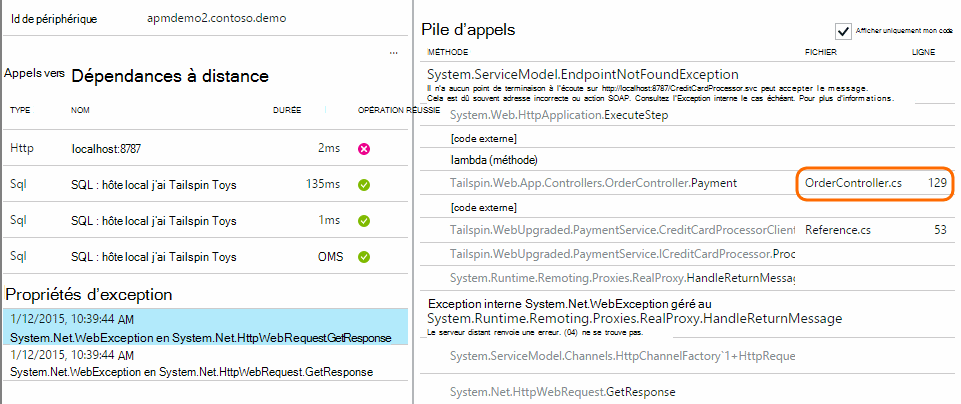

<properties 
    pageTitle="Utiliser la recherche Diagnostics | Microsoft Azure" 
    description="Rechercher et filtrer les événements individuels, requêtes et ouvrez une session traces." 
    services="application-insights" 
    documentationCenter=""
    authors="alancameronwills" 
    manager="douge"/>

<tags 
    ms.service="application-insights" 
    ms.workload="tbd" 
    ms.tgt_pltfrm="ibiza" 
    ms.devlang="na" 
    ms.topic="article" 
    ms.date="06/09/2016" 
    ms.author="awills"/>
 
# Utiliser la recherche Diagnostic dans perspectives d’Application

Recherche des diagnostics est une fonctionnalité [d’Analyse de l’Application] [ start] que vous utilisez pour rechercher et Explorer des éléments de télémétrie individuels, tels que des affichages de page exceptions ou web demandes. Et vous pouvez afficher le journal des traces et les événements que vous avez codé.

## L’endroit où vous voyez les Diagnostics de recherche ?

### Dans le portail Azure

Vous pouvez ouvrir explicitement recherche diagnostic :

Il s’ouvre également lorsque vous cliquez sur par le biais des graphiques et des éléments de la grille. Dans ce cas, ses filtres sont prédéfinis pour vous concentrer sur le type d’élément sélectionné. 

Par exemple, si votre application est un service web, la carte de vue d’ensemble affiche un graphique de volume de requêtes. Cliquez dessus et vous obtenez à un graphique plus détaillé, avec une annonce affichant le nombre de requêtes ont été apporté pour chaque URL. Cliquez sur n’importe quelle ligne, et vous obtenez une liste des requêtes individuelles pour cette URL :

Le corps principal de recherche Diagnostic est une liste d’éléments de télémétrie - demandes de serveur, page affichages, les événements personnalisés que vous avez codé et ainsi de suite. En haut de la liste est un résumé graphique affichant le nombre d’événements au fil du temps.

Événements généralement s’affichent dans Rechercher des diagnostics avant qu’ils apparaissent dans l’Explorateur métrique. Bien que la carte s’actualise à intervalles, vous pouvez cliquer sur Actualiser si vous êtes en attente d’un événement particulier.

### Dans Visual Studio

Ouvrez la fenêtre de recherche dans Visual Studio :

La fenêtre de recherche comporte les mêmes fonctionnalités que le portail web :

## Échantillonnages

Si votre application génère un grand nombre de télémétrie (et l’utilisation de la 2.0.0-beta3 version ASP.NET SDK ou version ultérieure), le module d’échantillonnage adapté réduit automatiquement le volume est envoyé au portail en envoyant qu’une fraction représentant des événements. Toutefois, les événements liés à la même demande seront être activés ou désactivées en tant que groupe, afin que vous pouvez vous déplacer entre les événements liés. 

[Découvrez les échantillonnages](app-insights-sampling.md).

## Inspecter des éléments individuels

Sélectionnez n’importe quel élément de télémétrie pour afficher les champs de clé et les éléments associés. Si vous voulez afficher l’ensemble des champs, cliquez sur « … ». 

Pour rechercher l’ensemble des champs, utilisez des chaînes de texte brut (sans les caractères génériques). Les champs disponibles dépendent du type de télémétrie.

## Créer un élément de travail

Vous pouvez créer un bogue dans Visual Studio Team Services avec les détails à partir de n’importe quel élément de télémétrie. 

La première fois que vous procédez ainsi, vous êtes invité à configurer un lien vers votre compte de Services d’équipe et le projet.

(Vous pouvez également accéder à la carte de configuration dans Paramètres > des éléments de travail.)

## Filtrer les types d’événements

Ouvrez la carte de filtre, puis sélectionnez les types d’événements que vous voulez voir. (Si, plus tard, vous souhaitez restaurer les filtres avec lequel vous avez ouvert la carte, cliquez sur Réinitialiser.)

Les types d’événements sont :

* **Trace** - journaux de Diagnostic, y compris les appels TrackTrace, log4Net, NLog et System.Diagnostic.Trace.
* **Demander** - demandes HTTP reçues par votre application serveur, y compris les pages, des scripts, des images, des fichiers de style et des données. Ces événements sont utilisés pour créer des graphiques de vue d’ensemble de la demande et réponse.
* **Mode Page** - télémétrie envoyé par le client web, utilisée pour créer la page Afficher les rapports. 
* **Custom Event** - si vous avez inséré des appels vers TrackEvent() afin de [surveiller l’utilisation de][track], vous pouvez y effectuer des recherches ici.
* **Exception** - exceptions non gérées sur le serveur et celles que vous vous connectez à l’aide de TrackException().

## Filtrer les valeurs de propriété

Vous pouvez filtrer les événements sur les valeurs de leurs propriétés. Les propriétés disponibles varient selon les types d’événements que vous avez sélectionné. 

Par exemple, sélectionnez les requêtes avec un code de réponse spécifique.

Ne choix d’aucune valeur d’une propriété particulière a le même effet que la sélection de toutes les valeurs ; il désactive le filtrage sur cette propriété.

### Affiner votre recherche

Notez que les nombres à droite de valeurs de filtre affichent le nombre d’occurrences il se trouvent dans le jeu filtré en cours. 

Dans cet exemple, il est clair que la `Reports/Employees` demander des résultats dans la plupart des messages de 500 Erreur :

En outre si vous voulez voir également les autres événements qui ont été activités pendant ce temps, vous pouvez vérifier les **événements inclure des propriétés non définies**.

## Supprimer des robots et tester le trafic web

Utilisez le filtre **le trafic réel ou synthétique** et vérifiez **réel**.

Vous pouvez également filtrer par **Source du trafic synthétique**.

## Inspecter des occurrences individuelles

Ajouter ce nom de requête à l’ensemble de filtre, et vous pouvez alors inspecter individuels occurrences de cet événement.

Pour les événements de requête, les détails de l’afficher les exceptions qui se sont produites pendant le traitement de la demande.

Cliquez sur via une exception pour afficher ses détails, y compris la trace de la pile.

## Rechercher des événements avec la même propriété

Rechercher tous les éléments avec la même valeur de propriété :

## Effectuer des recherches par valeur métrique

Obtenez tout le temps de réponse en demandes > 5 s.  Heures sont représentées dans les graduations : 10 000 graduations = 1 ms.

## Rechercher les données

Vous pouvez rechercher des termes dans une des valeurs de propriété. Cela s’avère particulièrement utile si vous avez écrit [des événements personnalisés] [ track] avec les valeurs de propriété. 

Vous souhaiterez peut-être définir une plage, comme les recherches portant sur une plage plus courte et sont plus rapides. 

Rechercher des termes, pas sous-chaînes. Termes sont des chaînes alphanumériques y compris certains éléments de ponctuation tels que «. » et « _ ». Par exemple :

magasin de termes|ne reconnaît *pas*|mais celles-ci ne correspondent pas
---|---|---
HomeController.About|à propos de accueil|h\*sur accueil\*
IsLocal|local est \*local|ISL\* IsLocal i\*l\*
Nouveau délai|w d|Nouveau retard n\* AND d\*

Voici les expressions de recherche que vous pouvez utiliser :

Exemple de requête | Effet 
---|---
ralentir|Rechercher tous les événements dans la plage de dates dont les champs incluent le terme « ralentissent »
base de données ?|Les correspondances Basededonnées01, databaseAB... ? n’est pas autorisée au début d’un terme de recherche.
base de données * |Correspond à la base de données, Basededonnées01, databaseNNNN  * non autorisé au début d’un terme de recherche
Apple et banane|Rechercher des événements qui contiennent les deux termes. Utiliser capital « et », pas « et ».
Apple banane OR banane Apple|Rechercher des événements qui contiennent des deux termes. Utilisez « Ou », non « ou ». < /br/ > courte formulaire.
Apple pas banane Apple-banane|Rechercher des événements qui contiennent un terme, mais pas dans l’autre. Forme abrégée.
application * AND banane-(grape pear)|Opérateurs logiques et les crochets.
« Métrique » : 0 à 500 « Métrique » : À 500 * | Rechercher des événements qui contiennent la mesure nommée au sein de la plage de valeurs.

## Enregistrer votre recherche

Lorsque vous avez défini tous les filtres que vous souhaitez, vous pouvez enregistrer la recherche comme favori. Si vous travaillez dans un compte professionnel, vous pouvez choisir si vous souhaitez le partager avec d’autres membres de l’équipe.

Pour voir la recherche, **accédez à la carte de vue d’ensemble** et ouvrir Favoris :

Si vous avez enregistré avec laps de temps Relative, la carte rouvert dispose des données les plus récentes. Si vous avez enregistré avec plage horaire absolue, vous voyez les mêmes données chaque fois.

## Envoyer de télémétrie plus analyse des applications

Outre la télémétrie de prédéfinies envoyé par Application Insights SDK, vous pouvez :

* Capturer les journaux à partir de votre infrastructure de journalisation favoris dans [.NET] [ netlogs] ou [Java][javalogs]. Cela signifie que vous pouvez effectuer des recherches dans vos traces journal et les faire correspondre aux affichages de page, des exceptions et d’autres événements. 
* [Écrire du code] [ track] pour envoyer des exceptions, des affichages de page et des événements personnalisés. 

[Découvrez comment envoyer les journaux et télémétrie personnalisé Application analyse][trace].

## Q & A

### La quantité de données est conservée ?

Jusqu'à 500 événements par seconde à partir de chaque application. Les événements sont conservés pendant sept jours.

### Comment puis-je afficher les données de publication dans Mes requêtes de serveur ?

Nous n’enregistre pas automatiquement les données de publication, mais vous pouvez utiliser [TrackTrace ou journal des appels][trace]. Placer les données de publication dans le paramètre de message. Vous ne pouvez pas filtrer sur le message comme vous pouvez le propriétés, mais la limite de taille est supérieure.

## Étapes suivantes

* [Envoyer les journaux et télémétrie personnalisé analyse des applications][trace]
* [Configurer la disponibilité et teste la réactivité][availability]
* [Résolution des problèmes][qna]

<!--Link references-->

[availability]: app-insights-monitor-web-app-availability.md
[javalogs]: app-insights-java-trace-logs.md
[netlogs]: app-insights-asp-net-trace-logs.md
[qna]: app-insights-troubleshoot-faq.md
[start]: app-insights-overview.md
[trace]: app-insights-search-diagnostic-logs.md
[track]: app-insights-api-custom-events-metrics.md

 