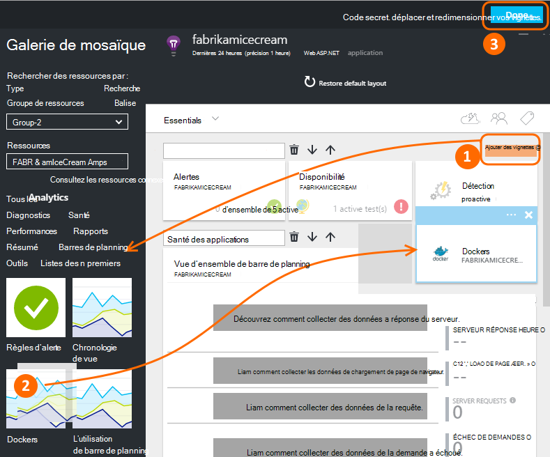
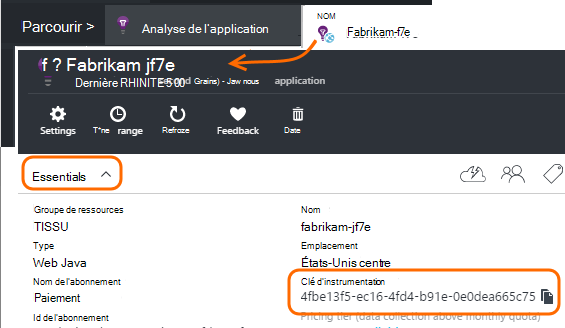
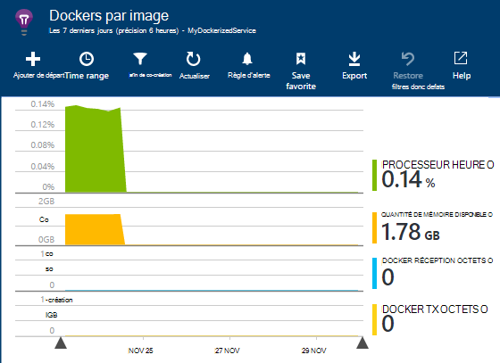
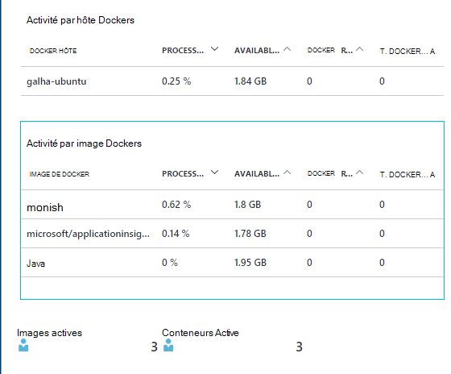
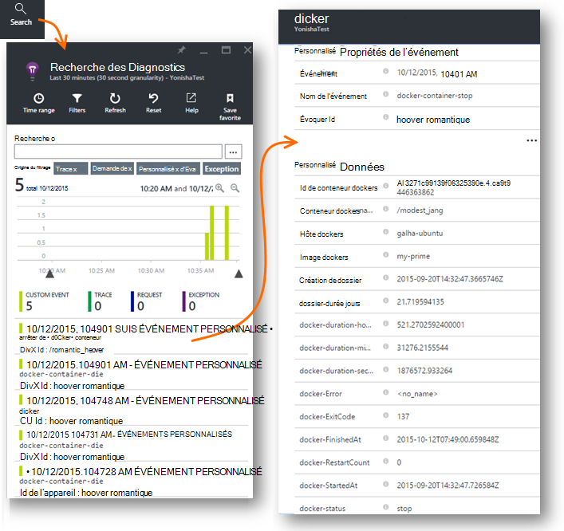
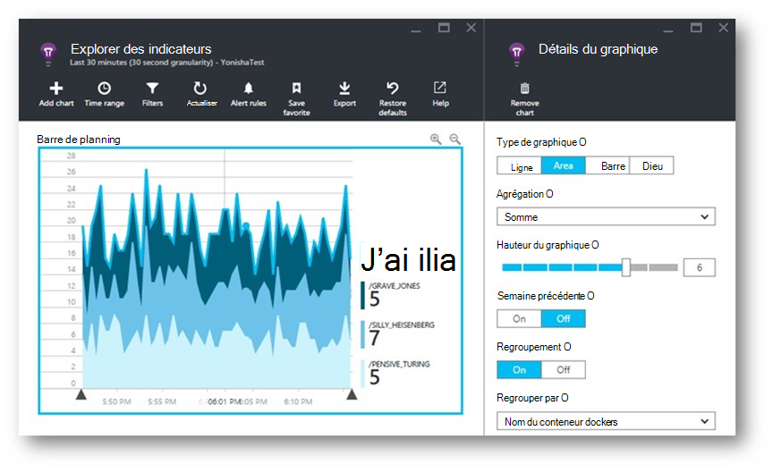
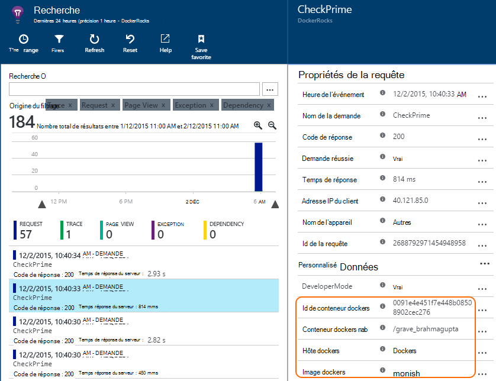
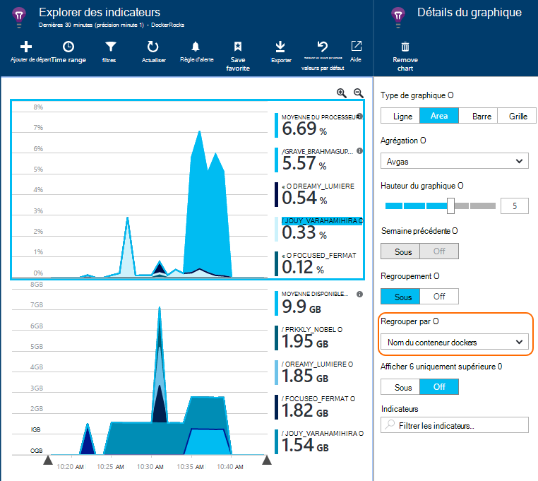

<properties 
    pageTitle="Surveiller des applications Docker dans perspectives d’Application" 
    description="Exceptions, les événements et compteurs de performance docker peuvent être affichées sur Insights d’Application, ainsi que la télémétrie à partir des applications en conteneur." 
    services="application-insights" 
    documentationCenter=""
    authors="alancameronwills" 
    manager="douge"/>

<tags 
    ms.service="application-insights" 
    ms.workload="tbd" 
    ms.tgt_pltfrm="ibiza" 
    ms.devlang="na" 
    ms.topic="article" 
    ms.date="12/01/2015" 
    ms.author="awills"/>
 
# <a name="monitor-docker-applications-in-application-insights"></a>Surveiller des applications Docker dans perspectives d’Application

Cycle de vie des événements et compteurs de performances des conteneurs [Docker](https://www.docker.com/) peuvent être représentées sur Application perspectives. Installer l’image de [l’Analyse des applications](app-insights-overview.md) dans un conteneur de votre hôte et affiche des compteurs de performance pour l’hôte, ainsi que pour les autres images.

Avec Docker vous distribuez vos applications dans conteneurs légers avec toutes les dépendances. Qu’elles s’exécutent sur n’importe quel ordinateur hôte qui s’exécute un moteur Docker.

Lorsque vous exécutez l' [Application Insights image](https://hub.docker.com/r/microsoft/applicationinsights/) sur votre hôte Docker, vous recevrez les avantages suivants :

* Cycle de vie télémétrie sur tous les conteneurs en cours d’exécution sur l’hôte - Démarrer, arrêter et ainsi de suite.
* Compteurs de performance pour tous les conteneurs. Processeur, la mémoire, l’utilisation du réseau et plus.
* Si vous avez [installé l’Application Insights SDK](app-insights-java-live.md) dans les applications en cours d’exécution dans les conteneurs, tous les télémétrie de ces applications ont des propriétés supplémentaires qui identifient l’ordinateur conteneur et de l’hôte. Par exemple, si vous avez des instances d’une application en cours d’exécution dans plusieurs hôtes, vous pouvez facilement en mesure de filtrer votre télémétrie application par hôte.


## <a name="set-up-your-application-insights-resource"></a>Configurer la ressource de perspectives d’Application

1. Connectez-vous à [Microsoft Azure Portal](https://azure.com) , puis ouvrez la ressource Application perspectives pour votre application ; ou [créez-en une](app-insights-create-new-resource.md). 

    *Quelle ressource dois-je utiliser ?* Si les applications en cours d’exécution sur votre hôte ont été développées par quelqu'un d’autre, vous devez [créer une nouvelle ressource Application perspectives](app-insights-create-new-resource.md). Il s’agit de l’endroit où vous permet d’afficher et d’analyser la télémétrie. (Sélectionnez « Autres » pour le type d’application).

    Mais si vous êtes le développeur des applications, puis nous espérons que vous avez [ajouté l’Application Insights SDK](app-insights-java-live.md) à chacun d’eux. S’ils sont tous les composants vraiment d’une application métier unique, puis vous pouvez configurer les envoyer de télémétrie à une ressource, et vous allez utiliser cette même ressource pour afficher les données Docker du cycle de vie et les performances. 

    Un troisième scénario est que vous avez développé la plupart des applications, mais que vous utilisez des ressources distinctes pour afficher leur télémétrie. Dans ce cas, vous devrez probablement que vous voulez également créer une ressource distincte pour les données Docker. 

2.  Ajouter la vignette Docker : cliquez sur **Ajouter la vignette**, faites glisser la vignette Docker à partir de la galerie, puis cliquez sur **terminé**. 

    


3. Cliquez sur le menu déroulant **Essentials** et copiez la clé d’Instrumentation. Vous allez utiliser cette pour indiquer le Kit de développement où envoyer son télémétrie.


    

Garder cette fenêtre de navigateur pratique, lorsque vous devez y revenir bientôt pour examiner votre télémétrie.


## <a name="run-the-application-insights-monitor-on-your-host"></a>Exécutez le moniteur Insights d’Application sur votre hôte
 
À présent que vous avez un emplacement pour afficher la télémétrie, vous pouvez configurer l’application en conteneur qui collecte et l’envoyer.

1.  Se connecter à votre hôte Docker. 
2.  Modifier votre clé instrumentation dans cette commande, puis exécutez-le :
 
    ```

    docker run -v /var/run/docker.sock:/docker.sock -d microsoft/applicationinsights ikey=000000-1111-2222-3333-444444444
    ```

Une seule image Insights Application est requise par hôte Docker. Si votre application est déployée sur plusieurs hôtes Docker, puis répétez la commande sur tous les hôtes.

## <a name="update-your-app"></a>Mettre à jour votre application

Si votre application est équipée de l' [Application Insights SDK pour Java](app-insights-java-get-started.md), ajoutez la ligne suivante dans le fichier ApplicationInsights.xml dans votre projet, sous la `<TelemetryInitializers>` élément :

```xml

    <Add type="com.microsoft.applicationinsights.extensibility.initializer.docker.DockerContextInitializer"/> 
```

Informations Docker comme conteneur et id d’hôte sont ajoutés à chaque élément de télémétrie envoyé à partir de votre application.

## <a name="view-your-telemetry"></a>Afficher votre télémétrie

Revenez à la ressource de perspectives d’Application dans le portail Azure.

Cliquez sur la vignette Docker.

Vous verrez bientôt des données en provenance de l’application Docker, surtout si vous avez d’autres conteneurs s’exécutant sur votre moteur Docker.


Voici quelques-unes des vues qu'accessible.

### <a name="perf-counters-by-host-activity-by-image"></a>Compteurs de performance par hôte, activité en image








Cliquez sur n’importe quel nom d’hôte ou une image pour plus de détails.


Pour personnaliser l’affichage, cliquez sur n’importe quel graphique, la grille de titre, ou utilisez Ajouter un graphique. 

[En savoir plus sur l’Explorateur indicateurs](app-insights-metrics-explorer.md).

### <a name="docker-container-events"></a>Événements de conteneur docker




Pour déterminer l’origine des événements individuels, cliquez sur [Rechercher](app-insights-diagnostic-search.md). Recherche et filtrage pour trouver les événements que vous souhaitez. Cliquez sur n’importe quel événement pour obtenir plus de détails.
 
### <a name="exceptions-by-container-name"></a>Exceptions par nom du conteneur
 



### <a name="docker-context-added-to-app-telemetry"></a>Contexte docker ajouté au télémétrie d’application

Demande de télémétrie envoyé à partir de l’application équipée AI SDK, enrichis avec contexte Docker :



Temps processeur et compteurs de performance de mémoire disponible, enrichies et regroupés par nom du conteneur Docker :





## <a name="q--a"></a>Q & A

*Que Application Insights Donnez-moi que je ne parviens pas à obtenir à partir de Docker ?*

* Description détaillée des compteurs en conteneur et image.
* Intégrer conteneur et application des données dans un tableau de bord.
* [Exportation de télémétrie](app-insights-export-telemetry.md) analyse approfondie à une base de données, Power BI ou tableau de bord.

*Comment obtenir télémétrie à partir de l’application elle-même ?*

* Installez les Kit de développement logiciel de perspectives Application dans l’application. Découvrez comment faire pour : [Java web apps](app-insights-java-get-started.md), des [applications web Windows](app-insights-asp-net.md).
