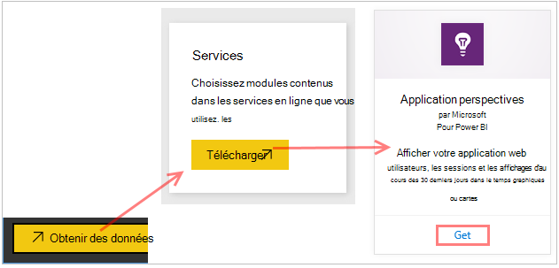
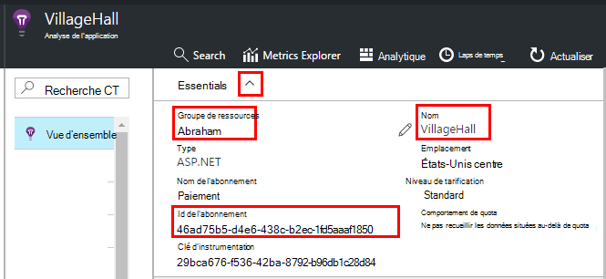
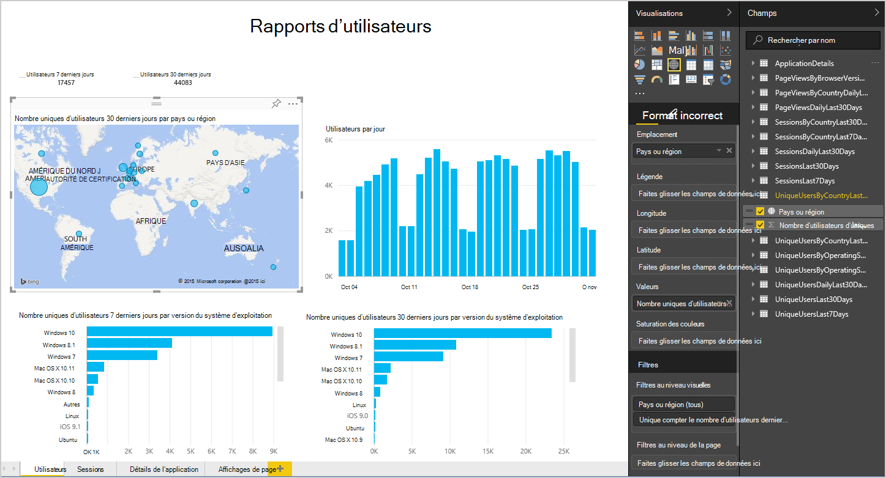
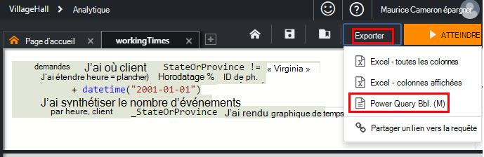
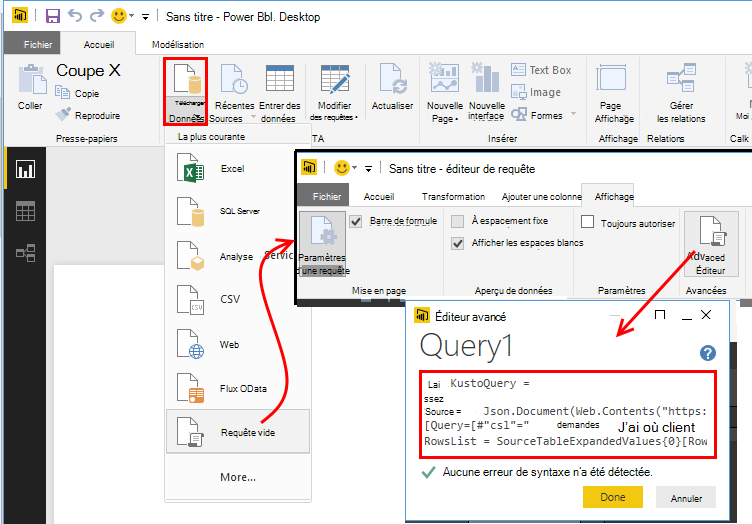
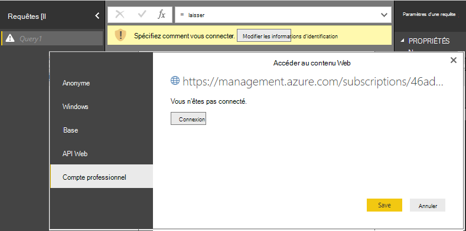
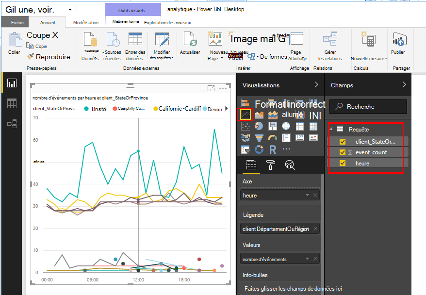
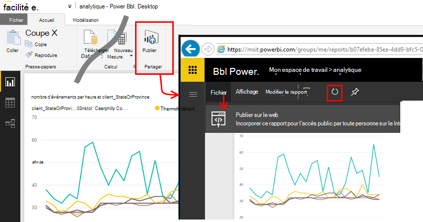

<properties 
    pageTitle="Exporter vers Power BI à partir de l’Application Insights | Microsoft Azure" 
    description="Requêtes Analytique peuvent être affichées dans Power BI." 
    services="application-insights" 
    documentationCenter=""
    authors="noamben" 
    manager="douge"/>

<tags 
    ms.service="application-insights" 
    ms.workload="tbd" 
    ms.tgt_pltfrm="ibiza" 
    ms.devlang="na" 
    ms.topic="article" 
    ms.date="10/18/2016" 
    ms.author="awills"/>

# Flux Power BI à partir de l’analyse des applications

[Power BI](http://www.powerbi.com/) est un ensemble d’outils analytique entreprise pour vous aider à analyser les données et les partager. Tableaux de bord enrichi est disponibles sur chaque appareil. Vous pouvez combiner les données provenant de nombreuses sources, y compris les requêtes Analytique à partir de [Visual Studio Application perspectives](app-insights-overview.md).

Il existe trois méthodes recommandées de l’exportation des données d’analyse de l’Application Power BI. Vous pouvez les utiliser séparément ou ensemble.

* [**Carte power BI**](#power-pi-adapter) - configurer un tableau de bord achevé de télémétrie depuis votre application. L’ensemble de graphiques est prédéfini, mais vous pouvez ajouter vos propres requêtes à partir de toutes les autres sources.
* [**Requêtes Analytique exporter**](#export-analytics-queries) - écrire une requête à l’aide d’Analytique, exporter pour Power BI. Vous pouvez placer cette requête dans un tableau de bord ainsi que d’autres données.
* [**Exportation continue et flux Analytique**](app-insights-export-stream-analytics.md) - cela implique plus de travail à configurer. Il est utile si vous souhaitez conserver vos données pour les périodes de temps. Dans le cas contraire, les autres méthodes sont recommandées.

## Adaptateur BI

Cette méthode crée un tableau de bord achevé de télémétrie pour vous. Le jeu de données initial est prédéfini, mais vous pouvez ajouter davantage de données à celle-ci.

### Obtenir la carte

1. Connexion à [Power BI](https://app.powerbi.com/).
2. Ouvrez **obtenir des données**, des **Services**, **Insights d’Application**

    

3. Entrez les détails de la ressource de perspectives d’Application.

    

4. Attendez une ou deux minutes pour les données à importer.

    

Vous pouvez modifier le tableau de bord, qui combine les graphiques d’analyse de l’Application avec celles d’autres sources et les requêtes Analytique. Il existe une galerie de visualisation où vous pouvez obtenir des graphiques plus et chaque graphique est doté d’un que vous pouvez définir des paramètres.

Après l’importation initiale, le tableau de bord et les rapports continuent à mettre à jour tous les jours. Vous pouvez contrôler la planification d’actualisation sur le jeu de données.

## Exporter des requêtes Analytique

Cet itinéraire vous permet d’écrire une requête Analytique vous aimez et puis qui exporter vers un tableau de bord Power BI. (Vous pouvez ajouter au tableau de bord créé par la carte.)

### Une fois : installer Power BI Desktop

Pour importer votre requête analyse de l’Application, vous utilisez la version de bureau de Power BI. Mais, puis vous pouvez le publier sur le web ou dans votre espace de travail de cloud Power BI. 

Installation de [Power BI Desktop](https://powerbi.microsoft.com/en-us/desktop/).

### Exporter une requête Analytique

1. [Analytique ouvert et écrivez votre requête](app-insights-analytics-tour.md).
2. Tester et affiner la requête jusqu'à ce que vous êtes satisfait avec les résultats.
3. Dans le menu **Exporter** , sélectionnez **Power BI (M)**. Enregistrez le fichier texte.

    
4. Dans Power BI Desktop sélectionnez **obtenir des données, requête vide** , puis dans l’éditeur de requête, sous **Afficher** **L’éditeur de requête avancée**.

    Collez le script M langue exporté dans l’éditeur de requête avancée.

    

5. Vous devrez peut-être fournir des informations d’identification pour permettre à Power BI accéder aux Azure. Utilisez 'compte d’organisation' pour vous connecter avec votre compte Microsoft.

    

6. Sélectionnez une visualisation pour votre requête, puis sélectionnez les champs pour l’axe des abscisses, axe des ordonnées et segmenter dimension.

    

7. Publier votre rapport sur votre espace de travail de cloud Power BI. À partir de là, vous pouvez incorporer une version synchronisée sur vos pages web.

    
 
8. Actualiser le rapport manuellement à des intervalles, ou configurer une actualisation planifiée dans la page options.

## À propos d’échantillonnage

Si votre application envoie un grand nombre de données, la fonctionnalité d’échantillonnage adapté peut-être fonctionner et envoyer uniquement un pourcentage de votre télémétrie. Il en est de même si vous avez défini manuellement d’échantillonnage dans le Kit de développement ou de réception. [Découvrez les échantillonnages.](app-insights-sampling.md)
 

## Étapes suivantes

* [Power BI - en savoir plus](http://www.powerbi.com/learning/)
* [Didacticiel Analytique](app-insights-analytics-tour.md)
