<properties 
    pageTitle="Utiliser flux Analytique pour traiter les données exportées à partir de l’analyse des applications | Microsoft Azure" 
    description="Flux Analytique en continu peut transformer, filtrer et acheminer les données que vous exportez à partir d’analyse de l’Application." 
    services="application-insights" 
    documentationCenter=""
    authors="noamben" 
    manager="douge"/>

<tags 
    ms.service="application-insights" 
    ms.workload="tbd" 
    ms.tgt_pltfrm="ibiza" 
    ms.devlang="na" 
    ms.topic="article" 
    ms.date="10/18/2016" 
    ms.author="awills"/>

# <a name="use-stream-analytics-to-process-exported-data-from-application-insights"></a>Utiliser flux Analytique pour traiter les données exportées à partir de l’analyse des applications

[Azure flux Analytique](https://azure.microsoft.com/services/stream-analytics/) est l’outil idéal pour le traitement des données [exporté à partir de l’analyse de l’Application](app-insights-export-telemetry.md). Flux Analytique pouvez extraire des données à partir d’une variété de sources. Il peut transformer et filtrer les données et à les diffuser puis à diverses de récepteurs.

Dans cet exemple, nous allons créer une carte qui extrait les données d’analyse de l’Application, renomme et traite certains champs injecte dans Power BI.

> [AZURE.WARNING] Il existe beaucoup plus facile et [méthodes recommandées pour afficher des données d’Application perspectives dans Power BI](app-insights-export-power-bi.md). Le chemin d’accès illustré ici est qu’un exemple pour illustrer comment traiter les données exportées.

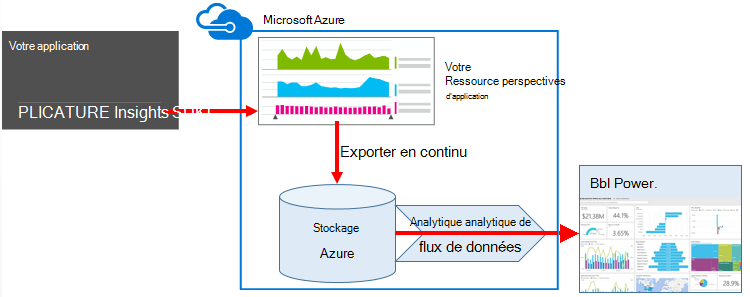


## <a name="create-storage-in-azure"></a>Créer un stockage dans Azure

Exportation continue génère toujours des données à un compte de stockage Azure, vous devez tout d’abord créer le stockage.

1.  Créer un compte de stockage « classique » dans votre abonnement dans le [portail Azure](https://portal.azure.com).

    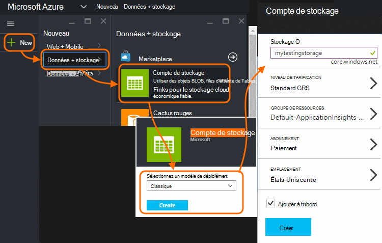

2. Créer un conteneur

    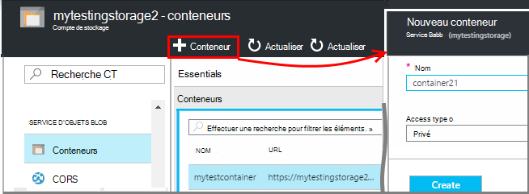

3. Copier la touche d’accès de stockage

    Vous en aurez besoin ultérieurement pour configurer l’entrée du service analytique flux.

    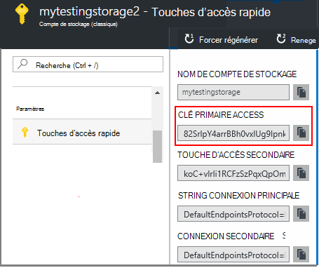

## <a name="start-continuous-export-to-azure-storage"></a>Démarrer exportation continue au stockage Azure

[Exporter continu](app-insights-export-telemetry.md) déplace les données d’analyse des applications dans le stockage Azure.

1. Dans le portail Azure, accédez à la ressource Application Insights que vous avez créé pour votre application.

    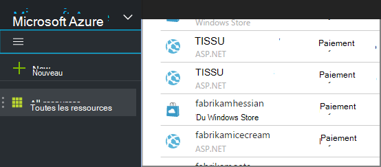

2. Créer une exportation continue.

    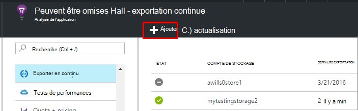


    Sélectionnez le compte de stockage que vous avez créée :

    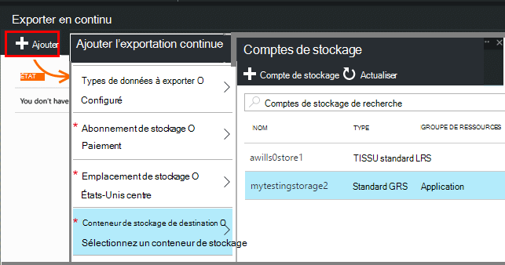
    
    Définir les types d’événements que vous voulez voir :

    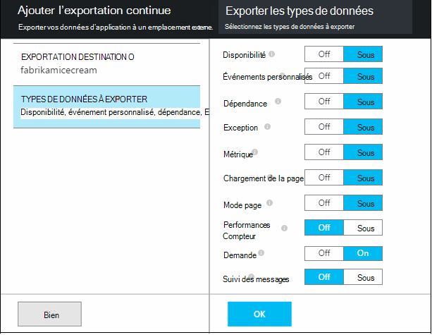

3. Laisser certaines données s’accumuler. Réunir revenir et permettre aux utilisateurs d’utiliser votre application depuis un certain temps. Télémétrie arriveront et vous verrez graphiques statistiques dans [l’Explorateur de métriques](app-insights-metrics-explorer.md) et événements individuels de [recherche de diagnostic](app-insights-diagnostic-search.md). 

    Et également, d’exportation de données à votre espace de stockage. 

4. Inspecter les données exportées. Dans Visual Studio, choisissez **Afficher / Cloud Explorer**, puis ouvrez Azure / stockage. (Si vous n’avez pas cette option de menu, vous devez installer le Kit de développement Azure : ouvrir la boîte de dialogue Nouveau projet et ouvrez c# / Cloud / obtenir Microsoft Azure SDK pour .NET.)

    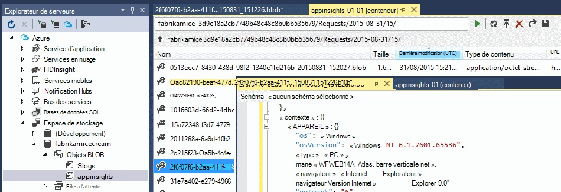

    Prenez note de la partie du nom du chemin d’accès, qui est dérivée de la clé de nom et d’instrumentation application commune. 

Les événements sont écrits sur blob des fichiers au format JSON. Chaque fichier peut contenir un ou plusieurs événements. Si nous aimerions lire les données d’événement et filtrer les champs que nous voulons. Il existe toutes sortes de choses que nous pourrions faire avec les données, mais notre plan aujourd'hui est d’utiliser les flux Analytique pour copier les données à Power BI.

## <a name="create-an-azure-stream-analytics-instance"></a>Créer une instance Azure flux Analytique

À partir du [Portail Azure classique](https://manage.windowsazure.com/), sélectionnez le service Azure flux Analytique et créez une nouvelle tâche de flux de données Analytique :


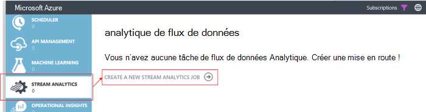


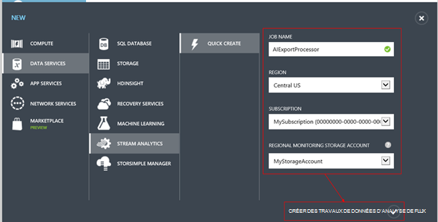

Lors de la création de la tâche, développer les détails :

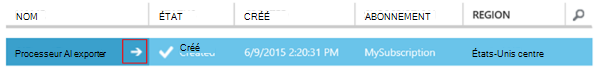


### <a name="set-blob-location"></a>Définir l’emplacement blob

Configurer à partir de votre blob exporter continue :

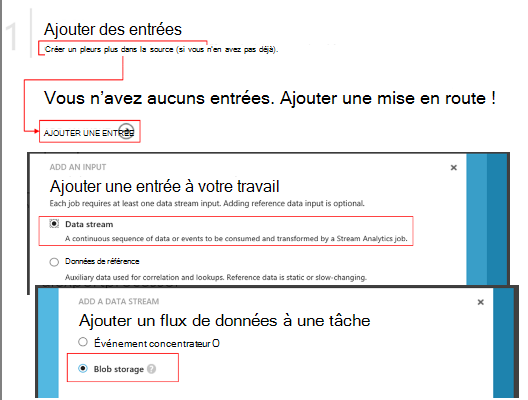

Désormais, vous devez la clé primaire Access à partir de votre compte de stockage, vous avez noté précédemment. Définir en tant que la clé de compte de stockage.

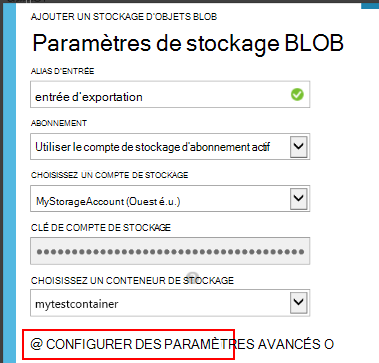

### <a name="set-path-prefix-pattern"></a>Modèle de préfixe défini chemin d’accès 

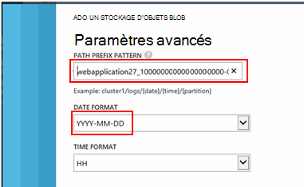


**Veillez à définir le Format de Date à AAAA-MM-JJ (avec tirets).**

Le modèle de préfixe chemin d’accès spécifie où flux Analytique trouve les fichiers d’entrée dans le stockage. Vous devez le configurer pour qu’elles correspondent à exporter continue le stockage des données. Définissez-le comme suit :

    webapplication27_12345678123412341234123456789abcdef0/PageViews/{date}/{time}

Dans cet exemple :

* `webapplication27`est le nom de la ressource de perspectives Application **minuscules**.
* `1234...`est la clé d’instrumentation de la ressource Application perspectives, **en omettant tirets**. 
* `PageViews`est le type de données que vous voulez analyser. Les types disponibles varient selon le filtre que vous définissez dans exporter continue. Examiner les données exportées pour afficher d’autres types disponibles et voir les [Exporter le modèle de données](app-insights-export-data-model.md).
* `/{date}/{time}`un motif écrit littéralement.

> [AZURE.NOTE] Vérifiez que l’espace de stockage pour vous assurer que vous obtenez le chemin d’accès approprié.

### <a name="finish-initial-setup"></a>Terminer la configuration initiale

Confirmez le format de sérialisation :

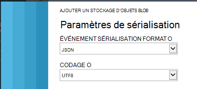

Fermez l’Assistant et attendez la configuration terminer.

> [AZURE.TIP] L’exemple de commande permet de télécharger des données. Conserver comme un échantillon déboguer votre requête.

## <a name="set-the-output"></a>Définissez la sortie

Sélectionnez votre travail et définissez la sortie.

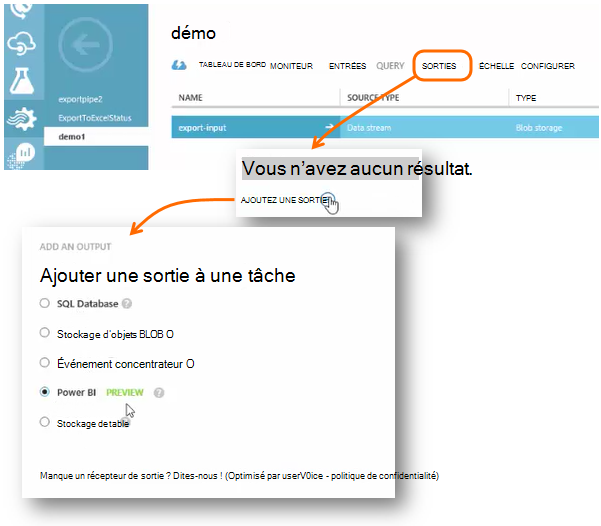

Fournir vos **scolaires ou compte** pour autoriser les flux Analytique pour accéder à votre ressource Power BI. Puis créer un nom pour la sortie et le jeu de données cible Power BI et la table.

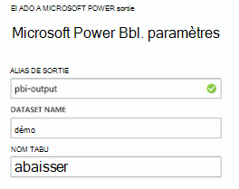

## <a name="set-the-query"></a>Définir la requête

La requête régit la traduction de l’entrée de sortie.

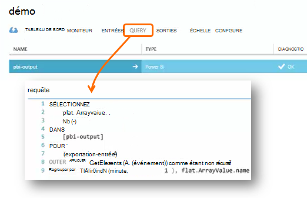


Utilisez la fonction de Test pour vérifier que vous obtenez le résultat approprié. Lui donner les exemples de données que vous avez prises à partir de la page entrées. 

### <a name="query-to-display-counts-of-events"></a>Requête pour afficher le nombre d’événements

Collez cette requête :

```SQL

    SELECT
      flat.ArrayValue.name,
      count(*)
    INTO
      [pbi-output]
    FROM
      [export-input] A
    OUTER APPLY GetElements(A.[event]) as flat
    GROUP BY TumblingWindow(minute, 1), flat.ArrayValue.name
```

* entrée d’exportation est l’alias que nous avons donné dans le flux d’entrée
* pbi sortie est l’alias de sortie que nous avons définie
* Nous utilisons [GetElements appliquer externe](https://msdn.microsoft.com/library/azure/dn706229.aspx) car le nom de l’événement se trouve dans un arrray JSON imbriquée. Sélectionnez sélectionne ensuite le nom de l’événement, ainsi que le nombre d’instances de ce nom dans la période de temps. La clause [Group By](https://msdn.microsoft.com/library/azure/dn835023.aspx) regroupe les éléments dans des périodes de temps d’une minute.


### <a name="query-to-display-metric-values"></a>Requête pour afficher les valeurs métriques


```SQL

    SELECT
      A.context.data.eventtime,
      avg(CASE WHEN flat.arrayvalue.myMetric.value IS NULL THEN 0 ELSE  flat.arrayvalue.myMetric.value END) as myValue
    INTO
      [pbi-output]
    FROM
      [export-input] A
    OUTER APPLY GetElements(A.context.custom.metrics) as flat
    GROUP BY TumblingWindow(minute, 1), A.context.data.eventtime

``` 

* Cette requête extrait dans la télémétrie métriques pour obtenir l’heure de l’événement et la valeur métrique. Les valeurs métriques sont à l’intérieur d’un tableau, afin que nous utiliser le modèle externe GetElements appliquer pour extraire les lignes. « myMetric » est le nom de la métrique dans ce cas. 

### <a name="query-to-include-values-of-dimension-properties"></a>Requête pour inclure des valeurs de propriétés de dimension

```SQL

    WITH flat AS (
    SELECT
      MySource.context.data.eventTime as eventTime,
      InstanceId = MyDimension.ArrayValue.InstanceId.value,
      BusinessUnitId = MyDimension.ArrayValue.BusinessUnitId.value
    FROM MySource
    OUTER APPLY GetArrayElements(MySource.context.custom.dimensions) MyDimension
    )
    SELECT
     eventTime,
     InstanceId,
     BusinessUnitId
    INTO AIOutput
    FROM flat

```

* Cette requête inclut les valeurs des propriétés de dimension sans selon une dimension particulier qui se trouve à un index fixé dans le tableau à une dimension.

## <a name="run-the-job"></a>Exécuter la tâche

Vous pouvez sélectionner une date passée pour démarrer la tâche à partir de. 

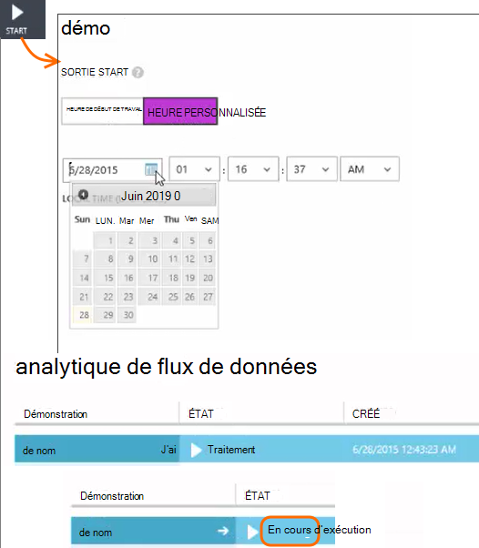

Attendez que la tâche est en cours d’exécution.

## <a name="see-results-in-power-bi"></a>Afficher les résultats dans Power BI

> [AZURE.WARNING] Il existe beaucoup plus facile et [méthodes recommandées pour afficher des données d’Application perspectives dans Power BI](app-insights-export-power-bi.md). Le chemin d’accès illustré ici est qu’un exemple pour illustrer comment traiter les données exportées.

Ouvrez Power BI avec votre travail ou scolaire compte, puis sélectionnez le jeu de données et la table que vous avez défini en tant que le résultat de la tâche de flux Analytique.

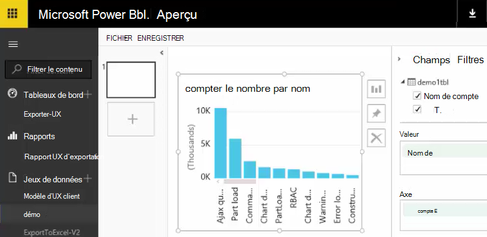

Vous pouvez désormais utiliser ce groupe de données dans les rapports et tableaux de bord dans [Power BI](https://powerbi.microsoft.com).


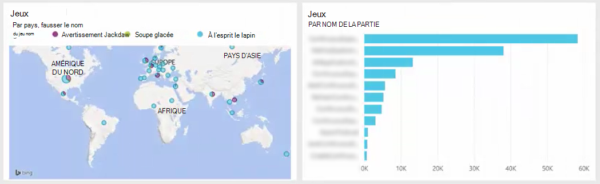


## <a name="no-data"></a>Aucune donnée ?

* Vérifiez que vous [Définissez le format de date](#set-path-prefix-pattern) correctement AAAA-MM-JJ (avec tirets).


## <a name="video"></a>Vidéo

Noam Ben Zeev montre comment traiter les données exportées à l’aide de flux de données Analytique.

> [AZURE.VIDEO export-to-power-bi-from-application-insights]

## <a name="next-steps"></a>Étapes suivantes

* [Exporter en continu](app-insights-export-telemetry.md)
* [Référence pour les types de propriétés et les valeurs de modèle de données détaillées.](app-insights-export-data-model.md)
* [Analyse de l’application](app-insights-overview.md)
* [Autres exemples et des procédures pas à pas](app-insights-code-samples.md)
 
