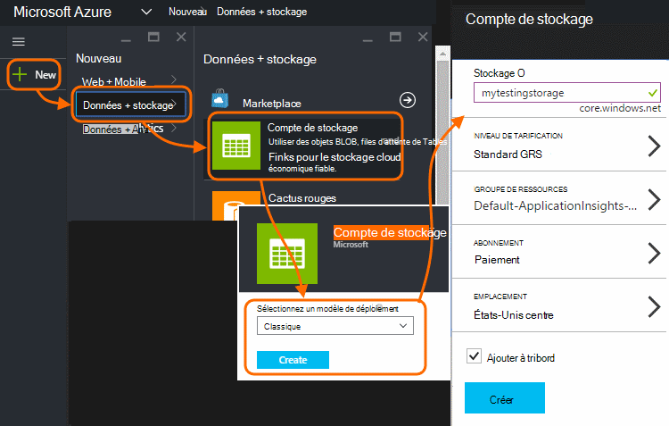

<properties 
    pageTitle="Exportation continue de télémétrie d’Application Insights | Microsoft Azure" 
    description="Exporter des données de diagnostic et l’utilisation de stockage dans Microsoft Azure, puis téléchargez-le à partir de cet emplacement." 
    services="application-insights" 
    documentationCenter=""
    authors="alancameronwills" 
    manager="douge"/>

<tags 
    ms.service="application-insights" 
    ms.workload="tbd" 
    ms.tgt_pltfrm="ibiza" 
    ms.devlang="na" 
    ms.topic="article" 
    ms.date="10/18/2016" 
    ms.author="awills"/>
 
# Exporter télémétrie à partir d’analyse de l’Application

Vous voulez conserver votre télémétrie pendant plus de la période de rétention standard ? Ou traiter d’une certaine manière spécialisée ? Exporter en continu est idéale pour cela. Les événements que vous voyez dans le portail d’analyse des applications peuvent être exportés vers le stockage dans Microsoft Azure au format JSON. À partir de là, vous pouvez télécharger vos données et écrire tout code que vous devez le traiter.  

Exporter continu est disponible dans la période d’évaluation gratuite et sur [Standard et Premium tarifs d’offre](https://azure.microsoft.com/pricing/details/application-insights/).

Avant de configurer exportation continue, il existe certaines solutions que vous souhaiterez à prendre en compte :

* [Bouton Exporter](app-insights-metrics-explorer.md#export-to-excel) l’en haut d’une carte métriques ou recherche vous permet de transférer des tables et des graphiques dans une feuille de calcul Excel. 
* [Analytique](app-insights-analytics.md) fournit un langage de requête puissantes de télémétrie et vous pouvez également exporter les résultats.
* Si vous cherchez à [Explorer vos données dans Power BI](http://blogs.msdn.com/b/powerbi/archive/2015/11/04/explore-your-application-insights-data-with-power-bi.aspx), vous pouvez le faire sans utiliser exporter continue.

## Créer un compte de stockage

Si vous n’avez pas un compte de stockage « classique », créez-le maintenant.

1. Créer un compte de stockage dans votre abonnement dans le [portail Azure](https://portal.azure.com).

    

2. Créer un conteneur.

    

## Configurer l’exporter continue

Sur la carte de vue d’ensemble de votre application dans le portail d’analyse de l’Application, ouvrez exporter continue : 

Ajouter une exportation continue, puis choisissez les types d’événements que vous souhaitez exporter :

Choisir ou créer le [compte de stockage Azure](../storage/storage-introduction.md) où vous voulez stocker les données :

Une fois que vous avez créé votre exportation, elle commence accédant. (Vous uniquement obtenez des données qui aboutit après avoir créé l’exportation.) 

Il peut être un délai d’environ une heure avant de données apparaissent dans le blob.

Si vous souhaitez modifier les types d’événements par la suite, modifiez simplement l’exportation :

Pour arrêter le flux de données, cliquez sur Désactiver. Lorsque vous cliquez sur Activer à nouveau, le flux de données redémarre avec de nouvelles données. Vous ne recevez pas les données qui est arrivé dans le portail alors que l’exportation a été désactivée.

Pour arrêter le flux de données définitivement, supprimez l’exportation. Cela ne supprime pas vos données à partir du stockage.

#### Impossible d’ajouter ou modifier une exportation ?

* Pour ajouter ou modifier les exportations, vous devez propriétaire, collaborateur ou Application Insights collaboration droits d’accès. [En savoir plus sur les rôles][roles].

## Quels événements pouvez-vous ?

Les données exportées sont la télémétrie brute que nous recevons à partir de votre application, sauf que nous ajouter des données d’emplacement qui nous calculent à partir de l’adresse IP du client. 

Données qui a été ignorées par [sondage](app-insights-sampling.md) ne sont pas incluses dans les données exportées.

D’autres mesures calculées ne sont pas inclus. Par exemple, nous n’exporter utilisation de l’UC moyenne, mais nous la télémétrie brute à partir de laquelle la moyenne est calculée.

Les données incluent également les résultats des [tests de site web de disponibilité](app-insights-monitor-web-app-availability.md) que vous avez configuré. 

> [AZURE.NOTE] **Échantillonnages.** Si votre application envoie un grand nombre de données et que vous utilisez le Kit de développement du Insights d’Application pour ASP.NET version 2.0.0-beta3 ou version ultérieure, la fonctionnalité d’échantillonnage adapté peut-être fonctionner et envoyer uniquement un pourcentage de votre télémétrie. [Découvrez les échantillonnages.](app-insights-sampling.md)

## Inspecter les données

Vous pouvez inspecter le stockage directement dans le portail. Cliquez sur **Parcourir**, sélectionnez votre compte de stockage et ouvrez **conteneurs**.

Pour vérifier si le stockage Azure dans Visual Studio, ouvrez **affichage**, **Cloud Explorer**. (Si vous n’avez pas cette commande de menu, vous devez installer le Kit de développement Azure : ouvrir la boîte de dialogue **Nouveau projet** , développez Visual c# / Cloud et choisissez **Obtenir Microsoft Azure SDK pour .NET**.)

Lorsque vous ouvrez votre Boutique blob, vous verrez un conteneur avec un jeu de fichiers blob. URI de chaque fichier dérivée de votre nom de la ressource Application perspectives, sa clé instrumentation, télémétrie-type/date/heure. (Le nom de la ressource est en minuscules l’ensemble, et la clé d’instrumentation omet tirets).

La date et l’heure sont au format UTC et sont lorsque la télémétrie a été enregistré dans la banque - pas le temps qu’il a été généré. Donc si vous écrivez du code pour télécharger les données, il peut se déplacer linéaire parmi les données.

Voici le formulaire du chemin d’accès :

    $"{applicationName}_{instrumentationKey}/{type}/{blobDeliveryTimeUtc:yyyy-MM-dd}/{ blobDeliveryTimeUtc:HH}/{blobId}_{blobCreationTimeUtc:yyyyMMdd_HHmmss}.blob"
  
Où 

-   `blobCreationTimeUtc`heure de création de blob dans interne est mis en œuvre stockage
-   `blobDeliveryTimeUtc`la fois quand blob est copié dans le stockage de destination d’exportation

## Format des données

* Chaque blob est un fichier texte qui contient plusieurs ' \n'-separated lignes. Il contient la télémétrie traitée sur une période d’environ la moitié une minute.
* Chaque ligne représente un point de données de télémétrie comme un affichage demande ou page.
* Chaque ligne est un document JSON non mis en forme. Si vous voulez réunir et infuse sur celui-ci, ouvrez dans Visual Studio et choisissez Modifier, options avancées, Format de fichier :

Durées sont en graduations, où de 10 000 graduations = 1 ms. Par exemple, ces valeurs indiquent une durée de 1 ms pour envoyer une demande à partir du navigateur, 3ms recevoir et 1.8s pour traiter la page dans le navigateur :

    "sendRequest": {"value": 10000.0},
    "receiveRequest": {"value": 30000.0},
    "clientProcess": {"value": 17970000.0}

[Référence pour les types de propriétés et les valeurs de modèle de données détaillées.](app-insights-export-data-model.md)

## Traitement des données

Sur une échelle de petite, vous pouvez écrire du code pour éclater vos données, lire dans une feuille de calcul et ainsi de suite. Par exemple :

    private IEnumerable<T> DeserializeMany<T>(string folderName)
    {
      var files = Directory.EnumerateFiles(folderName, "*.blob", SearchOption.AllDirectories);
      foreach (var file in files)
      {
         using (var fileReader = File.OpenText(file))
         {
            string fileContent = fileReader.ReadToEnd();
            IEnumerable<string> entities = fileContent.Split('\n').Where(s => !string.IsNullOrWhiteSpace(s));
            foreach (var entity in entities)
            {
                yield return JsonConvert.DeserializeObject<T>(entity);
            }
         }
      }
    }

Pour un échantillon de code plus large, voir [en utilisant un rôle de collaborateur][exportasa].

## Suppression de vos données anciennes
Veuillez noter que vous êtes responsable de la gestion de votre capacité de stockage et supprimer des données anciennes si nécessaire. 

## Si vous régénérez votre clé de stockage...

Si vous modifiez la clé à votre espace de stockage, exportation continue cesseront de fonctionner. Vous voyez une notification dans votre compte Azure. 

Ouvrez la carte exporter en continu et modifiez votre exportation. Modifier la Destination d’exportation, mais laissez le même stockage sélectionné. Cliquez sur OK pour confirmer.

L’exportation continue redémarre.

## Exemples d’exportation

* [Exporter vers SQL à l’aide d’un rôle de collaborateur][exportcode]
* [Exporter vers SQL à l’aide de flux de données Analytique][exportasa]
* [Exemple d’Analytique de flux de données 2](app-insights-export-stream-analytics.md)

Plus grande échelle, envisagez sur [HDInsight](https://azure.microsoft.com/services/hdinsight/) - Hadoop groupes dans le cloud. HDInsight fournit une variété de technologies d’assistance pour gérer et analyser des données volumineuses.

## Q & A

* *Mais tout ce que je veux est un téléchargement unique d’un graphique.*  
 
    Oui, vous pouvez le faire. En haut de la carte, cliquez sur [Exporter les données](app-insights-metrics-explorer.md#export-to-excel).

* *J’ai configuré une exportation, mais aucune donnée dans ma Boutique.*

    Application Insights reçue tout télémétrie de votre application dans la mesure où vous configurez l’exportation ? Vous recevrez uniquement les nouvelles données.

* *J’ai essayé de configurer une exportation, mais a été accès refusé*

    Si le compte appartient par votre organisation, vous devez être membre du groupe propriétaires ou des collaborateurs.

* *Puis-je exporter directement à mon propre magasin local ?* 

    Non, nous sommes désolés. Notre moteur d’exportation actuellement fonctionne uniquement avec stockage Azure pour le moment.  

* *Existe-t-il une limite pour la quantité de données que vous stockez dans ma Boutique ?* 

    Non. Nous allons conserver transmettre des données jusqu'à ce que vous supprimiez l’exportation. Nous allons arrêter si nous atteint la limite de stockage d’objets blob extérieure, mais qui est assez grande. C’est à vous permettent de contrôler la quantité de stockage que vous utilisez.  

* *Objets BLOB combien dois-je voir dans le stockage ?*

 * Pour chaque type de données que vous avez sélectionné à exporter, un nouveau blob est créé toutes les minutes (si les données sont disponibles). 
 * En outre, pour les applications ayant un trafic dense, partition supplémentaire d’unités sont affectées. Dans ce cas chaque unité crée un blob toutes les minutes.

* *J’ai régénérer la clé à mon espace de stockage ou modifié le nom du conteneur, et l’exportation ne fonctionne pas.*

    Modifier l’exportation et ouvrez la carte de destination d’exportation. Laissez le même stockage sélectionné comme avant, puis cliquez sur OK pour confirmer. Exportation va redémarrer. S’il s’agit dans les prochains jours précédents, vous ne pas perdre des données.

* *Puis-je suspendre l’exportation ?*

    Oui. Cliquez sur Désactiver.

## Exemples de code

* [Analyser JSON exporté à l’aide d’un rôle de collaborateur][exportcode]
* [Exemple d’Analytique de flux de données](app-insights-export-stream-analytics.md)
* [Exporter vers SQL à l’aide de flux de données Analytique][exportasa]

* [Référence pour les types de propriétés et les valeurs de modèle de données détaillées.](app-insights-export-data-model.md)

<!--Link references-->

[exportcode]: app-insights-code-sample-export-telemetry-sql-database.md
[exportasa]: app-insights-code-sample-export-sql-stream-analytics.md
[roles]: app-insights-resources-roles-access-control.md

 
