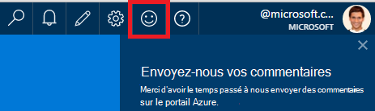
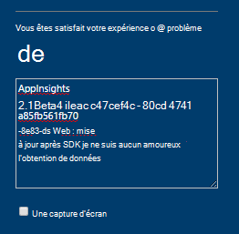
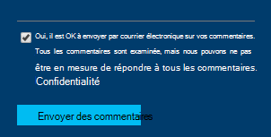

<properties 
    pageTitle="Comment obtenir un support technique à partir de l’équipe de développement de perspectives Application | Microsoft Azure" 
    description="Lorsque vous avez un cas nécessitant une prise en charge spéciale à partir de l’équipe de développement Application perspectives, voici comment vous pouvez envoyer les détails pour obtenir une assistance technique." 
    services="application-insights" 
    documentationCenter=""
    authors="alexbulankou" 
    manager="douge"/>
 
<tags 
    ms.service="application-insights" 
    ms.workload="tbd" 
    ms.tgt_pltfrm="ibiza" 
    ms.devlang="na" 
    ms.topic="article" 
    ms.date="06/01/2016" 
    ms.author="albulank"/>
    
# <a name="how-to-get-technical-support-from-application-insights-development-team"></a>Comment obtenir un support technique à partir de l’équipe de développement de perspectives d’Application
    
Lorsque vous avez un problème technique dans [Visual Studio Application perspectives](app-insights-overview.md), voici les options disponibles pour obtenir de l’aide :

## <a name="1-check-the-documents"></a>1. vérifier les documents

* Données manquantes ? Vérification : [échantillonnages](app-insights-sampling.md), [les quotas et la limitation](app-insights-pricing.md).
* Résolution des problèmes : [ASP.NET](app-insights-troubleshoot-faq.md) | [Java](app-insights-java-troubleshoot.md)

## <a name="2-search-the-forums"></a>2. dans les forums

* [Forum MSDN](https://social.msdn.microsoft.com/Forums/vstudio/home?forum=ApplicationInsights)
* [StackOverflow](http://stackoverflow.com/questions/tagged/ms-application-insights)

## <a name="3-azure-support-plan"></a>3. Plan d’assistance azure ?

Il existe des situations où vous voulez que les développeurs à votre cas spécifique. 

Si vous avez un [plan avec Microsoft Azure de prendre en charge](https://azure.microsoft.com/support/plans/) vous pouvez [Ouvrir un tickets de support](https://portal.azure.com/?#blade/Microsoft_Azure_Support/HelpAndSupportBlade).

## <a name="4-contact-the-application-insights-team"></a>4. Contactez l’équipe d’analyse des applications

Si vous n’avez pas un plan de support, notre équipe de développement est satisfait à offrir meilleure assistance aux clients de perspectives Application comme nous préparer pour le jalon officielle. Nous présentons **une nouvelle option de prise en charge**: vous pouvez décrire votre cas nous en envoyant un formulaire de commentaires dans Azure portail et un développeur sur le contact d’équipe Application Insights vous sauvegardez pour vous aider à résoudre votre problème.


1. Dans le [portail d’analyse de l’Application](https://portal.azure.com), cliquez sur l’émoticône dans le coin supérieur droit :  

       

2. Dans la zone de commentaire, veillez à spécifier **AppInsights** en tant que la première ligne et puis inclure les informations suivantes :   

    ```

    AppInsights   
    ikey: <instrumentation key>   
    sdk: <SDK that you are using, including name and version>  
    issue: <please describe the problem you are having>

    ```   

       

3. Vérifier que « Oui, il est OK pour envoyer un e-mail vous ». 

      

Un technicien de l’équipe Application Insights sera essaie de vous plus rapidement. Comme nous fournissons ce service sur mieux, aucune SLA formel ne peut être donné à ce stade.


