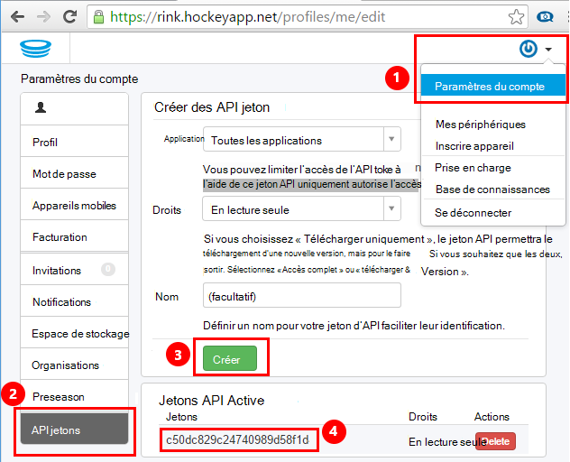
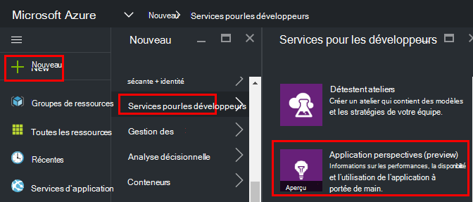
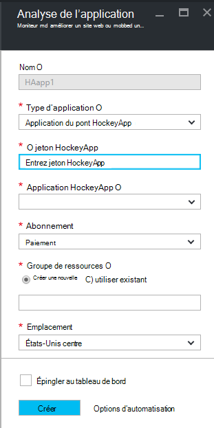
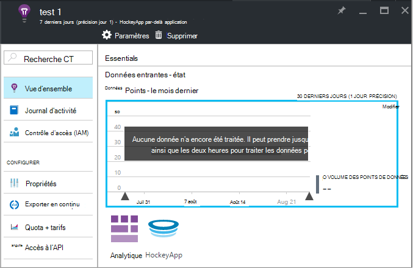
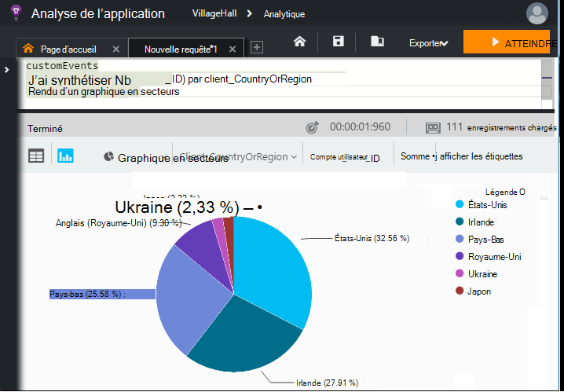

<properties 
    pageTitle="L’exploration des données HockeyApp dans perspectives Application | Microsoft Azure" 
    description="Analyser l’utilisation et les performances de votre application Azure avec des aperçus de l’Application." 
    services="application-insights" 
    documentationCenter="windows"
    authors="alancameronwills" 
    manager="douge"/>

<tags 
    ms.service="application-insights" 
    ms.workload="tbd" 
    ms.tgt_pltfrm="ibiza" 
    ms.devlang="na" 
    ms.topic="article" 
    ms.date="08/25/2016" 
    ms.author="awills"/>

#  L’exploration des données HockeyApp dans perspectives d’Application

[HockeyApp](https://azure.microsoft.com/services/hockeyapp/) est la plateforme recommandée pour l’analyse des applications de bureau et mobiles live. À partir de HockeyApp, vous pouvez envoyer personnalisé et suivi de télémétrie pour surveiller l’utilisation et aider diagnostic (en plus de l’obtention de données de blocage). Ce flux de données de télémétrie peut être interrogée à l’aide de la fonctionnalité [Analytique](app-insights-analytics.md) puissante de [Visual Studio Application perspectives](app-insights-overview.md). En outre, vous pouvez [Exporter personnalisé et télémétrie de suivi](app-insights-export-telemetry.md). Pour activer ces fonctionnalités, vous configurez un pont qui transfère les données HockeyApp analyse de l’Application.

## L’application HockeyApp pont

L’application de pont HockeyApp est les fonctionnalité principale qui permet d’accéder à vos données HockeyApp dans perspectives Application via l’Analytique et les fonctionnalités exporter continue. Toutes les données collectées par HockeyApp après la création de l’application de pont HockeyApp seront accessibles à partir de ces fonctionnalités. Voyons comment définir une de ces applications pont.

Dans HockeyApp, ouvrez Paramètres du compte, [API jetons](https://rink.hockeyapp.net/manage/auth_tokens). Créez un nouveau jeton ou réutiliser un existant. Les droits nécessaires minimum requis sont « en lecture seule ». Prendre une copie de l’API jeton.

Ouvrez le portail Microsoft Azure et [créez une ressource d’analyse de l’Application](app-insights-create-new-resource.md). Définir le Type d’Application à « Application du pont HockeyApp » :

Vous n’avez pas besoin de définir un nom : il sera automatiquement configuré à partir du nom de HockeyApp.

Les champs de pont HockeyApp apparaissent. 

Entrez le jeton HockeyApp que vous indiqué précédemment. Cette action remplit le menu déroulant « Application HockeyApp » avec toutes vos applications HockeyApp. Sélectionnez celle que vous souhaitez utiliser, puis complétez le reste des champs. 

Ouvrez la nouvelle ressource. 

Notez que les données prennent un certain temps pour démarrer s’étalant.

Voilà ! Toutes les données collectées dans votre application instrumentée HockeyApp à partir de ce point devient également disponibles dans les fonctionnalités Analytique et exporter continue de perspectives d’Application.

Passons brièvement en revue chacune de ces fonctionnalités désormais disponibles pour vous.

## Analytique

Analytique est un outil puissant pour interroger ad hoc de vos données, qui vous permet de diagnostiquer et analyser vos télémétrie et découvrir rapidement les causes et les modèles.

* [En savoir plus sur Analytique](app-insights-analytics-tour.md)
* [Présentation de la vidéo](https://channel9.msdn.com/events/Build/2016/T666)
* [Concepts avancés vidéo](https://channel9.msdn.com/Events/Build/2016/P591)

## Exporter en continu

Exportation continue vous permet d’exporter vos données dans un conteneur de stockage d’objets Blob Azure. C’est très utile si vous avez besoin maintenir ses données pendant plus de la période de rétention actuellement offerte par Application perspectives. Vous pouvez conserver les données dans le stockage blob, traiter dans une base de données SQL ou votre préférée solution de data warehouse.

[En savoir plus sur Exporter en continu](app-insights-export-telemetry.md)

## Étapes suivantes

* [Appliquer Analytique à vos données](app-insights-analytics-tour.md)

