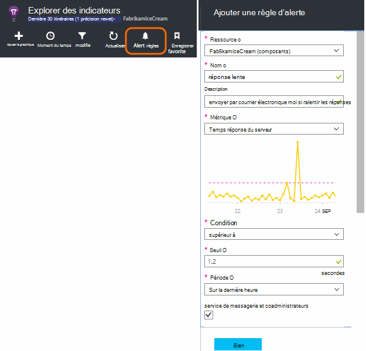
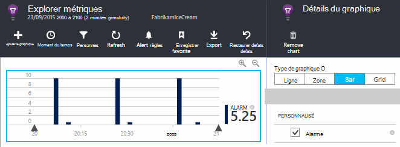
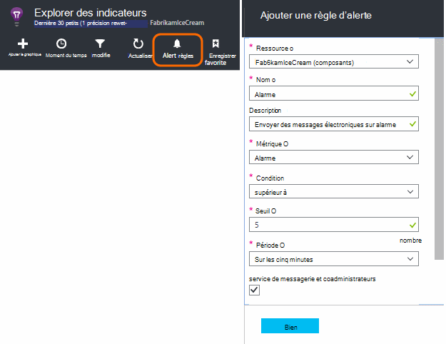
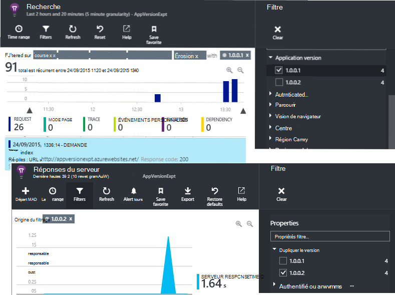
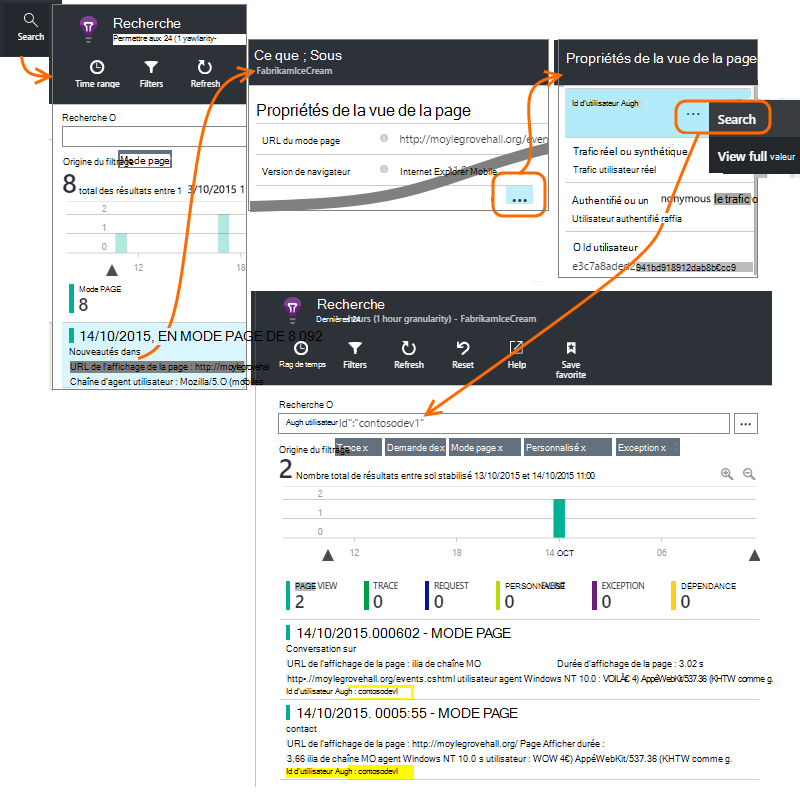
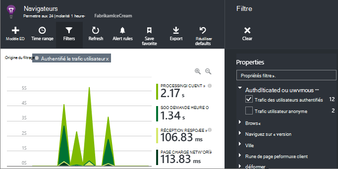
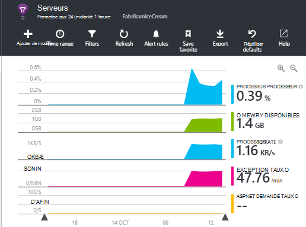

<properties 
    pageTitle="Comment puis-je... dans perspectives Application | Microsoft Azure" 
    description="Forum aux questions dans Application perspectives." 
    services="application-insights" 
    documentationCenter=""
    authors="alancameronwills" 
    manager="douge"/>

<tags 
    ms.service="application-insights" 
    ms.workload="tbd" 
    ms.tgt_pltfrm="ibiza" 
    ms.devlang="na" 
    ms.topic="article" 
    ms.date="02/05/2016" 
    ms.author="awills"/>

# <a name="how-do-i--in-application-insights"></a>Comment... dans perspectives d’Application ?

## <a name="get-an-email-when-"></a>Obtenir un message électronique lorsque...

### <a name="email-if-my-site-goes-down"></a>Envoyer par courrier électronique en cas de mon site vers le bas

Définir un [test web disponibilité](app-insights-monitor-web-app-availability.md).

### <a name="email-if-my-site-is-overloaded"></a>Envoyer par courrier électronique si mon site est surchargée

Définir une [alerte](app-insights-alerts.md) sur le **temps de réponse de serveur**. Un seuil compris entre 1 et 2 secondes devrait fonctionner.



Votre application peut également afficher des signes de déformation en renvoyant les codes d’erreur. Définir une alerte sur **demandes a échoué**.

Si vous souhaitez définir une alerte sur les **exceptions de serveur**, vous devrez effectuer [une installation supplémentaire](app-insights-asp-net-exceptions.md) afin de visualiser des données.

### <a name="email-on-exceptions"></a>Envoyer par courrier électronique sur les exceptions

1. [Configurer la surveillance des exceptions](app-insights-asp-net-exceptions.md)
2. [Définir une alerte](app-insights-alerts.md) sur le métrique Nb Exception


### <a name="email-on-an-event-in-my-app"></a>La messagerie sur un événement dans mon application

Supposons que vous voulez recevoir un courrier lorsqu’un événement spécifique se produit. Analyse de l’application ne fournit pas cette fonctionnalité directement, mais il peut [Envoyer une alerte lorsqu’une métrique dépasse un seuil](app-insights-alerts.md). 

Alertes peuvent être définies des [indicateurs personnalisés](app-insights-api-custom-events-metrics.md#track-metric), bien que les événements non personnalisés. Écrire du code pour augmenter un métrique lorsque l’événement se produit :

    telemetry.TrackMetric("Alarm", 10);

ou :

    var measurements = new Dictionary<string,double>();
    measurements ["Alarm"] = 10;
    telemetry.TrackEvent("status", null, measurements);

Alertes ayant deux États, vous devez envoyer une valeur faible lorsque vous envisagez l’alerte vers terminées :

    telemetry.TrackMetric("Alarm", 0.5);

Créer un graphique dans [l’Explorateur métrique](app-insights-metrics-explorer.md) pour afficher votre alarme :



Maintenant définir une alerte qui se déclenche lorsque la métrique dépasse une valeur STXT pour une période courte :




Définissez la durée moyennes au minimum. 

Vous recevrez les messages électroniques lorsque la métrique dépasse et sous le seuil.

Voici quelques points à prendre en compte :

* Une alerte possède deux États (« alerte » et « correct »). L’état est évalué uniquement lors de la réception d’une métrique.
* Un message électronique est envoyé uniquement lorsque l’état change. C’est pourquoi vous devez envoyer à la fois haute et faible valeur métrique. 
* Pour évaluer l’alerte, la moyenne est considérée des valeurs reçues pendant la période précédente. Cela se produit chaque fois qu’une métrique reçue, afin que les messages électroniques peuvent être envoyés plus fréquemment que la période que vous avez définie.
* Dans la mesure où les messages électroniques sont envoyés à la fois sur « alerte » et « correct », vous souhaiterez ré-penser votre événement usage unique comme condition deux États. Par exemple, au lieu d’un événement « travail terminé », avoir une condition « travail en cours », où vous obtenez des messages électroniques au début et fin d’une tâche.

### <a name="set-up-alerts-automatically"></a>Définir des alertes automatiquement

[Utiliser PowerShell pour créer de nouvelles alertes](app-insights-alerts.md#set-alerts-by-using-powershell)

## <a name="use-powershell-to-manage-application-insights"></a>Utiliser PowerShell pour gérer des perspectives d’Application

* [Créer des ressources](app-insights-powershell-script-create-resource.md)
* [Créer de nouvelles alertes](app-insights-alerts.md#set-alerts-by-using-powershell)

## <a name="application-versions-and-stamps"></a>Cachets et des versions

### <a name="separate-the-results-from-dev-test-and-prod"></a>Séparer les résultats de développement, de test et de production

* Pour l’autre environmnents, configurez ikeys différentes
* Pour différents tampons (développement, test, produit) ajouter des balises à la télémétrie avec différentes valeurs de propriété

[Pour en savoir plus](app-insights-separate-resources.md)
 

### <a name="filter-on-build-number"></a>Filtrer un numéro de version

Lorsque vous publiez une nouvelle version de votre application, vous souhaiterez pouvoir séparer la télémétrie de différentes versions.

Vous pouvez définir la propriété de Version de l’Application afin que vous pouvez filtrer les résultats de [recherche](app-insights-diagnostic-search.md) et [explorer métrique](app-insights-metrics-explorer.md) . 




Il existe différentes méthodes de définition de la propriété de Version de l’Application.

* Définir directement :

    `telemetryClient.Context.Component.Version = typeof(MyProject.MyClass).Assembly.GetName().Version;`

* Renvoyer à la ligne cette ligne dans un [initialiseur de télémétrie](app-insights-api-custom-events-metrics.md#telemetry-initializers) pour vous assurer que toutes les instances de TelemetryClient sont définies de façon homogène.

* (ASP.NET) Définir la version dans `BuildInfo.config`. Le module web chercher la version à partir du nœud BuildLabel. Inclure ce fichier dans votre projet et n’oubliez pas de définir la propriété toujours copier dans l’Explorateur de solutions.

    ```XML

    <?xml version="1.0" encoding="utf-8"?>
    <DeploymentEvent xmlns:xsi="http://www.w3.org/2001/XMLSchema-instance" xmlns:xsd="http://www.w3.org/2001/XMLSchema" xmlns="http://schemas.microsoft.com/VisualStudio/DeploymentEvent/2013/06">
      <ProjectName>AppVersionExpt</ProjectName>
      <Build type="MSBuild">
        <MSBuild>
          <BuildLabel kind="label">1.0.0.2</BuildLabel>
        </MSBuild>
      </Build>
    </DeploymentEvent>

    ```
* (ASP.NET) Générer automatiquement des BuildInfo.config dans MSBuild. Pour ce faire, ajoutez quelques lignes à votre fichier .csproj :

    ```XML

    <PropertyGroup>
      <GenerateBuildInfoConfigFile>true</GenerateBuildInfoConfigFile>    <IncludeServerNameInBuildInfo>true</IncludeServerNameInBuildInfo>
    </PropertyGroup> 
    ```

    Cette action génère un fichier nommé *yourProjectName*. BuildInfo.config. Le processus de publication renomme BuildInfo.config.

    L’étiquette de build contienne un espace réservé (AutoGen_...) quand vous créez avec Visual Studio. Mais lorsque créé avec MSBuild, il est rempli avec le numéro de version correct.

    Pour permettre à MSBuild générer les numéros de version, définissez la version comme `1.0.*` dans AssemblyReference.cs

## <a name="monitor-backend-servers-and-desktop-apps"></a>Surveiller les applications de bureau et les serveurs principaux

[Utiliser le module Windows Server SDK](app-insights-windows-desktop.md).


## <a name="visualize-data"></a>Visualiser des données

#### <a name="dashboard-with-metrics-from-multiple-apps"></a>Tableau de bord avec indicateurs à partir de plusieurs applications

* Dans l' [Explorateur de mesure](app-insights-metrics-explorer.md), personnaliser votre graphique et enregistrez-le en tant que favori. Épingler au tableau de bord Azure.


#### <a name="dashboard-with-data-from-other-sources-and-application-insights"></a>Tableau de bord avec des données provenant d’autres sources et les idées de l’Application

* [Exportation de télémétrie sur Power BI](app-insights-export-power-bi.md). 

Ou

* Utiliser SharePoint comme votre tableau de bord, affichage des données dans des composants WebPart SharePoint. [Utiliser d’exportation en continu et flux Analytique à exporter vers SQL](app-insights-code-sample-export-sql-stream-analytics.md).  Utilisez Power View pour examiner la base de données et créez un composant WebPart SharePoint pour Power View.


<a name="search-specific-users"></a>
### <a name="filter-out-anonymous-or-authenticated-users"></a>Filtrer les utilisateurs anonymes ou authentifiés

Si vos utilisateurs à vous connecter, vous pouvez définir l' [id utilisateur authentifié](app-insights-api-custom-events-metrics.md#authenticated-users). (Qu’il ne se produire automatiquement.) 

Vous pouvez ensuite :

* Effectuer une recherche sur un ID utilisateur spécifique



* Filtrer les mesures pour les utilisateurs anonymes ou authentifiés



## <a name="modify-property-names-or-values"></a>Modifier les noms de propriété ou les valeurs

Créer un [filtre](app-insights-api-filtering-sampling.md#filtering). Cela vous permet de modifier ou filtrer télémétrie avant d’être envoyé à partir de votre application analyse de l’Application.

## <a name="list-specific-users-and-their-usage"></a>Liste des utilisateurs spécifiques et leur utilisation

Si vous voulez simplement de [recherche pour des utilisateurs spécifiques](#search-specific-users), vous pouvez définir l' [id utilisateur authentifié](app-insights-api-custom-events-metrics.md#authenticated-users).

Si vous souhaitez une liste des utilisateurs avec des données telles que les pages qu’ils ont en ou la fréquence à laquelle ils se connecter, vous avez deux possibilités :

* [Jeu authentifié id d’utilisateur](app-insights-api-custom-events-metrics.md#authenticated-users), [Exporter vers une base de données](app-insights-code-sample-export-sql-stream-analytics.md) et l’utilisation des outils appropriés pour analyser vos données utilisateur il.
* Si vous avez uniquement un petit nombre d’utilisateurs, envoyez des événements personnalisés ou des mesures, en utilisant les données d’intérêt en tant que le nom d’événement ou valeur métrique et la définition de l’id utilisateur en tant que propriété. Pour analyser des affichages de page, remplacez l’appel de trackPageView JavaScript standard. Pour analyser télémétrie côté serveur, utiliser un initialiseur de télémétrie pour ajouter l’id utilisateur à tous les télémétrie de serveur. Vous pouvez ensuite métriques de filtre et segment et les recherches sur le nom d’utilisateur.


## <a name="reduce-traffic-from-my-app-to-application-insights"></a>Réduire le trafic à partir de mon application analyse des applications

* Dans [ApplicationInsights.config](app-insights-configuration-with-applicationinsights-config.md), désactivez les modules que vous n’avez pas besoin, tel le collecteur de compteur de performance.
* Utilisez [échantillonnages et le filtrage](app-insights-api-filtering-sampling.md) en le Kit de développement.
* Dans vos pages web, limiter le nombre d’appels Ajax reportée pour chaque mode page. Dans l’extrait de script après `instrumentationKey:...` , insérer : `,maxAjaxCallsPerView:3` (ou un nombre adéquat).
* Si vous utilisez [TrackMetric](app-insights-api-custom-events-metrics.md#track-metric), calculez l’agrégat des lots de valeurs métriques avant d’envoyer le résultat. Il existe une surcharge de TrackMetric() qui propose pour que.


En savoir plus sur les [prix et les quotas](app-insights-pricing.md).

## <a name="disable-telemetry"></a>Désactiver télémétrie

Pour **Arrêter dynamiquement et démarrer** la collection de sites et transmission de télémétrie à partir du serveur :

```

    using  Microsoft.ApplicationInsights.Extensibility;

    TelemetryConfiguration.Active.DisableTelemetry = true;
```


Pour **désactiver sélectionné collecteur standard** - par exemple, compteurs de performance, les requêtes HTTP ou dépendances - suppriment ou comment les lignes concernées [ApplicationInsights.config](app-insights-api-custom-events-metrics.md). Vous pouvez procéder, par exemple, si vous souhaitez envoyer vos propres données TrackRequest.


## <a name="view-system-performance-counters"></a>Affichage des compteurs de performance système

Parmi les mesures que vous pouvez afficher dans l’Explorateur de mesures est un ensemble de système compteurs de performance. Il existe une carte prédéfini intitulé **serveurs** qui affiche plusieurs d'entre eux.



### <a name="if-you-see-no-performance-counter-data"></a>Si vous ne voyez aucune donnée compteur de performance

* **Serveur IIS** sur votre ordinateur ou sur un ordinateur virtuel. [Installer le moniteur d’état](app-insights-monitor-performance-live-website-now.md). 
* **Site web azure** - nous ne prend pas en charge les compteurs de performance encore. Il existe plusieurs mesures que vous pouvez obtenir dans le cadre du Panneau de configuration de site web Azure standard.
* **Serveur UNIX** - [installer collectd](app-insights-java-collectd.md)

### <a name="to-display-more-performance-counters"></a>Pour afficher des compteurs de performance

* Tout d’abord, [Ajouter un nouveau graphique](app-insights-metrics-explorer.md) et vérifiez si le compteur est en basic défini que nous proposons.
* Si ce n’est pas le cas, [Ajoutez le compteur à l’ensemble collectée par le module de compteur de performances](app-insights-performance-counters.md).


