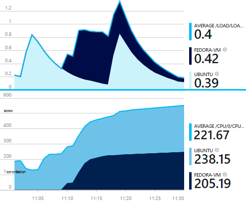
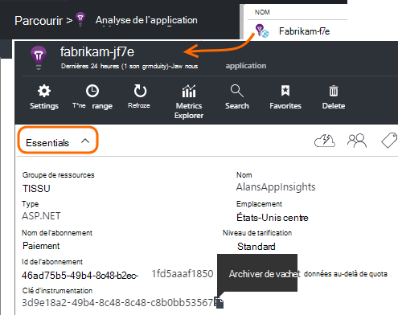
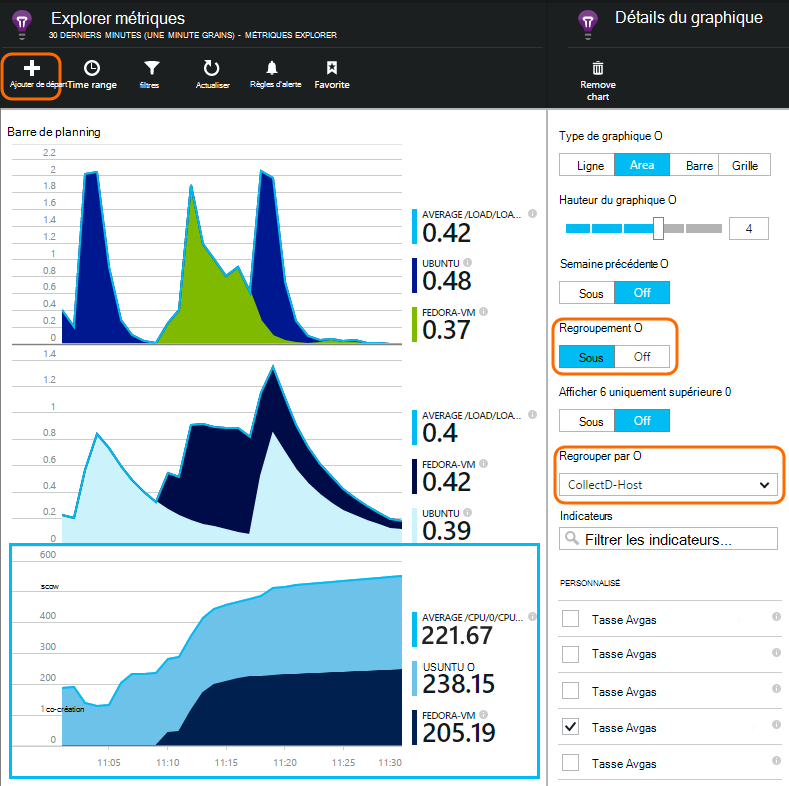

<properties 
    pageTitle="collectd : les statistiques de performance pour Java sous Unix dans perspectives d’Application" 
    description="-Surveillance de votre site Web Java avec le plug-in CollectD pour avoir un aperçu Application étendue" 
    services="application-insights" 
    documentationCenter="java"
    authors="alancameronwills" 
    manager="douge"/>

<tags 
    ms.service="application-insights" 
    ms.workload="tbd" 
    ms.tgt_pltfrm="ibiza" 
    ms.devlang="na" 
    ms.topic="article" 
    ms.date="08/24/2016" 
    ms.author="awills"/>
 
# <a name="collectd-unix-performance-metrics-in-application-insights"></a>collectd : métriques de performances Unix dans perspectives d’Application

*Analyse de l’application est en mode Aperçu.*

Pour Explorer les mesures de performances système Unix dans [Application perspectives](app-insights-overview.md), installez [collectd](http://collectd.org/), ainsi que ses idées Application plug-in. Cette solution open source regroupe différentes statistiques système et le réseau.

En règle générale vous utiliserez collectd si vous avez déjà [instrumentés votre service web Java avec des aperçus Application][java]. Il vous offre davantage de données pour vous aider à améliorer les performances de votre application ou diagnostiquer les problèmes. 



## <a name="get-your-instrumentation-key"></a>Obtenir votre clé d’instrumentation

Dans le [portail Microsoft Azure](https://portal.azure.com), ouvrez la ressource [Application Insights](app-insights-overview.md) où vous souhaitez faire apparaître les données. (Ou [créez une nouvelle ressource](app-insights-create-new-resource.md).)

Prendre une copie de la clé d’instrumentation, qui identifie la ressource.




## <a name="install-collectd-and-the-plug-in"></a>Installer le plug-in et collectd

Sur les serveurs Unix :

1. Installer [collectd](http://collectd.org/) version 5.4.0 ou version ultérieure.
2. Télécharger l' [Application Insights collectd writer plug-in](https://aka.ms/aijavasdk). Notez le numéro de version.
3. Copier le plug-in JAR dans `/usr/share/collectd/java`.
3. Modifier `/etc/collectd/collectd.conf`:
 * Vérifiez que [le plug-in Java](https://collectd.org/wiki/index.php/Plugin:Java) est activée.
 * Mettre à jour la JVMArg pour la java.class.path afin d’inclure le fichier JAR suivant. Mettre à jour le numéro de version pour correspondre à celui que vous avez téléchargé :
  * `/usr/share/collectd/java/applicationinsights-collectd-1.0.5.jar`
 * Ajoutez cet extrait, à l’aide de la clé d’Instrumentation à partir de la ressource :

```

     LoadPlugin "com.microsoft.applicationinsights.collectd.ApplicationInsightsWriter"
     <Plugin ApplicationInsightsWriter>
        InstrumentationKey "Your key"
     </Plugin>
```

Voici une partie d’un exemple de fichier de configuration :

    ...
    # collectd plugins
    LoadPlugin cpu
    LoadPlugin disk
    LoadPlugin load
    ...

    # Enable Java Plugin
    LoadPlugin "java"

    # Configure Java Plugin
    <Plugin "java">
      JVMArg "-verbose:jni"
      JVMArg "-Djava.class.path=/usr/share/collectd/java/applicationinsights-collectd-1.0.5.jar:/usr/share/collectd/java/collectd-api.jar"

      # Enabling Application Insights plugin
      LoadPlugin "com.microsoft.applicationinsights.collectd.ApplicationInsightsWriter"
                
      # Configuring Application Insights plugin
      <Plugin ApplicationInsightsWriter>
        InstrumentationKey "12345678-1234-1234-1234-123456781234"
      </Plugin>

      # Other plugin configurations ...
      ...
    </Plugin>
.   ...

Configurer d’autres [plug-ins collectd](https://collectd.org/wiki/index.php/Table_of_Plugins), permettant de recueillir différentes données issues de différentes sources.

Redémarrez collectd en fonction de son [manuel](https://collectd.org/wiki/index.php/First_steps).

## <a name="view-the-data-in-application-insights"></a>Affichez les données d’analyse de l’Application

Dans la ressource de perspectives de l’Application, ouvrez [Explorer métriques et ajouter des graphiques][metrics], sélectionner les mesures que vous voulez afficher à partir de la catégorie personnalisée.



Par défaut, les mesures sont regroupées sur tous les ordinateurs hôtes à partir de laquelle les mesures ont été collectées. Pour afficher les mesures par hôte, dans la carte de détails de graphique, activer le regroupement, puis choisissez Regrouper par CollectD hôte.


## <a name="to-exclude-upload-of-specific-statistics"></a>Exclure le téléchargement de statistiques spécifiques

Par défaut, le plug-in Application Insights envoie toutes les données collectées par toutes le collectd activé « lecture » plug-ins. 

Pour exclure des données à partir de sources de données ou les plug-ins spécifiques :

* Modifier le fichier de configuration. 
* Dans `<Plugin ApplicationInsightsWriter>`, ajouter des lignes directives comme suit :

Directive | Effet
---|---
`Exclude disk` | Exclure toutes les données collectées par le `disk` plug-in
`Exclude disk:read,write` | Exclure les sources nommés `read` et `write` à partir de la `disk` plug-in.

Directives particulières avec un saut de ligne.


## <a name="problems"></a>Problèmes ?

*Je ne vois pas les données dans le portail*

* Ouvrir la [recherche] [ diagnostic] pour voir si les événements brutes arrivés. Il faut parfois attendre plus de temps apparaissent dans l’Explorateur de mesures.
* Vous devrez peut-être [définir des exceptions de pare-feu pour les messages sortants](app-insights-ip-addresses.md)
* Activer le suivi dans le plug-in Application perspectives. Ajoutez cette ligne au sein de `<Plugin ApplicationInsightsWriter>`:
 *  `SDKLogger true`
* Ouvrez un terminal et démarrez collectd en mode détaillé, pour afficher des problèmes qu'il signale :
 * `sudo collectd -f`


<!--Link references-->

[api]: app-insights-api-custom-events-metrics.md
[apiexceptions]: app-insights-api-custom-events-metrics.md#track-exception
[availability]: app-insights-monitor-web-app-availability.md
[diagnostic]: app-insights-diagnostic-search.md
[eclipse]: app-insights-java-eclipse.md
[java]: app-insights-java-get-started.md
[javalogs]: app-insights-java-trace-logs.md
[metrics]: app-insights-metrics-explorer.md
[usage]: app-insights-web-track-usage.md

 
