<properties 
    pageTitle="Prise en main Application analyse avec Java dans Éclipse" 
    description="Le plug-in Eclipse permet d’ajouter analyse des performances et l’utilisation pour votre site Web avec des aperçus Application Java" 
    services="application-insights" 
    documentationCenter="java"
    authors="alancameronwills" 
    manager="douge"/>

<tags 
    ms.service="application-insights" 
    ms.workload="tbd" 
    ms.tgt_pltfrm="ibiza" 
    ms.devlang="na" 
    ms.topic="article" 
    ms.date="03/02/2016" 
    ms.author="awills"/>
 
# Prise en main Application analyse avec Java dans Éclipse

Le Kit de développement de perspectives Application envoie télémétrie à partir de votre application web Java afin que vous pouvez analyser l’utilisation et les performances. Le plug-in pour avoir un aperçu Application Eclipse installe automatiquement le Kit de développement de votre projet afin que vous tirer parti de télémétrie de la zone, plus une API que vous pouvez utiliser pour écrire télémétrie personnalisé.   

## Conditions préalables

Actuellement le plug-in works pour Maven projets et dynamique Web dans Eclipse. ([Ajouter Application Insights à d’autres types de projet Java][java].)

Vous devez :

* Oracle JRE 1,6 ou version ultérieure
* Un abonnement à [Microsoft Azure](https://azure.microsoft.com/). (Vous pouvez démarrer avec la [version d’évaluation gratuite](https://azure.microsoft.com/pricing/free-trial/).)
* [Eclipse IDE pour les développeurs Java EE](http://www.eclipse.org/downloads/), Indigo ou version ultérieure.
* Windows 7 ou version ultérieure, ou Windows Server 2008 ou version ultérieure

## Installez le Kit de développement sur Eclipse (une fois)

Vous ne devez effectuer cette fois par ordinateur. Cette étape installe un ensemble d’outils qui peut ajouter puis le Kit de développement pour chaque projet Web dynamique.

1. Dans Eclipse, cliquez sur aide, installer un nouveau logiciel.

    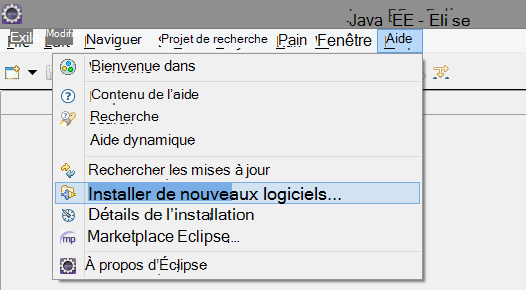

2. Le Kit de développement est http://dl.windowsazure.com/eclipse, sous boîte à outils Azure. 
3. Décochez la case **tous les sites de mise à jour des contacts...**

    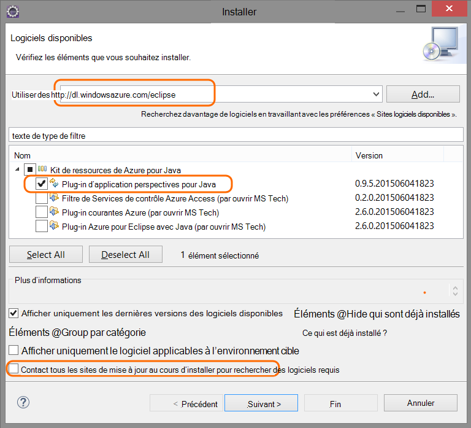

Suivez les étapes restantes pour chaque projet Java.

## Création d’une ressource d’Application Insights dans Azure

1. Connectez-vous au [portail Azure](https://portal.azure.com).
2. Créer une nouvelle ressource Application perspectives.  

      
3. Définissez le type d’application sur application web Java.  

    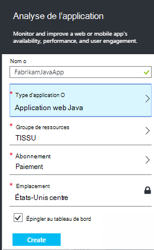  
4. Recherchez la clé d’instrumentation de la nouvelle ressource. Vous devez coller dans votre projet de code peu de temps.  

      

## Ajouter des perspectives d’Application à votre projet

1. Ajouter des perspectives d’Application dans le menu contextuel de votre projet web Java.

    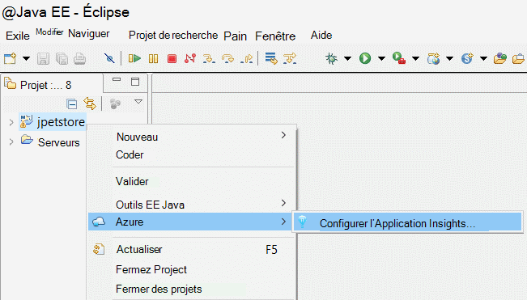

2. Coller la clé instrumentation que vous avez obtenu à partir du portail Azure.

    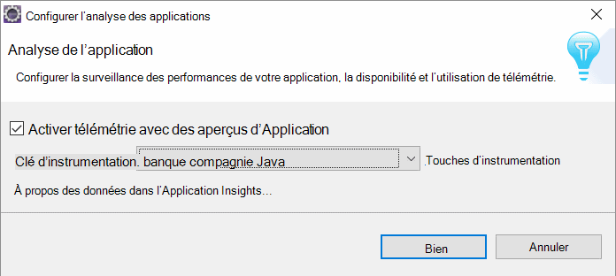

La clé est envoyée en même temps que chaque élément de télémétrie et vous explique Application perspectives pour l’afficher dans la ressource.

## Exécutez l’application et voir métriques

Exécuter votre application.

Revenir à la ressource Application Insights dans Microsoft Azure.

Demande HTTP des données seront affichent sur la carte de vue d’ensemble. (Si elle n’est pas il, attendez quelques secondes, puis sur Actualiser.)

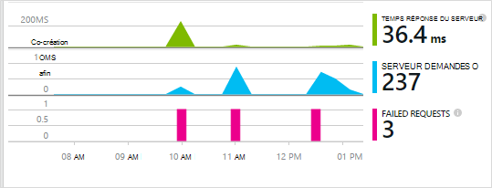
 

Cliquez dans un graphique quelconque pour afficher plus d’indicateurs. 

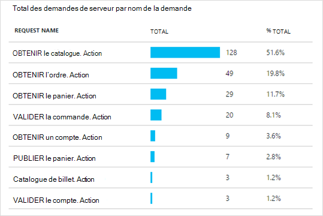

[En savoir plus sur les mesures.][metrics]

 

Et lorsque vous affichez les propriétés d’une requête, vous pouvez voir les événements de télémétrie associés tels que les demandes et les exceptions.
 
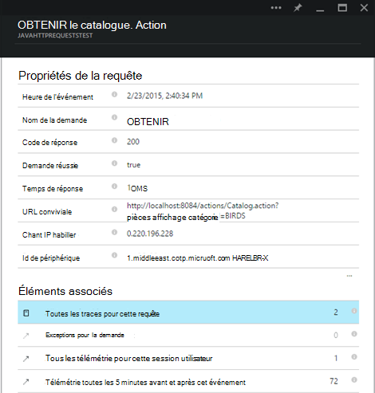

## Télémétrie côté client

À partir de la carte de démarrage rapide, cliquez sur obtenir le code pour contrôler Mes pages web : 

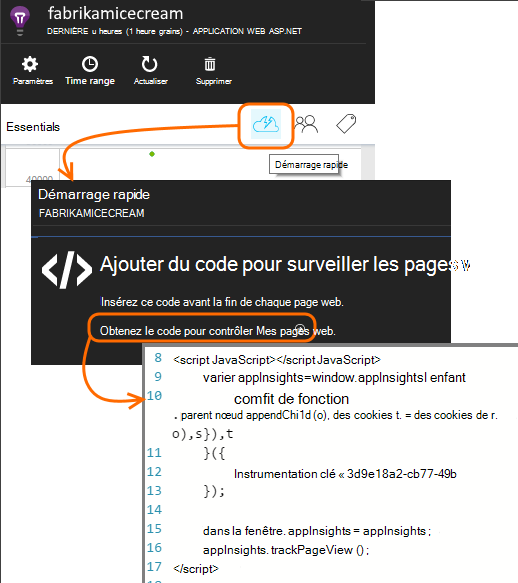

Insérez l’extrait de code dans l’en-tête de vos fichiers HTML.

#### Afficher les données côté client

Ouvrez vos pages web mis à jour et les utiliser. Attendre une minute ou deux, puis retournez analyse de l’Application et ouvrez la carte de l’utilisation. (À partir de la carte de la vue d’ensemble, faites défiler vers le bas et cliquez sur utilisation.)

Mesures de vue, utilisateur et la session de la page seront affichent sur la carte de l’utilisation :

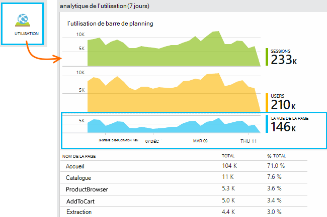

[En savoir plus sur la configuration de télémétrie côté client.][usage]

## Publiez votre application

Publier maintenant votre application sur le serveur, utilisez permettre aux utilisateurs et Espion la télémétrie apparaissant sur le portail.

* Vérifiez que votre pare-feu permet à votre application envoyer de télémétrie à ces ports :

 * DC.Services.VisualStudio.com:443
 * DC.Services.VisualStudio.com:80
 * F5.Services.VisualStudio.com:443
 * F5.Services.VisualStudio.com:80

* Sur les serveurs de Windows, installez :

 * [Microsoft Visual C++ redistribuable](http://www.microsoft.com/download/details.aspx?id=40784)

    (Ainsi, compteurs de performance.)

## Exceptions et échecs de requêtes

Exceptions non gérées sont collectées automatiquement :

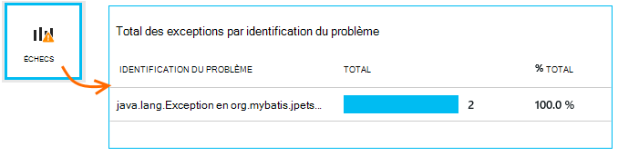

Pour collecter les données sur les autres exceptions, vous avez deux possibilités :

* [Insérer des appels à TrackException dans votre code](app-insights-api-custom-events-metrics.md#track-exception). 
* [Installer l’Agent Java sur votre serveur](app-insights-java-agent.md). Vous spécifiez les méthodes que vous souhaitez examiner.

## Surveiller les appels de méthode et les dépendances externes

[Installer l’Agent Java](app-insights-java-agent.md) pour ouvrir une session spécifié méthodes internes et les appels effectués via JDBC, avec des données de minutage.

## Compteurs de performance

Sur votre carte de la vue d’ensemble, faites défiler vers le bas, puis cliquez sur la vignette de **serveurs** . Vous verrez une plage de compteurs de performance.

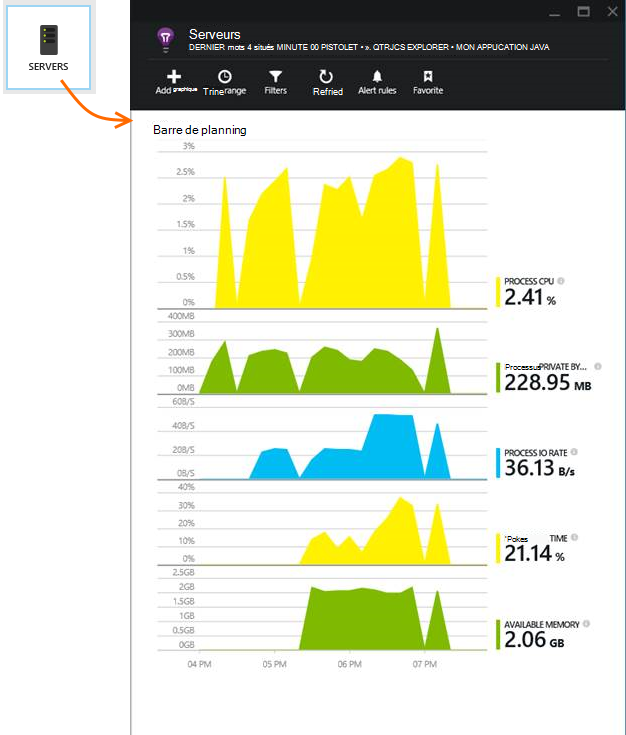

### Personnalisation de la collecte de compteur de performances

Pour désactiver la collecte de l’ensemble standard de compteurs de performance, ajoutez le code suivant sous le nœud racine du fichier ApplicationInsights.xml :

    <PerformanceCounters>
       <UseBuiltIn>False</UseBuiltIn>
    </PerformanceCounters>

### Collecter des compteurs de performance supplémentaires

Vous pouvez spécifier des compteurs de performance supplémentaires pour être collectés.

#### Compteurs JMX (exposés par la Machine virtuelle Java)

    <PerformanceCounters>
      <Jmx>
        <Add objectName="java.lang:type=ClassLoading" attribute="TotalLoadedClassCount" displayName="Loaded Class Count"/>
        <Add objectName="java.lang:type=Memory" attribute="HeapMemoryUsage.used" displayName="Heap Memory Usage-used" type="composite"/>
      </Jmx>
    </PerformanceCounters>

*   `displayName`– Le nom affiché dans le portail d’analyse de l’Application.
*   `objectName`– Le nom de l’objet JMX.
*   `attribute`– L’attribut de l’objet JMX pour récupérer
*   `type`(facultatif) - le type d’attribut l’objet JMX :
 *  Par défaut : type simple tel qu’int ou long.
 *  `composite`: les données de compteur de performance sont au format « Attribute.Data »
 *  `tabular`: les données de compteur de performance figurent dans le format d’une ligne de tableau

#### Compteurs de performance Windows

Chaque [compteur de performance Windows](https://msdn.microsoft.com/library/windows/desktop/aa373083.aspx) est un membre d’une catégorie (de la même façon qu’un champ est un membre d’une classe). Catégories peut être globales, ou peuvent avoir numérotées ou instances nommées.

    <PerformanceCounters>
      <Windows>
        <Add displayName="Process User Time" categoryName="Process" counterName="%User Time" instanceName="__SELF__" />
        <Add displayName="Bytes Printed per Second" categoryName="Print Queue" counterName="Bytes Printed/sec" instanceName="Fax" />
      </Windows>
    </PerformanceCounters>

*   nom complet – le nom affiché dans le portail d’analyse de l’Application.
*   nom de la catégorie – la catégorie de compteur de performance (objet de performance) à laquelle ce compteur de performance est associé.
*   counterName – le nom du compteur de performance.
*   instanceName – le nom de l’instance de catégorie de compteur de performance, ou une chaîne vide (« »), si la catégorie contient une seule instance. Si le nom de la catégorie est processus et le compteur de performance que vous voulez collecter du processus en cours de la machine virtuelle Java sur lequel votre application est en cours d’exécution, spécifiez `"__SELF__"`.

Vos compteurs de performance sont représentés sous forme de mesures personnalisées dans [l’Explorateur de mesures][metrics].

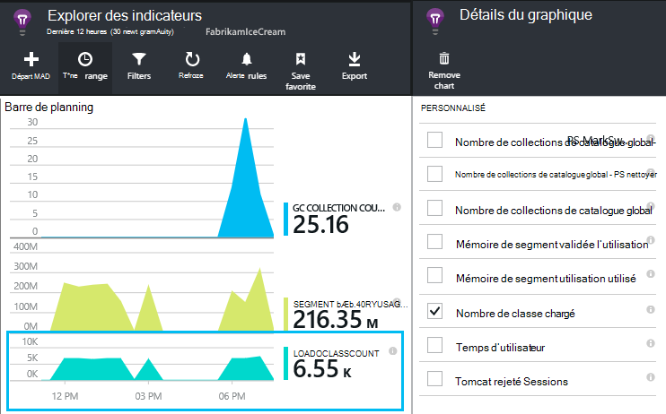

### Compteurs UNIX

* [Installer collectd avec le plug-in Application perspectives](app-insights-java-collectd.md) pour obtenir un large éventail de données système et le réseau.

## Disponibilité des tests de site web

Analyse de l’application permet de tester votre site Web à intervalles réguliers pour vérifier qu’il s’agit des et répondre bien. [Configurer][availability], faites défiler vers le bas jusqu'à cliquez sur disponibilité.

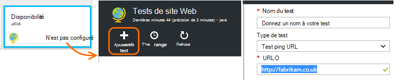

Vous recevrez graphiques de temps de réponse, ainsi que les notifications par courrier électronique si votre site s’arrête.

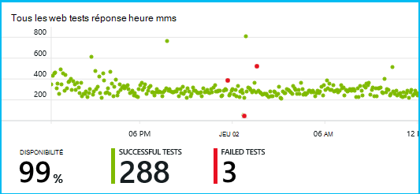

[En savoir plus sur la disponibilité des tests de site web.][availability] 

## Journaux de diagnostic

Si vous utilisez Logback ou Log4J (version 1.2 ou version 2.0) pour le suivi, vous pouvez avoir votre journaux envoyés automatiquement analyse d’Application dans laquelle vous pouvez Explorer et effectuez une recherche sur les.

[En savoir plus sur les journaux de diagnostic][javalogs]

## Télémétrie personnalisé 

Insérer plusieurs lignes de code dans votre application web Java pour déterminer ce que font les utilisateurs avec lui ou de diagnostiquer les problèmes. 

Vous pouvez insérer le code dans la page web JavaScript et Java côté serveur.

[En savoir plus sur télémétrie personnalisé][track]

## Étapes suivantes

#### Détecter et diagnostiquer les problèmes

* [Ajouter de télémétrie de client web] [ usage] pour obtenir de télémétrie de performances à partir du client web.
* [Configurer des tests de site web] [ availability] pour vous assurer que votre application reste injoignable et en temps réel.
* [Rechercher des événements et les journaux] [ diagnostic] de diagnostiquer les problèmes.
* [Capturer Log4J ou Logback][javalogs]

#### Effectuer le suivi de l’utilisation

* [Ajouter de télémétrie de client web] [ usage] aux affichages de page moniteur et indicateurs utilisateur de base.
* [Effectuer le suivi des événements personnalisés et indicateurs] [ track] pour en savoir plus sur la façon dont votre application est utilisée, à la fois sur le client et le serveur.

<!--Link references-->

[availability]: app-insights-monitor-web-app-availability.md
[diagnostic]: app-insights-diagnostic-search.md
[java]: app-insights-java-get-started.md
[javalogs]: app-insights-java-trace-logs.md
[metrics]: app-insights-metrics-explorer.md
[track]: app-insights-api-custom-events-metrics.md
[usage]: app-insights-web-track-usage.md

 