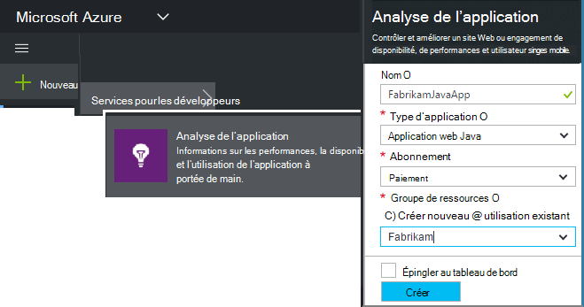
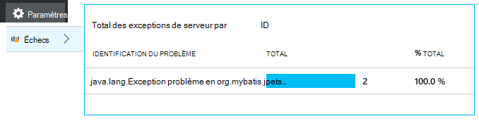

<properties
    pageTitle="Analytique de l’application web Java avec des aperçus Application | Microsoft Azure"
    description="Surveiller les performances et l’utilisation de votre site Web Java avec des aperçus de l’Application. "
    services="application-insights"
    documentationCenter="java"
    authors="alancameronwills"
    manager="douge"/>

<tags
    ms.service="application-insights"
    ms.workload="tbd"
    ms.tgt_pltfrm="ibiza"
    ms.devlang="na"
    ms.topic="get-started-article"
    ms.date="08/17/2016"
    ms.author="awills"/>

# Prise en main avec des aperçus de l’Application d’un projet web Java

*Analyse de l’application est en mode Aperçu.*

[AZURE.INCLUDE [app-insights-selector-get-started](../../includes/app-insights-selector-get-started.md)]

[Analyse de l’application](https://azure.microsoft.com/services/application-insights/) est un service analytique extensible qui vous permet de comprendre les performances et l’utilisation de vos applications en ligne. Utilisez-le pour [détecter et diagnostiquer les problèmes de performances et exceptions](app-insights-detect-triage-diagnose.md), puis [écrire du code] [ api] pour effectuer le suivi de ce que les utilisateurs faire avec votre application.

Analyse de l’application prend en charge les applications Java s’exécutant sur Linux, Unix ou Windows.

Tu as besoin de :

* Oracle JRE 1,6 ou version ultérieure, ou Zoulou JRE 1,6 ou version ultérieure
* Un abonnement à [Microsoft Azure](https://azure.microsoft.com/). (Vous pouvez démarrer avec la [version d’évaluation gratuite](https://azure.microsoft.com/pricing/free-trial/).)

*Si vous avez une application web qui est déjà en ligne, vous pourriez suivre la procédure de remplacement pour [Ajouter le Kit de développement en cours d’exécution sur le serveur web](app-insights-java-live.md). Cette alternative évite reconstruisant le code, mais vous n’obtenez pas l’option pour écrire du code pour effectuer le suivi de l’activité des utilisateurs.*

## 1. obtenir une clé d’instrumentation perspectives d’Application

1. Connectez-vous au [portail Microsoft Azure](https://portal.azure.com).
2. Création d’une ressource d’analyse de l’Application. Définissez le type d’application sur application web Java.

    
4. Recherchez la clé d’instrumentation de la nouvelle ressource. Vous devez coller cette clé dans votre projet de code peu de temps.

    

## 2. ajouter l’Application Insights SDK pour Java à votre projet

*Choisir la méthode appropriée pour votre projet.*

#### Si vous utilisez Eclipse pour créer un projet Maven ou Web dynamique...

Utiliser l' [Application Insights SDK pour Java plug-in][eclipse].

#### Si vous utilisez Maven...

Si votre projet est déjà configuré pour utiliser Maven pour créer, fusionner le code suivant à votre fichier pom.xml.

Actualiser les dépendances de projet pour obtenir les fichiers binaires téléchargés.

    <repositories>
       <repository>
          <id>central</id>
          <name>Central</name>
          <url>http://repo1.maven.org/maven2</url>
       </repository>
    </repositories>

    <dependencies>
      <dependency>
        <groupId>com.microsoft.azure</groupId>
        <artifactId>applicationinsights-web</artifactId>
        <!-- or applicationinsights-core for bare API -->
        <version>[1.0,)</version>
      </dependency>
    </dependencies>

* *Créer ou somme de contrôle des erreurs de validation ?* Essayez d’utiliser une version spécifique, par exemple : `<version>1.0.n</version>`. Vous trouverez la dernière version dans les [notes de publication SDK](https://github.com/Microsoft/ApplicationInsights-Java#release-notes) ou dans notre [objets Maven](http://search.maven.org/#search%7Cga%7C1%7Capplicationinsights).
* *Vous avez besoin pour mettre à jour vers un nouveau SDK ?* Actualiser les dépendances de votre projet.

#### Si vous utilisez Gradle...

Si votre projet est déjà configuré pour utiliser Gradle pour générer, fusionner le code suivant à votre fichier build.gradle.

Actualiser les dépendances de projet pour obtenir les fichiers binaires téléchargés.

    repositories {
      mavenCentral()
    }

    dependencies {
      compile group: 'com.microsoft.azure', name: 'applicationinsights-web', version: '1.+'
      // or applicationinsights-core for bare API
    }

* Erreurs *validation build ou somme de contrôle ? Essayez d’utiliser une version spécifique, par exemple :* `version:'1.0.n'`. *Vous trouverez la dernière version dans les [notes de publication du Kit de développement logiciel](https://github.com/Microsoft/ApplicationInsights-Java#release-notes).*
* *Mettre à jour vers un nouveau SDK*
 * Actualiser les dépendances de votre projet.

#### Dans le cas contraire...

Ajouter manuellement le Kit de développement :

1. Télécharger l' [Application Insights SDK pour Java](https://aka.ms/aijavasdk).
2. Extraire les fichiers binaires à partir du fichier zip et ajoutez-les à votre projet.

### Questions...

* *Quelle est la relation entre la `-core` et `-web` composants dans le zip ?*

 * `applicationinsights-core`vous donne l’API vierge. Vous devez toujours ce composant.
 * `applicationinsights-web`vous permet d’indicateurs de suivi des décomptes de demande HTTP et temps de réponse. Vous pouvez omettre ce composant si vous ne voulez pas cette télémétrie collectée automatiquement. Par exemple, si vous voulez écrire votre propre.

* *Pour mettre à jour le Kit de développement quand nous publier les modifications*
 * Téléchargez la dernière [Application Insights SDK pour Java](https://aka.ms/qqkaq6) et remplacent les anciennes.
 * Modifications sont décrites dans les [notes de publication du Kit de développement logiciel](https://github.com/Microsoft/ApplicationInsights-Java#release-notes).

## 3. ajouter un fichier .xml perspectives d’Application

Ajoutez ApplicationInsights.xml dans le dossier de ressources dans votre projet, ou vous assurer qu’il est ajouté au chemin d’accès de classe de déploiement de votre projet. Copiez le code XML suivant dans celle-ci.

Remplacez la clé instrumentation que vous avez obtenu à partir du portail Azure.

    <?xml version="1.0" encoding="utf-8"?>
    <ApplicationInsights xmlns="http://schemas.microsoft.com/ApplicationInsights/2013/Settings" schemaVersion="2014-05-30">

      <!-- The key from the portal: -->

      <InstrumentationKey>** Your instrumentation key **</InstrumentationKey>

      <!-- HTTP request component (not required for bare API) -->

      <TelemetryModules>
        <Add type="com.microsoft.applicationinsights.web.extensibility.modules.WebRequestTrackingTelemetryModule"/>
        <Add type="com.microsoft.applicationinsights.web.extensibility.modules.WebSessionTrackingTelemetryModule"/>
        <Add type="com.microsoft.applicationinsights.web.extensibility.modules.WebUserTrackingTelemetryModule"/>
      </TelemetryModules>

      <!-- Events correlation (not required for bare API) -->
      <!-- These initializers add context data to each event -->

      <TelemetryInitializers>
        <Add   type="com.microsoft.applicationinsights.web.extensibility.initializers.WebOperationIdTelemetryInitializer"/>
        <Add type="com.microsoft.applicationinsights.web.extensibility.initializers.WebOperationNameTelemetryInitializer"/>
        <Add type="com.microsoft.applicationinsights.web.extensibility.initializers.WebSessionTelemetryInitializer"/>
        <Add type="com.microsoft.applicationinsights.web.extensibility.initializers.WebUserTelemetryInitializer"/>
        <Add type="com.microsoft.applicationinsights.web.extensibility.initializers.WebUserAgentTelemetryInitializer"/>

      </TelemetryInitializers>
    </ApplicationInsights>

* La clé d’instrumentation est envoyée en même temps que chaque élément de télémétrie et vous explique Application perspectives pour l’afficher dans la ressource.
* Le composant de requête HTTP est facultatif. Il envoie automatiquement télémétrie sur les demandes et les temps de réponse au portail.
* Corrélation des événements est un complément pour le composant de demande HTTP. Il vous affecte un identificateur pour chaque demande reçue par le serveur et ajoute cet identificateur en tant que propriété à chaque élément de télémétrie en tant que la propriété « Operation.Id ». Il vous permet de faire correspondre la télémétrie associé à chaque demande en définissant un filtre de [recherche diagnostic][diagnostic].
* La touche Application Insights peut être passée dynamiquement à partir du portail Azure comme une propriété système (-DAPPLICATION_INSIGHTS_IKEY = your_ikey). S’il n’existe aucune propriété définie, elle vérifie variable d’environnement (APPLICATION_INSIGHTS_IKEY) dans les paramètres de l’application Azure. Si les deux propriétés ne sont pas définies, la valeur par défaut InstrumentationKey est utilisée à partir de ApplicationInsights.xml. Cette séquence vous aide à gérer InstrumentationKeys différentes pour les différents environnements dynamiquement.

### Autres façons de définir la clé d’instrumentation

Application Insights SDK recherche la clé dans l’ordre suivant :

1. Propriété du système :-DAPPLICATION_INSIGHTS_IKEY = your_ikey
2. Variable d’environnement : APPLICATION_INSIGHTS_IKEY
3. Fichier de configuration : ApplicationInsights.xml

Vous pouvez également [définir dans le code](app-insights-api-custom-events-metrics.md#ikey):

    telemetryClient.InstrumentationKey = "...";

## 4. Ajoutez un filtre HTTP

La dernière étape de configuration permet au composant de demande HTTP pour vous connecter chaque requête web. (Non obligatoire si vous voulez simplement l’API vierge.)

Recherchez et ouvrez le fichier web.xml dans votre projet et fusionner le code suivant sous le nœud web app, où votre application des filtres sont configurés.

Pour obtenir les résultats les plus précis, le filtre doit être mappé avant tous les autres filtres.

    <filter>
      <filter-name>ApplicationInsightsWebFilter</filter-name>
      <filter-class>
        com.microsoft.applicationinsights.web.internal.WebRequestTrackingFilter
      </filter-class>
    </filter>
    <filter-mapping>
       <filter-name>ApplicationInsightsWebFilter</filter-name>
       <url-pattern>/*</url-pattern>
    </filter-mapping>

#### Si vous utilisez un événement du printemps Web MVC 3.1 ou version ultérieure

Modifier ces éléments pour inclure le package d’Application perspectives :

    <context:component-scan base-package=" com.springapp.mvc, com.microsoft.applicationinsights.web.spring"/>

    <mvc:interceptors>
        <mvc:interceptor>
            <mvc:mapping path="/**"/>
            <bean class="com.microsoft.applicationinsights.web.spring.RequestNameHandlerInterceptorAdapter" />
        </mvc:interceptor>
    </mvc:interceptors>

#### Si vous utilisez étais 2

Ajoutez cet élément au fichier de configuration étais (généralement appelé struts.xml ou étais default.xml) :

     <interceptors>
       <interceptor name="ApplicationInsightsRequestNameInterceptor" class="com.microsoft.applicationinsights.web.struts.RequestNameInterceptor" />
     </interceptors>
     <default-interceptor-ref name="ApplicationInsightsRequestNameInterceptor" />

(Si vous avez intercepteurs définis dans une pile par défaut, l’intercepteur peut simplement être ajouté à cette pile.)

## 5. Exécutez votre application

Exécuter en mode débogage sur votre ordinateur de développement, soit publier sur votre serveur.

## 6. afficher votre télémétrie dans perspectives d’Application

Revenir à la ressource de perspectives de l’Application portail [Microsoft Azure](https://portal.azure.com).

Demande HTTP des données s’affiche sur la carte de vue d’ensemble. (Si elle n’est pas il, attendez quelques secondes, puis sur Actualiser.)

[En savoir plus sur les mesures.][metrics]

Cliquez dans un graphique quelconque pour afficher plus d’indicateurs agrégé.

> Application Insights suppose qu’est le format des demandes HTTP pour les applications MVC : `VERB controller/action`. Par exemple, `GET Home/Product/f9anuh81`, `GET Home/Product/2dffwrf5` et `GET Home/Product/sdf96vws` sont regroupées en `GET Home/Product`. Ce regroupement permet d’agrégations significatives de requêtes, tels que nombre des requêtes et la durée d’exécution moyenne pour les requêtes.

### Données de l’instance 

Cliquez sur via un type spécifique de demande pour afficher des instances individuelles. 

Deux types de données sont affichés dans l’Application Insights : données agrégées, stockées et affichées comme moyennes, le nombre et sommes ; et données - rapports individuels de demandes HTTP, exceptions, affichages de page ou des événements personnalisés de l’instance.

Lorsque vous affichez les propriétés d’une requête, vous pouvez afficher les événements de télémétrie associés tels que les demandes et les exceptions.

### Analytique : Langage de requête puissantes

Comme vous accumuler davantage de données, vous pouvez exécuter des requêtes à la fois pour agréger les données et pour trouver des instances individuelles. [Analytique]() est un outil puissant pour les deux pour l’utilisation et présentation des performances et fins de diagnostic.

## 7. Installez votre application sur le serveur

Publier maintenant votre application sur le serveur, utilisez permettre aux utilisateurs et Espion la télémétrie apparaissant sur le portail.

* Vérifiez que votre pare-feu permet à votre application envoyer de télémétrie à ces ports :

 * DC.Services.VisualStudio.com:443
 * F5.Services.VisualStudio.com:443

* Sur les serveurs de Windows, installez :

 * [Microsoft Visual C++ redistribuable](http://www.microsoft.com/download/details.aspx?id=40784)

    (Ce composant Active compteurs de performance).

## Exceptions et échecs de requêtes

Exceptions non gérées sont collectées automatiquement :

Pour collecter les données sur les autres exceptions, vous avez deux possibilités :

* [Insérer des appels vers trackException() dans votre code][apiexceptions]. 
* [Installer l’Agent Java sur votre serveur](app-insights-java-agent.md). Vous spécifiez les méthodes que vous souhaitez examiner.

## Surveiller les appels de méthode et les dépendances externes

[Installer l’Agent Java](app-insights-java-agent.md) pour ouvrir une session spécifié méthodes internes et les appels effectués via JDBC, avec des données de minutage.

## Compteurs de performance

Ouvrez **paramètres**, **serveurs**, pour afficher une plage de compteurs de performance.

### Personnalisation de la collecte de compteur de performances

Pour désactiver la collecte de l’ensemble standard de compteurs de performance, ajoutez le code suivant sous le nœud racine du fichier ApplicationInsights.xml :

    <PerformanceCounters>
       <UseBuiltIn>False</UseBuiltIn>
    </PerformanceCounters>

### Collecter des compteurs de performance supplémentaires

Vous pouvez spécifier des compteurs de performance supplémentaires pour être collectés.

#### Compteurs JMX (exposés par la Machine virtuelle Java)

    <PerformanceCounters>
      <Jmx>
        <Add objectName="java.lang:type=ClassLoading" attribute="TotalLoadedClassCount" displayName="Loaded Class Count"/>
        <Add objectName="java.lang:type=Memory" attribute="HeapMemoryUsage.used" displayName="Heap Memory Usage-used" type="composite"/>
      </Jmx>
    </PerformanceCounters>

*   `displayName`– Le nom affiché dans le portail d’analyse de l’Application.
*   `objectName`– Le nom de l’objet JMX.
*   `attribute`– L’attribut de l’objet JMX pour récupérer
*   `type`(facultatif) - le type d’attribut l’objet JMX :
 *  Par défaut : type simple tel qu’int ou long.
 *  `composite`: les données de compteur de performance sont au format « Attribute.Data »
 *  `tabular`: les données de compteur de performance figurent dans le format d’une ligne de tableau

#### Compteurs de performance Windows

Chaque [compteur de performance Windows](https://msdn.microsoft.com/library/windows/desktop/aa373083.aspx) est un membre d’une catégorie (de la même façon qu’un champ est un membre d’une classe). Catégories peut être globales, ou peuvent avoir numérotées ou instances nommées.

    <PerformanceCounters>
      <Windows>
        <Add displayName="Process User Time" categoryName="Process" counterName="%User Time" instanceName="__SELF__" />
        <Add displayName="Bytes Printed per Second" categoryName="Print Queue" counterName="Bytes Printed/sec" instanceName="Fax" />
      </Windows>
    </PerformanceCounters>

*   nom complet – le nom affiché dans le portail d’analyse de l’Application.
*   nom de la catégorie – la catégorie de compteur de performance (objet de performance) à laquelle ce compteur de performance est associé.
*   counterName – le nom du compteur de performance.
*   instanceName – le nom de l’instance de catégorie de compteur de performance, ou une chaîne vide (« »), si la catégorie contient une seule instance. Si le nom de la catégorie est processus et le compteur de performance que vous voulez collecter du processus en cours de la machine virtuelle Java sur lequel votre application est en cours d’exécution, spécifiez `"__SELF__"`.

Vos compteurs de performance sont représentés sous forme de mesures personnalisées dans [l’Explorateur de mesures][metrics].

### Compteurs UNIX

* [Installer collectd avec le plug-in Application perspectives](app-insights-java-collectd.md) pour obtenir un large éventail de données système et le réseau.

## Obtenir des données utilisateur et session

OK, vous envoyez télémétrie à partir de votre serveur web. Pour obtenir la vue 360 degrés de votre application, vous pouvez désormais ajouter une analyse plus :

* [Ajouter de télémétrie à vos pages web] [ usage] à surveiller les affichages de page et d’indicateurs de l’utilisateur.
* [Configurer des tests de site web] [ availability] pour vous assurer que votre application reste injoignable et en temps réel.

## Capturer des journaux

Vous pouvez utiliser des perspectives d’Application pour analyser les journaux de Log4J, Logback ou autres structures de journalisation. Vous pouvez corrélation les journaux avec les requêtes HTTP et autres télémétrie. [Découvrez comment][javalogs].

## Envoyer votre propre télémétrie

À présent que vous avez installé le Kit de développement, vous pouvez utiliser l’API pour envoyer votre propre télémétrie.

* [Effectuer le suivi des événements personnalisés et indicateurs] [ api] pour découvrir ce que font les utilisateurs avec votre application.
* [Rechercher des événements et les journaux] [ diagnostic] de diagnostiquer les problèmes.

## Disponibilité des tests de site web

Analyse de l’application permet de tester votre site Web à intervalles réguliers pour vérifier qu’il s’agit des et répondre bien. [Configurer][availability], cliquez sur tests de site Web.

Vous recevrez graphiques de temps de réponse, ainsi que les notifications par courrier électronique si votre site s’arrête.

[En savoir plus sur la disponibilité des tests de site web.][availability] 

## Questions ? Problèmes ?

[Résolution des problèmes de Java](app-insights-java-troubleshoot.md)

## Étapes suivantes

Pour plus d’informations, voir le [Centre de développement Java](/develop/java/).

<!--Link references-->

[api]: app-insights-api-custom-events-metrics.md
[apiexceptions]: app-insights-api-custom-events-metrics.md#track-exception
[availability]: app-insights-monitor-web-app-availability.md
[diagnostic]: app-insights-diagnostic-search.md
[eclipse]: app-insights-java-eclipse.md
[javalogs]: app-insights-java-trace-logs.md
[metrics]: app-insights-metrics-explorer.md
[usage]: app-insights-web-track-usage.md
