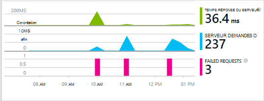

<properties 
    pageTitle="Analyse des applications pour les applications web Java qui se trouvent déjà live" 
    description="Démarrer une application web qui est déjà en cours d’exécution sur votre serveur de surveillance" 
    services="application-insights" 
    documentationCenter="java"
    authors="alancameronwills" 
    manager="douge"/>

<tags 
    ms.service="application-insights" 
    ms.workload="tbd" 
    ms.tgt_pltfrm="ibiza" 
    ms.devlang="na" 
    ms.topic="article" 
    ms.date="08/24/2016" 
    ms.author="awills"/>
 
# Analyse des applications pour les applications web Java qui se trouvent déjà live

*Analyse de l’application est en mode Aperçu.*

Si vous avez une application web qui est déjà en cours d’exécution sur votre serveur J2EE, vous pouvez démarrer la surveillance avec des [Aperçus Application](app-insights-overview.md) sans avoir à apporter des modifications de code ou recompilation de votre projet. Avec cette option, vous obtenez des informations sur les requêtes HTTP envoyées à votre serveur, les exceptions non gérées et les compteurs de performance.

Vous avez besoin d’un abonnement à [Microsoft Azure](https://azure.com).

> [AZURE.NOTE] La procédure de cette page ajoute le Kit de développement pour votre application web en cours d’exécution. Cette instrumentation runtime est utile si vous ne voulez pas mettre à jour ou reconstruire votre code source. Mais si vous le pouvez, nous vous recommandons [Ajouter le Kit de développement pour le code source](app-insights-java-get-started.md) à la place. Qui vous propose des options supplémentaires telles que l’écriture de code pour effectuer le suivi de l’activité des utilisateurs.

## 1. obtenir une clé d’instrumentation perspectives d’Application

1. Connectez-vous au [portail Microsoft Azure](https://portal.azure.com)
2. Créer une nouvelle ressource Insights d’Application

    
3. Définissez le type d’application sur application web Java.

    
4. Recherchez la clé d’instrumentation de la nouvelle ressource. Vous devez coller cette clé dans votre projet de code peu de temps.

    

## 2. Téléchargez le Kit de développement

1. Télécharger l' [Application Insights SDK pour Java](https://aka.ms/aijavasdk). 
2. Sur votre serveur, extraire le contenu SDK à l’annuaire chargés à partir de laquelle vos fichiers binaires du projet. Si vous utilisez Tomcat, ce répertoire est généralement sous`webapps\<your_app_name>\WEB-INF\lib`

## 3. ajouter un fichier xml Insights d’Application

Créez ApplicationInsights.xml dans le dossier dans lequel vous avez ajouté le Kit de développement. Placer le code XML suivant dedans.

Remplacez la clé instrumentation que vous avez obtenu à partir du portail Azure.

    <?xml version="1.0" encoding="utf-8"?>
    <ApplicationInsights xmlns="http://schemas.microsoft.com/ApplicationInsights/2013/Settings" schemaVersion="2014-05-30">

      <!-- The key from the portal: -->

      <InstrumentationKey>** Your instrumentation key **</InstrumentationKey>

      <!-- HTTP request component (not required for bare API) -->

      <TelemetryModules>
        <Add type="com.microsoft.applicationinsights.web.extensibility.modules.WebRequestTrackingTelemetryModule"/>
        <Add type="com.microsoft.applicationinsights.web.extensibility.modules.WebSessionTrackingTelemetryModule"/>
        <Add type="com.microsoft.applicationinsights.web.extensibility.modules.WebUserTrackingTelemetryModule"/>
      </TelemetryModules>

      <!-- Events correlation (not required for bare API) -->
      <!-- These initializers add context data to each event -->

      <TelemetryInitializers>
        <Add   type="com.microsoft.applicationinsights.web.extensibility.initializers.WebOperationIdTelemetryInitializer"/>
        <Add type="com.microsoft.applicationinsights.web.extensibility.initializers.WebOperationNameTelemetryInitializer"/>
        <Add type="com.microsoft.applicationinsights.web.extensibility.initializers.WebSessionTelemetryInitializer"/>
        <Add type="com.microsoft.applicationinsights.web.extensibility.initializers.WebUserTelemetryInitializer"/>
        <Add type="com.microsoft.applicationinsights.web.extensibility.initializers.WebUserAgentTelemetryInitializer"/>

      </TelemetryInitializers>
    </ApplicationInsights>

* La clé d’instrumentation est envoyée en même temps que chaque élément de télémétrie et vous explique Application perspectives pour l’afficher dans la ressource.
* Le composant de requête HTTP est facultatif. Il envoie automatiquement télémétrie sur les demandes et les temps de réponse au portail.
* Corrélation des événements est un complément pour le composant de demande HTTP. Il vous affecte un identificateur pour chaque demande reçue par le serveur et ajoute cet identificateur en tant que propriété à chaque élément de télémétrie en tant que la propriété « Operation.Id ». Il vous permet de faire correspondre la télémétrie associé à chaque demande en définissant un filtre de [recherche de diagnostic](app-insights-diagnostic-search.md).

## 4. Ajoutez un filtre HTTP

Recherchez et ouvrez le fichier web.xml dans votre projet et fusionner l’extrait de code sous le nœud web app, où votre application des filtres sont configurés suivant.

Pour obtenir les résultats les plus précis, le filtre doit être mappé avant tous les autres filtres.

    <filter>
      <filter-name>ApplicationInsightsWebFilter</filter-name>
      <filter-class>
        com.microsoft.applicationinsights.web.internal.WebRequestTrackingFilter
      </filter-class>
    </filter>
    <filter-mapping>
       <filter-name>ApplicationInsightsWebFilter</filter-name>
       <url-pattern>/*</url-pattern>
    </filter-mapping>

## 5. exceptions de pare-feu à cocher

Vous devrez peut-être [définir des exceptions pour envoyer des données sortantes](app-insights-ip-addresses.md).

## 6. Redémarrez votre application web

## 7. afficher votre télémétrie dans perspectives d’Application

Revenir à la ressource de perspectives de l’Application portail [Microsoft Azure](https://portal.azure.com).

Télémétrie relatives aux demandes HTTP apparaît sur la carte de vue d’ensemble. (Si elle n’est pas il, attendez quelques secondes, puis sur Actualiser.)

 

Cliquez dans un graphique quelconque pour afficher plus d’indicateurs. 

 

Et lorsque vous affichez les propriétés d’une requête, vous pouvez voir les événements de télémétrie associés tels que les demandes et les exceptions.
 

[En savoir plus sur les mesures.](app-insights-metrics-explorer.md)

## Étapes suivantes

* [Télémétrie ajouter à vos pages web](app-insights-web-track-usage.md) à surveiller les affichages de page et d’indicateurs de l’utilisateur.
* [Configurer des tests de site web](app-insights-monitor-web-app-availability.md) pour vous assurer que votre application reste injoignable et en temps réel.
* [Capturer des journaux](app-insights-java-trace-logs.md)
* [Les journaux et les événements de recherche](app-insights-diagnostic-search.md) de diagnostiquer les problèmes.

 
