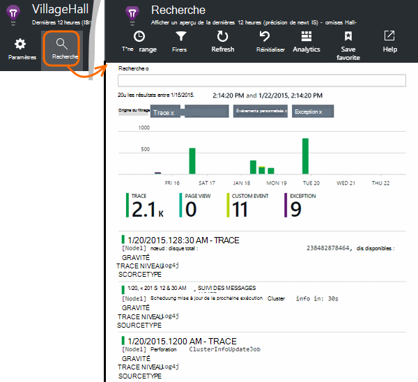

<properties 
    pageTitle="Explorer Java dans l’Application analyse les journaux de suivi" 
    description="Recherche Log4J ou Logback traces dans perspectives d’Application" 
    services="application-insights" 
    documentationCenter="java"
    authors="alancameronwills" 
    manager="douge"/>

<tags 
    ms.service="application-insights" 
    ms.workload="tbd" 
    ms.tgt_pltfrm="ibiza" 
    ms.devlang="na" 
    ms.topic="article" 
    ms.date="07/12/2016" 
    ms.author="awills"/>

# Explorer Java dans l’Application analyse les journaux de suivi

Si vous utilisez Logback ou Log4J (version 1.2 ou version 2.0) pour le suivi, vous pouvez avoir votre journaux envoyés automatiquement analyse d’Application dans laquelle vous pouvez Explorer et effectuez une recherche sur les.

Installer [l’Application Insights SDK pour Java][java], si vous n’avez pas déjà fait.

## Ajouter des bibliothèques de journalisation à votre projet

*Choisir la méthode appropriée pour votre projet.*

#### Si vous utilisez Maven...

Si votre projet est déjà configuré pour utiliser Maven pour créer, fusionner parmi les extraits de code suivants dans votre fichier pom.xml.

Actualiser les dépendances de projet, pour obtenir les fichiers binaires téléchargés.

*Logback*

    <dependencies>
       <dependency>
          <groupId>com.microsoft.azure</groupId>
          <artifactId>applicationinsights-logging-logback</artifactId>
          <version>[1.0,)</version>
       </dependency>
    </dependencies>

*Version 2.0 log4j*

    <dependencies>
       <dependency>
          <groupId>com.microsoft.azure</groupId>
          <artifactId>applicationinsights-logging-log4j2</artifactId>
          <version>[1.0,)</version>
       </dependency>
    </dependencies>

*Version 1.2 log4j*

    <dependencies>
       <dependency>
          <groupId>com.microsoft.azure</groupId>
          <artifactId>applicationinsights-logging-log4j1_2</artifactId>
          <version>[1.0,)</version>
       </dependency>
    </dependencies>

#### Si vous utilisez Gradle...

Si votre projet est déjà configuré pour utiliser Gradle pour générer, ajoutez l’un des lignes suivantes à la `dependencies` groupe dans votre fichier build.gradle :

Actualiser les dépendances de projet, pour obtenir les fichiers binaires téléchargés.

**Logback**

    compile group: 'com.microsoft.azure', name: 'applicationinsights-logging-logback', version: '1.0.+'

**Version 2.0 log4j**

    compile group: 'com.microsoft.azure', name: 'applicationinsights-logging-log4j2', version: '1.0.+'

**Version 1.2 log4j**

    compile group: 'com.microsoft.azure', name: 'applicationinsights-logging-log4j1_2', version: '1.0.+'

#### Dans le cas contraire...

Télécharger et extraire l’appender approprié, puis ajouter la bibliothèque appropriée à votre projet :

Enregistreur d’événements | Télécharger | Bibliothèque
----|----|----
Logback|[Kit de développement logiciel avec Logback appender](https://aka.ms/xt62a4)|applicationinsights-journalisation-logback
Version 2.0 log4j|[Kit de développement logiciel avec Log4J v2 appender](https://aka.ms/qypznq)|applicationinsights-journalisation-log4j2 
Version 1.2 log4j|[Kit de développement logiciel avec Log4J version 1.2 appender](https://aka.ms/ky9cbo)|applicationinsights-journalisation-log4j1_2 

## Ajouter l’appender à votre infrastructure de journalisation

Pour recevoir les traces, fusionnez l’extrait de code au fichier de configuration Log4J ou Logback : 

*Logback*

    <appender name="aiAppender" 
      class="com.microsoft.applicationinsights.logback.ApplicationInsightsAppender">
    </appender>
    <root level="trace">
      <appender-ref ref="aiAppender" />
    </root>

*Version 2.0 log4j*

    <Configuration packages="com.microsoft.applicationinsights.Log4j">
      <Appenders>
        <ApplicationInsightsAppender name="aiAppender" />
      </Appenders>
      <Loggers>
        <Root level="trace">
          <AppenderRef ref="aiAppender"/>
        </Root>
      </Loggers>
    </Configuration>

*Version 1.2 log4j*

    <appender name="aiAppender" 
         class="com.microsoft.applicationinsights.log4j.v1_2.ApplicationInsightsAppender">
    </appender>
    <root>
      <priority value ="trace" />
      <appender-ref ref="aiAppender" />
    </root>

Les appenders Application Insights peuvent être référencées par n’importe quel journal configuré, mais pas forcément par le journal racine (comme illustré dans les exemples de code ci-dessus).

## Explorer vos traces dans le portail d’analyse de l’Application

Maintenant que vous avez configuré votre projet pour envoyer les traces analyse de l’Application, vous pouvez afficher et rechercher ces traces dans le portail d’analyse des applications, dans la [recherche] [ diagnostic] carte.

## Étapes suivantes

[Recherche des Diagnostics][diagnostic]

<!--Link references-->

[diagnostic]: app-insights-diagnostic-search.md
[java]: app-insights-java-get-started.md

 
