<properties
    pageTitle="Applications web application perspectives pour JavaScript | Microsoft Azure"
    description="Obtenir la session et afficher le nombre de pages, des données client web et suivre des modèles d’utilisation. Détecter les exceptions et les problèmes de performances dans les pages web JavaScript."
    services="application-insights"
    documentationCenter=""
    authors="alancameronwills"
    manager="douge"/>

<tags
    ms.service="application-insights"
    ms.workload="tbd"
    ms.tgt_pltfrm="ibiza"
    ms.devlang="na"
    ms.topic="get-started-article"
    ms.date="08/15/2016"
    ms.author="awills"/>

# Application perspectives pour les pages web

[AZURE.INCLUDE [app-insights-selector-get-started-dotnet](../../includes/app-insights-selector-get-started-dotnet.md)]

Consultez des informations sur les performances et l’utilisation de votre page web ou une application. Si vous ajoutez Visual Studio Application perspectives à votre script de page, vous obtenez le minutage de chargement des pages et les appels AJAX, les nombres et les détails des exceptions de navigateur et échecs AJAX, ainsi que les utilisateurs et le nombre de session. Tous ces peuvent être segmentées par page, système d’exploitation client et version de navigateur, emplacement géographique et autres dimensions. Vous pouvez également définir des alertes sur le nombre de panne ou ralentir le chargement de la page.

Vous pouvez utiliser des perspectives Application avec toutes les pages web : vous simplement ajouter un morceau de JavaScript. Si votre service web est [Java](app-insights-java-get-started.md) ou [ASP.NET](app-insights-asp-net.md), vous pouvez intégrer télémétrie à partir de votre serveur et les clients.

Vous avez besoin d’un abonnement à [Microsoft Azure](https://azure.com). Si votre équipe dispose d’un abonnement d’organisation, demandez au propriétaire pour lui ajouter votre Account Microsoft. Il existe un niveau de tarification gratuit, développement et l’utilisation de petite taille ne coûte rien.

## Configurer Application perspectives pour votre page web

Tout d’abord, vous devez ajouter Application perspectives à vos pages web ? Vous pouvez déjà fait. Si vous avez choisi ajouter des perspectives d’Application à votre application web dans la boîte de dialogue Nouveau projet dans Visual Studio, le script a été ajouté puis. Dans ce cas, vous n’avez pas besoin effectuer d’autres.

Dans le cas contraire, vous devez ajouter un extrait de code vos pages web, comme suit.

### Ouvrez une ressource d’Application perspectives

La ressource Insights Application est l’emplacement d’affichage des données sur les performances et l’utilisation de votre page. 

Connectez-vous au [portail Azure](https://portal.azure.com).

Si vous avez déjà configuré la surveillance pour le côté serveur de votre application, vous disposez déjà d’une ressource :

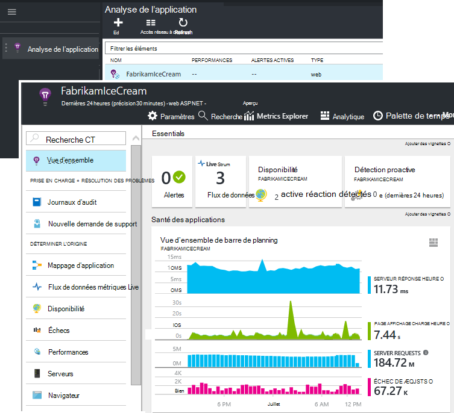

Si vous n’en avez pas, créez-le :

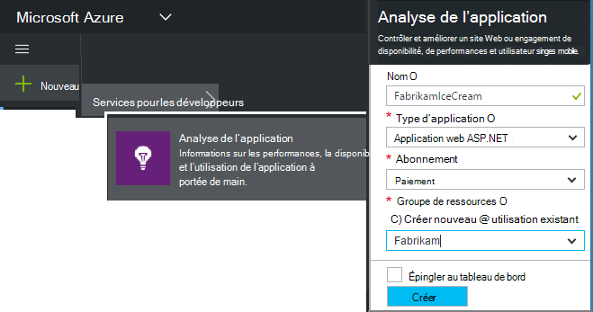

*Questions déjà ?* [En savoir plus sur la création d’une ressource](app-insights-create-new-resource.md).

### Ajouter le script SDK à votre application ou des pages web

Dans la zone Démarrage rapide, obtenir le script pour les pages web :

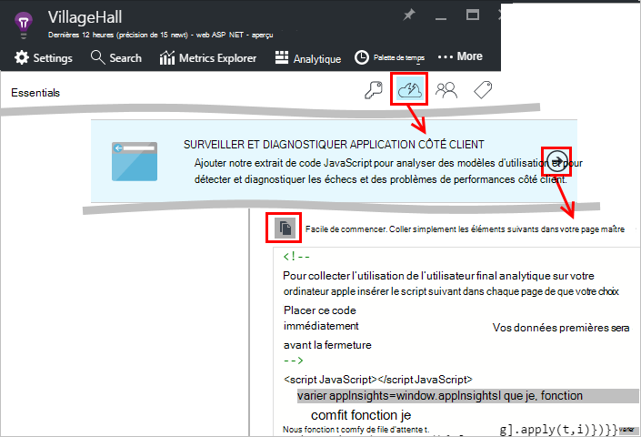

Insérer le script juste avant le `</head>` balise de chaque page que vous voulez effectuer le suivi. Si votre site Web a une page maître, vous pouvez y placez le script. Par exemple :

* Dans un projet ASP.NET MVC, vous devez le placer dans`View\Shared\_Layout.cshtml`
* Dans un site SharePoint, dans le panneau de configuration, ouvrez [paramètres du Site / Page maître](app-insights-sharepoint.md).

Le script contient la clé d’instrumentation qui achemine les données à la ressource de perspectives d’Application. 

(Pour[une explication plus en profondeur du script.](http://apmtips.com/blog/2015/03/18/javascript-snippet-explained/))

*(Si vous utilisez un cadre de la page web connu, explorez pour cartes Application perspectives. Par exemple, il existe [un module AngularJS](http://ngmodules.org/modules/angular-appinsights).)*

## Configuration détaillée

Il existe plusieurs [paramètres](https://github.com/Microsoft/ApplicationInsights-JS/blob/master/API-reference.md#config) , vous pouvez définir, dans la plupart des cas, vous ne devez ; Par exemple, vous pouvez désactiver ou limiter le nombre d’appels Ajax indiqués en mode page (afin de réduire le trafic). Ou vous pouvez définir le mode de débogage d’avoir télémétrie déplacer rapidement dans le pipeline de sans être regroupés.

Pour définir ces paramètres, recherchez la ligne dans l’extrait de code et ajouter d’autres éléments séparées par des virgules après celui-ci :

    })({
      instrumentationKey: "..."
      // Insert here
    });

Les [paramètres disponibles](https://github.com/Microsoft/ApplicationInsights-JS/blob/master/API-reference.md#config) incluent :

    // Send telemetry immediately without batching.
    // Remember to remove this when no longer required, as it
    // can affect browser performance.
    enableDebug: boolean,

    // Don't log browser exceptions.
    disableExceptionTracking: boolean,

    // Don't log ajax calls.
    disableAjaxTracking: boolean,

    // Limit number of Ajax calls logged, to reduce traffic.
    maxAjaxCallsPerView: 10, // default is 500

    // Time page load up to execution of first trackPageView().
    overridePageViewDuration: boolean,

    // Set these dynamically for an authenticated user.
    appUserId: string,
    accountId: string,

## Exécuter votre application

Exécuter votre application web, utiliser un certain temps pour générer des télémétrie et attendez quelques secondes. Exécuter à l’aide de la touche **F5** sur votre ordinateur de développement, ou publier et permettre aux utilisateurs de lire avec lui.

Si vous souhaitez vérifier la télémétrie qui envoie une application web Application analyse, utilisez les outils de débogage de votre navigateur (**F12** dans de nombreux navigateurs). Données sont envoyées à dc.services.visualstudio.com.

## Explorer vos données de performances du navigateur

Ouvrez la carte de navigateurs pour afficher des données de performance agrégé à partir de navigateurs de vos utilisateurs.

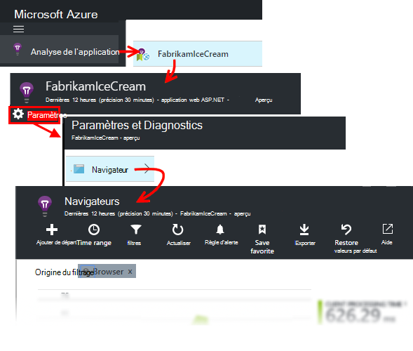

*Pas encore de données ? Cliquez sur * *Actualiser* * en haut de la page. Toujours rien ? Voir [dépannage](app-insights-troubleshoot-faq.md).*

La carte de navigateurs est une [carte métriques Explorer](app-insights-metrics-explorer.md) avec sélections de graphique et filtres prédéfinis. Si vous souhaitez, puis enregistrez le résultat en tant que favori, vous pouvez modifier l’intervalle de temps, les filtres et configuration des graphiques. Cliquez sur **restaurer les valeurs par défaut** pour revenir à la configuration de la carte d’origine.

## Performances de chargement de page

Dans la partie supérieure est un graphique segmenté de temps de chargement de page. La hauteur totale du graphique représente la durée moyenne pour charger et afficher des pages à partir de votre application dans les navigateurs de vos utilisateurs. Le temps est mesuré à partir de lorsque le navigateur envoie la requête HTTP initiale jusqu'à charge synchrone tous les événements ont été traitées, y compris la mise en page et l’exécution de scripts. Il n’inclut pas asynchrones tâches telles que le chargement des composants WebPart à partir d’appels AJAX.

Le graphique les segments le temps de chargement du nombre total de pages dans les [minutages standards définies par W3C](http://www.w3.org/TR/navigation-timing/#processing-model). 

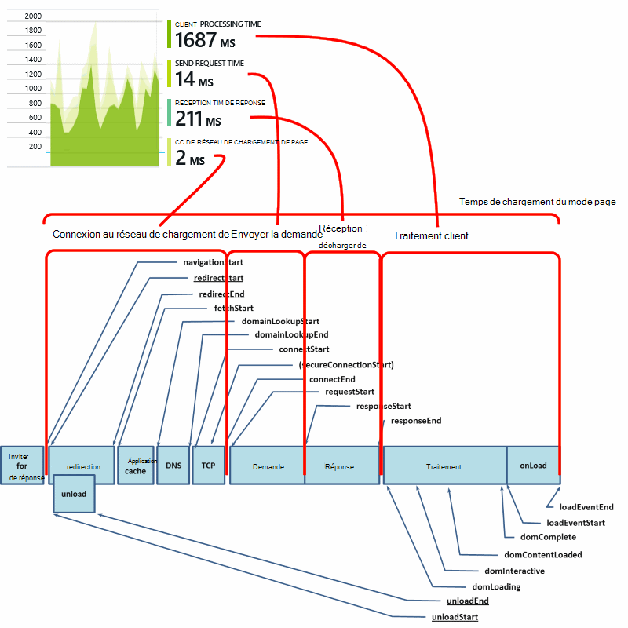

Notez que le moment de la *connexion réseau* est souvent plus basse que vous pouvez attendre, car il est une moyenne de toutes les requêtes à partir du navigateur sur le serveur. Plusieurs requêtes individuelles ont une durée de connexion de 0, car il existe déjà une connexion active sur le serveur.

### Chargement lent ?

Chargement des pages lente constituent une source majeure d’insatisfaction pour vos utilisateurs. Si le graphique indique le chargement des pages lent, il est facile effectuer des recherches de diagnostic.

Le graphique affiche la moyenne de toutes les charges de page dans votre application. Pour voir si le problème est limité à certaines pages, examinez plus bas dans la carte, lorsqu’il existe une grille segmentée par URL de la page :

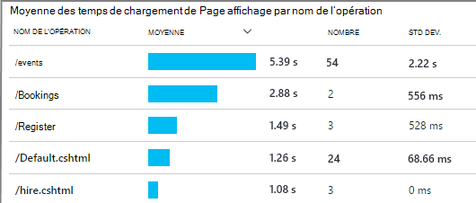

Notez le nombre d’affichages de page et l’écart type. Si le nombre de pages est très faible, puis le problème n’est pas affecter les utilisateurs beaucoup. Écart haut (comparable à la moyenne lui-même) indique un grand nombre de variantes entre des mesures individuelles.

**Effectuer un zoom avant sur une URL et le mode d’une page.** Cliquez sur n’importe quel nom de la page pour afficher une carte de graphiques navigateur filtré uniquement pour cette URL ; puis sur une instance d’un affichage de la page.

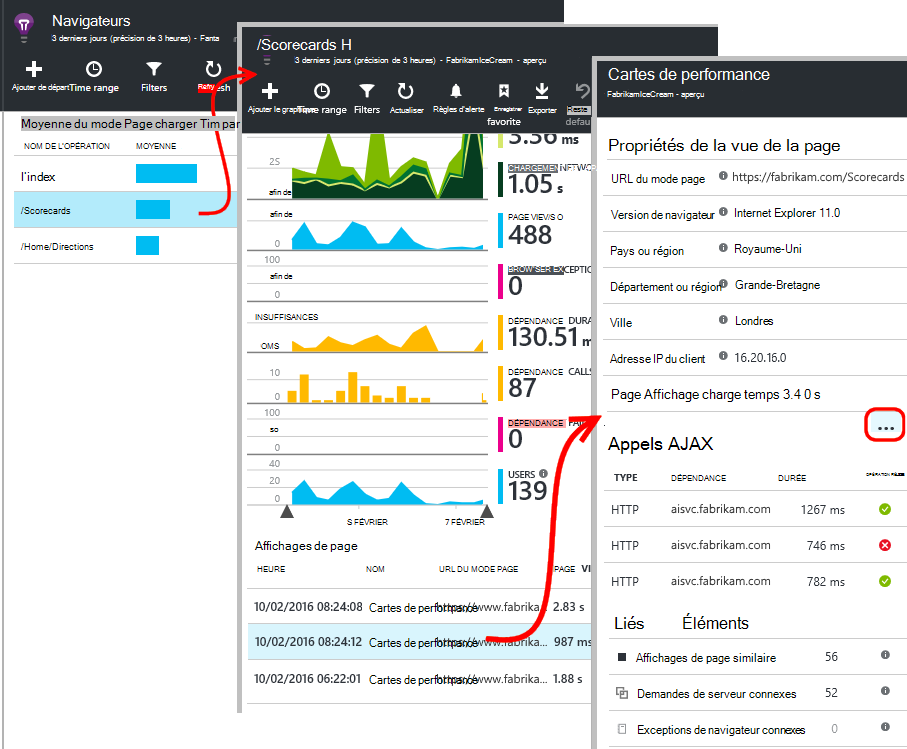

Cliquez sur `...` pour une liste complète des propriétés pour cet événement, ou vérifiez que les appels Ajax et les événements connexes. Les appels Ajax lentes affectent le temps de chargement de page générale s’ils sont synchrones. Les événements liés incluent des demandes de serveur pour la même URL (si vous avez configuré perspectives d’Application sur votre serveur web).

**Performances de la page dans le temps.** Revenir à la carte navigateurs, modifier la grille de temps de chargement du mode Page dans un graphique en courbes pour voir s’il y a pointes à des moments :

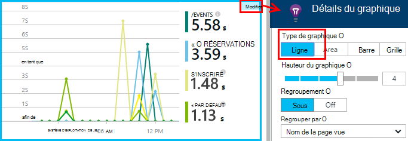

**Segment par d’autres dimensions.** Vos pages sont peut-être plus lents à charger sur un navigateur particulier, le client du système d’exploitation ou la localisation d’utilisateur ? Ajouter un nouveau graphique et expérimenter la dimension **Group by** .

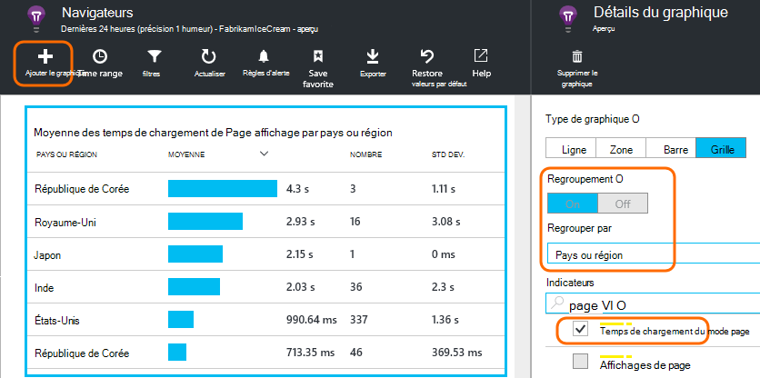

## Performances AJAX

Assurez-vous que tous les appels AJAX dans vos pages web sont fonctionne bien. Ils sont souvent utilisés pour remplir les parties de votre page asynchrone. Bien que la page entière peut charger rapidement, vos utilisateurs peuvent pas de veut composants WebPart vide, en attente de faire apparaître dans les données.

Appels AJAX effectués à partir de votre page web apparaissent comme des dépendances sur la carte de navigateurs.

Il existe dans la partie supérieure de la cuillère de synthèse graphiques :

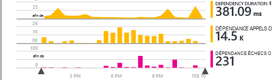

et grilles plus bas :

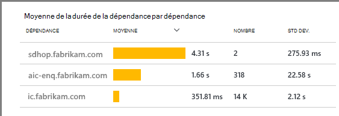

Cliquez sur n’importe quelle ligne pour plus d’informations spécifiques.

> [AZURE.NOTE] Si vous supprimez le filtre de navigateurs sur la carte, serveur et dépendances AJAX sont inclus dans ces graphiques. Cliquez sur Rétablir pour reconfigurer le filtre.

**Pour Explorer les appels Ajax échecs** faites défiler jusqu'à la grille d’échecs de dépendance, puis cliquez sur une ligne pour afficher des instances spécifiques.

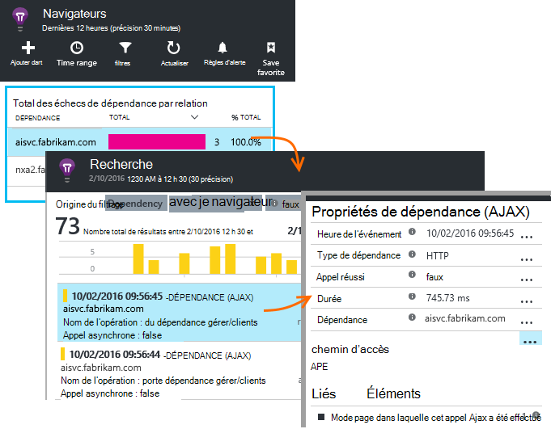

Cliquez sur `...` pour la télémétrie complète d’un appel Ajax.

### Les appels Ajax signalé ?

Les appels AJAX incluent tous les appels HTTP effectuées à partir du script de votre page web. Si vous ne voyez pas les signalé, vérifiez que l’extrait de code ne la `disableAjaxTracking` ou `maxAjaxCallsPerView` [paramètres](https://github.com/Microsoft/ApplicationInsights-JS/blob/master/API-reference.md#config).

## Exceptions de navigateur

Sur la carte navigateurs, il existe un graphique de synthèse exceptions et une grille des types d’exception davantage vers le bas de la carte.

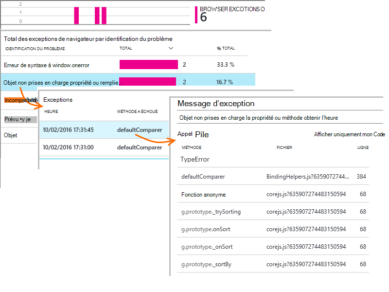

Si vous ne voyez pas exceptions navigateur signalées, vérifiez que l’extrait de code ne la `disableExceptionTracking` [paramètre](https://github.com/Microsoft/ApplicationInsights-JS/blob/master/API-reference.md#config).

## Vérifiez qu’afficher les événements de page individuel

Généralement télémétrie du mode page est analysée par Application Insights et vous verrez uniquement les rapports cumulés, moyennes pour tous vos utilisateurs. Mais, pour le débogage, vous pouvez également consulter afficher les événements de page individuel.

Dans la recherche de Diagnostic carte, définir des filtres en mode Page.

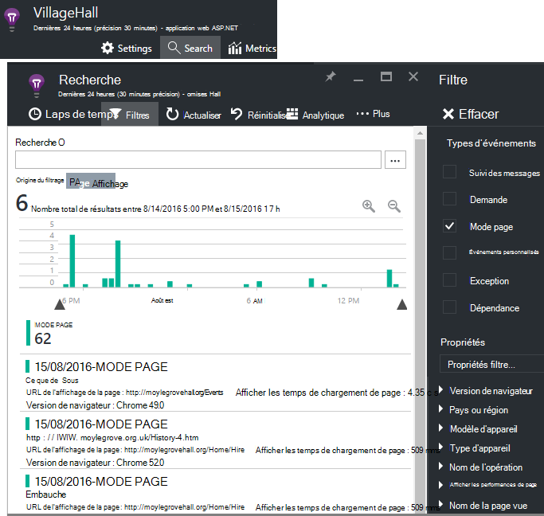

Sélectionnez n’importe quel événement pour afficher plus en détail. Dans la page Détails, cliquez sur « … » pour afficher davantage de détails.

> [AZURE.NOTE] Si vous utilisez la [recherche](app-insights-diagnostic-search.md), notez que vous devez faire correspondre les mots entiers : « Ropos » et « à propos de » ne correspondent pas à « À propos ».

Vous pouvez également utiliser les puissantes [Analytique langage de requête](app-insights-analytics-tour.md) pour rechercher des affichages de page.

### Afficher les propriétés de page

* **Durée du mode page** 

 * Par défaut, le temps nécessaire au chargement de la page, à partir de client demander à pleine charge (y compris les fichiers auxiliaires mais excluant des tâches asynchrones telles que les appels Ajax). 
 * Si vous définissez `overridePageViewDuration` dans la [configuration de la page](#detailed-configuration), l’intervalle entre les clients demander à l’exécution de la première `trackPageView`. Si vous avez déplacé trackPageView de sa position habituelle après l’initialisation du script, elle reflète une valeur différente.
 * Si `overridePageViewDuration` est défini et une durée argument est fourni dans la `trackPageView()` appeler, puis la valeur de l’argument est utilisée à la place. 

## Nombre de pages personnalisées

Par défaut, un nombre de pages, se produit chaque fois qu'une nouvelle page est chargée dans le navigateur client.  Mais vous pouvez souhaiter compter le nombre d’affichages de page supplémentaire. Par exemple, une page peut afficher son contenu dans les onglets et vous voulez compter le nombre d’une page lorsque l’utilisateur bascule onglets. Ou code JavaScript dans la page peut charger le nouveau contenu sans modifier l’URL du navigateur.

Insérer un appel JavaScript à ceci à l’endroit approprié dans votre code client :

    appInsights.trackPageView(myPageName);

Le nom de la page peut contenir les mêmes caractères sous forme d’URL, mais tout après « # » ou « ? » est ignorée.

## Suivi de l’utilisation

Vous voulez savoir ce que vos utilisateurs faire avec votre application ?

* [En savoir plus sur l’utilisation de suivi](app-insights-web-track-usage.md)
* [Découvrez les mesures API et événements personnalisés](app-insights-api-custom-events-metrics.md).

#### Vidéo : Suivi de l’utilisation

> [AZURE.VIDEO tracking-usage-with-application-insights]

## Étapes suivantes

* [Effectuer le suivi de l’utilisation](app-insights-web-track-usage.md)
* [Mesures et les événements personnalisés](app-insights-api-custom-events-metrics.md)
* [En savoir mesure de génération](app-insights-overview-usage.md)

