<properties 
    pageTitle="Exploration des indicateurs dans perspectives Application | Microsoft Azure" 
    description="Comment interpréter les graphiques dans l’Explorateur de métriques et la personnalisation des cartes explorer métrique." 
    services="application-insights" 
    documentationCenter=""
    authors="alancameronwills" 
    manager="douge"/>

<tags 
    ms.service="application-insights" 
    ms.workload="tbd" 
    ms.tgt_pltfrm="ibiza" 
    ms.devlang="na" 
    ms.topic="article" 
    ms.date="10/15/2016" 
    ms.author="awills"/>
 
# Exploration des indicateurs dans perspectives d’Application

Métrique en [Application Insights] [ start] sont des valeurs mesurées et le nombre d’événements qui sont envoyés en télémétrie à partir de votre application. Ils vous aider à détecter des problèmes de performances et regarder les tendances dans l’utilisation de votre application. Il existe un large éventail de mesures standard, et vous pouvez également créer vos propres mesures personnalisés et les événements.

Nombre de mesures et événement s’affichent dans les graphiques de valeurs agrégées telles que sommes, moyennes ou de nombres.

Voici un exemple de graphique :

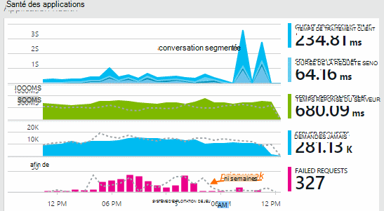

Certains graphiques sont segmentées : la hauteur totale du graphique à tout moment est la somme des mesures affichés. La légende par défaut affiche les quantités plus grandes.

Lignes en pointillés indiquent les valeurs de la métrique une semaine précédemment.

## Laps de temps

Vous pouvez modifier la période couverts par les graphiques ou de grilles analytiques sur une carte.

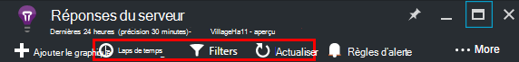

Si vous attendez des données qui n’a pas encore s’est affichée, cliquez sur Actualiser. Graphiques actualiser eux-mêmes à intervalles, mais les intervalles sont plus de plages de temps plus grandes. En mode publication, il peut prendre un certain temps pour les données à venir dans le pipeline d’analyse sur un graphique.

Pour effectuer un zoom dans un composant d’un graphique, faites glisser dessus :

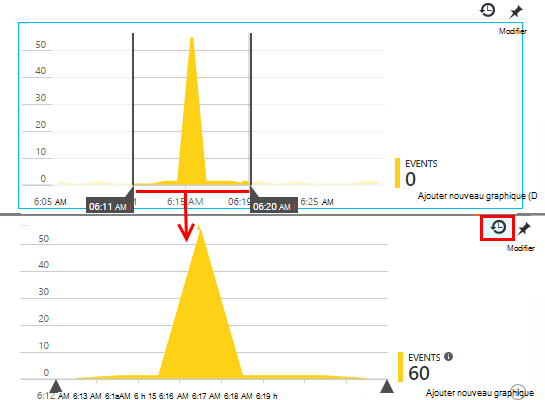

Cliquez sur le bouton Annuler effectuer un zoom avant pour la restaurer.

## Valeurs de précision et point

Pointez votre souris sur le graphique pour afficher les valeurs des mesures à ce stade.

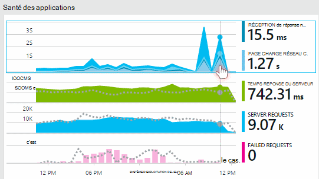

La valeur de la métrique à un moment donné est agrégée sur l’intervalle d’échantillonnage précédente. 

L’intervalle d’échantillonnage ou « précision » s’affiche en haut de la carte. 

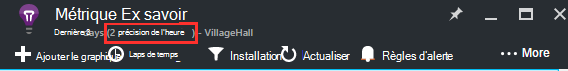

Vous pouvez ajuster la précision dans la carte de plage horaire :

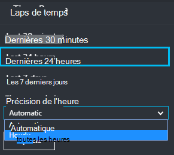

Les granularités disponibles dépendent de la plage horaire que vous sélectionnez. Les granularités explicites sont des alternatives au niveau « automatique » pour la plage horaire. 

## Explorer des indicateurs

Cliquez sur par le biais des graphiques dans la carte de présentation pour afficher un jeu plus détaillé des graphiques associés et les grilles. Vous pouvez modifier ces graphiques et les grilles pour vous concentrer sur les détails que qui vous intéresse.

Ou vous pouvez cliquez simplement sur le bouton Explorer indicateurs dans l’en-tête de la cuillère vue d’ensemble.

Par exemple, cliquez sur graphique de demandes Échec de l’application web :

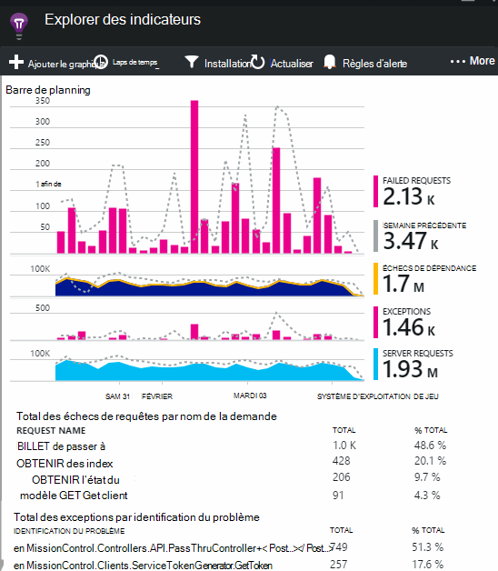

## Que signifient les chiffres ?

La légende sur le côté par défaut affiche généralement la valeur d’agrégation pendant la période du graphique. Si vous pointez sur le graphique, il affiche la valeur à ce stade.

Chaque point de données sur le graphique est un agrégat des valeurs reçues dans l’intervalle d’échantillonnage précédente ou « précision ». La précision est affichée en haut de la cuillère et varie en fonction de l’échelle de temps générale du graphique.

Indicateurs peuvent être regroupés de différentes manières : 

 * **Somme** additionne les valeurs de tous les points de données reçus via l’intervalle d’échantillonnage ou de la période du graphique.
 * **Moyenne** divise la somme par le nombre d’observations reçu sur l’intervalle.
 * Nombre **unique** est utilisés pour le nombre d’utilisateurs et des comptes. Sur l’intervalle d’échantillonnage, ou sur la période du graphique, l’illustration indique le nombre de différents utilisateurs vu pendant cette période.

Vous pouvez modifier la méthode d’agrégation :

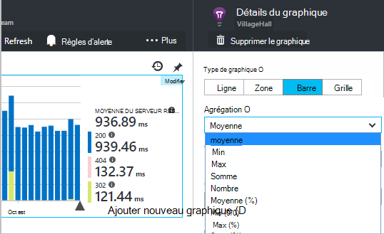

La méthode par défaut pour chaque métrique est affichée lorsque vous créez un nouveau graphique ou lorsque toutes les mesures sont désactivées :

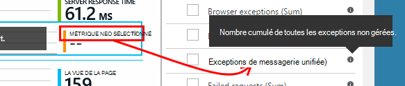

## Modification de graphiques et les grilles

Pour ajouter un nouveau graphique à la carte :

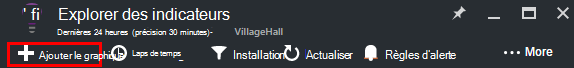

Sélectionner **Modifier** dans un graphique existant ou nouveau pour modifier ce qu’elle affiche :

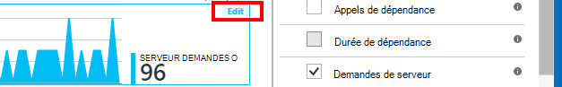

Vous pouvez afficher plusieurs métrique dans un graphique, qu’il existe des restrictions sur les combinaisons qui peuvent être affichés ensemble. Dès que vous choisissez une métrique, certains des autres sont désactivés. 

Si vous avez codée [indicateurs personnalisés] [ track] dans votre application (appels à TrackMetric et TrackEvent) qu’ils sont répertoriés ici.

## Segmenter vos données

Vous pouvez fractionner une métrique par propriété - par exemple, pour comparer les affichages de page sur les clients avec différents systèmes d’exploitation. 

Sélectionnez un graphique ou une grille, basculer sur le regroupement, puis sélectionnez une propriété pour regrouper par :

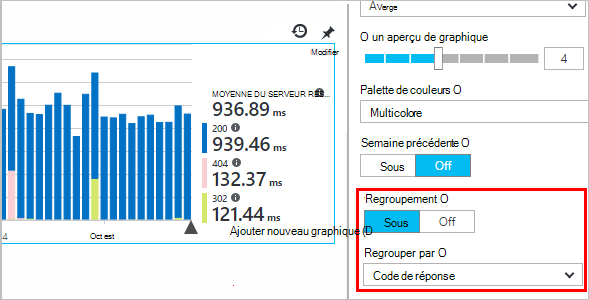

> [AZURE.NOTE] Lorsque vous utilisez le regroupement, les types de zone et graphique à barres fournissent un affichage empilé. Cela est approprié dans lequel la méthode d’agrégation est somme. Mais où le type d’agrégation est moyenne, choisissez les types d’affichage ligne ou de grille. 

Si vous avez codée [indicateurs personnalisés] [ track] dans votre application et inclure des valeurs de propriétés, vous pouvez sélectionner la propriété dans la liste.

Le graphique est trop petit pour données segmentées ? Ajuster la hauteur :

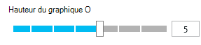

## Filtrer des données

Pour afficher uniquement les mesures pour un jeu de valeurs de propriété sélectionné :

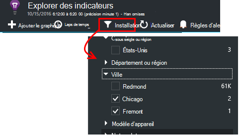

Si vous ne sélectionnez pas toutes les valeurs d’une propriété particulière, il est identique à la sélection de tous les : aucun filtre ne sur cette propriété.

Notez le nombre d’événements à côté de chaque valeur de propriété. Lorsque vous sélectionnez des valeurs de propriété, les nombres en parallèle avec d’autres valeurs de propriétés sont ajustées.

Filtres s’appliquent à tous les graphiques dans une carte. Si vous souhaitez que différents filtres appliqués aux graphiques différents, créer et enregistrer des cartes de différentes mesures. Si vous le souhaitez, vous pouvez épingler des graphiques à partir de différentes cartes au tableau de bord, afin que vous puissiez les voir en parallèle avec eux.

### Supprimer des robots et tester le trafic web

Utilisez le filtre **le trafic réel ou synthétique** et vérifiez **réel**.

Vous pouvez également filtrer par **Source du trafic synthétique**.

### Pour ajouter des propriétés de la liste de filtres

Vous voulez filtrer télémétrie sur une catégorie de votre choix ? Par exemple, peut-être diviser vos utilisateurs en différentes catégories, et vous voulez que vos données de segment par ces catégories.

[Créer votre propre propriété](app-insights-api-custom-events-metrics.md#properties). Configurer dans un [Initialiseur de télémétrie](app-insights-api-custom-events-metrics.md#telemetry-initializers) pour le faire apparaître dans tous les télémétrie - y compris la télémétrie standard envoyé par différents modules SDK.

## Modifier le type de graphique

Notez que vous pouvez passer à l’aide de grilles :

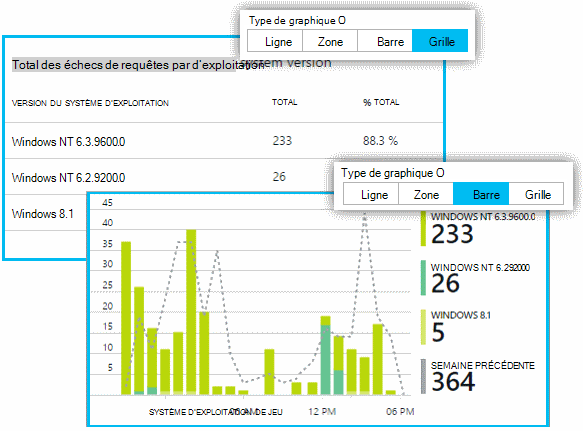

## Enregistrer votre carte de mesures

Lorsque vous avez créé d’autres graphiques, les enregistrer en tant que favori. Vous pouvez choisir si vous souhaitez le partager avec d’autres membres de l’équipe, si vous utilisez un compte professionnel.

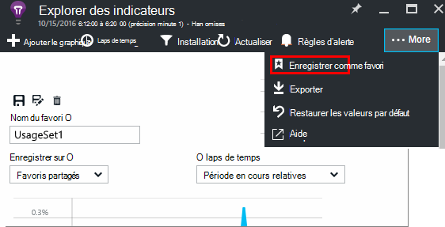

Pour afficher la carte à nouveau, **accédez à la carte de vue d’ensemble** et ouvrir Favoris :

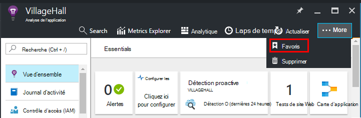

Si vous avez choisi laps de temps Relative lorsque vous avez enregistré, la carte est mise à jour avec les dernières mesures. Si vous avez choisi laps de temps absolu, il affiche les mêmes données chaque fois.

## Réinitialiser la carte

Si vous modifiez une carte mais puis que vous voulez revenir vers l’original enregistrement jeu, cliquez simplement sur Réinitialiser.

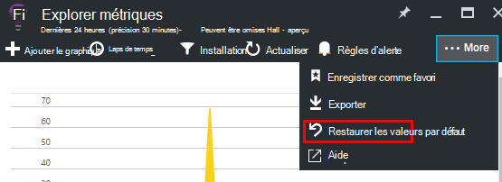

## Flux métriques direct : instantanée métriques de surveillance fermer

Indicateurs de flux vous montre les mesures de votre application vers la droite pour l’instant tout, avec une latence en temps réel futur proche de 1 seconde. Ceci est très utile lorsque vous êtes libération d’une nouvelle version et que vous voulez vous assurer que tout est travail comme prévu, ou l’examen un incident en temps réel.

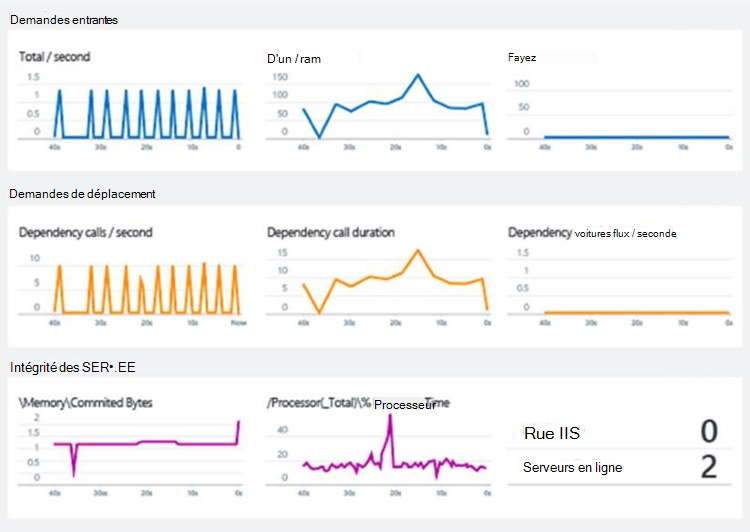

Contrairement à Explorer les mesures, indicateurs de flux affiche un ensemble fixe de mesures. Les données dure uniquement tant qu’il se trouve sur le graphique et est ignorée. 

Indicateurs de flux est disponible avec Application Insights SDK pour ASP.NET, version2.1.0 ou version ultérieure.

## Définir des alertes

Pour recevoir une notification par courrier électronique de valeurs inhabituelles d’une métrique, ajoutez une alerte. Vous pouvez choisir des options pour envoyer le message électronique aux administrateurs de compte ou aux adresses de messagerie spécifique.

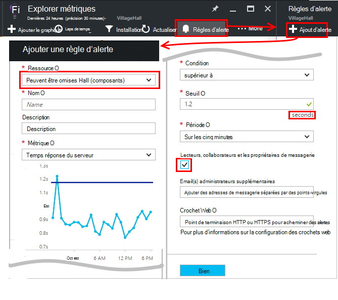

[En savoir plus sur les alertes][alerts].

## Exporter vers Excel

Vous pouvez exporter des données métriques qui sont affiche dans l’Explorateur de métrique vers un fichier Excel. Les données exportées incluent les données à partir de tous les graphiques et tableaux comme indiqué dans le portail. 

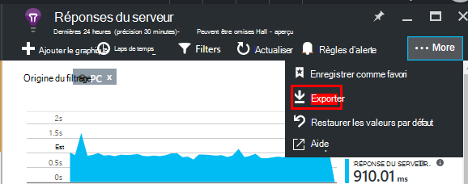

Les données de chaque graphique ou un tableau sont exportées vers une feuille séparée du fichier Excel.

Vous voyez ce qui obtient exporté. Modifier la période ou les filtres si vous souhaitez modifier la plage de données exportées. Pour les tableaux, si la commande **charger plus** s’affiche, vous pouvez cliquer dessus avant de cliquer sur Exporter, pour d’autres données exportées.

*Exporter fonctionne uniquement pour Internet Explorer et Chrome à l’heure actuelle. Nous travaillons sur l’ajout de prise en charge pour d’autres navigateurs.*

## Exporter en continu

Si vous souhaitez que les données exportées en permanence afin que vous pouvez les traiter avec l’extérieur, envisagez d’utiliser [continu exporter](app-insights-export-telemetry.md).

### Power BI

Si vous souhaitez encore plus riches vues de vos données, vous pouvez [exporter à Power BI](http://blogs.msdn.com/b/powerbi/archive/2015/11/04/explore-your-application-insights-data-with-power-bi.aspx).

## Analytique

[Analytique](app-insights-analytics.md) est un moyen plus souple pour analyser votre télémétrie à l’aide d’un langage de requête puissantes. Utilisez-la si vous voulez combiner ou calculer les résultats de métrique ou effectuer une exploration dans deph de performance récente de votre application. En revanche, utilisez l’Explorateur métriques si vous souhaitez que l’actualisation automatique, des graphiques dans le tableau de bord et les alertes.

## Résolution des problèmes

*Je ne vois pas toutes les données dans mon graphique.*

* Filtres s’appliquent à tous les graphiques dans la carte. Assurez-vous que, lorsque vous vous concentrez sur un graphique, vous n’a pas été défini un filtre qui exclut toutes les données sur un autre. 

    Si vous voulez définir des filtres différents sur différentes graphiques, les créer dans différentes cartes, enregistrez-les Favoris distincts. Si vous le souhaitez, vous pouvez les épingler au tableau de bord afin que vous puissiez les voir en parallèle avec eux.

* Si vous regroupez un graphique par une propriété qui n’est pas définie sur la mesure, puis il sera rien sur le graphique. Essayez d’effacer « Grouper par », ou choisissez une propriété de regroupement différents.
* Les données de performance (processeur, taux IO et ainsi de suite) est disponible pour les services web Java, les applications de bureau Windows, le [web IIS applications et services si vous installez moniteur d’état](app-insights-monitor-performance-live-website-now.md)et la [Azure Cloud Services](app-insights-azure.md). Il n’est pas disponible pour les sites Web Azure.

## Étapes suivantes

* [Surveiller l’utilisation avec des aperçus d’Application](app-insights-overview-usage.md)
* [Utiliser la recherche des Diagnostics](app-insights-diagnostic-search.md)

<!--Link references-->

[alerts]: app-insights-alerts.md
[start]: app-insights-overview.md
[track]: app-insights-api-custom-events-metrics.md

 