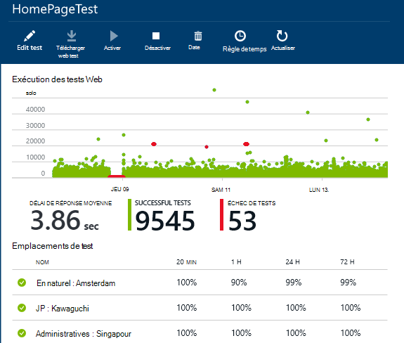
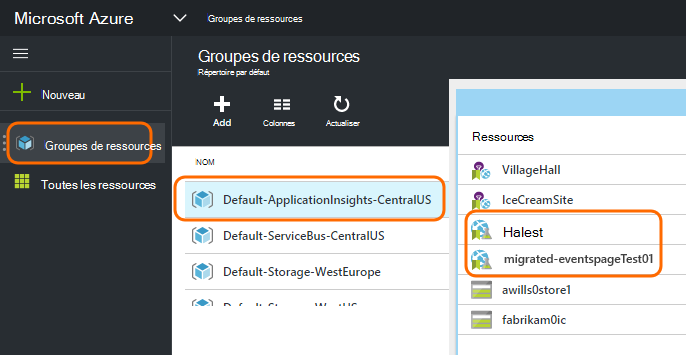
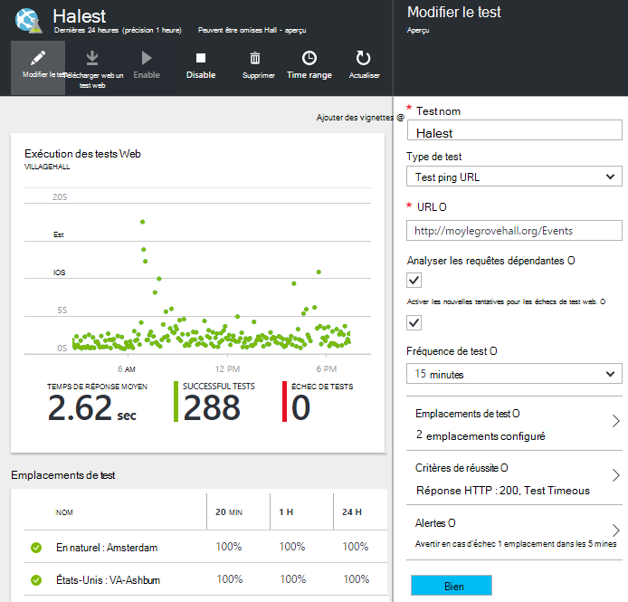

<properties 
    pageTitle="Migrer le point de terminaison Azure vers Tests de disponibilité des applications perspectives" 
    description="Migrer des tests de surveillance de point de terminaison Azure classiques en Application Insights teste la disponibilité en 31 octobre 2016."
    services="application-insights" 
    documentationCenter=""
    authors="soubhagyadash" 
    manager="douge"/>

<tags 
    ms.service="application-insights" 
    ms.workload="tbd" 
    ms.tgt_pltfrm="ibiza" 
    ms.devlang="na" 
    ms.topic="article" 
    ms.date="07/25/2016" 
    ms.author="awills"/>
 
# Déplacement du point de terminaison Azure surveillance à des Tests de disponibilité des applications perspectives

Utilisez [point de terminaison de surveillance des mots clés](https://blogs.msdn.microsoft.com/mast/2013/03/03/windows-azure-portal-update-configure-web-endpoint-status-monitoring-preview/) pour vos applications Azure ? En *31 octobre 2016*, nous allons les remplacer par les nouvelles et plus puissante [les tests de disponibilité](app-insights-monitor-web-app-availability.md). Nous avons déjà créé certains des tests de nouveau, même si elles sont désactivées jusqu'à ce que le 31 octobre 2016. 

Vous pouvez modifier les nouveaux tests et effectuez le commutateur vous-même si vous voulez. Vous les trouverez [portail Azure](https://portal.azure.com) dans le groupe de ressources par défaut-ApplicationInsights-CentralUS.

## Quelles sont les tests de disponibilité ?

Test de la disponibilité est une fonctionnalité de Azure qui vérifie continuellement que n’importe quel site web ou un service est vers le haut et en cours d’exécution en envoyant des requêtes HTTP (tests ping unique ou tests de site web Visual Studio) à partir de jusqu'à 16 emplacements dans le monde. 

Dans le [portail Azure classique](https://manage.windowsazure.com), ces tests ont été appelées surveillance de point de terminaison. Ils ont été une portée plus limitées. Les nouveaux tests de disponibilité sont une amélioration significative :

* Jusqu'à 10 tests de site web Visual Studio ou tests ping par ressource Application perspectives. 
* Jusqu'à 16 emplacements dans le monde à envoyer des demandes de test à votre application web. Meilleur contrôle des critères de réussite de test. 
* Testez un site web ou service - applications web pas simplement Azure.
* Tester de nouvelles tentatives : réduire les alertes de faux positifs en raison de problèmes réseau temporaires. 
* Webhooks peut recevoir des notifications de HTTP POST pour les alertes.

En savoir plus sur [les tests de disponibilité ici](app-insights-monitor-web-app-availability.md).

Les tests de disponibilité font partie [Visual Studio Application perspectives](app-insights-overview.md), qui est un service d’analytique extensible pour n’importe quelle application web.

## Qu’arrive-t-il à mes point de terminaison teste donc ?

* Nous avons copié votre point de terminaison de surveillance des tests pour les nouveaux tests de disponibilité des applications perspectives.
* Les nouveaux tests de disponibilité sont actuellement désactivés, et les tests de point de terminaison anciens toujours en cours d’exécution.
* Les alertes de règles n’ont *pas* été migrés. Les nouveaux tests initialement configurées avec une règle par défaut :
 * Se déclenche lorsque plus de 1 emplacement signale des défaillances dans 5 minutes.
 * Envoie un e-mail aux administrateurs de l’abonnement.

Dans le [portail Azure](https://portal.azure.com), vous pouvez trouver les tests migrés dans le groupe de ressources « Par défaut-ApplicationInsights-CentralUS ». Les noms de test comportent le préfixe « Migrée- ». 

## Que dois-je faire ?

* Si nous avons manqué d’une certaine manière migrer vos tests, les nouveaux tests de disponibilité sont [faciles à configurer](app-insights-monitor-web-app-availability.md).

### Option r : effectuez rien. Laisser contactez-nous.

**Sur le 31 octobre 2016,** nous allons :

* Désactiver les tests de point de terminaison ancien.
* Activer les tests de disponibilité migrés.

### Option b : vous gérer et/ou activer les tests de nouveau.

* Examiner et modifier les nouveaux tests de disponibilité dans le nouveau [portail Azure](https://portal.azure.com). 
 * Passez en revue les critères du déclencheur
 * Passez en revue les destinataires du message
* Activer les nouveaux tests
* Nous désactivons le point de terminaison héritée surveillance essais sur 31 octobre 2016 

### Option c : inscription arrière

Si vous ne voulez pas utiliser les tests de disponibilité, vous pouvez les supprimer dans le [portail Azure](https://portal.azure.com). Vous trouverez également un lien Annuler l’abonnement au bas des e-mails de notification.

Nous va toujours supprimer les tests de point de terminaison ancien sur 31 octobre 2016. 

## Comment modifier les nouveaux tests ?

Se connecter au [portail Azure](https://portal.azure.com) et rechercher les tests web migrée : 

Modifier ou activer le test :

## Que se passe-t-il ?

Améliorer le service. Le service de point de terminaison ancien a beaucoup plus restreint. Vous pouvez fournir seulement deux URL pour tests ping simple à partir de 3 emplacements geo une application web ou machine virtuelle Azure. Les nouveaux tests peuvent exécuter les tests de site web de plusieurs étapes de jusqu'à 16 emplacements, et vous pouvez spécifier jusqu'à 10 tests pour une application. Vous pouvez tester n’importe quelle URL - ne doit pas nécessairement être un site Azure.

Les nouveaux tests sont configurés séparément à partir du web app ou machine virtuelle que vous êtes en train de tester. 

Nous sommes migrer les tests pour vous assurer que vous continuez à rencontrer contrôler les lors de l’utilisation du portail de nouveau. 

## Quelles sont les perspectives d’Application ?

Les nouveaux tests de disponibilité font partie de [Visual Studio Application perspectives](app-insights-overview.md). Voici une [vidéo en 2 minutes](http://go.microsoft.com/fwlink/?LinkID=733921).

## Est-ce payer pour les nouveaux tests ?

Les tests migrés sont configurés dans une ressource d’analyse des applications dans le plan gratuit par défaut. Cela permet de collection de sites jusqu'à 5 millions de points de données. Qui couvre facilement le volume de données que vos tests utilise actuellement. 

Bien entendu, si vous comme Application Insights et créez des tests de disponibilité plus ou adopter plus de ses fonctionnalités de diagnostic et de l’analyse des performances, vous allez générer davantage de points de données.  Toutefois, le résultat ne serait que vous avez peuvent atteint le quota pour le plan gratuit. Vous ne recevrez pas d’une facture, sauf si vous choisissez cette option pour les plans Standard ou Premium. 

[En savoir plus sur l’Application Insights tarifs et contrôle du quota](app-insights-pricing.md). 

## Qu’est et n’est pas migré ?

Conservés à partir de votre ancien tests de point de terminaison :

* URL du point de terminaison à tester.
* Emplacements geo à partir duquel les demandes sont envoyées.
* Fréquence de test reste 5 minutes.
* Délai de test reste 30 secondes. 

Éléments non migrés :

* Règle de déclencheur alerte. La règle que nous avons créé des déclencheurs lorsque 1 emplacement signale des défaillances dans 5 minutes.
* Destinataires de l’alerte. E-mails de notification seront envoyées à l’abonnement propriétaires et de collaboration. 

## Comment trouver les nouveaux tests ?

Vous pouvez modifier un des nouveaux tests maintenant si vous voulez. Connectez-vous au [portail Azure](https://portal.azure.com), ouvrez les **Groupes de ressources** et sélectionnez **Par défaut-ApplicationInsights-CentralUS**. Dans ce groupe, vous trouverez les nouveaux tests de site web. [Découvrez les nouveaux tests de disponibilité](app-insights-monitor-web-app-availability.md).

Notez que les nouveaux messages électroniques alertes seront envoyés à partir de cette adresse : application analyse des alertes(ai-noreply@microsoft.com)

## Que se passe-t-il si je ne rien faire ?

Option A s’appliquent. Nous activer les tests migrés et configurer les règles d’alerte par défaut comme indiqué ci-dessus. Vous devrez ajouter les règles d’alerte personnalisées, destinataires comme indiqué ci-dessus. Nous désactivons le point de terminaison héritée tests de surveillance. 

## Où puis-je fournir des commentaires sur ce problème ? 

Nous vous remercions pour vos commentaires. Veuillez [nous envoyer un e-mail](mailto:vsai@microsoft.com). 

