<properties
    pageTitle="Diagnostiquer les problèmes de performances sur un site Web IIS en cours d’exécution | Microsoft Azure"
    description="Surveiller les performances d’un site Web sans le nouveau déployer. Utilisez autonome ou avec Application Insights SDK pour obtenir de télémétrie dépendance."
    services="application-insights"
    documentationCenter=".net"
    authors="alancameronwills"
    manager="douge"/>

<tags
    ms.service="application-insights"
    ms.workload="tbd"
    ms.tgt_pltfrm="ibiza"
    ms.devlang="na"
    ms.topic="get-started-article"
    ms.date="10/24/2016"
    ms.author="awills"/>

# Instrument web applications en cours d’exécution avec des aperçus d’Application

*Analyse de l’application est en mode Aperçu.*

Vous pouvez instrument une application web en ligne avec des aperçus de Application Visual Studio, sans avoir à modifier ou redéployez votre code. Dans vos applications sont hébergés par un serveur IIS en local, vous installez moniteur d’état ; ou, si elles n’applications web Azure ou exécutent une machine virtuelle Azure, vous pouvez installer l’extension Application perspectives. (Il existe également distinctes articles sur l’instrumentation [live J2EE web applications](app-insights-java-live.md) et [Services de Cloud Azure](app-insights-cloudservices.md).)

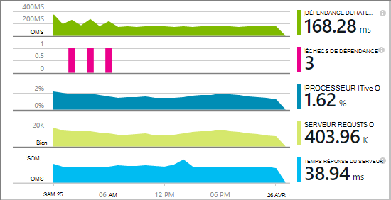

Vous avez le choix entre trois routes pour appliquer des perspectives d’Application à vos applications web .NET :

* **Heure de création :** [Ajouter l’Application Insights SDK] [greenbrown] pour le code de votre application web. 
* **Temps d’exécution :** Instrument votre application web sur le serveur, comme décrit ci-dessous, sans régénérer et redéployez le code.
* **Les deux :** Intégrer le Kit de développement de code de votre application web et s’appliquent également les extensions lors de l’exécution. Tirer le meilleur de ces deux options. 

Voici un résumé de ce que vous obtenez par chaque itinéraire :

||Heure de création|Temps d’exécution|
|---|---|---|
|Les demandes et les exceptions|Oui|Oui|
|[Plus d’exceptions](app-insights-asp-net-exceptions.md)||Oui|
|[Diagnostics de dépendance](app-insights-asp-net-dependencies.md)|Sous .NET 4.6 +|Oui|
|[Compteurs de performance système](app-insights-performance-counters.md)||Service de nuage IIS ou Azure, pas Azure dans le navigateur|
|[API de télémétrie personnalisé][api]|Oui||
|[Intégration du journal trace](app-insights-asp-net-trace-logs.md)|Oui||
|[Données de la page Afficher les & utilisateur](app-insights-javascript.md)|Oui||
|Sans avoir à recréer le code|N°||

## Instrument votre application web en cours d’exécution

Vous avez besoin d’un abonnement [Microsoft Azure](http://azure.com) .

### Si votre application est une application web Azure ou un Service Cloud

* Sélectionnez Application perspectives sur Panneau de configuration de l’application dans Azure. 

    [En savoir plus](app-insights-azure.md).

### Si votre application est hébergée sur votre serveur IIS

1. Sur votre serveur web IIS, connectez-vous à l’aide des informations d’identification d’administrateur.
2. Téléchargez et exécutez [programme d’installation de l’Analyseur de l’état](http://go.microsoft.com/fwlink/?LinkId=506648).
4. Dans l’Assistant installation, connectez-vous à Microsoft Azure.

    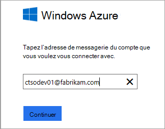

    *Erreurs de connexion ? Voir [résolution des problèmes](#troubleshooting).*

5. Sélectionnez l’application web installés ou le site Web que vous souhaitez surveiller, puis configurez la ressource dans laquelle vous souhaitez afficher les résultats dans le portail d’analyse de l’Application.

    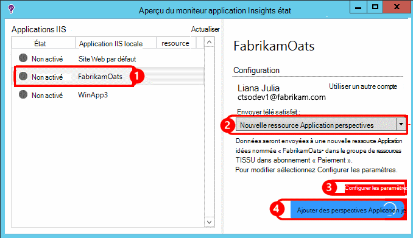

    En règle générale, vous choisissez de configurer un [groupe de ressources]et une nouvelle ressource[roles].

    Sinon, utilisez une ressource existante si vous avez déjà configuré des [tests web] [ availability] pour votre site ou [WebClient surveillance][client].

6. Redémarrer IIS.

    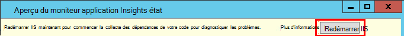

    Votre service web est interrompu pour quelques instants.

6. Notez que ApplicationInsights.config a été inséré dans les applications web que vous souhaitez analyser.

    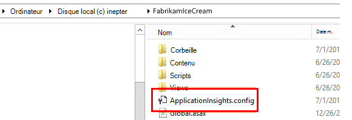

   Il existe également certaines modifications au fichier web.config.

#### Vous voulez (ré) configurer ultérieurement ?

Après avoir terminé l’Assistant, vous pouvez reconfigurer l’agent dès que vous le souhaitez. Vous pouvez également utiliser si vous avez installé l’agent mais il y a des problèmes avec la configuration initiale.

## Affichage performances télémétrie

Se connecter [au portail Azure](https://portal.azure.com), accédez Application Insights et la ressource que vous avez créé.

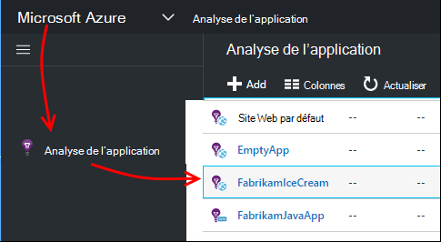

Ouvrez la carte de Performance pour afficher la demande, le temps de réponse, dépendance et d’autres données.

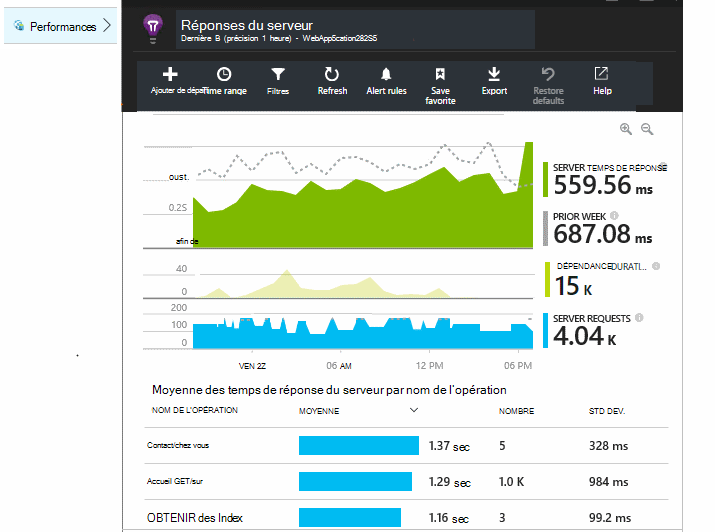

Cliquez sur un graphique quelconque pour ouvrir une vue plus détaillée.

Vous pouvez [modifier, réorganiser, enregistrer](app-insights-metrics-explorer.md), et l’épingler des graphiques ou la carte entier à un [tableau de bord](app-insights-dashboards.md).

## Dépendances

Le graphique de dépendance durée indique le temps écoulé par des appels provenant de votre application aux composants externes telles que les bases de données, API REST ou stockage blob Azure.

Pour segmenter le graphique par les appels à dépendances différentes : modifier le graphique, activer le regroupement et puis regrouper par dépendance, Type de dépendance ou dépendance performances.

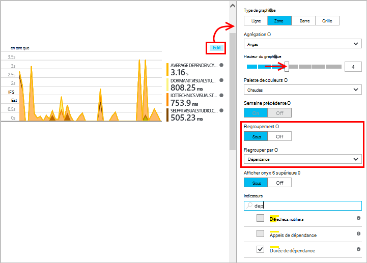

## Compteurs de performance 

(Pas pour les applications web Azure.) Cliquez sur serveurs sur la carte de présentation pour afficher des graphiques de compteurs performances du serveur comme initiaux à l’emménagement et la mémoire de l’UC.

Si vous avez plusieurs instances de serveur, vous souhaiterez peut-être modifier les graphiques pour regrouper par instance de rôle.

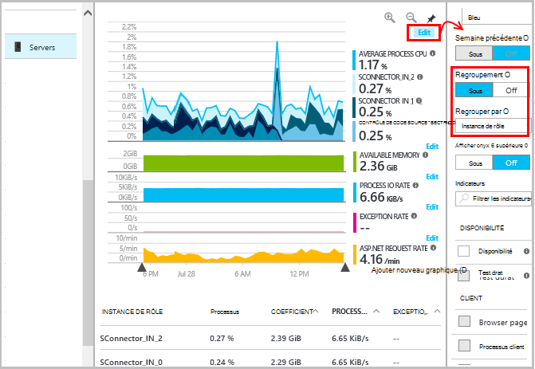

Vous pouvez également [Modifier l’ensemble des compteurs de performance qui sont signalés par le Kit de développement](app-insights-configuration-with-applicationinsights-config.md#nuget-package-3). 

## Exceptions

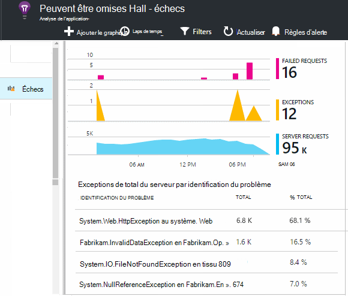

Vous pouvez d’exploration des exceptions spécifiques (dans les sept derniers jours) et obtenir des traces de la pile et des données de contexte.

## Échantillonnages

Si votre application envoie un grand nombre de données et que vous utilisez le Kit de développement du Insights d’Application pour ASP.NET version 2.0.0-beta3 ou version ultérieure, la fonctionnalité d’échantillonnage adapté peut-être fonctionner et envoyer uniquement un pourcentage de votre télémétrie. [Découvrez les échantillonnages.](app-insights-sampling.md)

## Résolution des problèmes

### Erreurs de connexion

Vous devez ouvrir [certains ports sortants](app-insights-ip-addresses.md#outgoing-ports) dans le pare-feu de votre serveur pour autoriser le moniteur d’état pour l’utiliser.

### Aucune télémétrie ?

  * Utiliser votre site, pour générer des données.
  * Patientez quelques minutes pour laisser les données arrivent, puis cliquez sur **Actualiser**.
  * Ouvrir la recherche Diagnostic (la vignette de recherche) pour consulter des événements particuliers. Événements sont souvent visibles dans recherche Diagnostic avant d’agréger les données s’affiche dans les graphiques.
  * Ouvrir le moniteur d’état et sélectionnez votre application dans le volet gauche. Vérifier s’il existe des messages de diagnostic pour cette application dans la section « Configuration notifications » :

  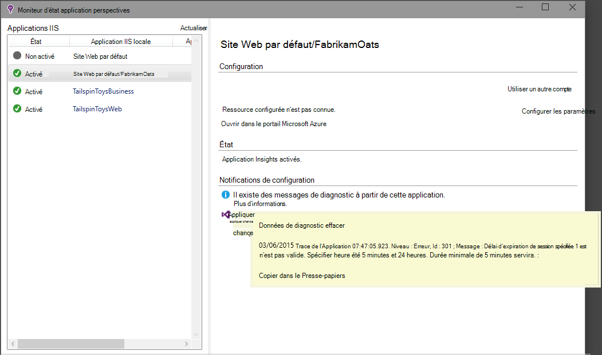

  * Vérifiez que votre pare-feu server autorise le trafic sortant sur les ports répertoriés ci-dessus.
  * Sur le serveur, si vous voyez un message indiquant « autorisations suffisantes », procédez comme suit :
    * Dans le gestionnaire, sélectionnez votre pool d’applications, ouvrez **Paramètres avancés**et sous **Le modèle de processus** Notez l’identité.
    * Dans le panneau de configuration ordinateur gestion, ajoutez cette identité au groupe d’utilisateurs de l’analyseur performances.
  * Si vous avez installé sur votre serveur MMA/SCOM, certaines versions peuvent entrer en conflit. Désinstallez SCOM et moniteur d’état, puis réinstallez versions les plus récentes.
  * Voir [dépannage][qna].

## Configuration système requise

Prise en charge du système d’exploitation pour Application moniteur d’état perspectives sur serveur :

- Windows Server 2008
- Windows Server 2008 R2
- Windows Server 2012
- Serveur Windows 2012 R2

avec les dernières SP et .NET Framework 4.0 et 4.5

Sur le côté client Windows 7, 8 et 8.1, à nouveau avec .NET Framework 4.0 et 4.5

Est prise en charge IIS : IIS 7, 7.5, 8, 8.5 (IIS est requis)

## Automatisation avec PowerShell

Vous pouvez démarrer et arrêter la surveillance à l’aide de PowerShell sur votre serveur IIS.

Tout d’abord importer le module d’analyse de l’Application :

`Import-Module 'C:\Program Files\Microsoft Application Insights\Status Monitor\PowerShell\Microsoft.Diagnostics.Agent.StatusMonitor.PowerShell.dll'`

Déterminer quelles applications sont en cours d’analyse :

`Get-ApplicationInsightsMonitoringStatus [-Name appName]`

* `-Name`(Facultatif) Le nom d’une application web.
* Affiche les analyses de l’Application suivi de l’état pour chaque application web (ou l’application nommée) sur ce serveur IIS.

* Renvoie `ApplicationInsightsApplication` pour chaque application :
 * `SdkState==EnabledAfterDeployment`: Application en cours d’analyse et a été instrumentée en cours d’exécution, l’outil Analyseur de l’état, ou en `Start-ApplicationInsightsMonitoring`.
 * `SdkState==Disabled`: L’application n’existe pas pour l’analyse de l’Application. Il a été instrumenté jamais, soit surveillance lors de l’exécution de scripts avec l’outil Analyseur de l’état ou `Stop-ApplicationInsightsMonitoring`.
 * `SdkState==EnabledByCodeInstrumentation`: L’application a été existe en ajoutant le Kit de développement pour le code source. Son SDK ne peut pas être mis à jour ou arrêté.
 * `SdkVersion`Affiche la version en cours d’utilisation pour l’analyse de cette application.
 * `LatestAvailableSdkVersion`Affiche la version actuellement disponible dans la galerie NuGet. Pour mettre à niveau de l’application pour cette version, utilisez `Update-ApplicationInsightsMonitoring`.

`Start-ApplicationInsightsMonitoring -Name appName -InstrumentationKey 00000000-000-000-000-0000000`

* `-Name`Le nom de l’application dans IIS
* `-InstrumentationKey`Ikey de la ressource Application Insights dans laquelle vous souhaitez que les résultats à afficher.

* Cette applet de commande n’affecte que les applications qui ne sont pas déjà instrumentées - autrement dit, SdkState == NotInstrumented.

    L’applet de commande n’affecte pas une application qui est déjà instrumentée, au moment de créer en ajoutant le Kit de développement pour le code ou en cours d’exécution par l’utilisation de cette applet de commande antérieure.

    La version du Kit de développement logiciel utilisée d’instrumentation de l’application est la version qui a été récemment téléchargée sur ce serveur.

    Pour télécharger la version la plus récente, utilisez ApplicationInsightsVersion de mise à jour.

* Renvoie `ApplicationInsightsApplication` en cas de réussite. En cas d’échec, il enregistre une trace dans stderr.

    
          Name                      : Default Web Site/WebApp1
          InstrumentationKey        : 00000000-0000-0000-0000-000000000000
          ProfilerState             : ApplicationInsights
          SdkState                  : EnabledAfterDeployment
          SdkVersion                : 1.2.1
          LatestAvailableSdkVersion : 1.2.3

`Stop-ApplicationInsightsMonitoring [-Name appName | -All]`

* `-Name`Le nom d’une application dans IIS
* `-All`Arrête l’analyse de toutes les applications sur ce serveur IIS dont`SdkState==EnabledAfterDeployment`

* Arrête de surveiller les applications spécifiées et supprime instrumentation. Elle fonctionne uniquement pour les applications qui ont été instrumentées au moment de l’exécution à l’aide de l’outil d’analyse de l’état ou démarrer ApplicationInsightsApplication. (`SdkState==EnabledAfterDeployment`)

* Renvoie ApplicationInsightsApplication.

`Update-ApplicationInsightsMonitoring -Name appName [-InstrumentationKey "0000000-0000-000-000-0000"`]

* `-Name`: Le nom d’une application web dans IIS.
* `-InstrumentationKey`(Facultatif). Utilisez cette option pour modifier la ressource à laquelle télémétrie de l’application est envoyée.
* Cette applet de commande :
 * Mises à niveau de l’application nommée vers la version du Kit de développement récemment téléchargée sur cet ordinateur. (Fonctionne uniquement si `SdkState==EnabledAfterDeployment`)
 * Si vous fournissez une clé d’instrumentation, de l’application nommée est reconfigurer pour envoyer de télémétrie à la ressource avec cette clé. (Fonctionne si `SdkState != Disabled`)

`Update-ApplicationInsightsVersion`

* Télécharge la dernière Application Insights SDK sur le serveur.

## Étapes suivantes

* [Créer des tests web] [ availability] pour vous assurer que votre site reste live.
* [Rechercher des événements et les journaux] [ diagnostic] de diagnostiquer les problèmes.
* [Ajouter de télémétrie de client web] [ usage] pour afficher les exceptions à partir du code de page web et permet d’insérer le suivi des appels.
* [Ajouter l’Application Insights SDK à votre code de service web] [ greenbrown] afin que vous pouvez insérer trace et journal des appels dans le code du serveur.

<!--Link references-->

[api]: app-insights-api-custom-events-metrics.md
[availability]: app-insights-monitor-web-app-availability.md
[client]: app-insights-javascript.md
[diagnostic]: app-insights-diagnostic-search.md
[greenbrown]: app-insights-asp-net.md
[qna]: app-insights-troubleshoot-faq.md
[roles]: app-insights-resources-roles-access-control.md
[usage]: app-insights-web-track-usage.md
