<properties
    pageTitle="Surveiller la disponibilité et la réactivité de n’importe quel site web | Microsoft Azure"
    description="Configurer des tests de site web dans l’Application perspectives. Recevoir des alertes si un site Web est indisponible ou répond lentement."
    services="application-insights"
    documentationCenter=""
    authors="alancameronwills"
    manager="douge"/>

<tags
    ms.service="application-insights"
    ms.workload="tbd"
    ms.tgt_pltfrm="ibiza"
    ms.devlang="na"
    ms.topic="get-started-article"
    ms.date="09/07/2016"
    ms.author="awills"/>

# Analyser la disponibilité et la réactivité de n’importe quel site web

Une fois que vous avez déployé votre application web ou un site web à un serveur, vous pouvez configurer les tests de site web pour surveiller sa disponibilité et la réactivité. [Visual Studio Application Insights](app-insights-overview.md) envoie des requêtes web à votre application à intervalles réguliers à partir de points dans le monde entier. Il vous avertit si votre application ne répond pas ou répond lentement.

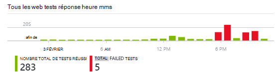

Vous pouvez configurer des tests de site web pour un point de terminaison HTTP ou HTTPS est accessible à partir de l’internet public.

Il existe deux types de test de site web :

* [Test ping URL](#create): un test simple que vous pouvez créer dans le portail Azure.
* [Test de site web de plusieurs étapes](#multi-step-web-tests): que vous créez dans Visual Studio intégrale ou entreprise de Visual Studio et télécharger dans le portail.

Vous pouvez créer jusqu'à 10 tests de site web par ressource d’application.

## 1. création d’une ressource pour vos rapports de test

Ignorer cette étape si vous avez déjà [configurer une ressource d’Application Insights] [ start] pour cette application et que vous voulez voir les rapports de disponibilité au même endroit.

S’inscrire à [Microsoft Azure](http://azure.com), accédez au [portail Azure](https://portal.azure.com)et créez une ressource d’analyse de l’Application.

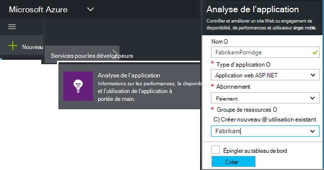

Cliquez sur **toutes les ressources** pour ouvrir la carte de vue d’ensemble de la nouvelle ressource.

## 2. création d’un test ping URL

Dans une ressource de votre Application perspectives, recherchez la vignette de disponibilité. Cliquez dessus pour ouvrir la carte de tests Web pour votre application, puis ajoutez un test web.

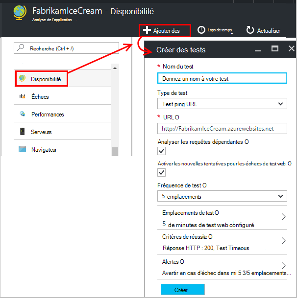

- **L’URL** doit être visible à partir de l’internet public. Il peut inclure une chaîne de requête & #151 ; par conséquent, par exemple, vous pouvez exercer votre base de données un peu. Si l’URL est résolue en une redirection, nous faire suivre jusqu'à 10 redirections.
- **Analyser les requêtes dépendantes**: Images, des scripts, fichiers de style et d’autres ressources de la page sont demandés dans le cadre du test, et le temps de réponse enregistrées inclut ces heures. Le test échoue si toutes ces ressources ne peut pas être téléchargés correctement dans le délai d’expiration pour l’ensemble de l’essai.
- **Activer les tentatives**: lorsque le test échoue, il est retentée après un court intervalle. Une erreur est signalée uniquement si les trois tentatives successives échouent. Les tests suivants sont alors effectuées à la fréquence d’essai habituelle. Nouvelles tentatives est temporairement suspendu jusqu'à ce que la réussite suivante. Cette règle est appliquée indépendamment à chaque emplacement de test. (Nous vous recommandons de ce paramètre. En moyenne, environ 80 % des échecs disparaissent sur Réessayer.)
- **Fréquence de test**: définit la fréquence à laquelle le test est exécuté à partir de chaque emplacement pour le test. Avec une fréquence de cinq minutes et test cinq emplacements, votre site est testé en moyenne toutes les minutes.
- **Emplacements de test** sont les endroits à partir de l’endroit où nos serveurs envoient les demandes web à l’URL de votre. Choisir plusieurs afin que vous pouvez distinguer les problèmes dans votre site Web de problèmes réseau. Vous pouvez sélectionner jusqu'à 16 emplacements.

- **Critères de réussite**:

    **Délai de test**: diminuez cette valeur pour être alerté sur réponses lentes. Le test est considérée comme une défaillance si les réponses à partir de votre site n’ont pas été reçues pendant cette période. Si vous avez sélectionné **analyser les demandes dépendantes**, puis toutes les images, fichiers de style, scripts et autres ressources dépendantes doivent ont été reçues pendant cette période.

    **Réponse HTTP**: le code d’état retourné est considérée comme un succès. 200 est le code qui indique qu’une page web normale a été retourné.

    **Contenu correspond à**: une chaîne, comme « Bienvenue ! » Nous tester qu’il se produit dans chaque réponse. Il doit être une chaîne simple, sans les caractères génériques. N’oubliez pas que si les modifications du contenu page que vous devrez peut-être mettre à jour.

- **Alertes** sont, par défaut, envoyé s’il existe plus de cinq minutes échecs dans trois emplacements. Une erreur dans un seul emplacement est susceptible d’être un problème de réseau et pas un problème avec votre site. Mais vous pouvez modifier le seuil afin d’être plus ou moins sensibles, et vous pouvez également qui les messages électroniques doivent être envoyées à modifier.

    Vous pouvez configurer un [webhook](../monitoring-and-diagnostics/insights-webhooks-alerts.md) qui est appelé lors d’une alerte. (Mais notez que, à l’heure actuelle, les paramètres de requête ne sont pas passés en tant que propriétés.)

### URL plus du test

Ajouter des tests plus. Pour exemple, ainsi que tester votre page d’accueil, vous pouvez vérifiez que votre base de données est en cours d’exécution en testant l’URL d’une recherche.

## 3. voir votre site web les résultats des tests

Après 1 et 2 minutes, les résultats s’affichent dans la carte de Test de site Web.

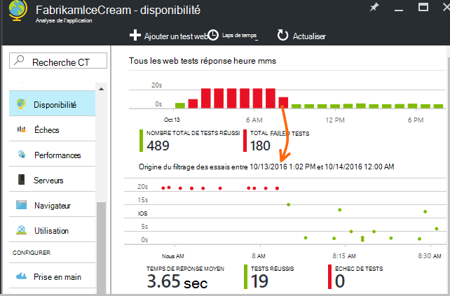

Cliquez sur une barre dans le graphique de synthèse pour une vue plus détaillée de cette période.

Ces graphiques combinent des résultats pour tous les tests de site web de cette application.

## Si vous constatez des échecs

Cliquez sur un point rouge.

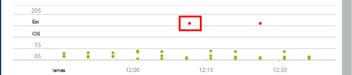

Ou, faites défiler vers le bas, puis cliquez sur un test indiquant inférieur à 100 % succès.

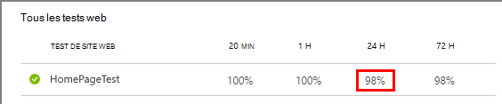

Les résultats de ce test doit être ouvert.

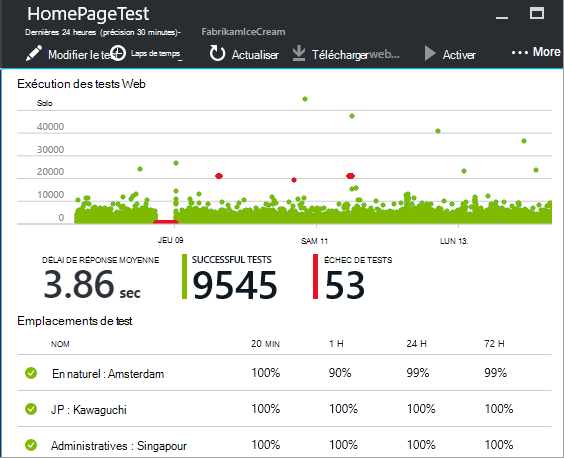

Le test est exécuté à partir de plusieurs emplacements & #151 ; sélectionnez-en un dans lequel les résultats sont inférieures à 100 %.

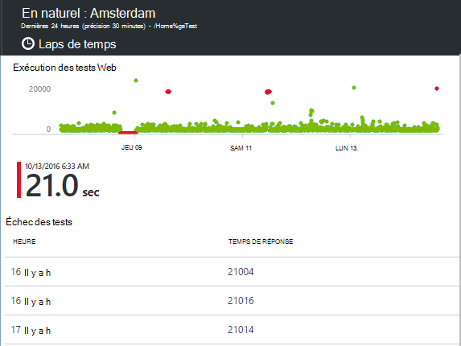

Faites défiler vers le bas jusqu'à **l’Échec des tests** et choisissez un résultat.

Cliquez sur le résultat pour évaluer dans le portail et voir pourquoi il a échoué.

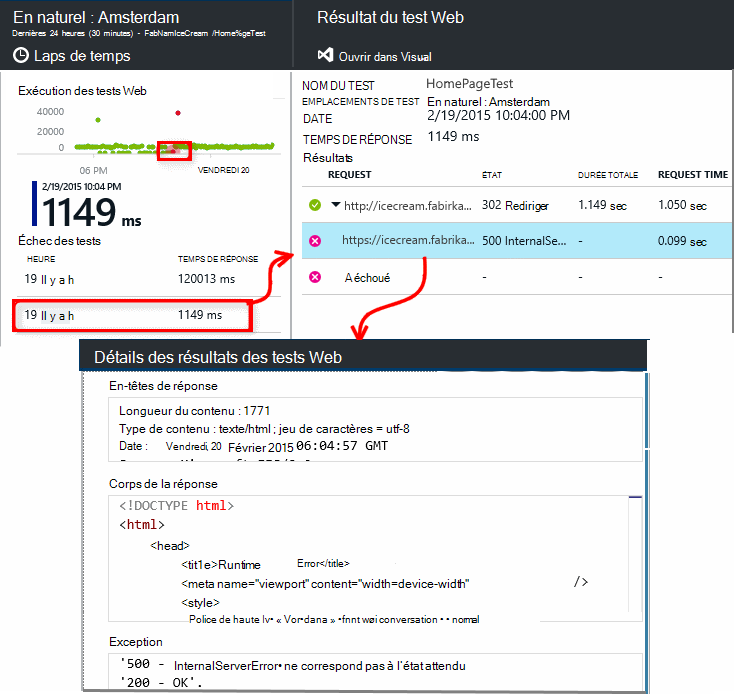

Par ailleurs, vous pouvez télécharger le fichier de résultats et inspecter dans Visual Studio.

*Recherche OK mais signalée comme un échec ?* Consultez toutes les images, les scripts, les feuilles de style et tous les autres fichiers chargement par la page. Si un d’eux échoue, le test est signalé comme ayant échoué, même si la page principale html est chargée OK.

## Tests de site web à plusieurs étapes

Vous pouvez analyser un scénario impliquant une séquence d’URL. Par exemple, si vous analysez un site Web de vente, vous pouvez tester qu’Ajout d’éléments à l’achat panier fonctionne correctement.

Pour créer un test à plusieurs étapes, vous enregistrez le scénario à l’aide de Visual Studio, puis téléchargez l’enregistrement analyse de l’Application. Application Insights relecture le scénario à intervalles et vérifie les réponses.

Notez que vous ne pouvez pas utiliser codé fonctions dans vos tests : les étapes du scénario doivent figurer sous forme de script dans le fichier .webtest.

#### 1. enregistrement un scénario

Utilisez Visual Studio Enterprise ou intégrale pour enregistrer une session web.

1. Créer un projet de test de performances web.

    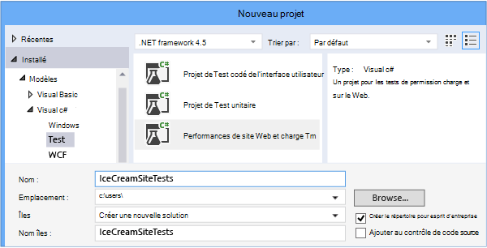

2. Ouvrez le fichier .webtest et démarrer l’enregistrement.

    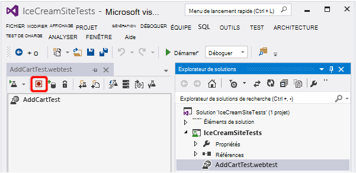

3. Effectuez les actions de l’utilisateur que vous souhaitez simuler dans votre test : ouvrir votre site Web, ajouter un produit au panier et ainsi de suite. Puis arrêter votre test.

    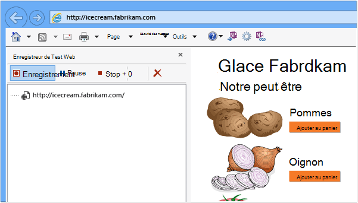

    Ne pas apporter de scénario long. Il existe une limite de 100 étapes et 2 minutes.

4. Modifier le test :
 - Ajouter des validations pour vérifier les codes de texte et de réponse reçus.
 - Supprimer les interactions superflues. Vous pouvez également supprimer demandes dépendantes pour les images ou pour ad ou suivi des sites.

    N’oubliez pas que vous pouvez uniquement modifier le script de test, vous ne pouvez pas ajouter du code personnalisé ou d’appeler d’autres tests de site web. N’insérez des boucles dans le test. Vous pouvez utiliser des plug-ins de test web standard.

5. Exécutez le test dans Visual Studio pour vérifier qu’il fonctionne.

    Le canal d’injection test web s’ouvre un navigateur web et répète les actions que vous avez enregistrées. Vérifier qu’il fonctionne comme prévu.

    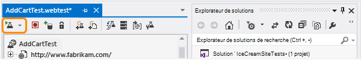

#### 2. télécharger le test web Application analyse

1. Dans le portail d’analyse de l’Application, créez un test web.

    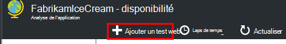

2. Sélectionnez test de plusieurs étapes et téléchargez le fichier .webtest.

    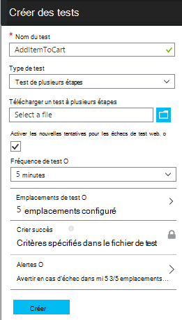

    Définissez les emplacements de test, fréquence et paramètres d’alerte de la même façon que pour les tests ping.

Afficher les résultats des tests et les erreurs éventuelles de la même façon que pour les tests codés url.

Une raison courante de l’échec est que le test s’exécute trop de temps. Il ne s’exécute plu de deux minutes.

N’oubliez pas que toutes les ressources d’une page doivent charger correctement pour le test aboutisse, y compris les scripts, feuilles de style, des images et ainsi de suite.

Notez que le test web doit impérativement se trouver dans le fichier .webtest : vous ne pouvez pas utiliser les fonctions codées dans le test.

### Brancher heures et des nombres aléatoires votre test à plusieurs étapes

Supposons que vous êtes en train de tester un outil qui extrait les données dépendant de la durée tels que des actions d’un flux externes. Lorsque vous enregistrez le test de votre site web, vous devez utiliser des heures spécifiques, mais les définir en tant que paramètres du test, les heures de début et heure de fin.

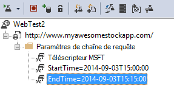

Lorsque vous exécutez le test, vous voulez que l’heure de fin doivent toujours l’heure actuelle, et heure de début doit être il y a 15 minutes.

Plug-ins de Test Web permettent de paramétrer heures.

1. Ajoutez un test web plug-in pour chaque valeur de paramètre de variable souhaitée. Dans la barre d’outils de test web, sélectionnez **Ajouter un plug-in de Test Web**.

    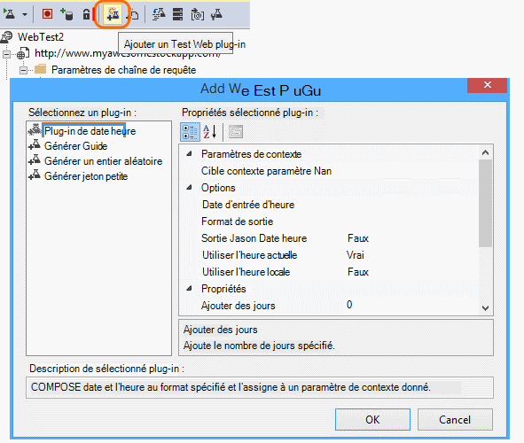

    Dans cet exemple, nous utilisons deux instances de l’heure du plug-in Date. Une instance est pour « il y a 15 minutes » et un autre pour « maintenant ».

2. Ouvrez les propriétés de chaque plug-in. Donnez-lui un nom et le configurer pour utiliser l’heure actuelle. Pour l’une des Minutes ajouter leur, définissez = -15.

    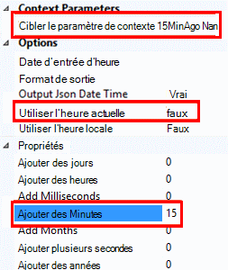

3. Tester les paramètres du site Web, utilisez {{nom du plug-in}} pour faire référence à un nom de plug-in.

    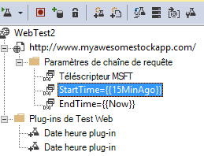

À présent, téléchargez votre test au portail. Il utilise les valeurs dynamiques à chaque exécution du test.

## En matière de gestion de se connecter

Si vos utilisateurs se connecter à votre application, vous devez différentes options pour simuler connexion afin que vous pouvez tester les pages derrière la connexion. L’approche que vous utilisez dépend du type de sécurité fournie par l’application.

Dans tous les cas, vous devez créer un compte dans votre application simplement pour effectuer un test. Si possible, limitez les autorisations de ce compte de test pour qu’il n’existe aucune possibilité des tests de site web qui peuvent affecter des utilisateurs réels.

### Simple nom d’utilisateur et mot de passe

Enregistrer un test web de la manière habituelle. Tout d’abord supprimer les cookies.

### Authentification SAML

Utilisez le plug-in SAML est disponible pour les tests de site web.

### Secret client

Si votre application dispose d’un itinéraire de connexion qui implique un secret client, utiliser cet itinéraire. Azure Active Directory (DAS) est un exemple d’un service qui fournit un client connexion secrète. Le code secret client AAD, est la touche application.

Voici un test web sur une application web Azure à l’aide d’une touche application :

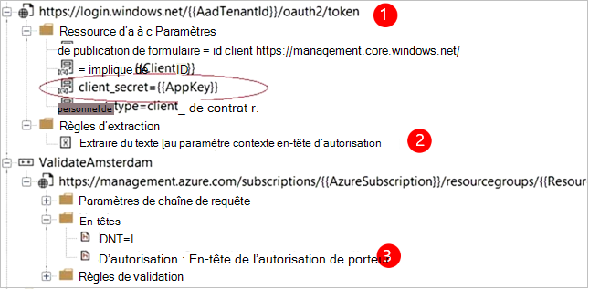

1. Obtenez jeton de DAS à l’aide de secret client (AppKey).
2. Extrait OAuth de réponse.
3. Appel API à l’aide de support OAuth dans l’en-tête d’autorisation.

Vérifiez que le test web est un client réel, c'est-à-dire qu’il possède son propre application dans AAD - et utiliser son identifiant du client + appkey. Votre service de test est également sa propre application dans AAD : l’identificateur URI de cette application est pris en compte dans le test web dans le champ « ressource ».

### Authentification ouverte

Exemple de l’authentification ouverte est pour vous connecter avec votre compte Microsoft ou Google. Plusieurs applications qui utilisent des OAuth fournissent au client à la place secrète, votre première stratégie doit être à cette possibilité.

Si votre test doit se connecter à l’aide de OAuth, l’approche générale est la suivante :

 * Utilisez un outil comme Fiddler pour examiner le trafic entre votre navigateur web, le site de l’authentification et votre application.
 * Effectuer deux ou plusieurs connexions à l’aide des ordinateurs différents ou navigateurs, ou à des intervalles de temps (pour autoriser les jetons à expiration).
 * En comparant différentes sessions, identifier le jeton passé à partir du site authentification, qui est ensuite transmis à votre serveur application après la connexion.
 * Enregistrement d’un test web à l’aide de Visual Studio.
 * Paramétrer les jetons, le paramètre lorsque le jeton est renvoyé à partir de l’authentificateur et son utilisation dans la requête au site.
 (Visual Studio tente à paramétrer le test, mais ne pas correctement paramétrer les jetons).

## Modifier ou désactiver un test

Ouvrez un test individuel pour modifier ou le désactiver.

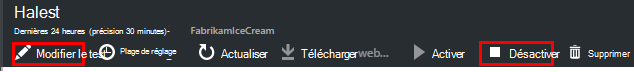

Vous souhaiterez peut-être désactiver les tests de site web alors que vous exécutez la maintenance de votre service.

## Tests de performances

Vous pouvez exécuter un test de charge sur votre site Web. Comme le test de disponibilité, vous pouvez envoyer des demandes simples ou les demandes de plusieurs étapes à partir de notre points du monde entier. Contrairement à un test de disponibilité, demandes de nombreux sont envoyées, simuler plusieurs utilisateurs simultanément.

À partir de la carte de la vue d’ensemble, ouvrez **paramètres**, **Les Tests de performances**. Lorsque vous créez un test, vous êtes invité à vous connecter à ou créer un compte Visual Studio Team Services.

Lorsque le test est terminé, vous sont affichées les temps de réponse et taux de réussite.

## Automatisation

* [Scripts utiliser PowerShell pour configurer un test web](https://azure.microsoft.com/blog/creating-a-web-test-alert-programmatically-with-application-insights/) automatiquement.
* Configurer un [webhook](../monitoring-and-diagnostics/insights-webhooks-alerts.md) qui est appelé lors d’une alerte.

## Questions ? Problèmes ?

* *Est-il possible d’appeler du code de test de mon site web ?*

    Non. Les étapes du test doivent être placé dans le fichier .webtest. Et vous ne pouvez pas appeler d’autres tests de site web ou utilisez des boucles. Mais il existe plusieurs plug-ins pouvez vous être utiles.

* *HTTPS est pris en charge ?*

    Nous prenons en charge TLS 1.1 et TLS 1.2.

* *Existe-t-il une différence entre « tests de site web » et « les tests de disponibilité » ?*

    Nous utilisons les deux termes manière interchangeable.

* *Je souhaite utiliser les tests de disponibilité sur notre serveur interne qui s’exécute derrière un pare-feu.*

    Configurez votre pare-feu pour autoriser les demandes d' [agents de test adresses IP du site web](app-insights-ip-addresses.md#availability).

* *Téléchargement d’un test web plusieurs étapes échoue*

    Il existe une limite de taille de 300 K.

    Boucles ne sont pas pris en charge.

    Les références aux autres tests de site web ne sont pas pris en charge.

    Sources de données ne sont pas pris en charge.

* *Ne termine pas mon test plusieurs étapes*

    Il existe une limite de 100 demandes par test.

    Le test est arrêté si elle s’exécute plu de deux minutes.

* *Comment puis-je exécuter un test avec un certificat client ?*

    Nous ne prend pas en charge, nous sommes désolés.

## Vidéo

> [AZURE.VIDEO monitoring-availability-with-application-insights]

## Étapes suivantes

[Recherche les journaux de diagnostic][diagnostic]

[Résolution des problèmes][qna]

[Adresses IP web d’agents de test](app-insights-ip-addresses.md)

<!--Link references-->

[azure-availability]: ../insights-create-web-tests.md
[diagnostic]: app-insights-diagnostic-search.md
[qna]: app-insights-troubleshoot-faq.md
[start]: app-insights-overview.md
