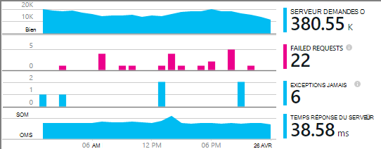
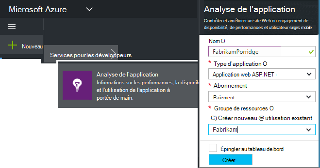
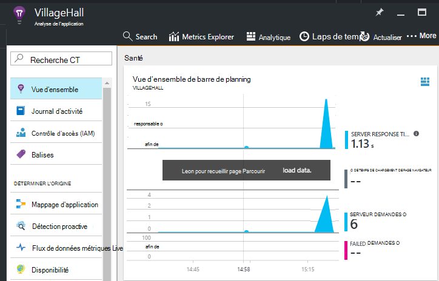

<properties
    pageTitle="Ajouter l’Application Insights SDK pour surveiller votre application Node.js | Microsoft Azure"
    description="Analyser l’utilisation et les performances de votre local ou votre application web de Microsoft Azure avec des aperçus de l’Application."
    services="application-insights"
    documentationCenter=""
    authors="alancameronwills"
    manager="douge"/>

<tags
    ms.service="application-insights"
    ms.workload="tbd"
    ms.tgt_pltfrm="ibiza"
    ms.devlang="na"
    ms.topic="get-started-article"
    ms.date="08/30/2016"
    ms.author="awills"/>


# <a name="add-application-insights-sdk-to-monitor-your-nodejs-app"></a>Ajouter l’Application Insights SDK pour surveiller votre application Node.js

*Analyse de l’application est en mode Aperçu.*

[Visual Studio Application Insights](app-insights-overview.md) surveille vos applications en ligne pour vous aider à [détecter et diagnostiquer les problèmes de performances et les exceptions](app-insights-detect-triage-diagnose.md)et [Découvrez comment votre application est utilisée](app-insights-overview-usage.md). Elle fonctionne pour les applications qui sont hébergées sur vos propres serveurs IIS en local ou sur machines virtuelles Azure, ainsi que les applications web Azure.


Le Kit de développement fournit une collecte automatique de taux de demande HTTP entrants et les réponses, compteurs de performance (processeur, mémoire, RPS) et exceptions non gérées. En outre, vous pouvez ajouter des appels personnalisés pour effectuer le suivi des dépendances, métrique ou autres événements.




#### <a name="before-you-start"></a>Avant de commencer

Tu as besoin de :

* Visual Studio 2013 ou version ultérieure. Une version ultérieure est meilleure.
* Un abonnement à [Microsoft Azure](http://azure.com). Si votre équipe ou organisation dispose d’un abonnement Azure, le propriétaire peut vous ajouter au, à l’aide de votre [compte Microsoft](http://live.com).

## <a name="add"></a>Création d’une ressource d’Application perspectives

Connectez-vous au [portail Azure][portal]et créer une nouvelle ressource Application perspectives. Une [ressource] [ roles] dans Azure est une instance d’un service. Cette ressource est l’endroit où télémétrie depuis votre application est analysée et vous invite à.



Sélectionnez autres en tant que le type d’application. Le choix du type d’application définit le contenu par défaut des propriétés et les cartes de ressources visible dans [l’Explorateur de mesures][metrics].

#### <a name="copy-the-instrumentation-key"></a>Copiez la clé d’Instrumentation

La clé identifie la ressource, et vous devez l’installer disponible dans le Kit de développement pour diriger les données à la ressource.


## <a name="sdk"></a>Installez le Kit de développement de votre application

```
npm install applicationinsights --save
```

## <a name="usage"></a>Utilisation

Cela permettra demande surveillance, exception non gérée suivi et performances du système surveillance (processeur/mémoire/RPS).

```javascript

var appInsights = require("applicationinsights");
appInsights.setup("<instrumentation_key>").start();
```

La clé d’instrumentation peut également être définie dans la variable d’environnement APPINSIGHTS_INSTRUMENTATIONKEY. Si cela est fait, aucun argument est requis lors de l’appel `appInsights.setup()` ou `appInsights.getClient()`.

Vous pouvez essayer le Kit de développement sans envoyer de télémétrie : définissez la clé instrumentation sur une chaîne non vide.


## <a name="run"></a>Exécuter votre projet

Exécuter votre application et essayez-le : ouvrir les différentes pages pour générer certains télémétrie.


## <a name="monitor"></a>Afficher votre télémétrie

Revenez au [portail Azure](https://portal.azure.com) et naviguez jusqu'à votre ressource Application perspectives.


Rechercher des données dans la page Vue d’ensemble. Tout d’abord, vous ne voyez un ou deux points. Par exemple :



Cliquez dans un graphique quelconque pour afficher plus d’indicateurs. [En savoir plus sur les mesures.][perf]

#### <a name="no-data"></a>Aucune donnée ?

* Utiliser l’application, ouvrez différentes pages afin qu’il génère certaines télémétrie.
* Ouvrez la fenêtre de [recherche](app-insights-diagnostic-search.md) , pour consulter des événements particuliers. Parfois nécessaire événements un peu pendant plus de temps pour obtenir dans le pipeline de mesures.
* Patientez quelques secondes, puis cliquez sur **Actualiser**. Graphiques elles-mêmes actualiser régulièrement, mais vous pouvez actualiser manuellement si vous êtes en attente pour des données s’affiche.
* Voir [dépannage][qna].

## <a name="publish-your-app"></a>Publier votre application

Maintenant déployer votre application sur IIS ou sur Azure et regarder les données s’accumuler.


#### <a name="no-data-after-you-publish-to-your-server"></a>Aucune donnée une fois que vous publiez sur le serveur ?

Ouvrez les ports pour le trafic sortant dans le pare-feu de votre serveur :

+ `dc.services.visualstudio.com:443`
+ `f5.services.visualstudio.com:443`


#### <a name="trouble-on-your-build-server"></a>Problèmes sur votre serveur de génération ?

Consultez [cet article de résolution des problèmes](app-insights-asp-net-troubleshoot-no-data.md#NuGetBuild).


## <a name="customized-usage"></a>Utilisation personnalisée 

### <a name="disabling-auto-collection"></a>Désactivation de la collection automatique

```javascript
import appInsights = require("applicationinsights");
appInsights.setup("<instrumentation_key>")
    .setAutoCollectRequests(false)
    .setAutoCollectPerformance(false)
    .setAutoCollectExceptions(false)
    // no telemetry will be sent until .start() is called
    .start();
```

### <a name="custom-monitoring"></a>Surveillance personnalisée

```javascript
import appInsights = require("applicationinsights");
var client = appInsights.getClient();

client.trackEvent("custom event", {customProperty: "custom property value"});
client.trackException(new Error("handled exceptions can be logged with this method"));
client.trackMetric("custom metric", 3);
client.trackTrace("trace message");
```

[En savoir plus sur l’API de télémétrie](app-insights-api-custom-events-metrics.md).

### <a name="using-multiple-instrumentation-keys"></a>À l’aide de plusieurs touches instrumentation

```javascript
import appInsights = require("applicationinsights");

// configure auto-collection with one instrumentation key
appInsights.setup("<instrumentation_key>").start();

// get a client for another instrumentation key
var otherClient = appInsights.getClient("<other_instrumentation_key>");
otherClient.trackEvent("custom event");
```

## <a name="examples"></a>Exemples

### <a name="tracking-dependency"></a>Dépendance de suivi

```javascript
import appInsights = require("applicationinsights");
var client = appInsights.getClient();

var startTime = Date.now();
// execute dependency call
var endTime = Date.now();

var elapsedTime = endTime - startTime;
var success = true;
client.trackDependency("dependency name", "command name", elapsedTime, success);
```


### <a name="manual-request-tracking-of-all-get-requests"></a>Effectuer le suivi de demande manuelle de toutes les demandes « GET »

```javascript
var http = require("http");
var appInsights = require("applicationinsights");
appInsights.setup("<instrumentation_key>")
    .setAutoCollectRequests(false) // disable auto-collection of requests for this example
    .start();

// assign common properties to all telemetry sent from the default client
appInsights.client.commonProperties = {
    environment: process.env.SOME_ENV_VARIABLE
};

// track a system startup event
appInsights.client.trackEvent("server start");

// create server
var port = process.env.port || 1337
var server = http.createServer(function (req, res) {
    // track all "GET" requests
    if(req.method === "GET") {
        appInsights.client.trackRequest(req, res);
    }

    res.writeHead(200, { "Content-Type": "text/plain" });
    res.end("Hello World\n");
}).listen(port);

// track startup time of the server as a custom metric
var start = +new Date;
server.on("listening", () => {
    var end = +new Date;
    var duration = end - start;
    appInsights.client.trackMetric("StartupTime", duration);
});
```

## <a name="next-steps"></a>Étapes suivantes

* [Surveiller votre télémétrie dans le portail](app-insights-dashboards.md)
* [Écrire des requêtes Analytique sur votre télémétrie](app-insights-analytics-tour.md)


<!--Link references-->

[knowUsers]: app-insights-overview-usage.md
[metrics]: app-insights-metrics-explorer.md
[perf]: app-insights-web-monitor-performance.md
[portal]: http://portal.azure.com/
[qna]: app-insights-troubleshoot-faq.md
[roles]: app-insights-resources-roles-access-control.md
