<properties
    pageTitle="Analyse de l’utilisation avec des aperçus d’Application"
    description="Vue d’ensemble des analytique de l’utilisation avec des aperçus d’Application"
    services="application-insights"
    documentationCenter=""
    authors="alancameronwills"
    manager="douge"/>

<tags
    ms.service="application-insights"
    ms.workload="tbd"
    ms.tgt_pltfrm="ibiza"
    ms.devlang="multiple"
    ms.topic="article" 
    ms.date="04/08/2016"
    ms.author="awills"/>

# Analyse de l’utilisation avec des aperçus d’Application

Connaissance de l’utilisation de votre application vous permet de votre travail de développement vous concentrer sur les scénarios qui les plus importantes pour les et familiarisez-vous dans les objectifs qu’elle trouve plus facile ou plus difficile à atteindre.

Analyse de l’application peut fournir un affichage clair de l’utilisation de votre application, pour vous aider à améliorer l’expérience de vos utilisateurs et répondre aux objectifs de votre entreprise.

Application Insights fonctionne pour les deux applications autonomes (sur iOS, Android et Windows) et pour les applications web (hébergées sur .NET ou J2EE). 

## Ajouter des perspectives d’Application à votre projet

Pour commencer, ouvrez un compte gratuit avec [Microsoft Azure](https://azure.com). (Après la période d’évaluation, vous pouvez continuer avec le niveau du service gratuit.)

Dans le [portail Azure](https://portal.azure.com), créez une ressource Application perspectives. Il s’agit de l’endroit où vous verrez performances et l’utilisation des données sur votre application.

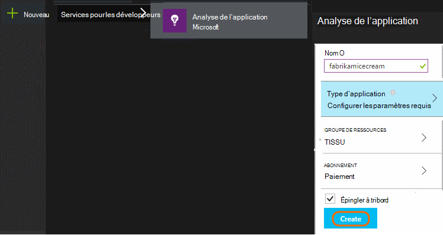

**Si votre application est une application d’appareil,** ajoutez le Kit de développement de perspectives Application à votre projet. La procédure exacte varie selon votre [IDE et plateforme](app-insights-platforms.md). Pour les applications Windows, droit le projet dans Visual Studio, puis cliquez sur « Ajouter Application Insights. »

**Si elle est une application web,** Ouvrez la carte de démarrage rapide et obtenir l’extrait de code à ajouter à vos pages web. Les republier avec l’extrait.

Vous pouvez également ajouter des perspectives d’Application à votre code serveur [ASP.NET](app-insights-asp-net.md) ou [J2EE](app-insights-java-get-started.md) pour combiner de télémétrie de client et serveur.

### Exécuter votre projet et voir les résultats de la premières

Exécuter votre projet en mode débogage pendant quelques minutes, puis accédez au [portail Azure](https://portal.azure.com) et accédez à la ressource de projet dans l’Application perspectives.

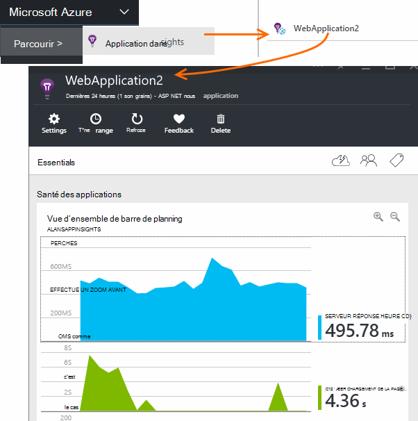

Publier votre application pour obtenir plus de télémétrie et découvrir ce que font les utilisateurs avec votre application.

## Analytique prêts à l’emploi

Cliquez sur la vignette affichages de Page pour afficher des détails de l’utilisation.

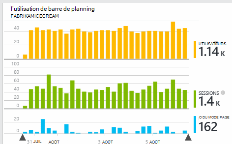

Placez le curseur dans la partie vide au-dessus d’un graphique pour afficher les nombres à un moment donné. Dans le cas contraire, les nombres indiquent les valeurs agrégées sur la période, comme une moyenne, un total ou un nombre d’utilisateurs distincts pendant la période.

Dans les applications web, les utilisateurs sont prises en compte à l’aide de cookies. Une personne qui utilise plusieurs navigateurs, efface les cookies ou la fonctionnalité de confidentialité à compter plusieurs fois.

Une session web est comptée après 30 minutes d’inactivité. Une session sur un téléphone ou un autre périphérique est comptée lorsque l’application est suspendue pendant plus de quelques secondes.

Cliquez dans un graphique quelconque pour afficher plus en détail. Par exemple :

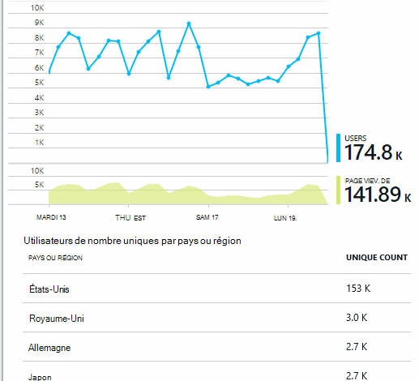

(Cet exemple fait partie d’un site Web, mais les graphiques similaires pour les applications qui s’exécutent sur les périphériques).

Comparer avec la semaine précédente pour savoir si les éléments sont change :

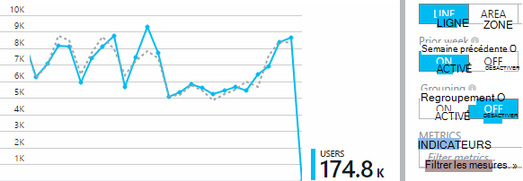

Comparer deux mesures, par exemple les utilisateurs et les nouveaux utilisateurs :

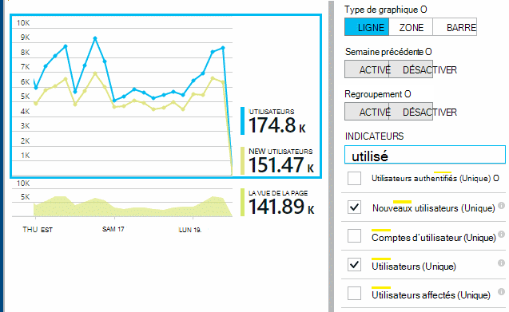

Grouper (segment) des données par une propriété comme navigateur, système d’exploitation ou City :

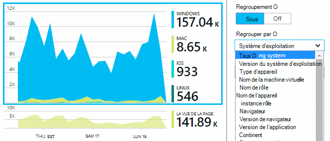

## Utilisation des pages

Cliquez sur les affichages de page avec la vignette pour obtenir un une répartition de vos pages les plus populaires :

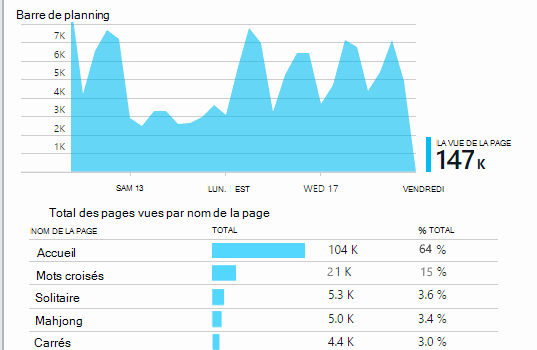

L’exemple ci-dessus est d’un site Web jeux. À partir de celui-ci nous pouvons voir instantanément :

* L’utilisation n’a pas été améliorée dans la semaine précédente. Peut-être que nous devons penser optimisation du moteur de recherche ?
* Beaucoup moins reportez-vous aux pages de jeux à la page d’accueil. Pourquoi ne notre page d’accueil attirer des personnes à participer à des jeux ?
* « Mots croisés » correspond au jeu les plus populaires. Nous devons donner la priorité à nouvelles idées et améliorations il.

## Suivi personnalisé

Supposons qu’au lieu d’implémenter chaque partie dans une page web distincte, vous décidez de refactoriser les toutes dans la même application page simple, avec la plupart des fonctionnalités codée en tant que Javascript dans la page web. Cela permet à l’utilisateur de basculer rapidement un jeu ou un autre ou même plusieurs jeux sur une seule page.

Mais que vous voulez toujours Insights Application pour ouvrir une session le nombre de fois où chaque jeu est ouvert, dans la même façon que lorsqu’elles sont sur des pages web distinctes. C’est très simple : simplement insérer un appel vers le module de télémétrie dans votre JavaScript où vous souhaitez enregistrement une nouvelle « page » a ouvert :

    telemetryClient.trackPageView(game.Name);

## Événements personnalisés

Vous pouvez utiliser télémétrie de nombreuses façons pour comprendre l’utilisation de votre application. Mais vous ne souhaitez pas que de mélanger les messages avec des vues de la page. À la place, utilisez des événements personnalisés. Vous pouvez leur envoyer à partir d’applications de périphérique, pages web ou un serveur web :

(JavaScript)

    telemetryClient.trackEvent("GameEnd");

(C#)

    var tc = new Microsoft.ApplicationInsights.TelemetryClient();
    tc.TrackEvent("GameEnd");

(VISUAL BASIC)

    Dim tc = New Microsoft.ApplicationInsights.TelemetryClient()
    tc.TrackEvent("GameEnd")

Les plus fréquentes événements personnalisés sont répertoriés dans la carte de vue d’ensemble.

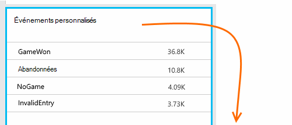

Cliquez sur l’en-tête du tableau pour afficher le nombre total d’événements. Vous pouvez segmenter le graphique par divers attributs tels que le nom de l’événement :

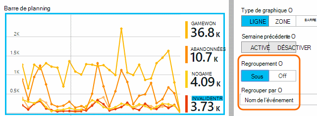

La fonctionnalité particulièrement utile de barres de planning est que vous pouvez faire correspondre des modifications avec d’autres mesures et les événements. Par exemple, parfois lors de la lecture d’autres jeux, vous souhaitez voir une hausse de jeux abandonnés également. Mais l’augmentation des jeux abandonnés est disproportionnée, il est préférable déterminer si la charge élevée à l’origine de problèmes que les utilisateurs à trouver inacceptables.

## Explorer les événements spécifiques

Pour obtenir un mieux comprendre comment ouvre une session classique, vous souhaiterez peut-être vous concentrer sur une session utilisateur spécifique qui contient un type particulier d’événement.

Dans cet exemple, nous codée un événement « NoGame » qui est appelé si l’utilisateur se déconnecte sans réellement démarrer un jeu personnalisé. Pourquoi un utilisateur pour cela ? Peut-être que nous Explorez certaines occurrences spécifiques, nous obtiendrez un indice.

Les événements personnalisés provenant de l’application sont répertoriés par nom dans la carte de vue d’ensemble :

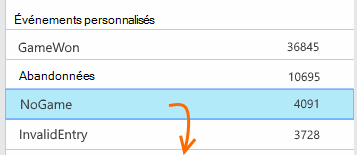

Cliquez sur l’événement de votre choix, puis sélectionnez une occurrence spécifique récente :

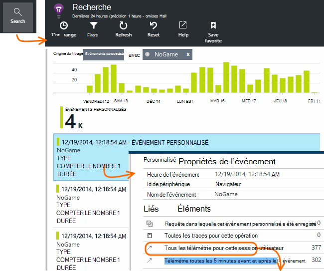

Examinons tous les télémétrie pour la session dans laquelle cet événement NoGame particulier s’est produite.

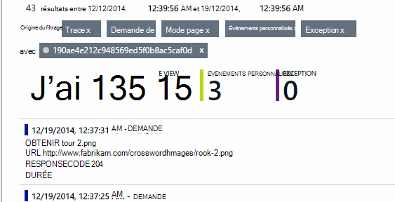

Qu’il n’existe aucune exceptions, afin que l’utilisateur n’a pas été empêché lecture par un échec.

Nous pouvons filtrer tous les types de télémétrie à l’exception des affichages de page pour cette session :

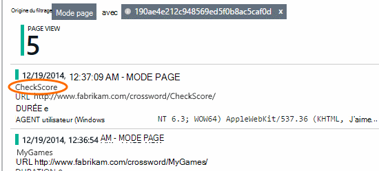

Et maintenant, nous voyons que cet utilisateur connecté simplement à vérifier les informations des plus récentes. Nous devons peut-être pensez à développer un récit utilisateur qui facilite le faire. (Et nous devons implémenter un événement personnalisé au rapport lorsque ce scénario spécifique se produit.)

## Filtrer, rechercher et segmenter vos données avec les propriétés
Vous pouvez joindre arbitraires balises et des valeurs numériques aux événements.

JavaScript au niveau client

    appInsights.trackEvent("WinGame",
        // String properties:
        {Game: currentGame.name, Difficulty: currentGame.difficulty},
        // Numeric measurements:
        {Score: currentGame.score, Opponents: currentGame.opponentCount}
    );

C# sur le serveur

    // Set up some properties:
    var properties = new Dictionary <string, string>
        {{"game", currentGame.Name}, {"difficulty", currentGame.Difficulty}};
    var measurements = new Dictionary <string, double>
        {{"Score", currentGame.Score}, {"Opponents", currentGame.OpponentCount}};

    // Send the event:
    telemetry.TrackEvent("WinGame", properties, measurements);

Visual Basic sur le serveur

    ' Set up some properties:
    Dim properties = New Dictionary (Of String, String)
    properties.Add("game", currentGame.Name)
    properties.Add("difficulty", currentGame.Difficulty)

    Dim measurements = New Dictionary (Of String, Double)
    measurements.Add("Score", currentGame.Score)
    measurements.Add("Opponents", currentGame.OpponentCount)

    ' Send the event:
    telemetry.TrackEvent("WinGame", properties, measurements)

Joindre des propriétés des affichages de page de la même façon :

JavaScript au niveau client

    appInsights.trackPageView("Win",
        {Game: currentGame.Name},
        {Score: currentGame.Score});

Dans Rechercher des diagnostics, afficher les propriétés en cliquant sur via une occurrence d’un événement.

Utilisez le champ de recherche pour afficher les occurrences d’événement avec une valeur de propriété particulière.

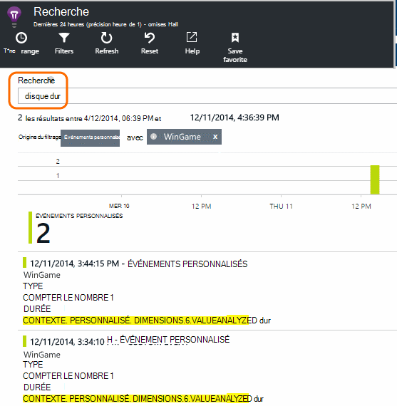

## A | Test B

Si vous ne savez pas quel type variant d’une fonctionnalité sera plus efficace, relâchez chacun d’eux, rendre chaque accessible à d’autres utilisateurs. Mesurer le succès de chaque et déplacez-le vers une version unifiée.

Pour cette technique, vous attachez balises distincts à tous les télémétrie envoyées par chaque version de votre application. Vous pouvez faire qui en définissant des propriétés dans le TelemetryContext active. Ces propriétés par défaut sont ajoutées à chaque message de télémétrie que l’application envoie - pas seulement vos messages personnalisés, mais également la télémétrie standard.

Dans le portail d’Application perspectives, vous puis pourrez pour filtrer et grouper (segment) vos données sur les balises, afin de comparer les différentes versions.

C# sur le serveur

    using Microsoft.ApplicationInsights.DataContracts;

    var context = new TelemetryContext();
    context.Properties["Game"] = currentGame.Name;
    var telemetry = new TelemetryClient(context);
    // Now all telemetry will automatically be sent with the context property:
    telemetry.TrackEvent("WinGame");

Visual Basic sur le serveur

    Dim context = New TelemetryContext
    context.Properties("Game") = currentGame.Name
    Dim telemetry = New TelemetryClient(context)
    ' Now all telemetry will automatically be sent with the context property:
    telemetry.TrackEvent("WinGame")

Télémétrie individuel peut remplacer les valeurs par défaut.

Vous pouvez configurer un initialiseur universel afin que tous les TelemetryClients nouveau utiliser automatiquement votre contexte.

    // Telemetry initializer class
    public class MyTelemetryInitializer : ITelemetryInitializer
    {
        public void Initialize (ITelemetry telemetry)
        {
            telemetry.Properties["AppVersion"] = "v2.1";
        }
    }

Dans l’initialiseur application comme Global.asax.cs :

    protected void Application_Start()
    {
        // ...
        TelemetryConfiguration.Active.TelemetryInitializers
        .Add(new MyTelemetryInitializer());
    }

## Génération - mesure - en savoir plus

Lorsque vous utilisez analytique, celle-ci devient partie intégrante de votre cycle de développement, pas simplement quelque chose que vous pensez que sur le point d’aider à résoudre les problèmes. Voici quelques conseils :

* Déterminer les mesures clés de votre application. Vous voulez utilisateurs autant que possible, ou vous préférez un petit ensemble d’utilisateurs Joyeux ? Vous voulez agrandir visites ou ventes ?
* Plan de mesurer chaque récit. Lorsque vous dessinez un nouveau récit utilisateur ou fonctionnalité ou plan pour mettre à jour une existante, réfléchissez toujours à comment vous allez mesurer la réussite de la modification. Avant de coder démarre, demandez à « effet que cela sera nos unités de mesure, si cela fonctionne ? Devons nous effectuer le suivi de tous les nouveaux événements ? »
Et bien entendu, lorsque la fonctionnalité est en ligne, vérifiez que vous examinez l’analytique et agir sur les résultats.
* Mettre en relation d’autres mesures de la clé symétrique. Par exemple, si vous ajoutez une fonctionnalité « favoris », vous voulez connaître la fréquence à laquelle les utilisateurs ajouter aux Favoris. Mais il est peut-être plus intéressant de savoir la fréquence à laquelle ils sont revenir à leurs favoris. Et, plus important, les clients qui utilisent des Favoris achètent plus de votre produit ?
* Canaries test. Configurer un commutateur fonctionnalité qui permet de rendre une nouvelle fonctionnalité visible uniquement à certains utilisateurs. Utilisez Application perspectives pour voir si la nouvelle fonctionnalité est utilisée dans la façon dont vous prévues. Des ajustements, puis relâchez à un public plus large.
* Parler à vos utilisateurs ! Analytique n’est pas suffisamment dans sa propre, mais complémentaire pour conserver une relation client appropriée.

## Pour en savoir plus

* [Détecter, trier et diagnostiquer les incidents et des problèmes de performances dans votre application](app-insights-detect-triage-diagnose.md)
* [Prise en main avec des aperçus d’Application sur plusieurs plateformes](app-insights-detect-triage-diagnose.md)

## Vidéo

> [AZURE.VIDEO usage-monitoring-application-insights]

 
