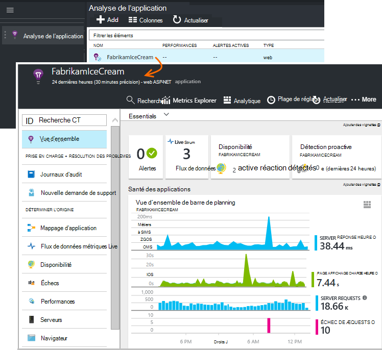

<properties 
    pageTitle="Didacticiel de perspectives application | Microsoft Azure" 
    description="Effectuer le suivi de l’utilisation et les performances de votre application web en direct.  Détecter, trier et diagnostiquer les problèmes. En permanence surveiller et améliorer succès avec d’autres utilisateurs." 
    services="application-insights" 
    documentationCenter=""
    authors="alancameronwills" 
    manager="douge"/>

<tags 
    ms.service="application-insights" 
    ms.workload="tbd" 
    ms.tgt_pltfrm="ibiza" 
    ms.devlang="na" 
    ms.topic="article" 
    ms.date="10/15/2016" 
    ms.author="awills"/>
 
# Application perspectives - introduction

Visual Studio Application Insights est un service extensible analytique qui surveille votre application web en direct. Vous pouvez détecter et diagnostiquer les problèmes de performances et comprendre que les utilisateurs effectuent avec votre application avec lui. Il est conçu pour les développeurs, pour vous aider à améliorer constamment les performances et la convivialité. Cela fonctionne pour les applications sur un large éventail de plateformes notamment .NET, Node.js et J2EE, hébergé en local ou sur le cloud. 

[Examinons l’animation Introduction](https://www.youtube.com/watch?v=fX2NtGrh-Y0).

## Comment cela fonctionne-t-il ?

Vous installez un package de petite instrumentation dans votre application et configurez une ressource d’Application Insights dans le portail Microsoft Azure. L’instrumentation surveille votre application et envoie des données de télémétrie au portail. Le portail vous montre graphiques statistiques et fournit des outils de recherche puissants pour vous aider à diagnostiquer les problèmes.

Analyse de l’application a plusieurs [modules instrumentation standard](app-insights-configuration-with-applicationinsights-config.md) de collecter différents types de télémétrie tels que les temps de réponse de demande et exceptions dépendance appels. Vous pouvez également [écrire du code pour envoyer de télémétrie personnalisé](app-insights-api-custom-events-metrics.md) au portail.

### Quelle est la surcharge ?

L’impact sur les performances de votre application est très petit. Suivi des appels sont non bloquant, regroupés et sont envoyés dans un thread séparé. 

## Ce que cela peut-il ?

Analyse de l’application est destiné à l’équipe de développement pour vous aider à comprendre comment votre application s’exécute et la manière dont il est utilisé. Il propose :

Types de télémétrie :

* Taux de demande HTTP, temps de réponse, taux de réussite.
* Dépendance (HTTP & SQL) appeler taux, temps de réponse, taux de réussite.
* Traces de exception à partir du serveur et le client.
* Traces journal de diagnostic.
* Mode page de compte, nombre utilisateur et de session, temps de chargement de navigateur, exceptions.
* Taux d’appel AJAX, temps de réponse et taux de réussite.
* Compteurs de performances du serveur.
* Télémétrie client et serveur personnalisé.
* Segmentation en emplacement du client, version de navigateur, version du système d’exploitation, instance du serveur, des dimensions personnalisées et plus.
* Tests de disponibilité

Outils de diagnostic et analytiques :

* Alertes actives et manuelles taux d’échec et d’autres indicateurs et disponibilité.
* Graphiques dans le temps de mesures agrégés.
* Recherche des diagnostics sur des instances de demandes, exceptions, événements personnalisés, traces journal, affichages de page, dépendance et AJAX appels. 
* Analytique - un langage de requête puissante sur votre télémétrie
* Tableaux de bord - composer les graphiques que vous devez surveiller tous vos composants d’application.

## Comment l’utiliser ?

### Moniteur

Installer l’Application Insights dans votre application web, configurer la disponibilité des tests de site web, et :

* Configurer un tableau de bord pour votre salle de réunion garder un œil sur chargement, la réactivité et les performances des dépendances, de chargement des pages et des appels AJAX. 
* Découvrez qui sont la plus lente et la plupart des demandes d’absence.
* Regardez flux en direct lorsque vous déployez une nouvelle version, afin de connaître une dégradation immédiatement.

### Diagnostiquer

Lorsque vous recevez une alerte ou rencontrez un problème :

* Faire correspondre échecs des exceptions, des appels de dépendance et traces.
* Examiner les journaux de suivi et les images complètes pile.

### Évaluer

Mesurer l’efficacité de chaque nouvelle fonctionnalité que vous déployez.

* Plan de mesurer comment les clients utilisent nouvelle expérience utilisateur ou fonctionnalités.
* Rédigez télémétrie personnalisé dans votre code pour vous connecter à l’utilisation.
* Chaque cycle de développement de base à partir de télémétrie de preuves dur.

## Prise en main

Analyse de l’application est un des nombreux services hébergés dans Microsoft Azure, et télémétrie est envoyé il analyse et la présentation. Pour effectuer une autre valeur, vous devez un abonnement à [Microsoft Azure](http://azure.com). Il est gratuit pour vous inscrire, et vous pouvez choisir la gratuit [tarifs couche](https://azure.microsoft.com/pricing/details/application-insights/) des perspectives d’Application. Si votre organisation possède déjà un abonnement, ils peuvent ajouter votre compte Microsoft à celui-ci. 

Il existe plusieurs manières de prise en main. Commencer par selon ce qui vous convient le mieux. Vous pouvez ajouter les autres colonnes ultérieurement.

* **Au moment de l’exécution : instrument votre application web sur le serveur.** Permet d’éviter toute mise à jour le code. Vous devez administrateur accéder à votre serveur.
 * [**IIS en local ou sur un ordinateur virtuel**](app-insights-monitor-performance-live-website-now.md)
 * [**Azure web app ou machine virtuelle**](app-insights-monitor-performance-live-website-now.md#if-your-app-runs-as-an-azure-web-app)
 * [**J2EE**](app-insights-java-live.md)
* **Au moment du développement : ajouter des perspectives d’Application à votre code.** Vous permet d’écrire télémétrie personnalisé et instrument principale et les applications de bureau.
 * [Visual Studio](app-insights-asp-net.md) 2013 mise à jour 2 ou version ultérieure.
 * Java dans [Eclipse](app-insights-java-eclipse.md) ou [d’autres outils](app-insights-java-get-started.md)
 * [Node.js](app-insights-nodejs.md)
 * [D’autres plateformes](app-insights-platforms.md)
* Pour en mode page, AJAX et autres télémétrie côté client, **[instrument vos pages web](app-insights-javascript.md)** .
* **[Les tests de disponibilité](app-insights-monitor-web-app-availability.md)** - ping sur votre site Web régulièrement de nos serveurs.

> [AZURE.NOTE]  À ce stade, peut-être que vous voulez simplement obtenir sur et à tester. Mais si vous voulez voir offertes Insights Application, lisez la suite...

## Explorer des indicateurs

Exécutez votre application - soit en mode débogage sur votre ordinateur de développement, ou en déployant sur un serveur - et utilisez-le pour un certain temps. Puis connectez-vous au [portail Azure](https://portal.azure.com).

Accédez à la carte de vue d’ensemble de votre application perspectives d’Application :

La vue d’ensemble permet de voir immédiatement comment votre application s’exécute. Vous pouvez comparer charge (en termes de taux de demandes) avec l’heure de votre application trop pour répondre aux demandes. S’il existe une augmentation disproportionnée dans le temps de réponse lorsque la charge augmente, vous souhaiterez peut-être allouer davantage de ressources dans votre application. S’il affiche plus droite échecs de réponse une fois que vous avez déployé une nouvelle version, vous souhaiterez peut-être restaurer.

#### Obtenir plus de détails

Cliquez dans n’importe quel graphique afin d’obtenir des graphiques plus détaillés. Par exemple, le graphique de temps de réponse serveur permet d’accéder à des graphiques qui affichent des taux de requête, temps de réponse et réactivité de dépendances (autrement dit, les services qui appelle votre application).  

Le graphique de dépendances est utile, car il vous permet de voir si les bases de données et API REST qui utilise votre application sont également répondre ou provoquent des retards.

#### Personnaliser un graphique

Essayez de modifier un de ces graphiques. Par exemple, si votre application web s’exécute sur une collection d’instances de serveur, vous pouvez comparer réactivité sur les instances de serveur différent :

1. Pointez sur le graphique et cliquez sur Modifier.
2. Choisissez une métrique. Plusieurs indicateurs peuvent être affichés sur un graphique, mais que dans certaines combinaisons : vous devrez peut-être désélectionner une métrique avant de sélectionner celui de votre choix.
3. Utiliser Group By pour segmenter une métrique par une propriété. Dans cet exemple, nous affichons une ligne distincte pour le temps de réponse. 

    Notez que vous devez sélectionner une propriété valide pour la mesure ou le graphique n’affiche pas les données.
4. Sélectionnez un type de graphique. Aires et graphiques à barres afficher un affichage empilé approprié lorsque le type d’agrégation 'Sum'.

[En savoir plus sur les indicateurs exploration](app-insights-metrics-explorer.md).

## Rechercher des données instance

Pour corriger un problème, il est utile à inspecter des instances d’événements spécifiques.

Cliquez dans un graphique métrique pour effectuer une recherche dans les données d’instance de filtres pertinents et laps de temps. Par exemple, cliquez sur demande de serveur compte pour afficher les rapports de demande individuelle. 

Ou vous pouvez accéder directement aux données de l’instance de la recherche dans la page Vue d’ensemble :

Utiliser des filtres pour attirer l’attention sur des types d’événement des valeurs de propriétés choisie :

Cliquez sur « … » pour obtenir la liste complète des propriétés, ou ouvrir d’autres événements associés à la même demande. Dans cet exemple, la requête ayant échoué compte un rapport d’exception associée :

Ouvrir un événement - dans cet exemple, l’exception connexe - et vous pouvez créer un élément de travail (si vous utilisez Visual Studio Team Services pour effectuer le suivi des tâches). 
 

## Analytique

[Analytique](app-insights-analytics.md) est une fonctionnalité de recherche et analyse encore plus puissante, dans lequel vous pouvez écrire requêtes SQL sur vos données de télémétrie, soit pour rechercher des problèmes spécifiques ou pour compiler les informations statistiques.

Ouvrir la fenêtre didacticiel pour voir et exécuter des exemples de requêtes sur vos données ou lire le [didacticiel procédure pas à pas](app-insights-analytics-tour.md)plus de temps. IntelliSense vous invite avec les requêtes que vous pouvez utiliser, et il existe une [référence du langage complet](app-insights-analytics-reference.md). 

Requêtes commencent généralement par le nom d’un flux de télémétrie tels que les demandes, les exceptions ou les dépendances. POP ouvrir le volet schéma située à gauche pour afficher la liste des flux de données de télémétrie disponibles. La requête est un pipeline [d’opérations](app-insights-analytics-reference.md#queries-and-operators) de requête tels que `where` - un filtre booléen - ou `project` -qui calcule les nouvelles propriétés. `summarize`[instances agrégats](app-insights-analytics-tour.md#aggregate-groups-of-rows), en les groupant en fonctions que vous définissez et en lui appliquant des fonctions d’agrégation sur les données groupées.

Résultats peuvent être [affichés dans les tables ou les différents types de graphique](app-insights-analytics-tour.md#charting-the-results).

## Télémétrie personnalisé

La télémétrie prédéfini que vous obtenez en installant Application Insights simplement vous permet d’analyser les nombres, taux de réussite, et de réponse à la fois pour les requêtes web importants à vos appels application et dépendances - c'est-à-dire, à partir de votre application SQL, API REST. Pouvez-vous traces exception et (avec moniteur d’état sur le serveur) compteurs de performance système. Si vous ajoutez l’extrait de code client à vos pages web, vous obtenez des comptes d’affichages de page et le temps de chargement, des exceptions de client et AJAX appellent taux de réussite et de réponse. 

Analyse de tous les cette télémétrie peut vous indiquer souvent sur les performances et l’utilisation de votre application. Mais parfois qui n’est pas suffisamment. Vous souhaiterez peut-être surveiller la longueur d’une file d’attente afin que vous pouvez optimiser les performances ; ou compter des ventes et les segments par emplacement ; ou, sur le côté client, découvrez comment souvent les utilisateurs cliquent sur un bouton de sorte que vous pouvez optimiser l’expérience utilisateur.

L' [Application analyse des API](app-insights-api-custom-events-metrics.md) fournit des appels `TrackEvent(name)` et `TrackMetric(name, value)` afin que vous pouvez envoyer vos propres événements personnalisés et indicateurs. Il existe des appels équivalentes pour le côté client.

Par exemple, si votre page web est une application de jeu d’une page simple, vous pouvez insérer une ligne aux emplacements appropriés pour ouvrir une session lorsque l’utilisateur wins ou perd un jeu :

    
    appInsights.trackEvent("WinGame");
    ...
    appInsights.trackEvent("LoseGame");

Nous pouvons puis graphique décomptes d’événements personnalisés, les segmenter par nom de l’événement :

### Journal des traces

À des fins de diagnostic, il existe un événement personnalisé `TrackTrace(message)` que vous pouvez utiliser pour les traces d’exécution. Dans les fonctionnalités de recherche et Analytique, vous pouvez rechercher du contenu du message, qui peut être plus de nom de l’événement. 

Si vous utilisez déjà un cadre journalisation comme Log4Net, NLog, Log4J ou System.Diagnostic.Trace, ces appels de traçage peuvent être capturés par Application perspectives et seront affichent à côté de l’autre télémétrie. Les outils Visual Studio ajoute automatiquement le module SDK approprié.

## Tableaux de bord

De nombreuses applications consistent de plusieurs composants comme un service web et un ou plusieurs en back-end processeurs. Chaque composant sera contrôlée par une ressource d’Application Insights séparée. Si votre système s’exécute sur Azure, vous susceptibles d’utiliser - et analyse - services tels que hubs événement et d’apprentissage ainsi que de l’ordinateur. 

Pour contrôler l’intégralité de votre système, vous pouvez sélectionner les graphiques plus intéressants à partir de différentes applications et épingler à un [tableau de bord](app-insights-dashboards.md)d' Azure, qui vous permet de conserver un œil sur l’ensemble du système en permanence. 

En fait, vous pouvez créer plusieurs tableaux de bord - par exemple, une équipe salle du tableau de bord pour surveiller l’intégrité du système général ; un tableau de bord de création qui met l’accent sur l’utilisation des fonctionnalités différentes. un tableau de bord distinct pour les composants testée ; et ainsi de suite.  

Tableaux de bord, tels que des ressources, peut être partagé entre les membres de l’équipe.

## Développement dans Visual Studio

Si vous utilisez Visual Studio pour développer votre application, vous trouverez plusieurs outils d’analyse de l’Application intégrées. 

### Recherche des Diagnostics

La fenêtre de recherche affiche des événements qui ont été enregistrés. (Si vous connecté à Azure lorsque vous configurez Application perspectives, vous pourrez rechercher les mêmes événements dans le portail.)

La recherche en texte libre fonctionne sur tous les champs dans les événements. Par exemple, recherchez partie de l’URL d’une page ; ou la valeur d’une propriété tel que Ville client ; ou des mots spécifiques dans un journal de suivi.

Cliquez sur n’importe quel événement pour afficher ses propriétés détaillées.

Vous pouvez également ouvrir l’onglet éléments associés pour aider à diagnostiquer les échecs de requêtes ou des exceptions.

### Concentrateur de Diagnostics

Le Hub Diagnostics (dans Visual Studio 2015 ou version ultérieure) affiche la télémétrie server Insights Application comme il est généré. Cela fonctionne même si vous choisi uniquement pour installer le Kit de développement, sans vous connecter à une ressource dans le portail Azure.

### Exceptions

Si vous avez [configuré de surveillance des exceptions](app-insights-asp-net-exceptions.md), les rapports d’exception seront affichent dans la fenêtre de recherche. 

Cliquez sur une exception pour obtenir une trace de la pile. Si le code de l’application est ouvert dans Visual Studio, vous pouvez cliquer sur par le biais de la trace de pile à la ligne du code.

En outre, dans la ligne de Code Lens au-dessus de chaque méthode, vous verrez un compteur des exceptions enregistrés par Application Insights dans les 24 heures passées.

### Surveillance local

(À partir de Visual Studio 2015 mise à jour 2) Si vous n’avez pas configuré le Kit de développement pour envoyer télémétrie au portail Insights Application (afin qu’il n’existe aucune clé instrumentation dans ApplicationInsights.config) la fenêtre diagnostics affichera télémétrie à partir de votre session de débogage plus récent. 

Il convient si vous avez déjà publié une version antérieure de votre application. Vous ne voulez pas la télémétrie dans vos sessions débogage mixte avec la télémétrie dans le portail d’analyse de l’Application à partir de l’application publié vers le haut.

Il est également utile si vous avez quelques [télémétrie personnalisé](app-insights-api-custom-events-metrics.md) que vous souhaitez déboguer avant l’envoi de télémétrie au portail.

* *Tout d’abord, j’ai configuré entièrement Insights Application pour envoyer de télémétrie au portail. Mais je souhaite maintenant voir la télémétrie uniquement dans Visual Studio.*

 * Dans les paramètres de la fenêtre de recherche, il existe une option pour rechercher des diagnostics local même si votre application envoie télémétrie au portail.
 * Pour arrêter de télémétrie envoyé au portail, commentez la ligne `<instrumentationkey>...` de ApplicationInsights.config. Lorsque vous êtes prêt à envoyer à nouveau télémétrie au portail, supprimez les commentaires.

## Tendances

Tendances est un outil dans Visual Studio pour visualiser le comportement de votre application dans le temps. 

Cliquez sur **Explorer les tendances de télémétrie** à partir du bouton de barre d’outils d’analyse de l’Application ou une fenêtre de recherche de perspectives Application. Choisissez une des cinq fréquemment utilisées pour commencer. Vous pouvez analyser les différents jeux de données en fonction de types de télémétrie, plages de temps et d’autres propriétés. 

Pour trouver anomalies dans vos données, choisissez une des options anomalie sous la liste déroulante « Type d’affichage ». Les options de filtrage en bas de la fenêtre facilitent la comprendre sous-groupes de votre télémétrie spécifiques.

## Libération d’une nouvelle version

### Flux de données métriques Live

Indicateurs de flux vous montre les mesures de votre application vers la droite pour l’instant tout, avec une latence en temps réel futur proche de 1 seconde. Ceci est très utile lorsque vous êtes libération d’une nouvelle version et que vous voulez vous assurer que tout est travail comme prévu, ou l’examen un incident en temps réel.

Contrairement à Explorer les mesures, indicateurs de flux affiche un ensemble fixe de mesures. Les données dure uniquement tant qu’il se trouve sur le graphique et est ignorée. 

### Annotations

[Annotations de version](app-insights-annotations.md) dans les graphiques mesures indiquent l’endroit où vous avez déployé une nouvelle version. Ils facilitent la voir si vos modifications avaient aucun effet sur les performances de votre application. Elles peuvent être créées automatiquement par le [système de génération de Visual Studio Team Services](https://www.visualstudio.com/en-us/get-started/build/build-your-app-vs), et vous pouvez également [les créer à partir de PowerShell](#create-annotations-from-powershell).

Les annotations Release sont une fonctionnalité de la version sur le nuage et relâchez service de Visual Studio Team Services. 

## Alertes

Si un problème survient avec votre application, vous souhaiterez savoir immédiatement. 

Application Insights propose trois types d’alerte, qui sont proposés par courrier électronique.

### Diagnostics proactifs 

[Diagnostics proactifs](app-insights-proactive-failure-diagnostics.md) est configuré automatiquement : vous n’êtes pas obligé de configurer. À condition que votre site ait suffisamment de trafic, vous recevrez un message électronique s’il existe une hausse des échecs de requêtes qui est inhabituelle pour l’heure du jour ou demande de taux. L’alerte contient des informations de diagnostic. 

Voici un échantillon d’alerte. 

Un deuxième type de détection proactive découvre corrélations entre les échecs et certains facteurs tels que l’emplacement, système d’exploitation client ou type de navigateur.

### Métriques alertes

Vous pouvez configurer des [alertes métriques](app-insights-alerts.md) pour indiquer quand les métrique coupe une valeur de seuil pendant une certaine période - tels que l’échec du nombre, la quantité de mémoire ou affichages de page.

### Disponibilité

[Tests de site web de disponibilité](app-insights-monitor-web-app-availability.md) envoyer les demandes à votre site à partir de nos serveurs à différents endroits dans le monde entier. Ils vous signale quand votre site est indisponible sur internet ou ne répond lentement. 

## Exporter

Il existe plusieurs façons, vous pouvez intégrer vos données de télémétrie déconnecter le portail d’analyse de l’Application :

* [Exporter continu](app-insights-export-telemetry.md) est idéal si vous souhaitez conserver la plus grande partie de votre télémétrie pendant plus de la période de rétention standard.
* [Les mesures de](app-insights-metrics-explorer.md#export-to-excel) tables, les résultats de recherche et les résultats [Analytique](app-insights-analytics.md) peuvent être exportés vers une feuille de calcul Excel. 
* L’API REST d’accès aux données peut être utilisé pour rechercher et extraire les données, y compris l’exécution des requêtes Analytique. L’API est en cours d’aperçu privé. [En savoir plus sur la participation à l’aperçu](https://visualstudio.uservoice.com/forums/357324-application-insights/suggestions/4999529-make-data-accessible-via-apis-for-custom-processin).
* Vous pouvez exporter des tableaux de bord [des requêtes Analytique pour Power BI](app-insights-export-power-bi.md) et afficher les résultats dans les visualisations Power BI, lequel peuvent être actualisées automatiquement.

 
## Gestion des données

Il existe des limites de l’utilisation de Insights d’Application, qui en dépendent dans une certaine mesure le jeu de tarification que vous choisissez. Les limites principales sont sur :

* Taux de télémétrie par minute
* Nombre de points de données par mois
* Période de rétention des données

[Échantillonnage](app-insights-sampling.md) est un mécanisme pour réduire le coût et éviter la limitation. Il supprime une partie de votre télémétrie, tout en conservant un échantillon représentatif. Éléments associés (par exemple, les exceptions et les requêtes qui a provoqué les) sont conservées ou ignorées ensemble. Pour les applications ASP.NET, échantillonnages sont automatique et sont appliqué dans l’application ; dans le cas contraire, vous pouvez le configurer à appliquer aux réception au portail.

## Étapes suivantes

Prise en main pendant l’exécution avec :

* [Serveur IIS](app-insights-monitor-performance-live-website-now.md)
* [Serveur J2EE](app-insights-java-live.md)

Prise en main au moment du développement avec :

* [ASP.NET](app-insights-asp-net.md)
* [Java](app-insights-java-get-started.md)
* [Node.js](app-insights-nodejs.md)

## Prise en charge et les commentaires

* Problèmes et questions :
 * [Résolution des problèmes][qna]
 * [Forum MSDN](https://social.msdn.microsoft.com/Forums/vstudio/home?forum=ApplicationInsights)
 * [StackOverflow](http://stackoverflow.com/questions/tagged/ms-application-insights)
 * [Obtenir une assistance technique pour les développeurs](app-insights-get-dev-support.md)
* Vos suggestions :
 * [UserVoice](https://visualstudio.uservoice.com/forums/357324)
* Blog :
 * [Application Insights blog](https://azure.microsoft.com/blog/tag/application-insights)

## Vidéos

> [AZURE.VIDEO 218]

> [AZURE.VIDEO usage-monitoring-application-insights]

> [AZURE.VIDEO performance-monitoring-application-insights]

> [Animation d’introduction](https://www.youtube.com/watch?v=fX2NtGrh-Y0)

<!--Link references-->

[android]: https://github.com/Microsoft/ApplicationInsights-Android
[azure]: ../insights-perf-analytics.md
[client]: app-insights-javascript.md
[desktop]: app-insights-windows-desktop.md
[detect]: app-insights-detect-triage-diagnose.md
[greenbrown]: app-insights-asp-net.md
[ios]: https://github.com/Microsoft/ApplicationInsights-iOS
[java]: app-insights-java-get-started.md
[knowUsers]: app-insights-overview-usage.md
[platforms]: app-insights-platforms.md
[portal]: http://portal.azure.com/
[qna]: app-insights-troubleshoot-faq.md
[redfield]: app-insights-monitor-performance-live-website-now.md

 