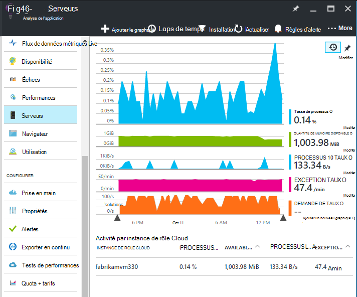
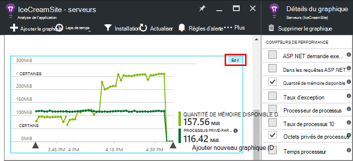
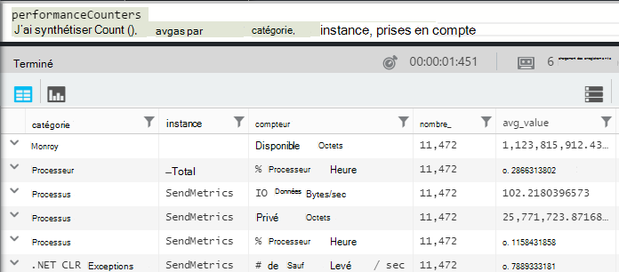
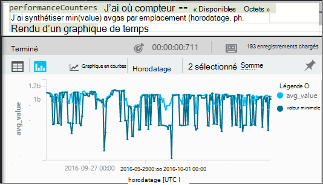
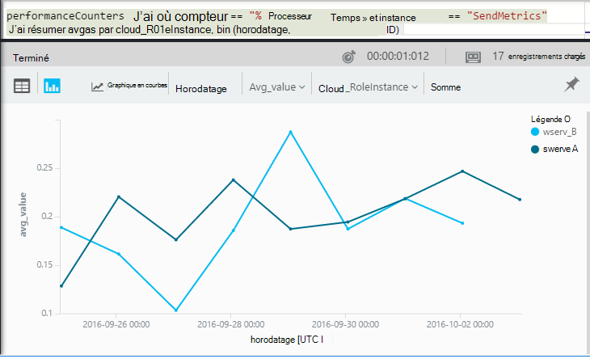

<properties 
    pageTitle="Compteurs de performance dans perspectives Application | Microsoft Azure" 
    description="Moniteur système et .NET compteurs de performances dans l’Application perspectives." 
    services="application-insights" 
    documentationCenter=""
    authors="alancameronwills" 
    manager="douge"/>

<tags 
    ms.service="application-insights" 
    ms.workload="tbd" 
    ms.tgt_pltfrm="ibiza" 
    ms.devlang="na" 
    ms.topic="article" 
    ms.date="10/11/2016" 
    ms.author="awills"/>
 
# <a name="system-performance-counters-in-application-insights"></a>Compteurs de performance système dans perspectives d’Application


Windows fournit un large éventail de [compteurs](http://www.codeproject.com/Articles/8590/An-Introduction-To-Performance-Counters) comme initiaux à l’emménagement processeur, la mémoire, disque et l’utilisation du réseau. Vous pouvez également définir vos propres. [Analyse de l’application](app-insights-overview.md) peut afficher ces compteurs de performance si votre application s’exécute sous IIS sur un hôte local ou machine virtuelle auxquelles vous avez accès administratif. Les graphiques indiquent les ressources disponibles pour votre application active et peuvent vous aider à identifier l’équilibrage de charge entre les instances de serveur.

Compteurs de performance apparaissent dans la carte de serveurs, qui inclut une table qui segments par instance du serveur.



(Compteurs de performance ne sont pas disponibles pour les applications Web Azure. Mais vous pouvez [Envoyer des Diagnostics Azure Application analyse](app-insights-azure-diagnostics.md).)

## <a name="configure"></a>Configurer

Si le moniteur d’état Insights Application n’est pas encore installé sur vos ordinateurs serveur, vous devez installer pour voir compteurs de performance.

Téléchargez et exécutez le [programme d’installation de l’Analyseur de l’état](http://go.microsoft.com/fwlink/?LinkId=506648) sur chaque instance du serveur. S’il est déjà installé, vous n’avez pas besoin de le réinstaller.

* *J’ai [installé le Kit de développement de perspectives Application dans mon application](app-insights-asp-net.md) pendant le développement. Dois-je toujours moniteur d’état ?*

    Oui, moniteur d’état est nécessaire pour recueillir des compteurs pour les applications web ASP.NET. Comme vous le savez peut-être déjà, moniteur d’état peut également servir à [surveiller des applications web qui sont déjà publiées](app-insights-monitor-performance-live-website-now.md), sans installer le Kit de développement pendant le développement.


## <a name="view-counters"></a>Afficher les compteurs

La carte de serveurs montre un ensemble par défaut des compteurs de performance. 

Pour afficher d’autres compteurs, modifier les graphiques dans la carte de serveurs, ou ouvrir une nouvelle carte [Métriques Explorer](app-insights-metrics-explorer.md) et ajouter des graphiques. 

Les compteurs disponibles sont répertoriées comme métrique lorsque vous modifiez un graphique.



Pour afficher tous vos graphiques plus utiles au même endroit, créer un [tableau de bord](app-insights-dashboards.md) et les épingler à celui-ci.

## <a name="add-counters"></a>Ajouter des compteurs

Si le compteur de performance souhaité n’apparaît pas dans la liste des mesures, c’est parce qu’il n’est pas de collecte du Kit de développement de perspectives Application sur votre serveur web. Vous pouvez le configurer pour le faire.

1. Découvrez quels compteurs sont disponibles sur votre serveur à l’aide de cette commande PowerShell au niveau du serveur :

    `Get-Counter -ListSet *`

    (See [`Get-Counter`](https://technet.microsoft.com/library/hh849685.aspx).)

1. Ouvrez ApplicationInsights.config.

 * Si vous avez ajouté des perspectives d’Application dans votre application pendant le développement, modifier ApplicationInsights.config dans votre projet et déployer nouveau sur vos serveurs.
 * Si vous avez utilisé le moniteur d’état d’instrumentation d’une application web en cours d’exécution, recherchez ApplicationInsights.config dans le répertoire racine de l’application dans IIS. Mettre à jour celui-ci dans chaque instance du serveur.

2. Modifier la directive collecteur de performances :

 ```XML

    <Add Type="Microsoft.ApplicationInsights.Extensibility.PerfCounterCollector.PerformanceCollectorModule, Microsoft.AI.PerfCounterCollector">
      <Counters>
        <Add PerformanceCounter="\Objects\Processes"/>
        <Add PerformanceCounter="\Sales(photo)\# Items Sold" ReportAs="Photo sales"/>
      </Counters>
    </Add>

```

Vous pouvez capturer les compteurs standard et ceux que vous avez implémenté vous-même. `\Objects\Processes`est un exemple d’un compteur de standard disponibles sur tous les systèmes Windows. `\Sales(photo)\# Items Sold`est un exemple d’un compteur personnalisé qui peut être implémenté dans un service web. 

Le format est `\Category(instance)\Counter"`, ou pour les catégories qui n’ont pas instances, juste `\Category\Counter`.

`ReportAs`est requis pour les noms de compteur qui ne correspondent pas à `[a-zA-Z()/-_ \.]+` -autrement dit, ils contiennent des caractères qui ne sont pas dans les jeux suivants : lettres, arrondi entre crochets, barre oblique, trait d’union, un trait de soulignement, espace, point.

Si vous spécifiez une instance, il est collectée comme une dimension « CounterInstanceName » de la métrique signalée.

### <a name="collecting-performance-counters-in-code"></a>Collecte des compteurs de performance dans le code

Pour collecter les compteurs de performance système et les envoyer analyse de l’Application, vous pouvez l’adapter l’extrait de code ci-dessous :

    var perfCollectorModule = new PerformanceCollectorModule();
    perfCollectorModule.Counters.Add(new PerformanceCounterCollectionRequest(
      @"\.NET CLR Memory([replace-with-application-process-name])\# GC Handles", "GC Handles")));
    perfCollectorModule.Initialize(TelemetryConfiguration.Active);

Ou vous pouvez effectuer la même chose avec indicateurs personnalisés que vous avez créé :

    var perfCollectorModule = new PerformanceCollectorModule();
    perfCollectorModule.Counters.Add(new PerformanceCounterCollectionRequest(
      @"\Sales(photo)\# Items Sold", "Photo sales"));
    perfCollectorModule.Initialize(TelemetryConfiguration.Active);

## <a name="performance-counters-in-analytics"></a>Compteurs de performance dans Analytique

Vous pouvez rechercher et afficher des rapports de performances compteur dans [Analytique](app-insights-analytics.md).


Le schéma de **compteurs de performance** expose la `category`, `counter` nom, et `instance` nom de chaque compteur de performance.  Dans la télémétrie pour chaque application, vous verrez uniquement les compteurs pour cette application. Par exemple, pour voir quels compteurs sont disponibles : 



(« Instance » ici fait référence à l’instance de compteur de performance, pas l’instance machine serveur ou un rôle. Le nom de l’instance compteur performances généralement les segments compteurs tels que de temps processeur par le nom de l’application ou le processus.)

Pour obtenir un graphique de mémoire disponible sur la période récente : 




Comme autres télémétrie, **compteurs de performance** possède également une colonne `cloud_RoleInstance` qui indique l’identité de l’instance du serveur hôte sur lequel s’exécute votre application. Par exemple, pour comparer les performances de votre application sur les ordinateurs différents : 




## <a name="aspnet-and-application-insights-counts"></a>ASP.NET et le nombre de perspectives d’Application

*Quelle est la différence entre le taux d’Exception et d’indicateurs de Exceptions ?*

* *Taux d’exception* est un compteur de performance système. Le CLR compte toutes les exceptions de gérées et non gérées qui sont levées et divise le total dans un intervalle d’échantillonnage par la longueur de l’intervalle. Le Kit de développement de perspectives Application collecte ce résultat et envoie au portail.
* *Exceptions* est un nombre des rapports TrackException reçu par le portail dans l’intervalle d’échantillonnage du graphique. Il inclut uniquement les exceptions traitées dans lequel vous avez écrit TrackException appelle dans votre code et n’inclut pas toutes les [exceptions non gérées](app-insights-asp-net-exceptions.md). 

## <a name="alerts"></a>Alertes

Tels que d’autres mesures, vous pouvez [définir une alerte](app-insights-alerts.md) pour vous avertir si un compteur de performance accède à l’extérieur une limite que vous spécifiez. Ouvrez la carte alertes, puis cliquez sur Ajouter une alerte.


## <a name="next"></a>Étapes suivantes

* [Suivi des dépendances](app-insights-asp-net-dependencies.md)
* [Exceptions de suivi](app-insights-asp-net-exceptions.md)