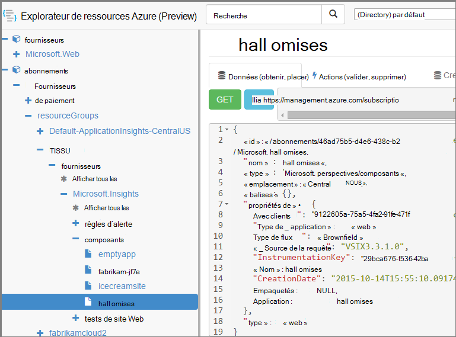

<properties 
    pageTitle="Créer des ressources d’analyse de l’Application à l’aide de PowerShell" 
    description="Créer par programme des ressources de perspectives d’Application dans le cadre de votre génération." 
    services="application-insights" 
    documentationCenter=""
    authors="alancameronwills" 
    manager="douge"/>

<tags 
    ms.service="application-insights" 
    ms.workload="tbd" 
    ms.tgt_pltfrm="ibiza" 
    ms.devlang="na" 
    ms.topic="article" 
    ms.date="03/02/2016" 
    ms.author="awills"/>
 
# <a name="create-application-insights-resources-using-powershell"></a>Créer des ressources d’analyse de l’Application à l’aide de PowerShell

Cet article vous explique comment créer une ressource [d’Application Insights](app-insights-overview.md) dans Azure automatiquement. Vous pouvez, par exemple, faire dans le cadre d’un processus de génération. Ainsi que la ressource Insights Application simple, vous pouvez créer des [tests de site web de disponibilité](app-insights-monitor-web-app-availability.md), [définir des alertes](app-insights-alerts.md)et créer d’autres ressources Azure.

La clé pour la création de ces ressources est modèles JSON pour [Le Gestionnaire de ressources Azure](../powershell-azure-resource-manager.md). En bref, la procédure est : télécharger les définitions JSON des ressources existantes ; paramétrer certaines valeurs, telles que des noms ; puis exécutez le modèle chaque fois que vous souhaitez créer une nouvelle ressource. Vous pouvez regrouper plusieurs ressources, les créer en une seule accédez - par exemple, un moniteur application avec les tests de disponibilité, alertes et de stockage pour l’exportation continue. Il existe certaines détail à certaines des paramétrages, que nous aborderons ici.

## <a name="one-time-setup"></a>Programme d’installation unique

Si vous n’avez pas utilisé PowerShell avec votre abonnement Azure avant :

Installez le module Azure Powershell sur l’ordinateur où vous voulez exécuter les scripts :

1. Installer [Microsoft Web Platform Installer (v5 ou une version ultérieure)](http://www.microsoft.com/web/downloads/platform.aspx).
2. Utilisez-le pour installer Microsoft Azure Powershell.

## <a name="copy-the-json-for-existing-resources"></a>Copier le JSON pour les ressources existantes

1. Configurer [Application perspectives](app-insights-overview.md) pour un projet semblables à ceux que vous souhaitez générer automatiquement. Ajouter des tests de site web et les alertes si vous le souhaitez.
2. Créer un nouveau fichier .json - nous allons appelez-le `template1.json` dans cet exemple. Copiez ce contenu dedans :


    ```JSON

        {
          "$schema": "https://schema.management.azure.com/schemas/2015-01-01/deploymentTemplate.json#",
          "contentVersion": "1.0.0.0",
          "parameters": {
            "appName": { "type": "string" },
            "webTestName": { "type": "string" },
            "url": { "type": "string" },
            "text": { "type" : "string" }
          },
          "variables": {
            "testName": "[concat(parameters('webTestName'), 
               '-', toLower(parameters('appName')))]"
            "alertRuleName": "[concat(parameters('webTestName'), 
               '-', toLower(parameters('appName')), 
               '-', subscription().subscriptionId)]"
          },
          "resources": [
            {
              // component JSON file contents
            },
            {
              //web test JSON file contents
            },
            {
              //alert rule JSON file contents
            }
 
            // Any other resources go here
          ]
        }
    
    ```

    Ce modèle définira la disponibilité d’un test en plus de la ressource principale.


2. Ouvrez [Le Gestionnaire de ressources Azure](https://resources.azure.com/). Naviguer vers le bas dans `subscriptions/resourceGroups/<your resource group>/providers/Microsoft.Insights/components`, à votre ressource d’application. 

    

    *Composants* sont les ressources Insights Application base pour afficher les applications. Il existe des ressources distinctes pour les règles d’alerte associés et disponibilité des tests de site web.

3. Copiez le JSON du composant dans l’emplacement approprié dans `template1.json`.
6. Supprimer ces propriétés :
  * `id`
  * `InstrumentationKey`
  * `CreationDate`
4. Ouvrez les sections webtests et alertrules et copiez le JSON pour des éléments individuels dans votre modèle. (Ne pas copier à partir des nœuds webtests ou alertrules : accédez dans les éléments sous les.)

    Chaque test web a une règle d’alerte associée, afin que vous deviez copier chacun d’eux.

    Le test web doit être placé avant la règle d’alerte.

5. Pour satisfaire le schéma, insérez cette ligne dans chaque ressource :

    `"apiVersion": "2014-04-01",`

    (Le schéma plaint également la casse des noms de type de ressources `Microsoft.Insights/*` --mais *ne* modifiez pas ces.)


## <a name="parameterize-the-template"></a>Paramétrer le modèle

Vous avez à présent à remplacer les noms spécifiques avec des paramètres. Pour [paramétrer un modèle](../resource-group-authoring-templates.md), vous écrivez des expressions en utilisant un [ensemble de fonctions d’assistance](../resource-group-template-functions.md). 

Vous ne pouvez pas paramétrer seulement une partie d’une chaîne, utilisez donc `concat()` pour générer des chaînes.

Voici quelques exemples des substitutions que vous souhaiterez. Il existe plusieurs occurrences de chaque substitution. Vous devrez peut-être d’autres personnes dans votre modèle. Ces exemples utilisent les paramètres et les variables que nous avons définie dans la partie supérieure du modèle.

Rechercher | remplacer par
---|---
`"hidden-link:/subscriptions/.../components/MyAppName"`| `"[concat('hidden-link:',`<br/>` resourceId('microsoft.insights/components',` <br/> ` parameters('appName')))]"`
`"/subscriptions/.../alertrules/myAlertName-myAppName-subsId",` | `"[resourceId('Microsoft.Insights/alertrules', variables('alertRuleName'))]",`
`"/subscriptions/.../webtests/myTestName-myAppName",` | `"[resourceId('Microsoft.Insights/webtests', parameters('webTestName'))]",`
`"myWebTest-myAppName"` | `"[variables(testName)]"'`
`"myTestName-myAppName-subsId"` | `"[variables('alertRuleName')]"`
`"myAppName"` | `"[parameters('appName')]"`
`"myappname"`(minuscule) | `"[toLower(parameters('appName'))]"`
`"<WebTest Name=\"myWebTest\" ...`<br/>` Url=\"http://fabrikam.com/home\" ...>"`|`[concat('<WebTest Name=\"',` <br/> `parameters('webTestName'),` <br/> `'\" ... Url=\"', parameters('Url'),` <br/> `'\"...>')]" `


## <a name="set-dependencies-between-the-resources"></a>Définition de relations entre les ressources

Azure doit configurer les ressources dans l’ordre strict. Pour vous assurer que le programme d’une installation se termine avant le début de la prochaine, ajoutez les lignes de dépendance :

* Ressource de test dans le site web :

    `"dependsOn": ["[resourceId('Microsoft.Insights/components', parameters('appName'))]"],`

* Dans la ressource alerte :

    `"dependsOn": ["[resourceId('Microsoft.Insights/webtests', variables('testName'))]"],`

## <a name="create-application-insights-resources"></a>Créer des ressources de l’analyse des applications

1. Dans PowerShell, connectez-vous à Azure

    `Login-AzureRmAccount`

2. Exécuter une commande à ceci :

    ```PS

        New-AzureRmResourceGroupDeployment -ResourceGroupName Fabrikam `
               -templateFile .\template1.json `
               -appName myNewApp `
               -webTestName aWebTest `
               -Url http://myapp.com `
               -text "Welcome!"
               -siteName "MyAzureSite"

    ``` 

    * -ResourceGroupName est le groupe dans lequel vous voulez créer les nouvelles ressources.
    * -templateFile doit se produire avant les paramètres personnalisés.
    * -Application le nom de la ressource à créer.
    * -webTestName le nom du test web pour créer.
    * -Url l’url de votre application web.
    * -texte chaîne qui s’affiche dans votre page web.
    * -Site - utilisé s’il s’agit d’un site Web Azure


## <a name="define-metric-alerts"></a>Définir des alertes métriques

Il existe une [méthode PowerShell de définir des alertes](app-insights-alerts.md#set-alerts-by-using-powershell).


## <a name="an-example"></a>Un exemple

Voici le composant terminé, le test de site web et le modèle alerte web test que j’ai créé :

``` JSON

{
  "$schema": "https://schema.management.azure.com/schemas/2015-01-01/deploymentTemplate.json#",
  "contentVersion": "1.0.0.0",
  "parameters": {
    "webTestName": { "type": "string" },
    "appName": { "type": "string" },
    "URL": { "type": "string" },
    "text": { "type" : "string" }
  },
  "variables": {
    "alertRuleName": "[concat(parameters('webTestName'), '-', toLower(parameters('appName')), '-', subscription().subscriptionId)]",
    "testName": "[concat(parameters('webTestName'), '-', toLower(parameters('appName')))]"
  },
  "resources": [
    {
      //"id": "[resourceId('Microsoft.Insights/components', parameters('appName'))]",
      "apiVersion": "2014-04-01",
      "kind": "web",
      "location": "Central US",
      "name": "[parameters('appName')]",
      "properties": {
        "TenantId": "9122605a-471fc50f8438",
        "Application_Type": "web",
        "Flow_Type": "Brownfield",
        "Request_Source": "VSIX3.3.1.0",
        "Name": "[parameters('appName')]",
        //"CreationDate": "2015-10-14T15:55:10.0917441+00:00",
        "PackageId": null,
        "ApplicationId": "[parameters('appName')]"
      },
      "tags": { },
      "type": "microsoft.insights/components"
    },
    {
      //"id": "[resourceId('Microsoft.Insights/webtests', variables('testName'))]",
      "name": "[variables('testName')]",
      "apiVersion": "2014-04-01",
      "type": "microsoft.insights/webtests",
      "location": "Central US",
      "tags": {
        "[concat('hidden-link:', resourceId('microsoft.insights/components', parameters('appName')))]": "Resource"
      },
      "properties": {
        "provisioningState": "Succeeded",
        "Name": "[parameters('webTestName')]",
        "Description": "",
        "Enabled": true,
        "Frequency": 900,
        "Timeout": 120,
        "Kind": "ping",
        "RetryEnabled": true,
        "Locations": [
          {
            "Id": "us-va-ash-azr"
          },
          {
            "Id": "emea-nl-ams-azr"
          },
          {
            "Id": "emea-gb-db3-azr"
          }
        ],
        "Configuration": {
          "WebTest": "[concat(
             '<WebTest   Name=\"', 
                parameters('webTestName'), 
              '\"  Id=\"32cfc791-aaad-4b50-9c8d-993c21beb218\"   Enabled=\"True\"         CssProjectStructure=\"\"    CssIteration=\"\"  Timeout=\"120\"  WorkItemIds=\"\"         xmlns=\"http://microsoft.com/schemas/VisualStudio/TeamTest/2010\"         Description=\"\"  CredentialUserName=\"\"  CredentialPassword=\"\"         PreAuthenticate=\"True\"  Proxy=\"default\"  StopOnError=\"False\"         RecordedResultFile=\"\"  ResultsLocale=\"\">  <Items>  <Request Method=\"GET\"         Guid=\"a6f2c90b-61bf-b28hh06gg969\"  Version=\"1.1\"  Url=\"', 
              parameters('Url'), 
              '\" ThinkTime=\"0\"  Timeout=\"300\" ParseDependentRequests=\"True\"         FollowRedirects=\"True\" RecordResult=\"True\" Cache=\"False\"         ResponseTimeGoal=\"0\"  Encoding=\"utf-8\"  ExpectedHttpStatusCode=\"200\"         ExpectedResponseUrl=\"\" ReportingName=\"\" IgnoreHttpStatusCode=\"False\" />        </Items>  <ValidationRules> <ValidationRule  Classname=\"Microsoft.VisualStudio.TestTools.WebTesting.Rules.ValidationRuleFindText, Microsoft.VisualStudio.QualityTools.WebTestFramework, Version=10.0.0.0, Culture=neutral, PublicKeyToken=b03f5f7f11d50a3a\" DisplayName=\"Find Text\"         Description=\"Verifies the existence of the specified text in the response.\"         Level=\"High\"  ExectuionOrder=\"BeforeDependents\">  <RuleParameters>        <RuleParameter Name=\"FindText\" Value=\"', 
              parameters('text'), 
              '\" />  <RuleParameter Name=\"IgnoreCase\" Value=\"False\" />  <RuleParameter Name=\"UseRegularExpression\" Value=\"False\" />  <RuleParameter Name=\"PassIfTextFound\" Value=\"True\" />  </RuleParameters> </ValidationRule>  </ValidationRules>  </WebTest>')]"
        },
        "SyntheticMonitorId": "[variables('testName')]"
      }
    },
    {
      //"id": "[resourceId('Microsoft.Insights/alertrules', variables('alertRuleName'))]",
      "name": "[variables('alertRuleName')]",
      "apiVersion": "2014-04-01",
      "type": "microsoft.insights/alertrules",
      "location": "East US",
      "dependsOn": [
        "[resourceId('Microsoft.Insights/components', parameters('appName'))]",
        "[resourceId('Microsoft.Insights/webtests', variables('testName'))]"
      ],
      "tags": {
        "[concat('hidden-link:', resourceId('Microsoft.Insights/components', parameters('appName')))]": "Resource",
        "[concat('hidden-link:', resourceId('Microsoft.Insights/webtests', variables('testName')))]": "Resource"
      },
      "properties": {
        "name": "[variables('alertRuleName')]",
        "description": "",
        "isEnabled": true,
        "condition": {
          "$type": "Microsoft.WindowsAzure.Management.Monitoring.Alerts.Models.LocationThresholdRuleCondition, Microsoft.WindowsAzure.Management.Mon.Client",
          "odata.type": "Microsoft.Azure.Management.Insights.Models.LocationThresholdRuleCondition",
          "dataSource": {
            "$type": "Microsoft.WindowsAzure.Management.Monitoring.Alerts.Models.RuleMetricDataSource, Microsoft.WindowsAzure.Management.Mon.Client",
            "odata.type": "Microsoft.Azure.Management.Insights.Models.RuleMetricDataSource",
            "resourceUri": "[resourceId('microsoft.insights/webtests', variables('testName'))]",
            "metricName": "GSMT_AvRaW"
          },
          "windowSize": "PT15M",
          "failedLocationCount": 2
        },
        "action": {
          "$type": "Microsoft.WindowsAzure.Management.Monitoring.Alerts.Models.RuleEmailAction, Microsoft.WindowsAzure.Management.Mon.Client",
          "odata.type": "Microsoft.Azure.Management.Insights.Models.RuleEmailAction",
          "sendToServiceOwners": true,
          "customEmails": [ ]
        },
        "provisioningState": "Succeeded",
        "actions": [ ]
      }

    }
  ]
}

```

## <a name="see-also"></a>Voir aussi

Autres articles automatisation :

* [Créer une ressource d’Application perspectives](app-insights-powershell-script-create-resource.md) - méthode rapide sans l’aide d’un modèle.
* [Configurer des alertes](app-insights-powershell-alerts.md)
* [Créer des tests de site web](https://azure.microsoft.com/blog/creating-a-web-test-alert-programmatically-with-application-insights/)
* [Envoyer les Diagnostics de Windows Azure Application analyse](app-insights-powershell-azure-diagnostics.md)
* [Créer des annotations de version](https://github.com/Microsoft/ApplicationInsights-Home/blob/master/API/CreateReleaseAnnotation.ps1)
